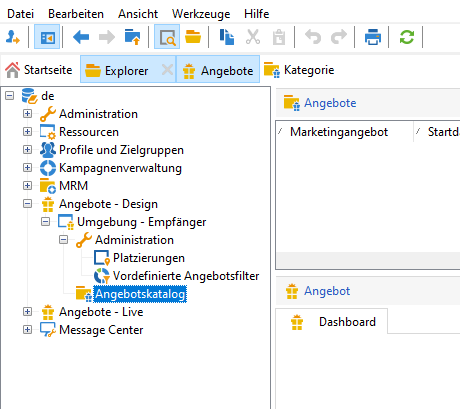
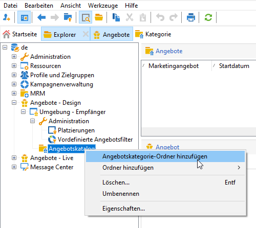
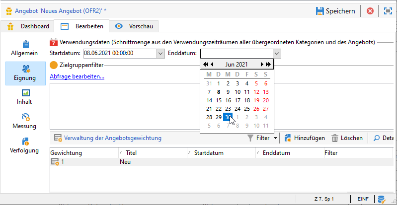
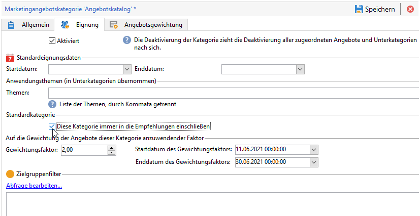

# Erstellen eines Angebotskatalogs

Als **Angebotsverantwortlicher** sind Sie für die Erstellung des Angebotskatalogs zuständig.

Ein Angebotskatalog ist einer bereits existierenden Umgebung zugeordnet. Angebote in diesem Katalog können nur Platzierungen derselben Umgebung zugeordnet werden.

Vor der Angebotserstellung ist die übergeordnete [Umgebung](interaction-env.md) zu konfigurieren. In der Umgebung werden die für alle enthaltenen, nach Kategorie geordneten Angebote identischen Merkmale (Eignung, Zielgruppe, Unterbreitungsregeln) bestimmt. Sie enthält außerdem die Liste der Platzierungen.

## Angebotskategorien erstellen{#creating-offer-categories}

Das Angebot ist in Kategorien/Unterkategorien unterteilt. Kategorien werden in der **[!UICONTROL Design]**-Umgebung erstellt und automatisch in der **[!UICONTROL Live]**-Umgebung bereitgestellt, sobald die darin enthaltenen Angebote validiert wurden. Die **[!UICONTROL Design]**-Umgebung enthält eine Standardkategorie für den Empfang aller Angebote. Unterkategorien können erstellt werden, um den Katalogangeboten eine Hierarchie hinzuzufügen.

Für jede Kategorie können Sie eine **Gültigkeit** definieren. Dies ist der Zeitraum, in dem die in der Kategorie enthaltenen Angebote ihrer Zielgruppe unterbreitet werden können. Sie können außerdem die Gewichtung einer Kategorie anpassen, um der Angebotsunterbreitung Priorität einzuräumen.

Gehen Sie wie folgt vor, um eine neue Kategorie zu erstellen:

1. Navigieren Sie im Navigationsbaum zum Ordner **[!UICONTROL Angebotskatalog]**.

   

1. Klicken Sie mit der rechten Maustaste und wählen Sie im Kontextmenü die Option **[!UICONTROL Angebotskategorie-Ordner hinzufügen]** aus.

   

1. Benennen Sie die Kategorie. Der Titel kann später auch über die Registerkarte **[!UICONTROL Allgemein]** der Kategorie geändert werden.

   

   >[!NOTE]
   >
   >Wiederholen Sie diese Schritte gegebenenfalls, bis Sie die gewünschte Anzahl an Kategorien erstellt haben.

   Nun haben Sie je nach Bedarf die Möglichkeit,

   * im Tab **[!UICONTROL Eignung]** Daten für die Verwendung zuzuweisen.

      

   * **[!UICONTROL Bearbeiten Sie die Abfrage]**, um Filter auf die Angebots-Zielgruppe anzuwenden.

   * Klicken Sie auf den Link **[!UICONTROL Planung und Eignungsregeln des Angebots]**, um die Zusammenfassung der Eignungsregeln anzuzeigen.

## Hinzufügen einer Ersatzkategorie

Um sicherzustellen, dass alle Empfänger einen Angebotsvorschlag erhalten, können in den Empfehlungen systematisch eine oder mehrere Angebotskategorien hinzugefügt werden.

Diese Fallback-Angebote müssen eine niedrige Gewichtung (aber nicht null) aufweisen, sodass sie nur dann berücksichtigt werden, wenn keine Angebote mit höherer Gewichtung infrage kommen.

Darüber hinaus darf auf diese Angebote keine Unterbreitungsregel angewendet werden, um sicherzustellen, dass sie immer in die Empfehlungen aufgenommen werden. Wenn also für einen Vorschlag kein Angebot mit höherer Gewichtung verfügbar ist, erhält der Empfänger mindestens ein Angebot aus dieser Kategorie.

Gehen Sie wie folgt vor, um eine Ersatzkategorie in die Empfehlungen aufzunehmen:

1. Navigieren Sie zu Ihrem Angebotskatalog.
1. Klicken Sie auf der Registerkarte **[!UICONTROL Eignung]** auf **[!UICONTROL Diese Kategorie immer in die Empfehlungen einschließen]**.
1. Klicken Sie auf **[!UICONTROL Speichern]**.

   
