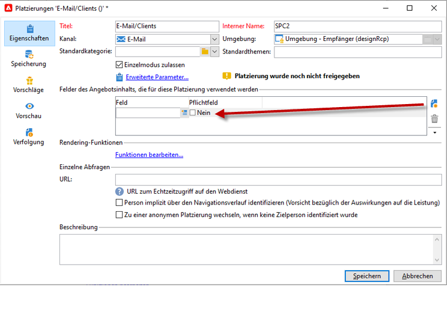
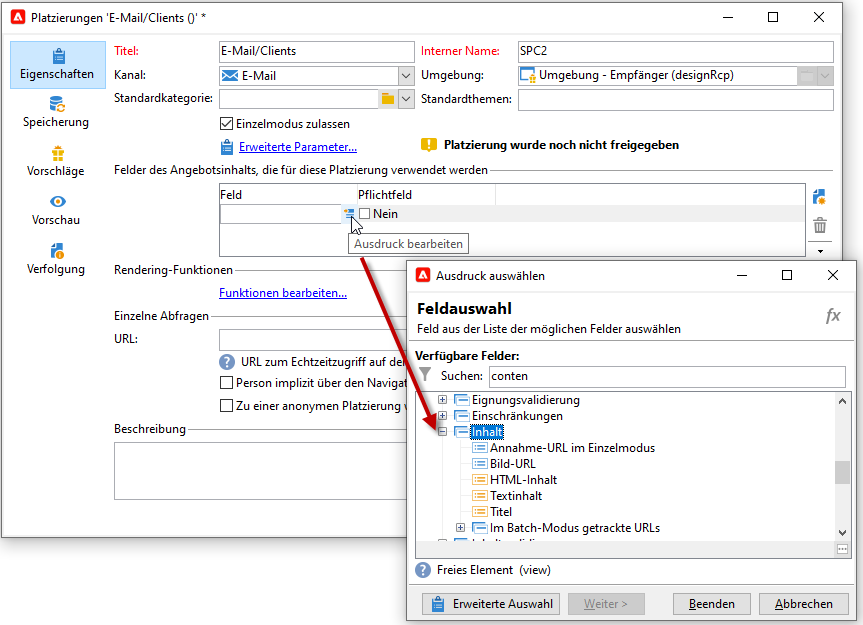
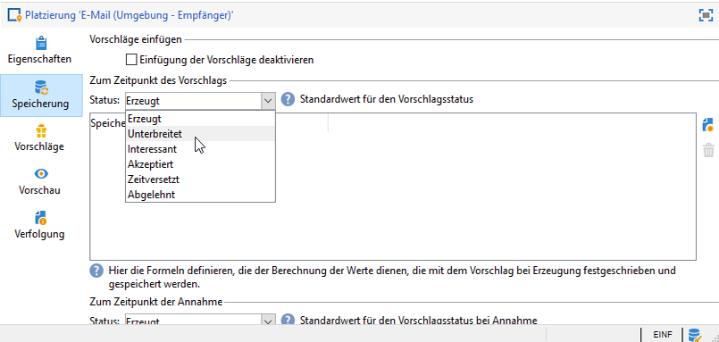

# Erstellen von Platzierungen{#creating-offer-spaces}

Der Content des Angebotskatalogs wird in Platzierungen konfiguriert. Standardmäßig kann der Content **[!UICONTROL die folgenden Felder enthalten: Titel]**, **[!UICONTROL Ziel-URL]**, **[!UICONTROL Bild-URL]**, **[!UICONTROL HTML-Inhalt]** und **[!UICONTROL Textinhalt]**. Die Feldsequenz wird in der Angebotsplatzierung konfiguriert.

Als **technischer Administrator** können Sie in der Design-Umgebung Angebotsplatzierungen erstellen. Dazu benötigen Sie Zugriff auf den Unterordner der Platzierung. Nach der Erstellung werden diese Platzierungen bei der Angebotsvalidierung automatisch in die Live-Umgebung dupliziert.

Das HTML-Rendering wird über eine Rendering-Funktion erstellt. Die Reihenfolge der in der Rendering-Funktion definierten Felder muss mit der im Content konfigurierten Sequenz übereinstimmen.


Gehen Sie wie folgt vor, um eine neue Platzierung zu erstellen:

1. Klicken Sie in der Liste der Platzierungen auf **[!UICONTROL Neu]**.

   

1. Benennen Sie die Platzierung und wählen Sie aus der Dropdown-Liste den E-Mail-Kanal aus.

   

1. Aktivieren Sie die Option **[!UICONTROL Einzelmodus zulassen]** .

1. Klicken Sie dann im Bereich **[!UICONTROL Felder des Angebotsinhalts]** auf **[!UICONTROL Hinzufügen]**.

   

1. Wählen Sie aus dem **[!UICONTROL Inhalt]**-Knoten unter Berücksichtigung der Reihenfolge folgende Felder aus: **[!UICONTROL Titel]**, **[!UICONTROL Bild-URL]**, **[!UICONTROL HTML-Inhalt]** und schließlich **[!UICONTROL Ziel-URL]**.

   

1. Machen Sie jedes Feld zum **[!UICONTROL Pflichtfeld]**.

   >[!NOTE]
   >
   >Diese Option wird in der Vorschau verwendet und macht die Platzierungen bei der Veröffentlichung ungültig, wenn eines der Pflichtfelder des Angebots fehlt. Wenn jedoch ein Angebot bereits auf einer Platzierung live ist, werden diese Kriterien nicht berücksichtigt.

   

1. Klicken Sie auf **[!UICONTROL Funktionen bearbeiten...]**, um eine Rendering-Funktion zu erstellen.

   Diese Funktionen dienen der Erzeugung von Angebotsdarstellungen auf einer Platzierung. Dabei sind folgende Formate möglich: HTML oder Text.

   **Hinweis** – Das XML-Format ist auf eingehende Interaktionen beschränkt, die in dieser Produktversion nicht verfügbar sind. [Weitere Informationen](../start/v7-to-v8.html#gs-unavailable-features)

   _

1. Gehen Sie auf die Registerkarte **[!UICONTROL HTML-Rendering]** und aktivieren Sie die Option **[!UICONTROL HTML-Rendering-Funktion überschreiben]**.
1. Geben Sie nun Ihre Rendering-Funktion ein.

   

## Vorschlagsstatus {#offer-proposition-statuses}

Der Vorschlagsstatus ändert sich entsprechend den Interaktionen mit der Zielpopulation. Das Campaign Interaction-Modul enthält eine Reihe von Werten, die während seines gesamten Lebenszyklus auf den Angebotsvorschlag angewendet werden können. Die Plattform muss so konfiguriert sein, dass sich der Status bei der Erstellung und Annahme des Angebotsvorschlags ändert.

>[!NOTE]
>
>Die Status-Aktualisierung ist ein **asynchroner** Prozess, der vom stündlich ausgelösten Tracking-Workflow ausgeführt wird.

### Liste der Angebotsstatus {#status-list}

Verfügbare Angebotsstatus sind:

* **[!UICONTROL Akzeptiert]**
* **[!UICONTROL Geplant]**
* **[!UICONTROL Erzeugt]**
* **[!UICONTROL Interessant]**
* **[!UICONTROL Unterbreitet]**
* **[!UICONTROL Zurückgewiesen]**

Diese Werte werden nicht standardmäßig angewendet, sie müssen zuvor konfiguriert werden.

>[!NOTE]
>
>Der Status eines Angebotsvorschlags wird automatisch in &quot;Unterbreitet&quot; geändert, wenn das Angebot mit einem Versand verknüpft ist, dessen Status &quot;Gesendet&quot; lautet.

### Angebotsstatus bei Erstellung des Vorschlags {#configuring-the-status-when-the-proposition-is-created}

Wenn ein Angebotsvorschlag **erzeugt** wird, wird sein Status aktualisiert.

Konfigurieren Sie in der Umgebung **[!UICONTROL Design]** für jede Platzierung den Status, der beim Erstellen eines Vorschlags zugewiesen werden soll, entsprechend den Informationen, die Sie in den Angebotsberichten anzeigen möchten.

Gehen Sie dazu wie folgt vor:

1. Gehen Sie auf die Registerkarte **[!UICONTROL Speicherung]** der zu konfigurierenden Platzierung.
1. Wählen Sie den Status aus, der bei der Vorschlagserzeugung zugewiesen werden soll.

   

### Angebotsstatus bei Akzeptanz des Vorschlags {#configuring-the-status-when-the-proposition-is-accepted}

Sobald ein Angebotsvorschlag **akzeptiert** wurde, konfigurieren Sie den neuen Vorschlagsstatus mit einem der standardmäßig verfügbaren Werte. Die Aktualisierung wird durchgeführt, sobald ein Empfänger auf einen Link im Angebot klickt.

Gehen Sie dazu wie folgt vor:

1. Gehen Sie auf die Registerkarte **[!UICONTROL Speicherung]** der zu konfigurierenden Platzierung.
1. Wählen Sie den Status aus, den der Vorschlag erhalten soll, nachdem er akzeptiert wurde.

   


**Eingehende Interaktionen**

Über die Registerkarte **[!UICONTROL Speicherung]** können Sie nur die Status für **unterbreitete** und **akzeptierte** Angebotsvorschläge definieren. Für eingehende Interaktionen sollte der Status von Angebotsvorschlägen nicht über die Schnittstelle, sondern direkt in der URL definiert werden, über die das Angebotsmodul aufgerufen wird. Auf diese Weise können Sie festlegen, welche Status in anderen Szenarien angewendet werden (z. B. wenn ein Angebotsvorschlag abgelehnt wird).

```
<BASE_URL>?a=UpdateStatus&p=<PRIMARY_KEY_OF_THE_PROPOSITION>&st=<NEW_STATUS_OF_THE_PROPOSITION>&r=<REDIRECT_URL>
```

So enthält beispielsweise der auf der **Neobank**-Webseite angezeigte Vorschlag mit Kennung **40004** zum Abschluss einer **Hausratsversicherung** folgende URL:

```
<BASE_URL>?a=UpdateStatus&p=<40004>&st=<3>&r=<"http://www.neobank.com/insurance/subscribe.html">
```

Wenn nun ein Besucher auf den Vorschlag und somit auf die URL klickt, wird dem Vorschlag der Status **[!UICONTROL Akzeptiert]** (entspricht dem Wert **3**) zugewiesen und der Besucher wird auf eine andere Seite der **Neobank**-Webseite weitergeleitet, um die Versicherung abzuschließen.

>[!NOTE]
>
>Wenn Sie in der URL einen anderen Status festlegen möchten (z. B. wenn ein Angebotsvorschlag abgelehnt wird), verwenden Sie den dem gewünschten Status entsprechenden Wert. Beispiel: **[!UICONTROL Abgelehnt]** = &quot;5&quot;, **[!UICONTROL Unterbreitet]** = &quot;1&quot; usw.
>
>Status und die ihnen zugehörigen Werte können aus dem Datenschema **[!UICONTROL Angebotsvorschläge (nms)]** abgerufen werden. Näheres hierzu finden Sie auf [dieser Seite](../dev/create-schema.md).

**Ausgehende Interaktionen**

Sie können den Status **[!UICONTROL Interessant]** automatisch auf einen Angebotsvorschlag anwenden, falls der Versand einen Link enthält. Fügen Sie einfach den Wert **_urlType=&quot;11&quot;** zum Link hinzu:

```
<a _urlType="11" href="<DEST_URL>">Link inserted into the delivery</a>
```

## Angebotsvorschau in der Platzierung {#offer-preview-per-space}

Auf der Registerkarte **[!UICONTROL Vorschau]** können Sie die Angebote anzeigen, die basierend auf einer zuvor ausgewählten Methode für den Empfänger infrage kommen. Beim folgenden Beispiel kommt der Empfänger für drei Angebote per Briefpost infrage.


Sollte kein Angebot für einen Empfänger infrage kommen, ist dies in der Vorschau leicht erkennbar.


Die Vorschau berücksichtigt Kontexte möglicherweise nicht, wenn sie auf eine Platzierung beschränkt sind. Dies ist der Fall, wenn das Interaktionsschema erweitert wurde, um Felder hinzuzufügen, auf die eine einen eingehenden Kanal verwendende Platzierung Bezug nimmt. 

 Weitere Informationen finden Sie in der [Dokumentation zu Campaign Classic v7](https://experienceleague.adobe.com/docs/campaign-classic/using/managing-offers/advanced-parameters/extension-example.html?lang=de){target=&quot;_blank&quot;}.