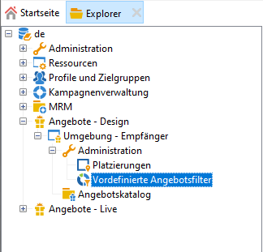
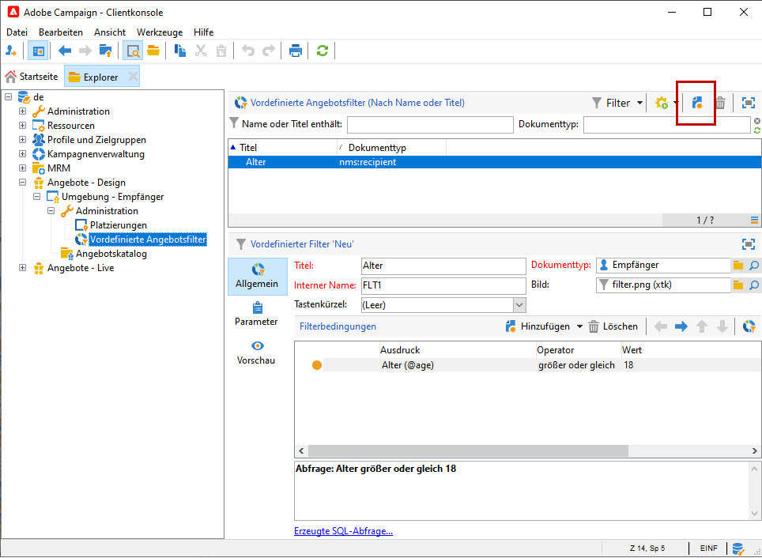
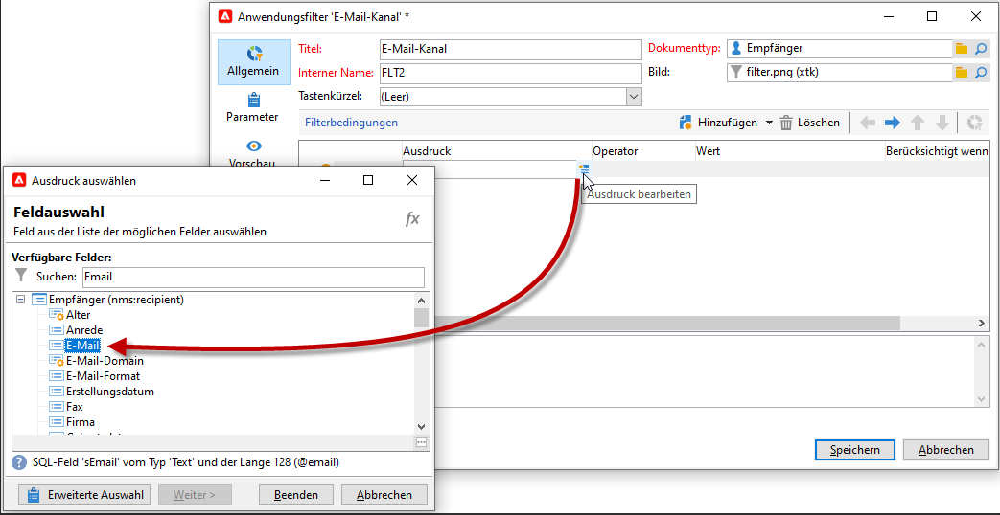
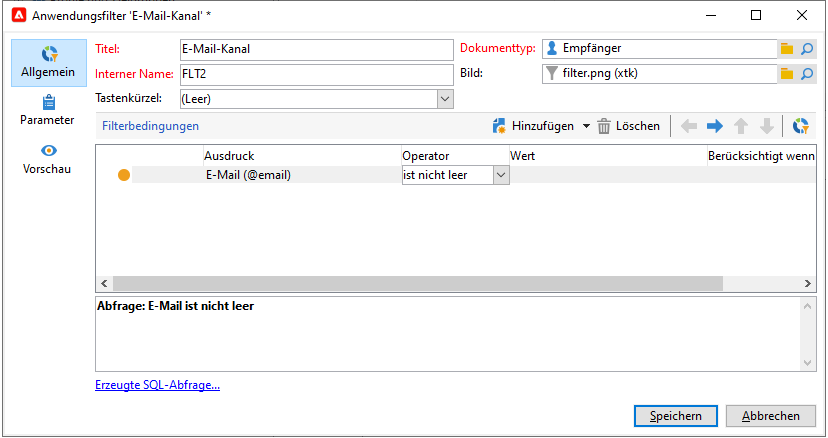
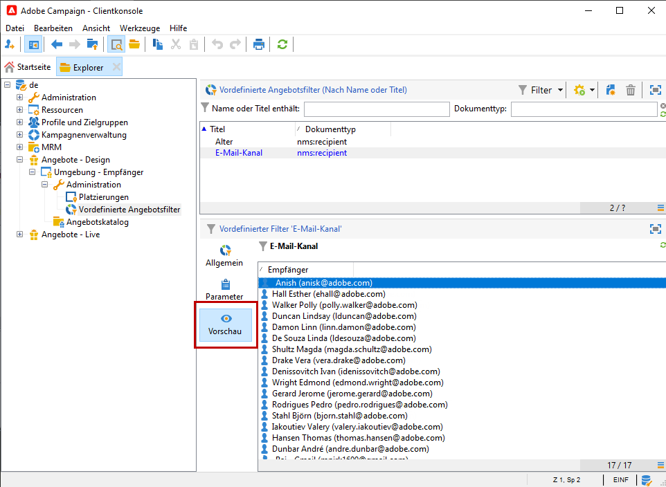

# Erstellen vordefinierter Filter{#creating-pre-defined-filters}

Erstellen Sie vordefinierte Filter, um Eignungsregeln für die Zielpopulation zu definieren, die bei der Erstellung von Angeboten einfach wiederverwendet werden können. Vordefinierte Filter sind für jede Umgebung spezifisch und berücksichtigen die Angebotsparameter.

Gehen Sie wie folgt vor, um einen Filter zu erstellen:

1. Markieren Sie im Ordner **[!UICONTROL Administration]** der jeweiligen Umgebung den Knoten **[!UICONTROL Vordefinierte Angebotsfilter]**.

   

1. Klicken Sie auf **[!UICONTROL Neu]**.

   

1. Benennen Sie den Filter.

   

1. Wählen Sie nun das Feld aus, auf das sich die Filterbedingung beziehen soll.

   

1. Geben Sie den Operator und gegebenenfalls einen Wert an und speichern Sie die Abfrage.

   

1. Durch Klick auf die Registerkarte **[!UICONTROL Vorschau]** können Sie das Ergebnis des Filters prüfen.

   
