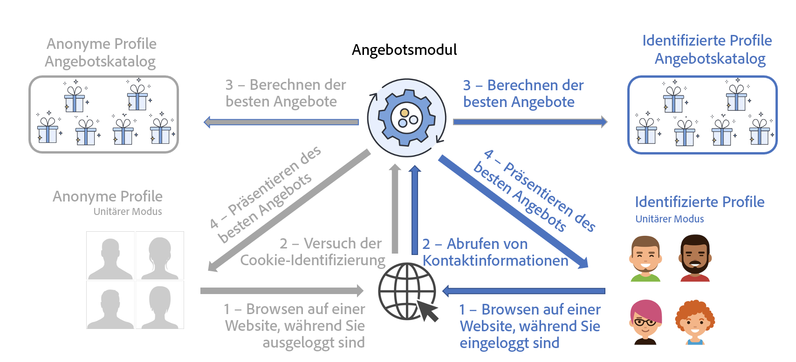

# Unterbreiten des besten Angebots{#interaction-present-offers}

Angebote können in verschiedenen Platzierungen über eingehende [ ausgehende Kanäle unterbreitet ](interaction-architecture.md#interaction-types). In diesem Kapitel werden einige spezifische Funktionen für eingehende Kanäle beschrieben.

Damit Angebote vom Angebotsmodul ausgewählt werden können, müssen sie zuvor genehmigt worden sein und in einer Live-Umgebung verfügbar sein.

Weitere Informationen finden Sie in der [Dokumentation zu Campaign Classic v7](https://experienceleague.adobe.com/docs/campaign-classic/using/managing-offers/managing-an-offer-catalog/approving-and-activating-an-offer.html?lang=de#approving-offer-content){target="_blank"}.

Im Kontext eines eingehenden Kontakts kann der Benutzer, der die Seite durchsucht, von der Website identifiziert werden oder nicht. Das Angebotsmodul bietet für identifizierte Profile und für anonyme Profile verschiedene Angebote an.

Um Angebote auf einem eingehenden Kanal unterbreiten zu können, müssen Sie die Abfrage des Angebotsmoduls so konfigurieren, dass die Angebote unterbreitet werden sollen. In den meisten Fällen für eingehende Interaktionen ist dies die Web-Seite.

>[!NOTE]
>
>Im Falle von eingehenden Interaktionen muss das Angebotsmodul dahingehend konfiguriert werden, ein oder mehrere Angebote zu aktualisieren und vorzuschlagen.
>
>Außerdem müssen Sie für Ihre Platzierungen den Einzelmodus zulassen. Weitere Informationen hierzu finden Sie auf [dieser Seite](interaction-offer-spaces.md).
