# Senden eines Angebots{#send}

Damit Angebote vom Angebotsmodul ausgewählt werden können, müssen sie zuvor genehmigt und für eine **Live**-Umgebung freigegeben worden sein. [Weitere Informationen](interaction-offer.md#approve-offers)

Die Angebotsunterbreitung über einen ausgehenden Kommunikationskanal erfolgt per Briefpost, E-Mail oder Mobile-Versand. Außerdem können Sie auch den Einzelmodus mit Transaktionsnachrichten (Message Center) verwenden.

## Einfügen eines Angebots in einen Versand {#offer-into-a-delivery}

Gehen Sie wie folgt vor, um Angebotsvorschläge in einen Versand einzufügen:

1. Klicken Sie im Versandfenster auf das Symbol **Angebote**.

   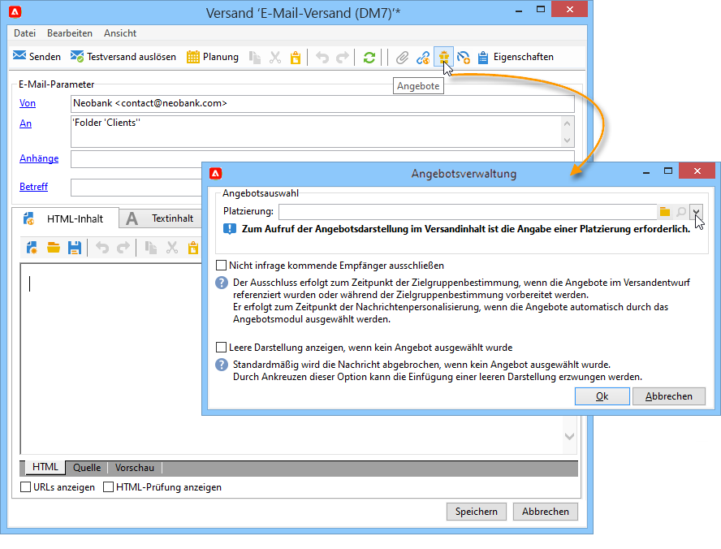

1. Wählen Sie die Ihrer Angebotsumgebung entsprechende Platzierung aus.

   

1. Wählen Sie die Kategorie aus, der die zu unterbreitenden Angebote angehören, oder ein oder mehrere Themen, um die vom Angebotsmodul getroffene Auswahl einzugrenzen. Es wird empfohlen, nur eins der beiden Felder zu verwenden, um die Auswahlmöglichkeiten nicht zu stark einzuschränken.

   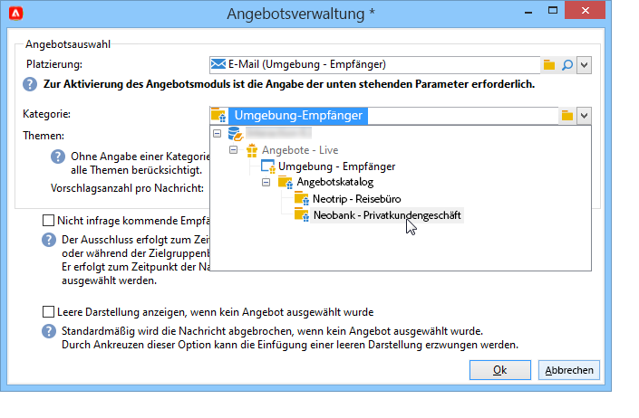

   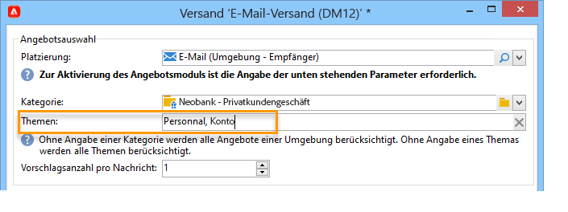

1. Geben Sie die Anzahl an Angeboten an, die im Nachrichten-Textkörper erscheinen sollen.

   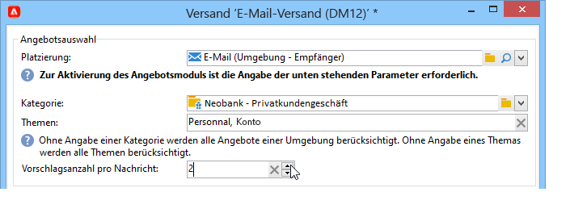

1. Wählen Sie bei Bedarf die Option **[!UICONTROL Nicht infrage kommende Empfänger ausschließen]** aus. [Weitere Informationen](#parameters-for-calling-offer-engine)

   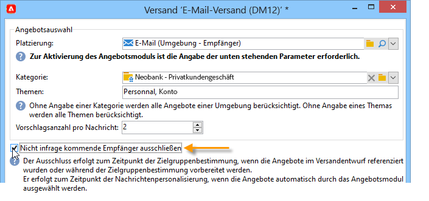

1. Wählen Sie die Option **[!UICONTROL Leere Darstellung anzeigen, wenn kein Angebot ausgewählt wurde]** aus. [Weitere Informationen](#parameters-for-calling-offer-engine)

   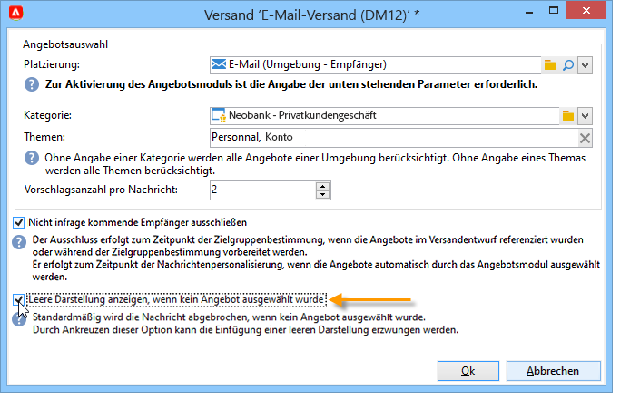

1. Fügen Sie die Eigenschaften mithilfe der Fusionsfelder in den Versandinhalt ein. Die Anzahl der verfügbaren Vorschläge hängt von der Konfiguration des Angebotsmodul-Aufrufs ab und ihre Reihenfolge hängt von der Priorität der Angebote ab.

   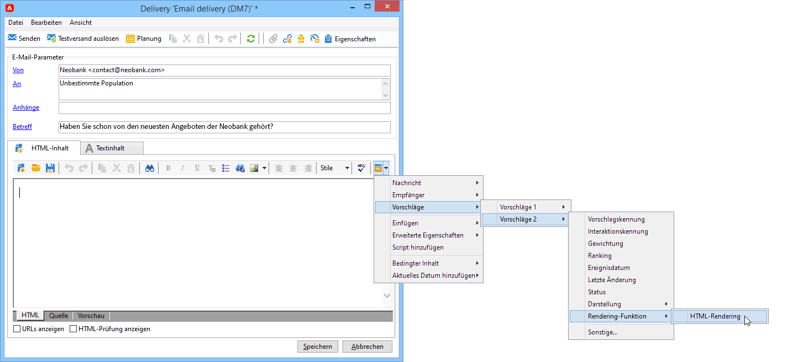

1. Schließen Sie den Inhalt ab, testen Sie Ihren Versand und führen Sie ihn aus.

   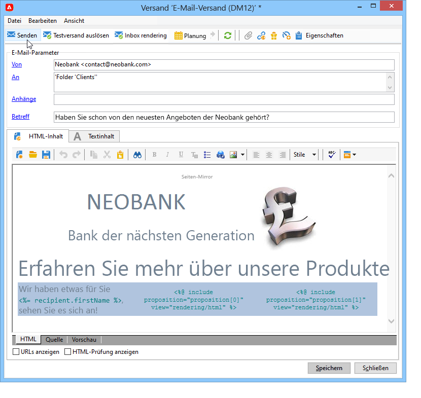

### Parameter des Angebotsmoduls {#parameters-for-calling-offer-engine}

* **[!UICONTROL Platzierung]**: Zur Aktivierung des Angebotsmoduls ist die Angabe einer Platzierung aus der Angebotsumgebung zwingend erforderlich.
* **[!UICONTROL Kategorie]**: spezifischer Ordner, in dem die Angebote sortiert werden. Wenn keine Kategorie angegeben wird, berücksichtigt das Angebotsmodul alle in der Umgebung enthaltenen Angebote, es sei denn, es wird ein Thema ausgewählt.
* **[!UICONTROL Themen]**: zuvor auf Kategorieebene definierte Schlüsselwörter, die wie ein Filter agieren. Die zu unterbreitenden Angebote werden den Themen entsprechend aus einer Gruppe von Kategorien ausgewählt.
* **[!UICONTROL Vorschlagsanzahl]**: Anzahl der von der Engine zurückgegebenen Angebote, die in den Textkörper des Versands eingeschlossen werden können. Wenn sie nicht in die Nachricht eingeschlossen werden, werden die Angebote immer noch erzeugt, aber nicht unterbreitet.
* **[!UICONTROL Nicht infrage kommende Empfänger ausschließen]**: Diese Option erlaubt es, Empfängerinnen und Empfänger, für die nicht ausreichend geeignete Angebote vorhanden sind, vom Versand auszuschließen. Die Anzahl der geeigneten Angebote kann geringer sein als die angeforderte Anzahl der Angebote. Wenn dieses Kästchen aktiviert ist, werden Empfängerinnen und Empfänger, für die nicht genügend Angebote vorliegen, vom Versand ausgeschlossen. Wenn Sie diese Option nicht wählen, werden diese Personen zwar nicht ausgeschlossen, doch sie erhalten nicht die gewünschte Anzahl von Angeboten.
* **[!UICONTROL Nichts anzeigen, wenn kein Angebot ausgewählt wurde]**: Mit dieser Option können Sie festlegen, wie die Nachricht verarbeitet werden soll, wenn eines der Angebote nicht vorhanden ist. Wenn dieses Kästchen markiert ist, wird die Darstellung des fehlenden Angebots nicht angezeigt und es erscheint kein Inhalt in der Nachricht für dieses Angebot. Ist das Kästchen nicht angekreuzt, wird die Nachricht selbst während des Versands abgebrochen und die Empfängerinnen und Empfänger erhalten keine Nachrichten mehr.

## Senden von Angeboten in Workflows{#offer-via-wf}

Verschiedene Workflow-Aktivitäten ermöglichen es Ihnen, die Unterbreitung von Angeboten zu definieren:

* Anreicherung
* Angebotsmodul
* Angebote pro Segment

### Anreicherung {#enrichment}

Die Aktivität **Anreicherung** ermöglicht das Hinzufügen von Angeboten oder Links zu Angeboten für Versandempfänger.[Weitere Informationen](https://experienceleague.adobe.com/docs/campaign/automation/workflows/wf-activities/targeting-activities/enrichment.html?lang=de){target="_blank"}.

Sie können beispielsweise aus einer Abfrage stammende Empfängerdaten vor Durchführung eines Versands anreichern.

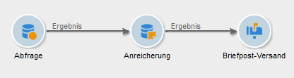

Zwei Methoden ermöglichen in diesem Fall die Auswahl der Angebotsvorschläge:

* Konfiguration eines Angebots oder einer Abfrage des Angebotsmoduls.
* Referenzierung einer Verknüpfung mit einem Angebot.

#### Konfigurieren eines Angebots oder einer Angebotsmodul-Abfrage {#specifying-an-offer-or-a-call-to-the-offer-engine}

Nach der Konfiguration Ihrer Aktivität **Abfrage** führen Sie folgende Schritte aus:

1. Platzieren und öffnen Sie eine Aktivität des Typs **Anreicherung**.
1. Wählen Sie **[!UICONTROL Daten hinzufügen]** im Tab **[!UICONTROL Anreicherung]**.
1. Wählen Sie **[!UICONTROL Angebotsvorschlag]** als hinzuzufügenden Datentyp aus.

   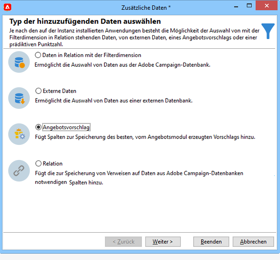

1. Geben Sie eine Kennung und einen Titel für den hinzuzufügenden Vorschlag an.
1. Konfigurieren Sie die Angebotsauswahl. Zwei Optionen stehen zur Auswahl:

   * **[!UICONTROL Suche nach dem besten Angebot in einer Kategorie]**: Beim Ankreuzen dieser Option geben Sie die verschiedenen Parameter der Abfrage des Angebotsmoduls an (Platzierung, Kategorie oder Themen, Kontaktdatum, Anzahl der beizubehaltenden Angebote). Das Modul berechnet automatisch die hinzuzufügenden Angebote, die den Parametern entsprechen. Wir empfehlen, entweder das Feld **[!UICONTROL Kategorie]** oder das Feld **[!UICONTROL Thema]** vollständig auszufüllen, aber nicht beide gleichzeitig.

     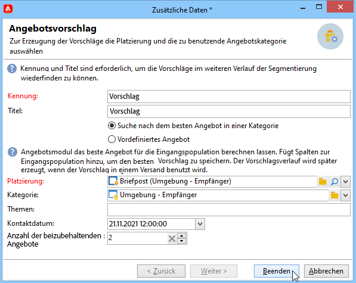

   * **[!UICONTROL Vordefiniertes Angebot]**: Beim Ankreuzen dieser Option können Sie ohne Abfrage des Angebotsmoduls direkt das einzufügende Angebot konfigurieren (Platzierung, ein bestimmtes Angebot und ein Kontaktdatum).

     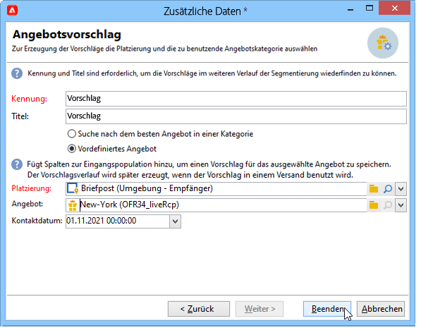

1. Konfigurieren Sie dann eine Versandaktivität, die dem von Ihnen gewählten Kanal entspricht. [Weitere Informationen](#offer-into-a-delivery)

   >[!NOTE]
   >
   >Die Anzahl an für die Vorschau verfügbaren Vorschlägen hängt von der Konfiguration der Anreicherung und nicht von im Versand konfigurierten Parametern ab.

#### Referenzieren einer Relation zu einem Angebot {#referencing-a-link-to-an-offer}

In einer Aktivität des Typs **Anreicherung** besteht darüber hinaus die Möglichkeit, eine Relation zu einem Angebot zu referenzieren.

Gehen Sie dazu wie folgt vor:

1. Klicken Sie im Tab **[!UICONTROL Anreicherung]** der Aktivität auf den Link **[!UICONTROL Daten hinzufügen...]**.
1. Wählen Sie im folgenden Fenster den Datentyp **[!UICONTROL Relation]** aus.
1. Definieren Sie nun den Relationstyp und das Ziel der Relation. Im vorliegenden Beispiel handelt es sich beim Ziel um das Angebotsschema.

   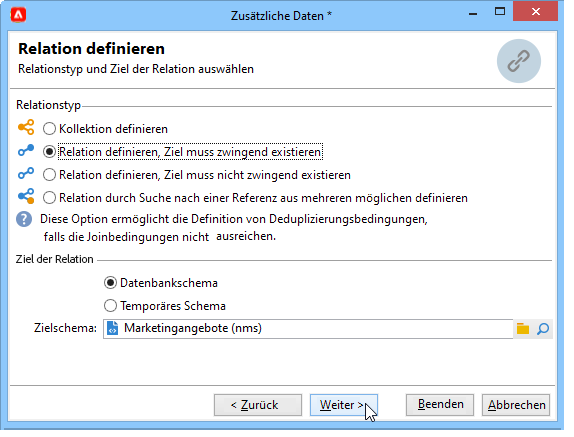

1. Definieren Sie die Art der Relation zwischen den Daten der Eingangstabelle der Aktivität &quot;Anreicherung&quot; (hier die Empfängertabelle) und der Angebotstabelle. Sie können beispielsweise einem Empfänger einen Angebots-Code zuordnen.

   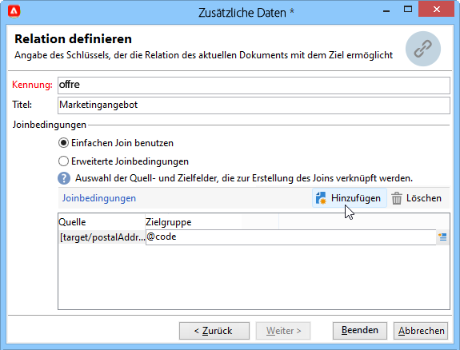

1. Konfigurieren Sie dann eine Versandaktivität, die dem von Ihnen gewählten Kanal entspricht. [Weitere Informationen](#offer-into-a-delivery)

   >[!NOTE]
   >
   >Die Anzahl an für die Vorschau verfügbaren Vorschlägen hängt von den im Versand konfigurierten Parametern ab.

#### Speichern von Ranking und Gewichtung von Angeboten {#storing-offer-rankings-and-weights}

Standardmäßig werden Ranking und Gewichtung bei Verwendung der Aktivität **Anreicherung** nicht in der Vorschlagstabelle gespeichert.

>[!NOTE]
>
>Die Aktivität **[!UICONTROL Angebotsmodul]** speichert diese Informationen standardmäßig.

Gehen Sie wie folgt vor, wenn Sie diese Informationen dennoch speichern möchten:

1. Erstellen Sie eine Angebotsmodul-Abfrage in einer Anreicherungsaktivität, die nach einer Abfrage und vor einer Versandaktivität platziert wird. [Weitere Informationen](#specifying-an-offer-or-a-call-to-the-offer-engine)
1. Klicken Sie auf der Registerkarte &quot;Anreicherung&quot; der gleichnamigen Aktivität auf den Link **[!UICONTROL Zusätzliche Daten bearbeiten...]**.

   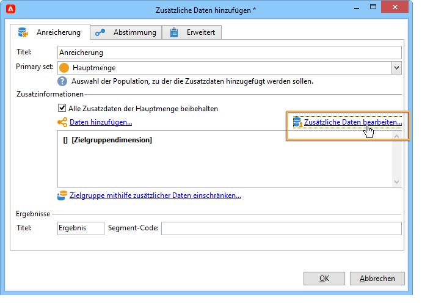

1. Fügen Sie für das Ranking die Spalte **[!UICONTROL @rank]** und für die Gewichtung die Spalte **[!UICONTROL @weight]** hinzu.

   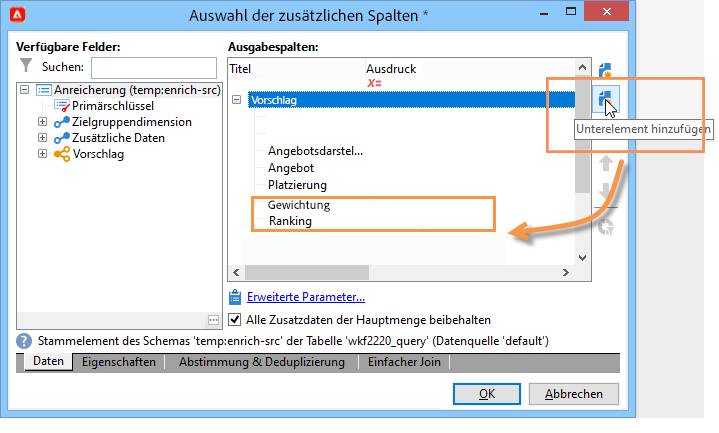

1. Bestätigen Sie Ihre Wahl und speichern Sie den Workflow.

Der Versand speichert automatisch die Rangfolge und Gewichtung der Angebote. Diese Informationen werden in der Registerkarte **[!UICONTROL Angebote]** des Versands angezeigt.

### Angebotsmodul {#offer-engine}

Auch die Aktivität **[!UICONTROL Angebotsmodul]** ermöglicht die Konfiguration einer einem Versand vorangestellten Modulabfrage.

Weitere Informationen über die Aktivität **Angebotsmodul** finden Sie auf [dieser Seite](https://experienceleague.adobe.com/docs/campaign/automation/workflows/wf-activities/targeting-activities/offer-engine.html?lang=de){target="_blank"}.

Das Prinzip dieser Aktivität entspricht dem der **Anreicherung**. Auch hier werden die Daten der Eingangspopulation mit einem vom Modul berechneten Angebot angereichert, bevor die eigentliche Versandaktivität startet.

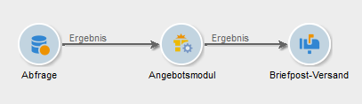

Nach der Konfiguration Ihrer Aktivität **Abfrage** führen Sie folgende Schritte aus:

1. Fügen Sie eine **[!UICONTROL Angebotsmodul]**-Aktivität hinzu und öffnen Sie sie.
1. Konfigurieren Sie die verschiedenen Parameter der Abfrage des Angebotsmoduls (Platzierung, Kategorie oder Themen, Kontaktdatum, Anzahl beizubehaltender Angebote). Das Modul berechnet automatisch die den Parametern entsprechenden hinzuzufügenden Angebote.

   >[!CAUTION]
   >
   >Wenn Sie diese Aktivität nutzen, werden nur die im Versand verwendeten Vorschläge gespeichert.

   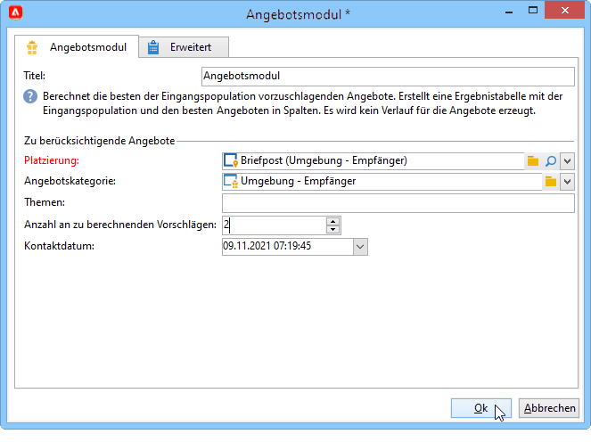

1. Konfigurieren Sie dann eine Versandaktivität, die dem von Ihnen gewählten Kanal entspricht. [Weitere Informationen](#inserting-an-offer-proposition-into-a-delivery)

### Angebote pro Segment {#offers-by-cell}

Mithilfe der Aktivität **[!UICONTROL Angebote pro Segment]** lässt sich die eingehende Population (die beispielsweise aus einer Abfrage hervorgeht) in mehrere Zielgruppen aufspalten, um so je Segment spezifische Angebote zu unterbreiten.

Weitere Informationen über die Aktivität **Angebot pro Segment** finden Sie auf [dieser Seite](https://experienceleague.adobe.com/docs/campaign/automation/workflows/wf-activities/targeting-activities/offers-by-cell.html?lang=de){target="_blank"}.

Gehen Sie dazu wie folgt vor:

1. Platzieren Sie im Anschluss an die Abfrage eine Aktivität **[!UICONTROL Angebote pro Segment]** und öffnen Sie sie zur weiteren Bearbeitung.
1. Wählen Sie auf der Registerkarte **[!UICONTROL Allgemein]** die Platzierung, über die Sie Angebote unterbreiten möchten.
1. Definieren Sie nun auf der Registerkarte **[!UICONTROL Segmente]** über die Schaltfläche **[!UICONTROL Hinzufügen]** die verschiedenen Segmente:

   * Konfigurieren Sie anhand der verfügbaren Filter und Begrenzungen die Population des Segments.
   * Wählen Sie dann das Angebot aus, das Sie dem Segment unterbreiten möchten. Es stehen die Angebote zur Verfügung, die der Konfiguration der zuvor ausgewählten Platzierung entsprechen.

     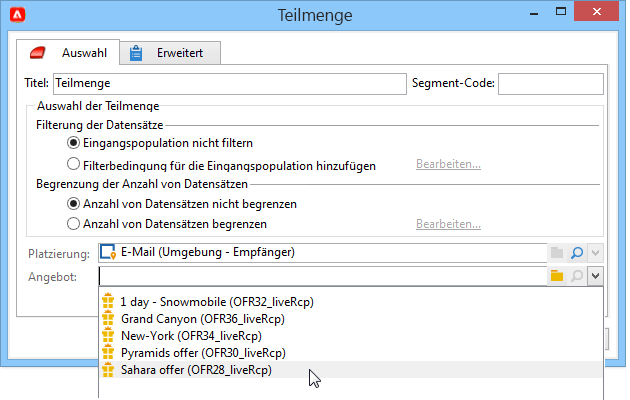

1. Konfigurieren Sie dann eine Versandaktivität, die dem von Ihnen gewählten Kanal entspricht.

<!--

## Delivering with delivery outlines {#delivering-with-delivery-outlines}

You can also present offers in a delivery using delivery outlines.

For more information on delivery outlines, refer to the Campaign - MRM guide.

1. Create a new campaign or access an existing campaign.
1. Access the delivery outlines via the campaign's **[!UICONTROL Edit]** > **[!UICONTROL Documents]** tab.
1. Add an outline then insert as many offers as you like into it by right-clicking on the outline and selecting **[!UICONTROL New]** > **[!UICONTROL Offer]**, then save the campaign.

1. Create a delivery whose delivery outlines you have access to (for example, a direct mail delivery).
1. When editing the delivery, click **[!UICONTROL Select a delivery outline]**.

   >[!NOTE]
   >
   >Depending on the type of delivery, this option can be found in the **[!UICONTROL Properties]** > **[!UICONTROL Advanced]** menu (for email deliveries for example).

1. Using the **[!UICONTROL Offers]** button, you can then configure the offer space as well as the number of offers to present in the delivery.

1. Add the propositions into the delivery body using the personalization fields (for more on this, refer to the [Inserting an offer proposition into a delivery](#inserting-an-offer-proposition-into-a-delivery) section), or in the case of a direct mail delivery, by editing the extraction file format.

   Propositions will be selected from the offers referenced in the delivery outline.

   >[!NOTE]
   >
   >Information regarding the offer rankings and weights is only saved in the proposition table if the offers are generated directly in the delivery.
-->
