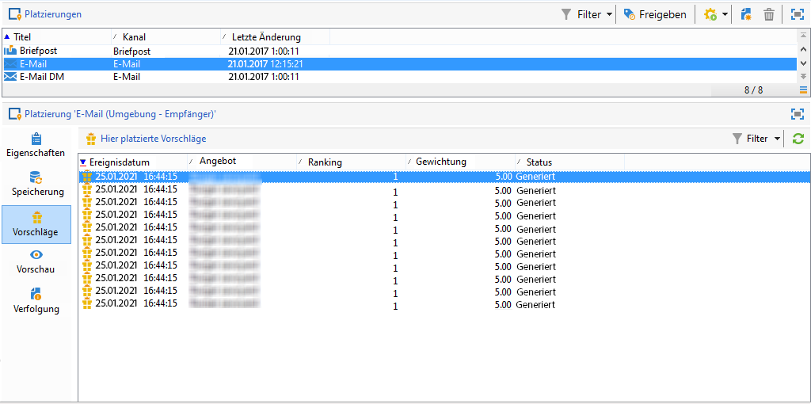

# Echtzeitverlauf und -berichte zu Interaktionen

>[!NOTE]
>
>Diese Funktionen sind nur online und nur für die **versandverantwortlichen Benutzer** sichtbar.

## Angebotsvorschlagsverlauf{#offer-proposition-history}

Nach der Unterbreitung von Angeboten haben Sie die Möglichkeit, den Verlauf der Unterbreitung einzusehen.

* Ausgehend vom Angebot: Klicken Sie im Tab **[!UICONTROL Bearbeiten]** des Angebots auf **[!UICONTROL Vorschläge]**.

   

* Ausgehend vom Empfänger: Klicken Sie auf den Tab **[!UICONTROL Vorschläge]**.

   

* Ausgehend von einer Platzierung: Klicken Sie auf den Tab **[!UICONTROL Vorschläge]**.

   

## Angebotsanalyse-Bericht{#offer-analysis-report}

Der Bericht **[!UICONTROL Angebotsanalyse]** bietet eine Zusammenfassung der akzeptierten und abgelehnten Vorschläge.

Die Statistiken gliedern sich nach drei Merkmalen:

* Nach Datum:

   

* Nach Platzierung:

   

* Nach Sendungen:

   

Im Berichtskopf können Sie die angezeigten Daten mithilfe bestimmter Kriterien einschränken. Wählen Sie z. B. einen Zeitraum aus und klicken Sie abschließend auf **[!UICONTROL Aktualisieren]**, um die Filter auf den Bericht anzuwenden.
