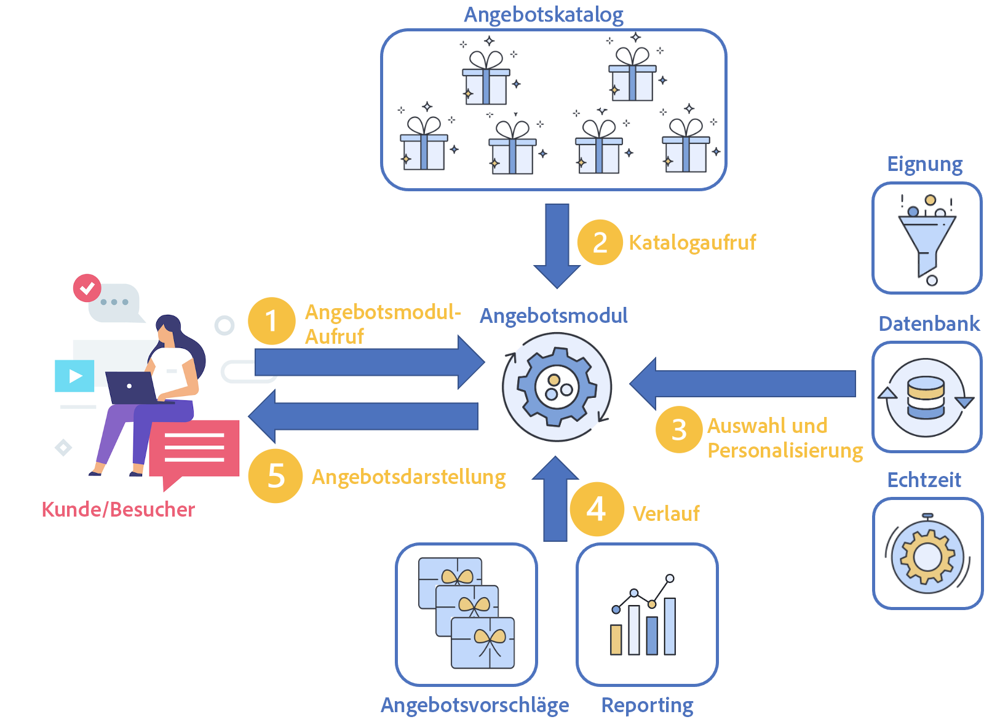

# Verwalten von Echtzeit-Interaktionen

Campaign verfügt über ein Modul **Interaktion**, mit dem Sie in Echtzeit während einer Interaktion auf einen bestimmten Kontakt reagieren können, indem Sie ihm ein einzelnes oder mehrere spezifische Angebote unterbreiten. Bei diesen Angeboten kann es sich um einfache Kommunikationsnachrichten, Sonderangebote für ein oder mehrere Produkte oder einen Service handeln.

Sie können einen Angebotskatalog erstellen, der mit Ihren ausgehenden Kanälen (E-Mail, Direkt-Mail, SMS) verbunden ist, um das beste Angebot für einen Kontakt in einem bestimmten Kontext auszuwählen. Die Auswahl des besten Angebots für einen Empfänger basiert auf **Eignungsregeln**. Die Auswahl eines Angebots aus einem Paket relevanter Angebote wird mithilfe von Prioritätsregeln bestimmt. Die Regeln zur Angebotsunterbreitung berücksichtigen den Verlauf des Kontakts und helfen zu vermeiden, dass der Kontakt nicht mehrmals dasselbe Angebot erhält.

Neben der Verwaltung des Angebotskatalogs bietet die Interaktion die Möglichkeit, Eignungsregeln und ihnen zugeordnete Anwendungsthemen zu definieren. Der Inhalt der Angebote kann je nach Kanal mithilfe der verschiedenen Darstellungen personalisiert werden. Das Simulationsmodul erlaubt es Ihnen zudem, vor Unterbreitung eines Angebots seine voraussichtliche Wirkung einzuschätzen.

Zuerst erfolgt ein Kontakt zwischen einem Kunden und einem Unternehmen über einen Kommunikationskanal. Dabei kann es sich um eine Website (ausgehende Interaktion) oder eine E-Mail, SMS, Push-Benachrichtigung (eingehende Interaktionen) handeln. [Weitere Informationen](#interaction-types)

Dieser Kontakt führt zu einem Aufruf des Angebotsmoduls. (1)

Wenn das Angebotsmodul aufgerufen wird, werden je nach der Anzahl der auf den Vorschlag bezogenen Angebotseinstellungen ein oder mehrere Angebote aus dem Angebotskatalog ausgewählt. (2)

Anschließend werden die Eignungsregeln angewendet: Die besten Angebote werden anhand der Eignungsregeln, des Start- und Enddatums der Angebote, der Profildaten und des Echtzeitverhaltens des Kunden ausgewählt. (3)

Der Verlauf der Profilvorschläge wird nach der Auswahl aktualisiert, um die Anzeige doppelter Angebote zu vermeiden. (4)

Schließlich wird das beste Angebot für die Zielgruppe vorgeschlagen. (5)

## Erste Schritte mit Angeboten

Die wichtigsten Schritte zu Beginn sind unten aufgeführt.

### Konfigurieren der Plattform

Stellen Sie vor dem Start als Campaign-**Administrator** sicher, dass Sie die folgenden Aufgaben in Design-Umgebungen ausgeführt haben:

1. Erstellen Sie Benutzerprofile. [Weitere Informationen](interaction-operators.md)
1. (optional) Erstellen Sie für jede Zielgruppendimension eine Angebotsumgebung. [Weitere Informationen](interaction-env.md)
1. Erstellen Sie Typologieregeln für jede Umgebung. [Weitere Informationen](interaction-offer.md#offer-presentation)
1. Erstellen Sie Angebotsplatzierungen für jede Umgebung und konfigurieren Sie die Rendering-Funktionen. [Mehr dazu](interaction-offer-spaces.md)
Wenn eine Platzierung in einem Einzelmodus-Kanal als identifiziert definiert wurde, müssen ihre erweiterten Parameter angegeben werden.

   >[!NOTE]
   >
   >Wenn eine Platzierung in einem Einzelmodus-Kanal als identifiziert definiert wurde, müssen ihre erweiterten Parameter angegeben werden.

1. Konfigurieren Sie das Angebotsmodul für eingehende Interaktionen, um ein oder mehrere Angebote zu unterbreiten und zu aktualisieren.

   Die verschiedenen Integrationsmodi werden in [diesem Abschnitt](interaction-present-offers.md) behandelt.

   >[!NOTE]
   >
   >Wenn eine Platzierung im eingehenden Web-Kanal erstellt wird, müssen Sie die Website so konfigurieren, dass dieses Angebot angezeigt wird.

### Erstellen und Veröffentlichen des Angebotskatalogs {#managing-the-offer-catalog-}

Als **Angebotsverantwortlicher** müssen Sie folgendes tun:

1. Erstellen Sie Angebotskategorien in Design-Umgebungen. [Weitere Informationen](interaction-offer-catalog.md#creating-offer-categories)
1. Erstellen Sie Angebote in Design-Umgebungen. [Weitere Informationen](interaction-offer.md)
1. Genehmigen und veröffentlichen Sie Angebote auf einem oder mehreren Plätzen, um sie in Live-Umgebungen für den Versandverantwortlichen verfügbar zu machen. [Weitere Informationen](interaction-offer.md#approve-offers)

### Verwendung des Angebotskatalogs {#using-the-offer-catalog-}

Als **Versandverantwortlicher** müssen Sie folgendes tun:

1. Erstellen Sie eine Kampagne.
1. Referenzieren Sie ein Angebot in der Kampagne oder im Versand. [Weitere Informationen](interaction-send-offers.md).

## Glossar

Bevor Sie beginnen, erfahren Sie mehr über angebotsspezifische Begriffe und entsprechende Anleitungen.

* **Umgebung**: ein Set, das einen Angebotskatalog und Haken (Angebotsplatzierungen) enthält. Erstellen Sie eine Umgebung anhand der Zielgruppendimension. Hier bestehen zwei Arten von Einschränkungen:

   * **Design-Umgebung**: Umgebung, in der Angebote erstellt und/oder Typologieregeln definiert werden (Regeln, die bestimmen, welche Angebote einer Zielperson unterbreitet werden sollen oder nicht). Die Tabelle der Einzelanwender, an die sich die Angebote richten sollen, und die Tabelle zum Speichern aller Angebotsvorschläge werden ebenfalls darin definiert. Der Knoten **[!UICONTROL Design-Umgebung]** enthält Platzierungs-Unterordner, vordefinierte Filter und Angebotskategorien. Für jede **[!UICONTROL Design-Umgebung]** gibt es eine entsprechende schreibgeschützte **[!UICONTROL Live-Umgebung]**, die aus derselben **[!UICONTROL Design-Umgebung]** erzeugt wird.
   * **Live-Umgebung**: Eine Live-Umgebung ist mit einer **[!UICONTROL Design-Umgebung]** verknüpft. Sie enthält schreibgeschützte Angebote, deren Inhalt und Eignung über die **[!UICONTROL Design-Umgebung]** genehmigt wurden. Sie können auf einer Website angezeigt oder in eine Nachricht eingefügt werden.

* **Platzierung**: Ordner, der festlegt, wo das Angebot gezeigt wird. Bei der Definition einer Platzierung haben Sie folgende Möglichkeiten:
   * Kanal auswählen
   * wählen, dass sie im Einzelmodus verwendet werden kann (standardmäßig: nur im Batch-Modus)
   * den Angebotsinhalt mithilfe von Rendering-Funktionen erstellen
   * die zu unterbreitenden Angebote angeben

   Die Platzierung bildet eine Schnittstelle zwischen Kanal und Angebotsmodul.

   >[!CAUTION]
   >
   >Eine Platzierung ist kein Kommunikationskanal, sondern entspricht einer bestimmten Position im Kanal. Beispielsweise können auf einer Website angezeigte Angebote zwei Platzierungen auf derselben Seite belegen. In diesem Fall haben Sie zwei Platzierungen für denselben Kanal.
   >
   >Die Platzierungen werden zu Beginn eines Projekts festgelegt und können im späteren Verlauf nicht mehr geändert werden.

* **Angebotskatalog**: Gesamtheit aller in Adobe Campaign erstellten Angebote, die bei Interaktionen unterbreitet werden können. Jeder Knoten der hierarchischen Katalogstruktur entspricht einer Angebotskategorie.
* **Kategorie**: Mit einem Angebotskatalog einer Platzierung verknüpfter Ordner, der dazu dient, Angebote nach ihrer Art, ihrer Gültigkeit und ihren Anwendungsthemen zu organisieren. Eine Kategorie kann Unterkategorien enthalten, die alle auf Ebene der übergeordneten Kategorie definierten Eigenschaften übernehmen.
* **Themen**: Auf Ebene der Kategorie festgelegte Stichwörter, die es ermöglichen, Angebote bei ihrer Unterbreitung über einen aus- oder eingehenden Kanal zu filtern. Die Angebotsauswahl kann auf eine oder mehrere Kategorien begrenzt werden.

   >[!NOTE]
   >
   >Untergeordnete Kategorien übernehmen automatisch die Themen, die in der übergeordneten Kategorie definiert wurden.

* **Eignungsregeln**: Einschränkungen, die sicherstellen sollen, dass ein Angebot bestmöglich dem Empfänger entspricht, dem es unterbreitet wird. Sie können auf eine Umgebung, eine Angebotskategorie oder ein Angebot angewendet werden und sich auf den Gültigkeitszeitraum, die Zielgruppe und die Gewichtung beziehen.

   Auf Umgebungsniveau enthalten die Eignungsregeln die Unterbreitungsregeln, die auf Angebote und Personen, die angesprochen werden sollen.

   In den Kategorien ermöglichen Ihnen die Eignungsregeln, die Gültigkeit der Kategorie zeitlich zu begrenzen, Anwendungsthemen zu definieren und die Zielgruppe zu bestimmen. Sie können auch eine Multiplikatorgewichtung für einen bestimmten Zeitraum erhalten. Auf diese Weise können Sie die Regeln für Angebote in anderen Kategorien gemeinsam nutzen und so ihre Verwaltung vereinfachen.

   Auf Angebotsniveau lassen sich mithilfe der Eignungsregeln die Gültigkeit von Angeboten zeitlich begrenzen sowie Kriterien der Zielgruppenbestimmung definieren.

* **Schlichtung**: Auswahl der Angebote, die in einer Umgebung angezeigt werden sollen (geeignete Angebote). Das Schlichtungsprinzip ordnet Angebote nach ihrer Priorität entsprechend den Kriterien, die in Kategorien, Angeboten und Kontextangeboten definiert wurden.
* **Kontakt**: Person am Ursprung einer eingehenden Interaktion. Bei einer Abfrage des Angebotsmoduls wird der Kontakt einer Zielgruppendimension zugeordnet. Es werden zwei Kontakttypen unterschieden:

   * **[!UICONTROL Identifizierter Kontakt]**: Kontakt, der sich explizit im Kanal identifiziert hat (z. B. durch Angabe einer Benutzerkennung und eines Kennworts). Bei ausgehenden Interaktionen sind alle Kontakte systematisch identifiziert.
   * **[!UICONTROL Anonymer Kontakt]**: Kontakt, der sich nicht explizit im Kanal identifiziert hat, der jedoch mithilfe eines Cookies implizit identifiziert werden kann. Diese Art von Kontakten tritt nur bei eingehenden Interaktionen auf.

      >[!NOTE]
      >
      >Nicht identifizierbare anonyme Kontakte werden der Zielgruppendimension der Besucher zugeordnet.

* Eine **ausgehende Interaktion** ruft das Angebotsmodul von einer Kontaktliste aus auf (für den Versand von E-Mails, Direkt-Mail usw.). Auf jeden Kontakt werden die gleichen Regeln und Prozesse angewendet. Dieser Interaktionstyp wird in der Regel im Batch-Modus verarbeitet.
* **Eingehende Interaktionen**: Interaktion nach einem eingehenden Aufruf, der durch die Aktion eines Kontakts im Kanal generiert wurde. Dieser Interaktionstyp wird im Allgemeinen im Einzelmodus verarbeitet.
* Im **Batch-Modus** können Sie das beste Angebot für eine Gruppe von Kontakten auswählen. Eignungs-/Prioritätsregeln werden auf alle Kontakte des Sets angewendet. Dieser Modus wird im Allgemeinen für ausgehende Interaktionen verwendet.
* **Einzelmodus**: Zu einem gegebenen Zeitpunkt wird jeweils ein Kontakt verarbeitet. Dieser Modus wird in der Regel für eingehende Interaktionen und Transaktionsnachrichten verwendet.
* **Identifizierungsmodus**: bezieht sich auf den Status eines Kontakts:

   * **[!UICONTROL explizit]** : Kontakte werden durch ihre Anmeldung bei der Kanalschnittstelle identifiziert.
   * **[!UICONTROL implizit]** : Kontakte werden durch ein Cookie (permanent oder Sitzungsinstanz) identifiziert. Sie können als anonymer oder identifizierter Kontakt verarbeitet werden.
   * **[!UICONTROL anonym]**: Kontakte können nicht identifiziert werden.

* **Geeignetes Angebot**: Angebot, das bestimmten, zuvor definierten Bedingungen entspricht und somit einer Zielgruppe auf mit ihrer Markenerfahrung kohärente Weise unterbreitet werden kann.
* **Unterbreitungsregeln**: Typologieregeln, die auf Basis der einem Kontakt bereits vorgeschlagenen Angebote bestimmte Angebote von der Unterbreitung ausschließen. Die Regeln werden auf Ebene der Umgebung der Angebote verzeichnet.
* **Gewichtung**: Formeln, mit denen Sie die Relevanz eines Angebots exakt berechnen können, um das Angebot mit der höchsten Relevanz auszuwählen. Die Gewichtung wird in den Angeboten definiert. Geeignete Angebote werden in absteigender Reihenfolge der Gewichtung berücksichtigt.
* **Rendering-Funktionen** werden in der Angebotsplatzierung definiert, um die Darstellung der Angebote anhand der im Angebot definierten Attribute zu erstellen. Es gibt drei verschiedene Rendering-Funktionsmodi: HTML, XML und Text.
* **Angebotsvorschlag**: Aktion, die darin besteht, einem Empfänger ein oder mehrere Angebote auf einer gegebenen Platzierung zu unterbreiten (beispielsweise auf einem Webseiten-Banner oder in einer E-Mail bzw. SMS). Das Ergebnis der Aktion wird in der Tabelle der Angebotsvorschläge gespeichert. Die Speicherung der Vorschläge selbst ist optional.
* **Simulation**: Modul, das es ermöglicht, die Angebotsunterbreitung vor der tatsächlichen Unterbreitung bei Zielpersonen zu evaluieren.
* **Vorschau**: Anzeige der Darstellung des Angebots in seiner Platzierung. Die Vorschau kann aus dem Konfigurationsfenster des Angebots oder dem Kontaktprofil heraus aufgerufen werden.
* **Vordefinierte Filter**: Vordefinierte Filterregeln können Angebotsparameter (z. B. den Angebots-Code) berücksichtigen. Sie können nach der Erstellung von Angeboten wiederverwendet werden.
* **Darstellung eines Angebots**: Informationen, die vom jeweiligen Kanal abgerufen werden, um das Angebot anzuzeigen. Die Darstellung kann mithilfe der Rendering-Funktion einer Platzierung konstruiert oder direkt in der Schnittstelle (z. B. im HTML-Block) erfasst werden. Ein Angebot kann je nach Platzierung unterschiedliche Darstellungen aufweisen.
* **Platzierungswechsel**: Option in einer identifizierten Platzierung, die den Wechsel zu einer anonymen Platzierung auslöst, wenn ein Kontakt weder ex- noch implizit identifiziert werden konnte.
