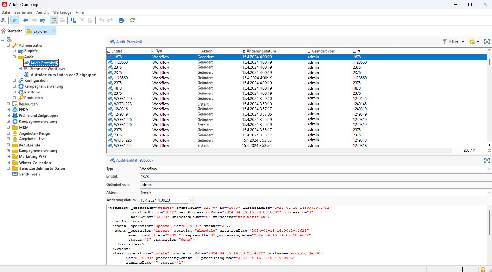
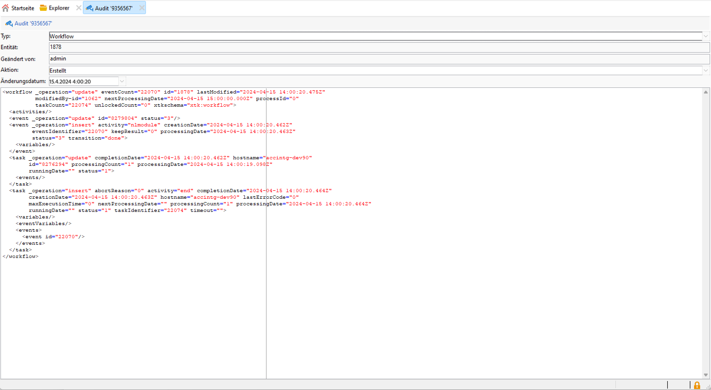
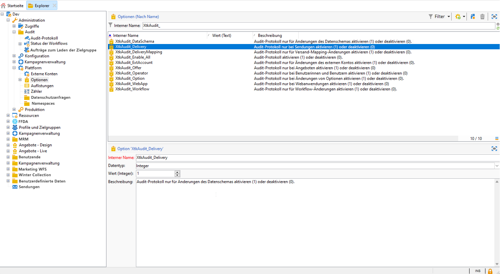
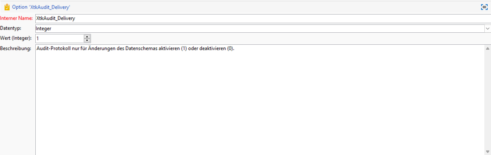

# Audit-Protokoll{#audit-trail}

Die **[!UICONTROL Audit-Protokoll]** -Funktion in Adobe Campaign bietet einen detaillierten Datensatz aller Änderungen, die an wichtigen Entitäten in Ihrer Instanz vorgenommen wurden. Dies sind typischerweise Änderungen, die einen reibungslosen Betrieb der Instanz erheblich beeinträchtigen. Es dient als Echtzeit-Protokoll und erfasst eine detaillierte Liste von Aktionen und Ereignissen, sobald sie auftreten.

>[!NOTE]
>
>Adobe Campaign prüft keine Änderungen an Benutzerrechten, Vorlagen, Personalisierungen oder Kampagnen.\
>Das Audit-Protokoll kann nur von Administratoren der Instanz verwaltet werden.

+++ Weitere Informationen zu verfügbaren Entitäten im Audit-Protokoll

* **Schema-Audit-Protokoll**: ermöglicht es Ihnen, die Änderungen an Ihren Schemas zu untersuchen und zu identifizieren, wer diese Änderungen vorgenommen hat und wann sie vorgenommen wurden.

  Detaillierte Informationen zu Schemata finden Sie unter [page](../dev/schemas.md).

* **Workflow-Audit-Protokoll** verfolgt alle Aktionen im Zusammenhang mit Ihren Workflows, einschließlich:

   * Starten
   * Aussetzen
   * Stoppen
   * Neu starten
   * Bereinigung, die dem Aktionsbereinigungsverlauf entspricht
   * Simulieren, welche der Aktion Start im Simulationsmodus entspricht
   * Wakeup, der der Aktion Ausstehende Aufgaben jetzt ausführen entspricht
   * Unbedingter Stopp

  Weiterführende Informationen zu Workflows finden Sie in diesem Abschnitt [page](../../automation/workflow/about-workflows.md).

  Weiterführende Informationen zur Überwachung von Workflows finden Sie im Abschnitt [dedizierter Abschnitt](../../automation/workflow/monitor-workflow-execution.md).

* **Option-Audit-Protokoll** können Sie Aktivitäten überprüfen und letzte Änderungen an Ihren Optionen vornehmen.

  Weiterführende Informationen zu Optionen finden Sie in diesem Abschnitt [page](https://experienceleague.adobe.com/en/docs/campaign-classic/using/installing-campaign-classic/appendices/configuring-campaign-options).

* **Versandaudit-Protokoll** ermöglicht Ihnen, die Aktivitäten und letzten Änderungen an Ihren Sendungen zu überprüfen.

  Weiterführende Informationen zu Sendungen finden Sie in diesem Abschnitt [page](../start/create-message.md).

* **Externes Konto** können Sie Änderungen an externen Konten überprüfen, die von technischen Prozessen wie technischen Workflows oder Kampagnen-Workflows verwendet werden.

  Weiterführende Informationen zu externen Konten finden Sie in diesem Abschnitt [page](../config/external-accounts.md).

* **Versandzuordnung** ermöglicht es Ihnen, Aktivitäten und kürzlich an Ihren Versandzuordnungen vorgenommene Änderungen zu überwachen.

  Weiterführende Informationen zum Versand-Mapping finden Sie in diesem Abschnitt [page](../audiences/target-mappings.md).

* **Webanwendung** können Sie Änderungen an Webformularen in Campaign V8 überprüfen, die zum Erstellen von Seiten mit Eingabe- und Auswahlfeldern verwendet werden und die Daten aus der Datenbank enthalten können.

  Weiterführende Informationen zur Webanwendung finden Sie in diesem Abschnitt [page](../dev/webapps.md).

* **Angebot** ermöglicht es Ihnen, die Aktivitäten und letzten Änderungen an Ihren Angeboten zu überprüfen.

  Weiterführende Informationen zu Angeboten finden Sie in diesem Abschnitt [page](../interaction/interaction.md).

* **Operator** ermöglicht es Ihnen, Aktivitäten und Änderungen zu überwachen, die an Ihren Benutzern vor Kurzem vorgenommen wurden.

  Weiterführende Informationen zu Benutzern finden Sie in diesem Abschnitt [page](../interaction/interaction-operators.md).

+++

## Zugriff auf das Audit-Protokoll {#accessing-audit-trail}

So greifen Sie auf die **[!UICONTROL Audit-Protokoll]**:

1. Zugriff auf **[!UICONTROL Explorer]** -Menü Ihrer Instanz.

1. Unter dem **[!UICONTROL Administration]** Menü auswählen **[!UICONTROL Prüfung]** then **[!UICONTROL Audit-Protokoll]**.

   

1. Das Fenster **[!UICONTROL Audit-Protokoll]** wird mit der Liste Ihrer Entitäten geöffnet. Adobe Campaign prüft die Aktionen zum Erstellen, Bearbeiten und Löschen für Ihre verschiedenen Entitäten.

   Wählen Sie eine der Entitäten aus, um mehr über die letzten Änderungen zu erfahren.

1. Die **[!UICONTROL Auditstelle]** enthält detailliertere Informationen zur ausgewählten Entität, z. B.:

   * **[!UICONTROL Typ]**: Workflow, Optionen, Sendungen oder Schemata.
   * **[!UICONTROL Entität]**: Interner Name Ihrer Aktivitäten.
   * **[!UICONTROL Geändert von]**: Benutzername der letzten Person, die diese Entität zuletzt geändert hat.
   * **[!UICONTROL Aktion]**: Letzte Aktion, die für diese Entität ausgeführt wurde, entweder &quot;Erstellt&quot;, &quot;Geändert&quot;oder &quot;Gelöscht&quot;.
   * **[!UICONTROL Änderungsdatum]**: Datum der letzten Aktion, die für diese Entität durchgeführt wurde.

   

>[!NOTE]
>
>Standardmäßig ist die Aufbewahrungsfrist auf 180 Tage für **[!UICONTROL Auditprotokolle]**. Dieser Wert kann im Softwareverteilungs-Assistenten geändert werden.

## Audit-Protokoll aktivieren/deaktivieren {#enable-disable-audit-trail}

Das Audit-Protokoll kann für eine bestimmte Aktivität einfach aktiviert oder deaktiviert werden, wenn Sie beispielsweise Speicherplatz in der Datenbank sparen möchten.

Gehen Sie dabei folgendermaßen vor:

1. Zugriff auf **[!UICONTROL Explorer]** -Menü Ihrer Instanz.

1. Unter dem **[!UICONTROL Administration]** Menü auswählen **[!UICONTROL Plattform]** then **[!UICONTROL Optionen]**.

1. Wählen Sie je nach Entität, die Sie aktivieren/deaktivieren möchten, eine der folgenden Optionen aus:

   * Für Workflow: **[!UICONTROL XtkAudit_Workflows]**
   * Für Schemas: **[!UICONTROL XtkAudit_DataSchema]**
   * Für Optionen: **[!UICONTROL XtkAudit_Option]**
   * Für Sendungen: **[!UICONTROL XtkAudit_Delivery]**
   * Für externes Konto: **[!UICONTROL XtkAudit_ExtAccount]**
   * Für die Versandzuordnung: **[!UICONTROL XtkAudit_DeliveryMapping]**
   * Für Webanwendungen: **[!UICONTROL XtkAudit_WebApp]**
   * Für Angebot: **[!UICONTROL XtkAudit_Offer]**
   * Für Operator: **[!UICONTROL XtkAudit_Operator]**
   * Für jede Entität: **[!UICONTROL XtkAudit_Enable_All]**

   

1. Ändern Sie die **[!UICONTROL Wert]** auf 1 gesetzt, wenn Sie die Entität aktivieren möchten, oder auf 0, wenn Sie sie deaktivieren möchten.

   

1. Klicken Sie auf **[!UICONTROL Speichern]**.
