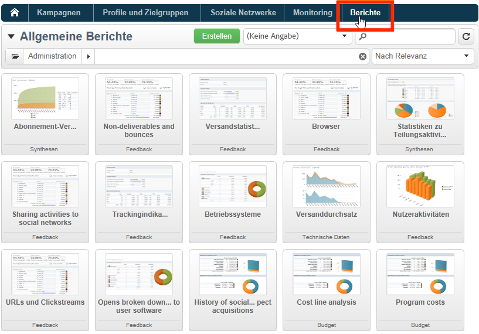
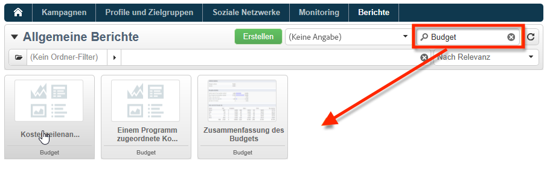
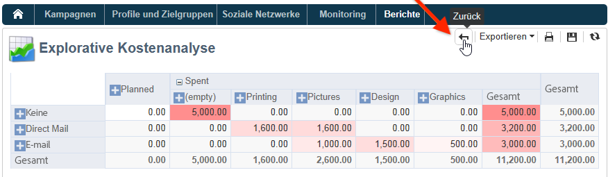
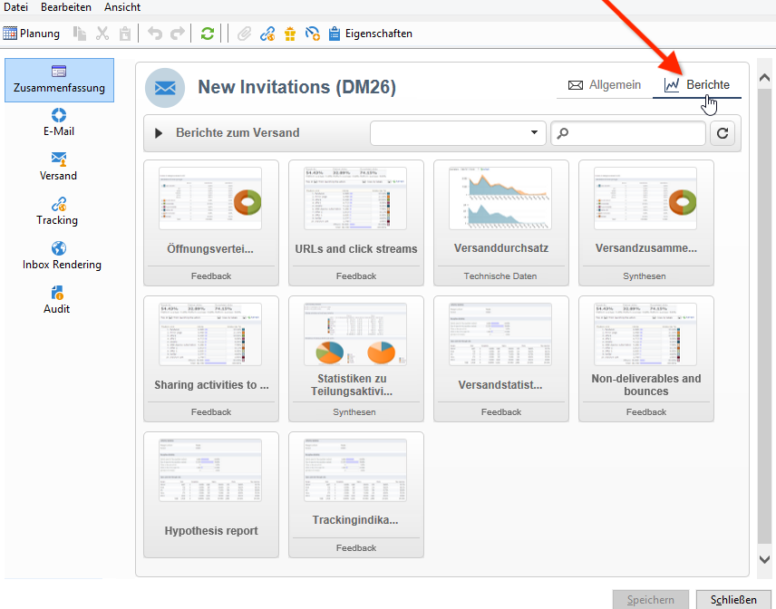
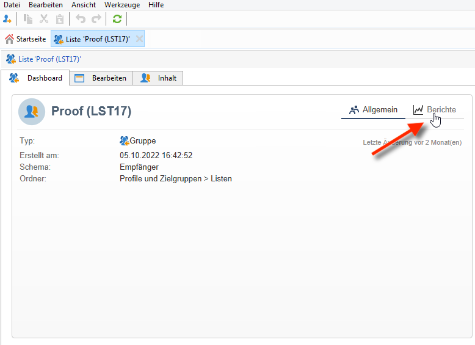

# Integrierte Berichte in Adobe Campaign{#ootb-reports}

Auf dieser Seite finden Sie eine Liste der in Adobe Campaign integrierten Berichte, ihren Inhalt und den Kontext dieser Berichte. Adobe Campaign bietet eine Reihe integrierter Berichte, auf die über die Client-Konsole oder einen Internet-Browser zugegriffen werden kann.

Folgende Berichttypen stehen zur Verfügung:

* Berichte über die gesamte Plattform. [Weitere Informationen](global-reports.md).
* Versandberichte. [Weitere Informationen](delivery-reports.md).

Der Zugriff auf integrierte Berichte erfolgt über die Campaign-Startseite, das dedizierte Berichte-Dashboard oder die Versandliste. Wie der Bericht in der Benutzeroberfläche angezeigt wird, hängt vom Kontext ab.

Auf der Startseite steht eine Liste wichtiger Berichte zur Verfügung, mit denen Sie schnell auf die Versanddaten zugreifen können. Diese Liste kann Ihren Bedürfnissen entsprechend geändert werden. Außerdem erfahren Sie, wie Sie Ihre eigenen Berichte zur Registerkarte **[!UICONTROL Berichte]** hinzufügen.

Weiterführende Informationen zu diesen benutzerdefinierten Konfigurationen finden Sie in der [Dokumentation zu Campaign Classic v7](https://experienceleague.adobe.com/docs/campaign-classic/using/reporting/creating-new-reports/configuring-access-to-the-report.html?lang=de).

## Zugriff auf integrierte Berichte {#access-ootb-reports}

Zugriff auf native Campaign-Berichte:

1. Wählen Sie in der Benutzeroberfläche von Adobe Campaign den Tab **[!UICONTROL Berichte]** aus.

   

1. Mithilfe des Suchfelds können die angezeigten Berichte gefiltert werden.

1. Durch Klick auf einen Bericht wird dieser geöffnet.

   

1. Klicken Sie oben im Bildschirm auf den Link **[!UICONTROL Zurück]**, der wieder zur Berichtsliste zurückführt.

   

Kampagnen- oder versandspezifische Berichte können über die jeweiligen Dashboards eingesehen werden.

Der Zugriff auf Berichte über Listen, Dienste, Angebote etc. erfolgt auf die gleiche Weise:

## Versandberichte {#reports-on-deliveries}

Die integrierten Berichte von Adobe Campaign werden in der folgenden Tabelle aufgelistet.

Weitere Informationen zum Inhalt dieser Berichte erhalten Sie in diesem [Abschnitt](delivery-reports.md).

<table> 
 <tbody> 
  <tr> 
   <td> <strong>Titel und interner Name</strong>  </td> 
   <td> <strong>Beschreibung</strong>  </td> 
   <td> <strong>Schema</strong>  </td> 
  </tr> 
  <tr> 
   <td> Nutzer-Aktivitäten (recipientActivity)  </td> 
   <td> Verteilung der Öffnungen, Klicks und Transaktionen der Nutzer nach Zeitspanne  </td> 
   <td> nms:delivery  </td> 
  </tr> 
  <tr> 
   <td> Versanddurchsatz (throughput)  </td> 
   <td> Grafiken zum Versanddurchsatz in Nachrichten/Stunde und Bits/Sekunde  </td> 
   <td> nms:delivery  </td> 
  </tr> 
  <tr> 
   <td> Fehler und Bounces (errors)  </td> 
   <td> Verteilung von Fehlern und Bounces nach Ursache und Domain  </td> 
   <td> nms:delivery  </td> 
  </tr> 
  <tr> 
   <td> Trackingindikatoren (deliveryFeedback)  </td> 
   <td> Zusammenfassung der Schlüsselindikatoren, die die Verfolgung des Empfängerverhaltens ermöglichen  </td> 
   <td> nms:delivery  </td> 
  </tr> 
  <tr> 
   <td> Trackingindikatoren (mobileAppDeliveryFeedback)  </td> 
   <td> Trackingindikatoren eines Mobile-App-Versands  </td> 
   <td> nms:delivery  </td> 
  </tr> 
  <tr> 
   <td> Browser (browserStatistics)  </td> 
   <td> Statistiken bezüglich der von den Empfängern, die in die Nachrichten geklickt haben, benutzten Browser  </td> 
   <td> xtk:none  </td> 
  </tr> 
  <tr> 
   <td> Teilen über soziale Netzwerke (deliveryForward)  </td> 
   <td> Statistiken über Teilungen und Öffnungen  </td> 
   <td> nms:delivery  </td> 
  </tr> 
  <tr> 
   <td> Klickposition (hoturls)  </td> 
   <td> Zeigt den Nachrichteninhalt mit dem prozentualen Klickanteil für jeden Link  </td> 
   <td> nms:delivery  </td> 
  </tr> 
  <tr> 
   <td> Hypothesenbericht (deliveryHypothesis)  </td> 
   <td> Fasst die Berechnungen der Versandhypothesen zusammen  </td> 
   <td> nms:delivery  </td> 
  </tr> 
  <tr> 
   <td> Versandstatistiken (statisticsPerDelivery)  </td> 
   <td> Statistiken (verarbeitete Nachrichten, zugestellte Nachrichten, Hardbounces, Softbounces, Öffnungen, Klicks, Abmeldungen) nach E-Mail-Domain  </td> 
   <td> nms:delivery  </td> 
  </tr> 
  <tr> 
   <td> Statistiken zu Teilungsaktivitäten (forwardActivities)  </td> 
   <td> Zeitliche Entwicklung von Teilungen, Öffnungen und Anmeldungen  </td> 
   <td> nms:delivery  </td> 
  </tr> 
  <tr> 
   <td> Trackingstatistiken (trackingStatistics)  </td> 
   <td> Statistiken über Öffnungen, Klicks und Transaktionen über einen Zeitraum hinweg  </td> 
   <td> nms:delivery  </td> 
  </tr> 
  <tr> 
   <td> Versandzusammenfassung (deliverySending)  </td> 
   <td> Zusammenfassung der Versandindikatoren: Zielgruppe, Ausschlüsse und versandte Nachrichten  </td> 
   <td> nms:delivery  </td> 
  </tr> 
  <tr> 
   <td> Versandzusammenfassung (deliveryStatistics)  </td> 
   <td> Zusammenfassung der ausgewählten Sendungen: Zielgruppe, Ausschlüsse und versandte Nachrichten  </td> 
   <td> nms:delivery  </td> 
  </tr> 
  <tr> 
   <td> Betriebssysteme (osStatistics)  </td> 
   <td> Statistiken bezüglich der von den Empfängern, die in die Nachrichten geklickt haben, benutzten Betriebssysteme  </td> 
   <td> xtk:none  </td> 
  </tr> 
  <tr> 
   <td> Reaktionsrate (deliveryFeedbackSocial)  </td> 
   <td> Feedback-Rate eines Versands und Feedback-Verteilung  </td> 
   <td> nms:delivery  </td> 
  </tr> 
  <tr> 
   <td> URLs und Clickstreams (topUrlDelivery)  </td> 
   <td> Reaktionsstärkste URLs und entsprechende Clickstreams  </td> 
   <td> nms:delivery  </td> 
  </tr> 
 </tbody> 
</table>

## Kampagnenberichte {#reports-on-campaigns}

Berichte zu Kampagnen beziehen sich auf die Daten der Tabelle **nms:operation**.

<table> 
 <tbody> 
  <tr> 
   <td> <strong>Titel und interner Name</strong>  </td> 
   <td> <strong>Beschreibung</strong>  </td> 
  </tr> 
  <tr> 
   <td> Nutzer-Aktivitäten (operationRecipientActivity)  </td> 
   <td> Verteilung der Öffnungen, Klicks und Transaktionen der Nutzer nach Zeitspanne; abhängig von Campaign  </td> 
  </tr> 
  <tr> 
   <td> Versanddurchsatz (operationThroughput)  </td> 
   <td> Grafiken zum Versanddurchsatz in Nachrichten/Stunde und Bits/Sekunde; abhängig von Campaign  </td> 
  </tr> 
  <tr> 
   <td> Kampagnenausgaben (budgetOperationExpenses)  </td> 
   <td> Detailanzeige der der Kampagne zugeordneten Ausgaben; abhängig von Campaign  </td> 
  </tr> 
  <tr> 
   <td> Fehler und Bounces (operationErrors)  </td> 
   <td> Verteilung von Fehlern und Bounces nach Ursache und Domain; abhängig von Campaign  </td> 
  </tr> 
  <tr> 
   <td> Kostenzeilenanalyse (budgetExplorerOperation)  </td> 
   <td> Deskriptive Kostenzeilenanalyse; abhängig von MRM  </td> 
  </tr> 
  <tr> 
   <td> Trackingindikatoren (operationFeedback)  </td> 
   <td> Zusammenfassung der wichtigsten Trackingindikatoren: Öffnungen, Klicks und Transaktionen; abhängig von Campaign  </td> 
  </tr> 
  <tr> 
   <td> Teilen über soziale Netzwerke (operationForward)  </td> 
   <td> Statistiken über Teilungen und Öffnungen; abhängig von Campaign  </td> 
  </tr> 
  <tr> 
   <td> Hypothesenbericht (operationHypothesis)  </td> 
   <td> Fasst die Berechnungen der Hypothesen über Versandkampagnen zusammen; abhängig von Campaign  </td> 
  </tr> 
  <tr> 
   <td> Statistiken zu Teilungsaktivitäten (forwardActivityOpt)  </td> 
   <td> Analyse von Teilungen, Öffnungen und Abonnements nach Zeiträumen; abhängig von Campaign  </td> 
  </tr> 
  <tr> 
   <td> Versandzusammenfassung (operationStatistics)  </td> 
   <td> Zusammenfassende Übersicht bezüglich der Kampagnensendungen: Zielgruppe, Ausschlüsse und versandte Nachrichten  </td> 
  </tr> 
  <tr> 
   <td> URLs und Clickstreams (operationTopUrlDelivery)  </td> 
   <td> Reaktionsstärkste URLs und entsprechende Clickstreams; abhängig von Campaign  </td> 
  </tr> 
 </tbody> 
</table>

## Dienstberichte {#reports-on-services}

Berichte über Services beziehen sich auf die Daten der Tabelle **nms:service**.

<table> 
 <tbody> 
  <tr> 
   <td> <strong>Titel und interner Name</strong>  </td> 
   <td> <strong>Beschreibung</strong>  </td> 
  </tr> 
  <tr> 
   <td> Fan-Akquise (socialAcquisitionsByWebapp)  </td> 
   <td> Webanwendungen, über die Interessenten akquiriert wurden Hängt vom Social Marketing-Add-on ab.  </td> 
  </tr> 
  <tr> 
   <td> Abonnement-Verteilung (mobileAppDistribution)  </td> 
   <td> Verteilung der aktiven Abonnements pro Mobile App; abhängig vom Mobile-App-Kanal-Add-on  </td> 
  </tr> 
  <tr> 
   <td> Abonnement-Verfolgung (subscriptionsProgress)  </td> 
   <td> Entwicklung der Dienst-Anmeldungen  </td> 
  </tr> 
  <tr> 
   <td> Reaktionsrate (socialReactionRate)  </td> 
   <td> Reaktionsraten der letzten Sendungen Hängt vom Social Marketing-Add-on ab.  </td> 
  </tr> 
  <tr> 
   <td> Reaktionsrate (mobileAppReactivityRate)  </td> 
   <td> Reaktionsrate der letzten Sendungen; abhängig vom Mobile-App-Kanal-Add-on  </td> 
  </tr> 
 </tbody> 
</table>

## Budgetberichte {#budget-reports}

Die integrierten Berichte von Adobe Campaign werden in der folgenden Tabelle aufgelistet.

<table> 
 <tbody> 
  <tr> 
   <td> <strong>Titel und interner Name</strong>  </td> 
   <td> <strong>Beschreibung</strong>  </td> 
   <td> <strong>Schema</strong>  </td> 
  </tr> 
  <tr> 
   <td> Programmen zugeordnete Kosten (budgetProgramCost)  </td> 
   <td> Verteilung der Programmkosten.  </td> 
   <td> nms:program  </td> 
  </tr> 
  <tr> 
   <td> Budget-Entwicklung (budgetEvolution)  </td> 
   <td> Kostenentwicklung nach Verbindlichkeitsniveau  </td> 
   <td> nms:budget  </td> 
  </tr> 
  <tr> 
   <td> Kumulierte Entwicklung des Budgets (budgetCumulativeEvolution)  </td> 
   <td> Entwicklung der kumulierten Budgetbeträge, verteilt nach Verbindlichkeitsniveau  </td> 
   <td> nms:budget  </td> 
  </tr> 
  <tr> 
   <td> Kostenzeilenanalyse (budgetExplorerBudget)  </td> 
   <td> Deskriptive Kostenzeilenanalyse  </td> 
   <td> nms:budget  </td> 
  </tr> 
  <tr> 
   <td> Kostenzeilenanalyse (budgetExplorer)  </td> 
   <td> Deskriptive Kostenzeilenanalyse  </td> 
   <td> nms:costLine  </td> 
  </tr> 
  <tr> 
   <td> Kostenzeilenanalyse (budgetExplorerPlan)  </td> 
   <td> Deskriptive Kostenzeilenanalyse  </td> 
   <td> nms:plan  </td> 
  </tr> 
  <tr> 
   <td> Kostenzeilenanalyse (budgetExplorerProgram)  </td> 
   <td> Deskriptive Kostenzeilenanalyse  </td> 
   <td> nms:program  </td> 
  </tr> 
  <tr> 
   <td> Budget-Zusammenfassung (budget)  </td> 
   <td> Sofortübersicht der wichtigsten Kosten, Ausgabenkategorien und Budgets  </td> 
   <td> nms:budget  </td> 
  </tr> 
 </tbody> 
</table>

## Simulationsberichte {#reports-on-simulations}

Berichte über Simulationen beziehen sich auf die Daten der Tabelle **nms:simulation**.

<table> 
 <tbody> 
  <tr> 
   <td> <strong>Titel und interner Name</strong>  </td> 
   <td> <strong>Beschreibung</strong>  </td> 
  </tr> 
  <tr> 
   <td> Detail der Simulationsausschlüsse (dlvSimuLossesDetail)  </td> 
   <td> Detaillierte Tabelle aller Ausschlussgründe  </td> 
  </tr> 
  <tr> 
   <td> Angebotsverteilung nach Rang (offerSimulationRanking)  </td> 
   <td> Verteilung der simulierten Angebote nach Rang  </td> 
  </tr> 
  <tr> 
   <td> Simulationszusammenfassung (dlvSimuLossesSummary)  </td> 
   <td> Zusammenfassung Simulationsgesamtzahl und -ausschlüsse  </td> 
  </tr> 
  <tr> 
   <td> Überschneidungsstatistiken (dlvSimuOverlapping)  </td> 
   <td> Versandzielgruppenüberschneidungen  </td> 
  </tr> 
  <tr> 
   <td> Zusammenfassung der simulationsbedingten Ausschlüsse (dlvSimuLossesSimu)  </td> 
   <td> Tabelle der simulationsbedingten Ausschlüsse  </td> 
  </tr> 
 </tbody> 
</table>

## Berichte über Web-Anwendungen {#reports-on-web-applications}

Berichte über Web-Anwendungen beziehen sich auf die Daten der Tabelle **nms:WebApp**.

<table> 
 <tbody> 
  <tr> 
   <td> <strong>Titel und interner Name</strong>  </td> 
   <td> <strong>Beschreibung</strong>  </td> 
  </tr> 
  <tr> 
   <td> Dokumentation (surveyDictionary)  </td> 
   <td> Beschreibung der Umfragestruktur; abhängig vom Survey-Manager-Add-on  </td> 
  </tr> 
  <tr> 
   <td> Allgemein (surveyProperties)  </td> 
   <td> Eigenschaften der Umfrage  </td> 
  </tr> 
  <tr> 
   <td> Antwortenverteilung (surveyDistribution)  </td> 
   <td> Verteilung der Umfrageantworten  </td> 
  </tr> 
 </tbody> 
</table>

## Andere Standardberichte {#other-ootb-reports}

Nachfolgende Berichte stehen ebenfalls nativ zur Verfügung. Weitere Informationen erhalten Sie im Handbuch der zugehörigen Anwendung.

<table> 
 <tbody> 
  <tr> 
   <td> <strong>Titel und interner Name</strong>  </td> 
   <td> <strong>Beschreibung</strong>  </td> 
   <td> <strong>Schema</strong>  </td> 
  </tr> 
  <tr> 
   <td> Angebotsanalyse (offerAnalysis)  </td> 
   <td> Angebotsanalyse nach Datum und Kanal; abhängig vom Interaction-Add-on  </td> 
   <td> nms:offer  </td> 
  </tr> 
  <tr> 
   <td> Remarketing-Effizienz (remarketingEffect)  </td> 
   <td> Messung der Remarketing-Effizienz  </td> 
   <td> nms:webEvent  </td> 
  </tr> 
  <tr> 
   <td> Verlauf der Akquise aus sozialen Netzwerken (socialVisitorStatistics)  </td> 
   <td> Verlauf der Akquise aus Twitter und Facebook; abhängig vom Social-Marketing-Add-on  </td> 
   <td> nms:visitor  </td> 
  </tr> 
  <tr> 
   <td> Verfolgung kürzlicher Vorschläge (recentPropositions)  </td> 
   <td> Echtzeitverfolgung der Vorschläge  </td> 
   <td> nms:propositionRcp  </td> 
  </tr> 
 </tbody> 
</table>
