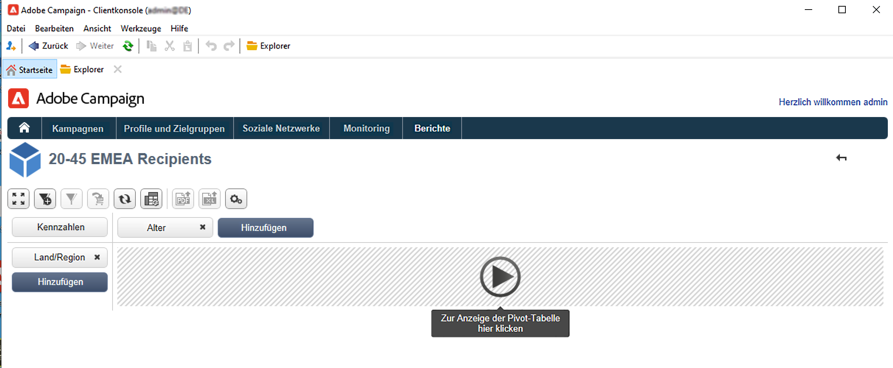

# Erstellen von Cubes{#create-a-cube}

## Arbeitsbereich Cube {#cube-workspace}

Um auf Cubes zuzugreifen, navigieren Sie zu **[!UICONTROL Administration > Konfiguration > Cubes]** vom Campaign-Explorer aus.

Mit Cubes können Sie:

* Daten direkt in einen Bericht exportieren, der im Abschnitt **[!UICONTROL Berichte]** auf der Adobe Campaign-Plattform.

   Erstellen Sie hierzu einen neuen Bericht und wählen Sie den zu verwendenden Cube.

   

   Cubes stellen Vorlagen dar, auf deren Grundlage Berichte erstellt werden. Nachdem Sie eine Vorlage ausgewählt haben, klicken Sie auf **[!UICONTROL Erstellen]** um den neuen Bericht zu konfigurieren und anzuzeigen.

   Sie können die Kennzahlen anpassen, den Anzeigemodus ändern oder eine Tabelle konfigurieren und dann den Bericht über die zentrale Schaltfläche erzeugen.

   

* Referenzieren eines Cubes im **[!UICONTROL Abfrage]** -Feld eines Berichts, um dessen Indikatoren zu verwenden, wie unten dargestellt:

   

* Fügen Sie eine auf einem Cube basierende Pivot-Tabelle in eine beliebige Seite eines Berichts ein. Referenzieren Sie dazu den im **[!UICONTROL Daten]** der Pivot-Tabelle auf der entsprechenden Seite.

   

   Weitere Informationen hierzu finden Sie unter [Erkunden der Daten in einem Bericht](cube-tables.md#explore-the-data-in-a-report).

>[!CAUTION]
>
>Zum Erstellen von Cubes sind Administratorberechtigungen erforderlich.

## Cube erstellen{#cube-create}

Bevor Sie mit der Erstellung eines Cube-Berichts beginnen, identifizieren Sie die relevanten Dimensionen und Kennzahlen und erstellen Sie sie im Cube.

Gehen Sie wie folgt vor, um einen Cube zu erstellen:

1. Wählen Sie die Arbeitstabelle aus. [Weitere Informationen](#select-the-work-table).
1. Definieren von Dimensionen. [Weitere Informationen](#define-dimensions).
1. Definieren von Kennzahlen. [Weitere Informationen](#build-indicators).
1. Erstellen von Aggregaten (optional). [Weitere Informationen](customize-cubes.md#calculate-and-use-aggregates).

Im folgenden Beispiel erfahren Sie, wie Sie in einem Bericht schnell einen einfachen Cube erstellen, um seine Kennzahlen zu exportieren.

### Wählen der Arbeitstabelle {#select-the-work-table}

Gehen Sie wie folgt vor, um einen Cube zu erstellen:

1. Klicken Sie auf **[!UICONTROL Neu]** oberhalb der Cube-Liste.

   

1. Wählen Sie das Schema aus, das die Elemente enthält, die Sie untersuchen möchten (auch als &quot;Faktenschema&quot;bezeichnet). Wählen Sie in diesem Beispiel die Standardeinstellung **Empfänger** Tabelle.
1. Klicken **[!UICONTROL Speichern]** , um den Cube zu erstellen: wird der Liste der Cubes hinzugefügt. Jetzt können Sie die Registerkarten verwenden, um sie zu konfigurieren.

1. Klicken Sie auf **[!UICONTROL Quelldaten filtern...]** -Link, um die Berechnungen dieses Cubes auf Daten in der Datenbank anzuwenden.

   

### Definieren von Dimensionen {#define-dimensions}

Definieren Sie nach der Erstellung des Cubes dessen Dimensionen. Dimensionen sind die Analyseachsen, die für jeden Cube auf der Grundlage seines zugehörigen Faktenschemas definiert werden. Dabei handelt es sich um die in der Analyse untersuchten Dimensionen, wie z. B. Zeit (Jahr, Monat, Datum), eine Classification der Produkte oder Verträge (Familie, Referenz usw.), ein Populationssegment (nach Stadt, Altersgruppe, Status usw.).

Gehen Sie wie folgt vor, um Dimensionen zu erstellen:

1. Navigieren Sie zum **[!UICONTROL Dimension]** und klicken Sie auf die **[!UICONTROL Hinzufügen]** -Schaltfläche, um eine neue Dimension zu erstellen.
1. Im **[!UICONTROL Ausdrucksfeld]**, klicken Sie auf die **[!UICONTROL Ausdruck bearbeiten]** -Symbol, um das Feld auszuwählen, das die betreffenden Daten enthält.

   

1. In diesem Beispiel wählen wir den Empfänger aus **Alter**. Für dieses Feld können Sie eine Klassierung definieren, um Altersgruppen zu gruppieren und die Lesbarkeit der Informationen zu vereinfachen. Es wird empfohlen, die Klassierung zu verwenden, wenn die Wahrscheinlichkeit mehrerer separater Werte besteht.

Kreuzen Sie hierzu die Option **[!UICONTROL Klassierung aktivieren]** an. [Weitere Informationen](customize-cubes.md#data-binning).

1. Hinzufügen einer **Datum** Typdimension. In unserem Beispiel sollen die Erstellungsdaten der Empfängerprofile angezeigt werden. Klicken Sie hierzu auf **[!UICONTROL Hinzufügen]** und wählen Sie das Feld **[!UICONTROL Erstellungsdatum]** in der Empfängertabelle aus.
Sie können den Anzeigemodus für das Datum anpassen. Wählen Sie dazu die zu verwendende Hierarchie und die zu erzeugenden Ebenen aus:

In unserem Beispiel möchten wir nur Jahre, Monate und Tage anzeigen. Beachten Sie, dass Sie nicht gleichzeitig mit Wochen und Semestern/Monaten arbeiten können: diese Ebenen sind nicht kompatibel.

1. Erstellen Sie eine weitere Dimension, um die Daten relativ zur Stadt des Empfängers zu analysieren. Fügen Sie hierzu eine neue Dimension hinzu und wählen Sie im Knoten **[!UICONTROL Geografische Lokalisierung]** des Empfängerschemas das Feld Ort aus.

Sie können auch hier die Klassierung aktivieren, um die Lesbarkeit der Informationen zu erleichtern, und in diesem Fall die Werte mit einem Auflistungswert verknüpfen.

Wählen Sie die Auflistung in der Dropdown-Liste aus.. Beachten Sie, dass diese Auflistung als **[!UICONTROL Reserviert für Klassierung]**.

Nur die in der Auflistung vorhandenen Werte werden angezeigt. Alle anderen werden unter einem Titel zusammengefasst, den Sie im Feld **[!UICONTROL Titel der anderen Werte]** definieren können.

Weiterführende Informationen hierzu finden Sie in [diesem Abschnitt](customize-cubes.md#dynamically-manage-bins).

### Erstellen von Indikatoren {#build-indicators}

Nachdem die Dimensionen definiert wurden, legen Sie einen Berechnungsmodus für die Werte fest, die in den Zellen angezeigt werden sollen.

Erstellen Sie dazu die Indikatoren im **[!UICONTROL Maßnahmen]** Registerkarte. Erstellen Sie so viele Kennzahlen wie Spalten, die in den auf diesem Cube basierenden Berichten angezeigt werden sollen.

Gehen Sie wie folgt vor, um Indikatoren zu erstellen:

1. Navigieren Sie zum **[!UICONTROL Maßnahmen]** und klicken Sie auf **[!UICONTROL Hinzufügen]** Schaltfläche.
1. Wählen Sie den Kennzahlentyp und die anzuwendende Formel aus. In diesem Beispiel zählen wir die Anzahl der Frauen unter den Empfängern. Die Kennzahl basiert auf dem Faktenschema und verwendet die Funktion **[!UICONTROL Zählung]**.

   

   Verwenden Sie die **[!UICONTROL Filtern Sie die Messdaten...]** -Link, um nur Frauen auszuwählen. [Weitere Informationen](customize-cubes.md#define-measures).

   

1. Geben Sie den Titel der Kennzahl an und speichern Sie sie.

   

1. Speichern Sie den Cube.

Jetzt können Sie einen auf diesem Cube basierenden Bericht erstellen. [Weitere Informationen](cube-tables.md).
