# Verwenden von Cubes zur Datenanalyse{#use-cubes-to-create-reports}

Mithilfe von Cubes können Sie Berichte erstellen sowie Daten aus der Datenbank identifizieren und auswählen. Sie haben folgende Möglichkeiten:

* Erstellung von Cube-basierten Berichten. [Weitere Informationen](#explore-the-data-in-a-report).
* Sammeln Sie die Daten in der Datenbank und gruppieren Sie sie in Listen, um beispielsweise Zielgruppen und Sendungen zu identifizieren und zu erstellen. [Weitere Informationen](#build-a-target-population).
* Fügen Sie eine Pivot-Tabelle in einen Bericht ein und verweisen Sie auf einen darin vorhandenen Cube. [Weitere Informationen](#insert-a-pivot-table-into-a-report).

## Erkunden der Daten in einem Bericht {#explore-the-data-in-a-report}

### Schritt 1: Erstellen eines Cube-basierten Berichts {#step-1---create-a-report-based-on-a-cube}

Einmal [Cube ist konfiguriert](cube-indicators.md)kann sie als Vorlage für die Erstellung eines neuen Berichts verwendet werden.

Gehen Sie wie folgt vor, um einen auf einem vorhandenen Cube basierenden Bericht zu erstellen:

1. Klicken Sie im Tab **[!UICONTROL Berichte]** auf die Schaltfläche **[!UICONTROL Erstellen]** und wählen Sie den zuvor erstellten Cube aus.

   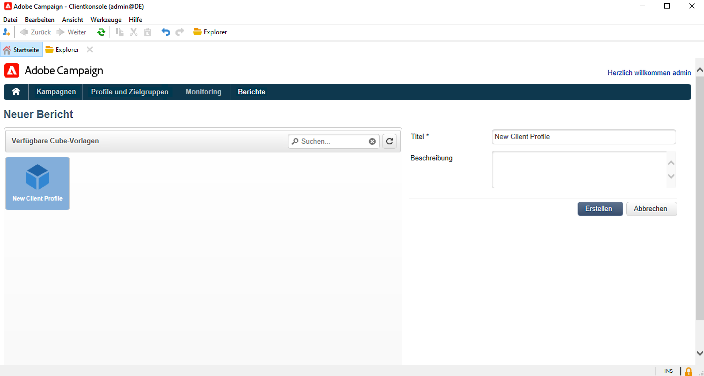

1. Klicken Sie zur Bestätigung auf die Schaltfläche **[!UICONTROL Erstellen]**: Der Bildschirm zur Konfiguration und Ansicht des Berichts wird geöffnet.

   Die ersten beiden verfügbaren Dimensionen werden standardmäßig in Spalten- und Zeilenform angezeigt, die Tabelle enthält jedoch keine Werte. Klicken Sie auf das zentrale Symbol, um sie zu erzeugen:

   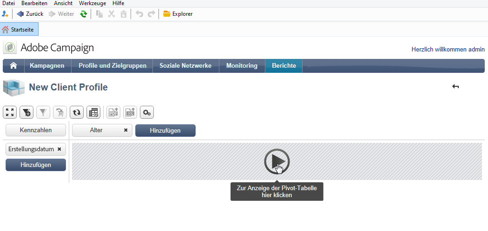

1. Sie können die Dimensionen von einer Achse in die andere verschieben, sie löschen, neue Kennzahlen hinzufügen etc. Verwenden Sie hierzu die entsprechenden Symbole.

   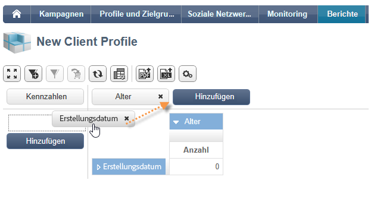

   Diese Vorgänge werden nachfolgend beschrieben.

### Schritt 2: Auswahl der Zeilen und Spalten {#step-2---select-lines-and-columns}

Die Standardanzeige beinhaltet die ersten beiden Dimensionen des Cubes (in unserem Beispiel: Alter und Stadt).

Über die oberhalb der jeweiligen Achse gelegenen **[!UICONTROL Hinzufügen]**-Schaltflächen können weitere Dimensionen hinzugefügt werden.

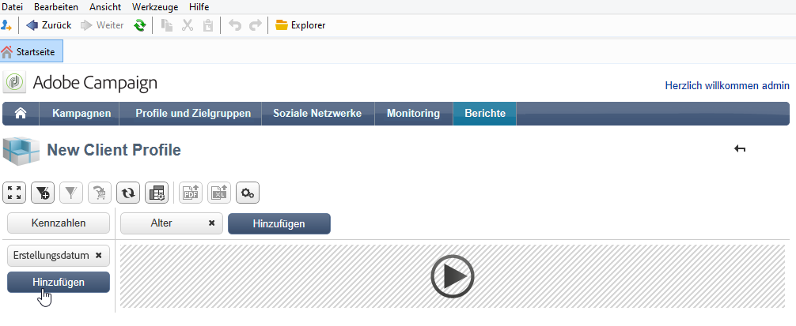

1. Wählen Sie die Dimensionen aus, die in den Zeilen und Spalten der Tabelle angezeigt werden sollen. Ziehen Sie dazu die verfügbaren Dimensionen per Drag-and-Drop in den Arbeitsbereich.
1. Wählen Sie die der Tabelle hinzuzufügende Dimension aus den verfügbaren Dimensionen aus:
   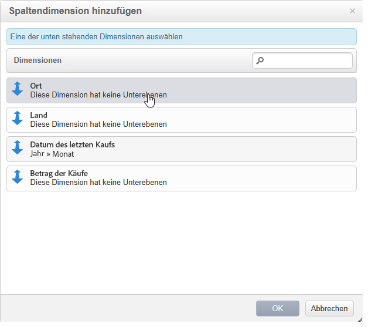

1. Legen Sie die Parameter dieser Dimension fest.

   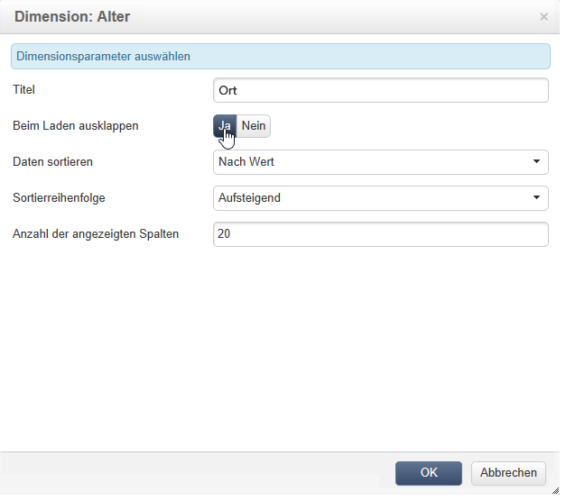

   Diese Parameter hängen vom Datentyp der ausgewählten Dimension ab.

   Beispielsweise können für Daten mehrere Ebenen verfügbar sein. Weitere Informationen hierzu finden Sie unter [Anzeigen von Kennzahlen](cube-best-practices.md#display-measures).

   In diesem Fall sind die folgenden Optionen verfügbar:

   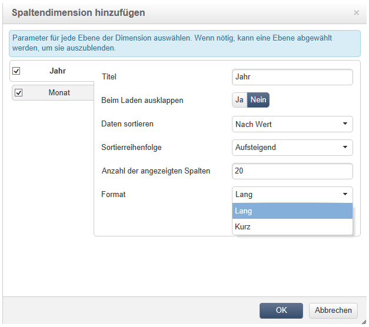

   Sie können

   * die Daten beim Laden auszuklappen: Die Werte werden bei Aktivierung dieser Option bei jeder Aktualisierung des Berichts angezeigt (Standardwert: Nein);
   * das Ergebnis am Zeilenende anzuzeigen: Für in Spalten angezeigte Daten wird eine zusätzliche Option angeboten, um das Gesamtergebnis am Ende der Zeile anzuzeigen. In diesem Fall wird der Tabelle eine zusätzliche Spalte hinzugefügt (Standardwert: Ja);
   * die Daten zu sortieren: Die Spaltenwerte können nach Wert, Titel oder Kennzahl sortiert werden (Standardwert: Nach Wert);
   * die Werte absteigend (A-Z, 0-9) oder aufsteigend (Z-A, 9-0) anzuzeigen;
   * die Anzahl der beim Laden anzuzeigenden Spalten ändern (Standardwert: 200).

1. Klicken Sie zur Bestätigung auf **[!UICONTROL OK]**: Die Dimension wird den existierenden Dimensionen hinzugefügt.

   Das gelbe Banner oberhalb der Tabelle zeigt an, dass Sie Änderungen vorgenommen haben. Klicken Sie auf die Schaltfläche **[!UICONTROL Speichern]**, wenn diese berücksichtigt werden sollen.

   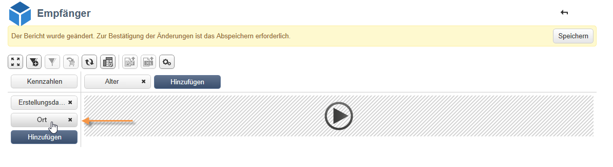

### Schritt 3: Konfiguration der anzuzeigenden Kennzahlen {#step-3---configure-the-measures-to-display}

Nachdem die Zeilen und Spalten definiert wurden, wählen Sie aus, welche Messungen angezeigt werden sollen. Standardmäßig wird nur eine Kennzahl angezeigt.

Gehen Sie wie folgt vor, um Kennzahlen hinzuzufügen und zu konfigurieren:

1. Klicken Sie auf die Schaltfläche **[!UICONTROL Kennzahlen]**.

   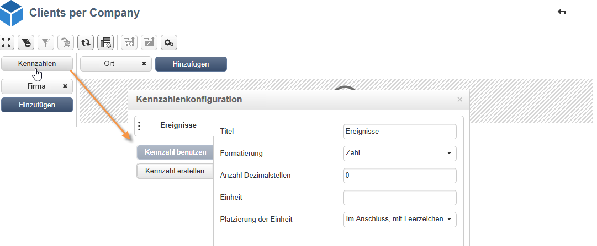

1. Die **[!UICONTROL Kennzahl verwenden]** wählen Sie eine der vorhandenen Maßnahmen aus.

   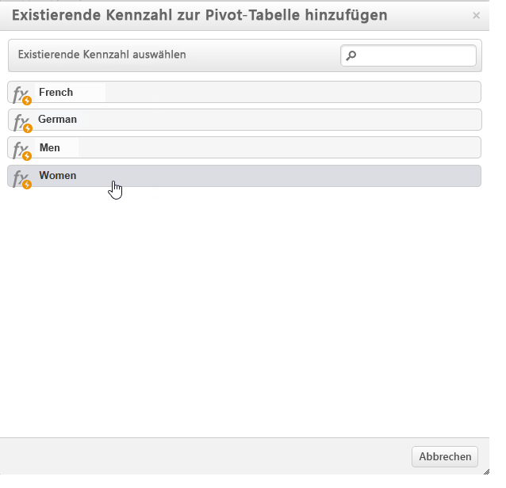

   Wählen Sie die anzuzeigenden Informationen und die Formatierungsoptionen aus. Die Liste der Optionen hängt vom Kennzahlentyp ab.

   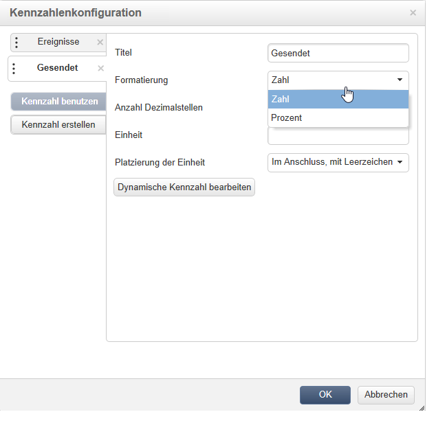

   Eine übergreifende Konfiguration der Kennzahlen ist über das Symbol **[!UICONTROL Konfiguration der Pivot-Tabelle bearbeiten]** möglich.

   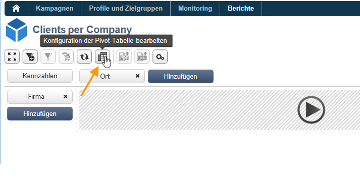

   Sie können insbesondere bestimmen, ob die Titel der Kennzahlen angezeigt werden sollen. [Weitere Informationen](cube-best-practices.md#configure-the-display).

1. Sie können neue Kennzahlen auf der Basis bestehender erstellen. Klicken Sie dazu auf **[!UICONTROL Kennzahl erstellen]** und konfigurieren Sie sie.

   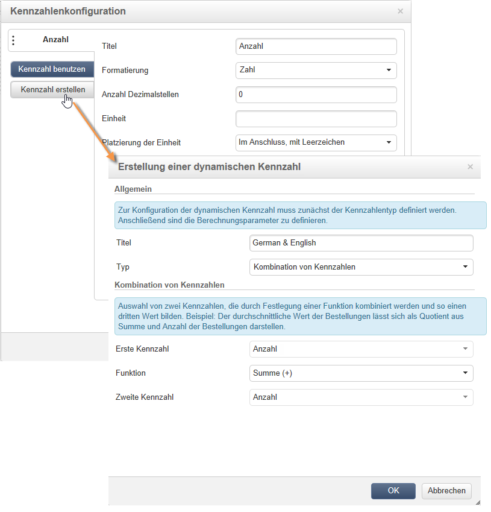

   Folgende Kennzahltypen sind möglich:

   * Kombination von Kennzahlen: ermöglicht die Erstellung der neuen Kennzahl auf Basis von existierenden Kennzahlen.

      Für diese Kennzahlen stehen folgende Funktionen zur Verfügung: Summe, Differenz, Produkt und Rate.

   * Anteil: ermöglicht die Berechnung der Anzahl an für eine gegebene Dimension gemessenen Datensätzen. Der Anteil kann in Bezug auf eine Dimension oder eine Unter-Dimension berechnet werden.
   * Abweichung: ermöglicht die Berechnung der Abweichungen der Werte einer Ebene.
   * Abweichung vom Durchschnitt: ermöglicht die Berechnung der Abweichungen in jeder Gruppe von entsprechenden Zellen in Bezug auf den Wertedurschnitt. Sie können zum Beispiel die jeweilige Einkaufsmenge der existierenden Segmente vergleichen.

   Nach der Erstellung wird die Maßnahme dem Bericht hinzugefügt.

   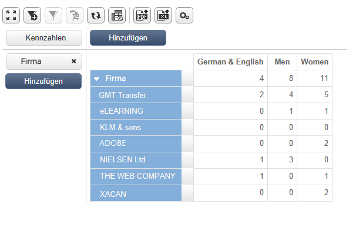

   Nachdem Sie eine Kennzahl erstellt haben, können Sie sie bearbeiten und ihre Konfiguration ändern. Klicken Sie dazu auf die Schaltfläche **[!UICONTROL Maßnahmen]** und navigieren Sie zum Tab der zu bearbeitenden Kennzahl.

   Klicken Sie anschließend auf die Schaltfläche **[!UICONTROL Dynamische Kennzahl bearbeiten]**, um auf die Einstellungen zuzugreifen.

## Erstellen einer Zielpopulation {#build-a-target-population}

Die basierend auf Cubes erstellten Berichte ermöglichen den Abruf von Daten aus der Datenbank und deren Speicherung in einer Liste.

Gehen Sie wie folgt vor, um eine Population in einer Liste zu gruppieren:

1. Markieren Sie durch Klick die Zellen, die die abzurufenden Populationen enthalten, und klicken Sie auf das Symbol **[!UICONTROL Zum Warenkorb hinzufügen]**.

   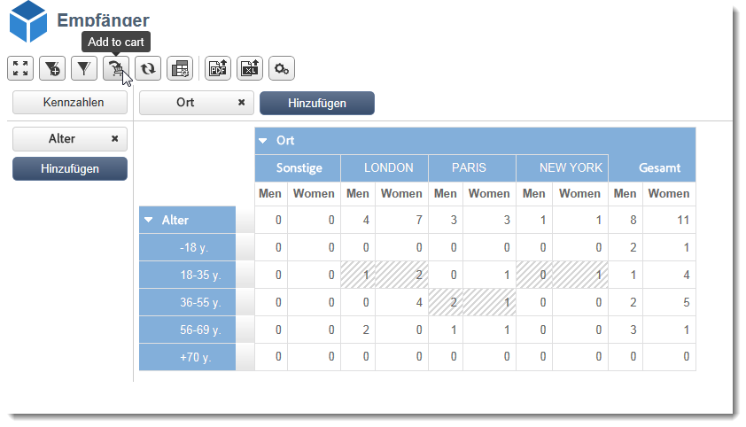

   Wiederholen Sie diesen Vorgang so oft wie nötig, um die unterschiedlichen Profile zu sammeln.

1. Klicken Sie auf die Schaltfläche **[!UICONTROL Warenkorb anzeigen]**, um den Inhalt einzusehen, bevor er exportiert wird.

   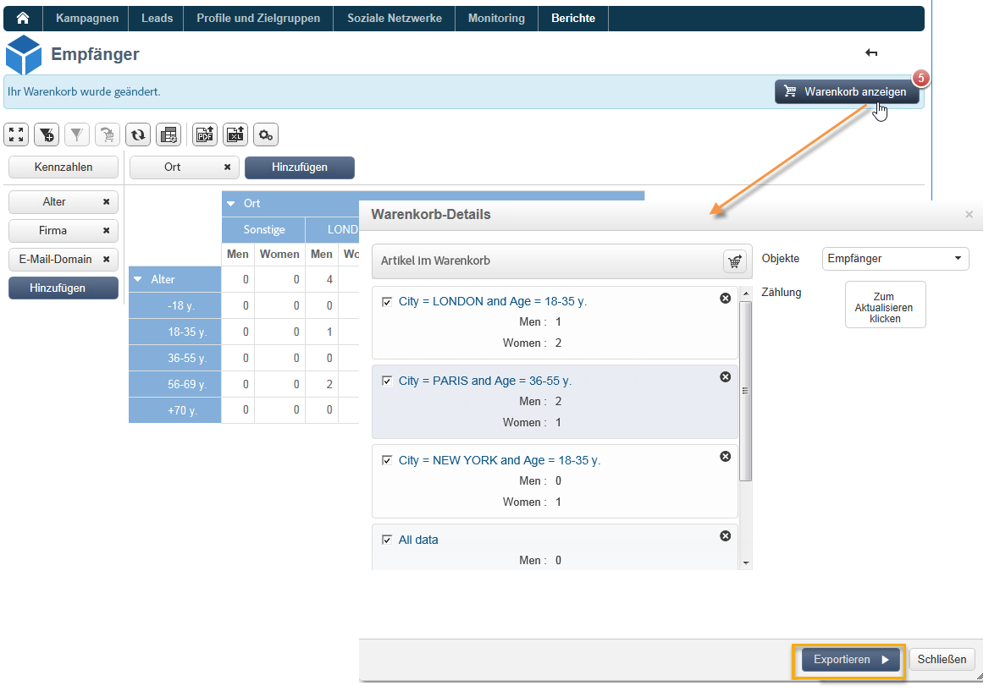

1. Verwenden Sie die **[!UICONTROL Export]** -Schaltfläche, um die Artikel im Warenkorb in einer Liste zu gruppieren.

   Geben Sie den Namen der Liste an und wählen Sie den gewünschten Exporttyp aus.

   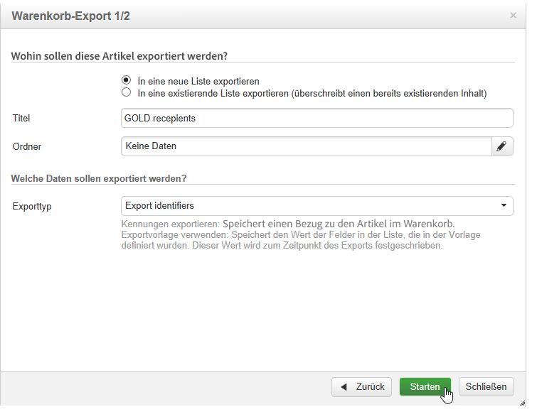

   Klicken Sie auf **[!UICONTROL Starten]**, um mit dem Export zu beginnen.

1. Nach Abschluss des Exports bestätigt eine Nachricht seine korrekte Ausführung und die Anzahl der verarbeiteten Datensätze.

   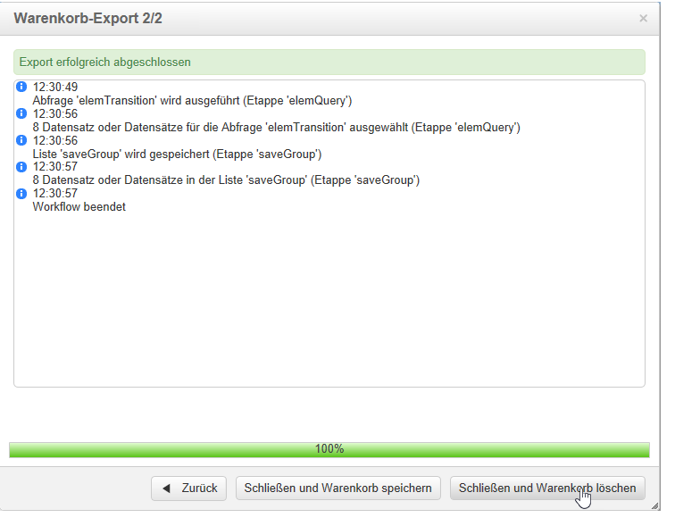

   Sie können den Inhalt des Warenkorbs beibehalten oder löschen.

   Die neue Liste ist über die **[!UICONTROL Profile und Zielgruppen]** Registerkarte.

   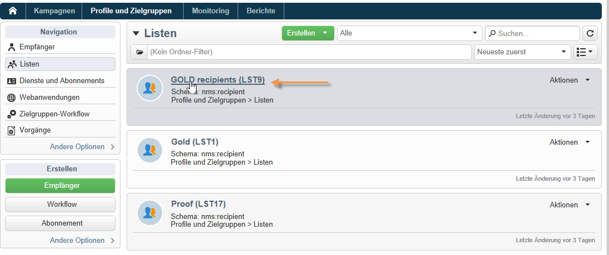

## Einfügen von Pivot-Tabellen in Berichte {#insert-a-pivot-table-into-a-report}

Gehen Sie wie folgt vor, um eine Tabelle zu erstellen und die Daten in einem Cube zu untersuchen:

1. Erstellen Sie einen neuen Bericht mit einer Seite und fügen Sie eine Pivot-Tabelle ein.

   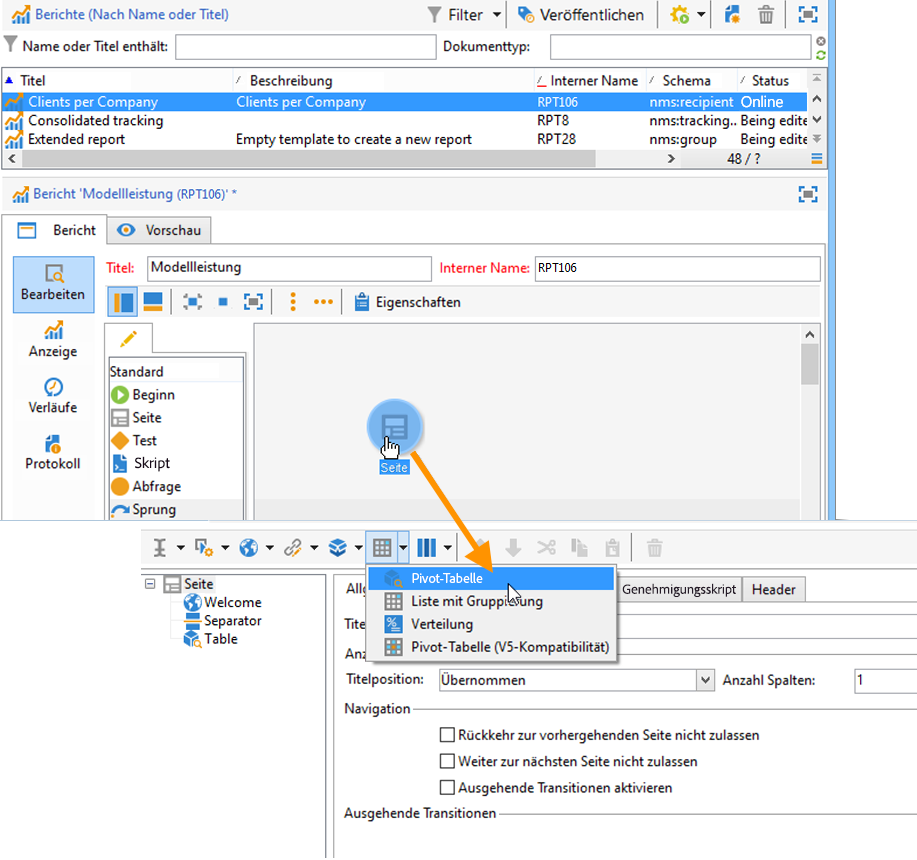

1. Im Tab **[!UICONTROL Daten]** haben Sie die Möglichkeit, einen existierenden Cube auszuwählen. Auf diese Weise werden automatisch die Dimensionen und Kennzahlen angezeigt, die zuvor konfiguriert wurden.

   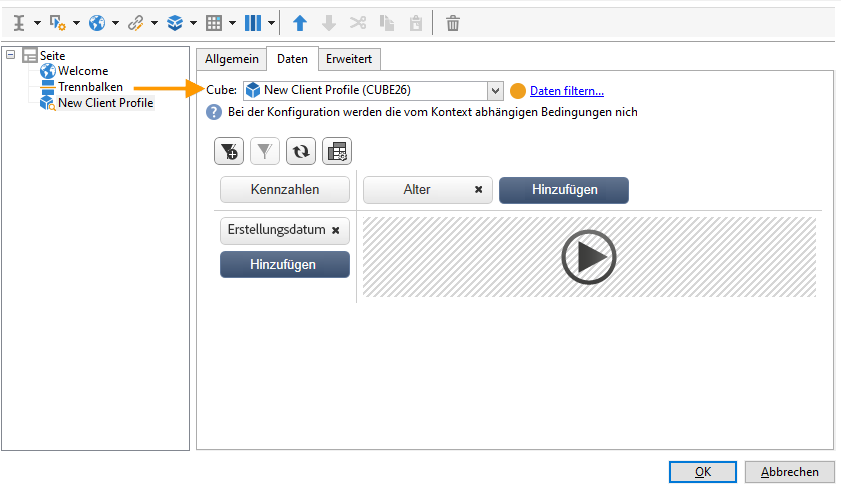

   Auf diese Weise können Sie den anzuzeigenden Bericht erstellen. Weitere Informationen hierzu finden Sie unter [2. Schritt - Zeilen und Spalten auswählen](#step-2---select-lines-and-columns).
