# Anpassen von Cubes{#cube-custom}

## Daten klassieren {#data-binning}

Nutzen Sie die Klassierung, um die Anzeige der Daten zu vereinfachen, indem Sie die Werte nach Kriterien gruppieren. Je nach den verfügbaren Informationen können Sie Altersgruppen definieren, E-Mail-Domains gruppieren, auf eine Werteauflistung beschränken, die Daten explizit auf die Anzeige und Gruppierung aller anderen Daten in einer dedizierten Zeile oder Spalte beschränken usw.

Insgesamt sind drei Klassierungstypen möglich:

1. Mit manuell definierten Wertebereichen. Beispielweise Alter, durchschnittlicher Warenkorb, Anzahl der geöffneten Sendungen usw. Weitere Informationen hierzu finden Sie unter [Klassen manuell definieren](#defining-each-bin).
1. Dynamisch, entsprechend den Werten einer Auflistung: Nur die in der Auflistungen enthaltenen Werte werden angezeigt, alle anderen werden als „Sonstige“ gruppiert. Weitere Informationen hierzu finden Sie unter [Klassen dynamisch verwalten](#dynamically-managing-bins).
1. Mit Wertebereichen, wobei alle anderen Bereiche gruppiert werden. Zum Beispiel 18- bis 25-Jährige, 26- bis 59-Jährige und andere. Weitere Informationen hierzu finden Sie unter [Wertebereiche anzeigen](#creating-value-ranges).

Um die Klassierung zu aktivieren, kreuzen Sie die entsprechende Option bei der Erstellung der Dimension an.

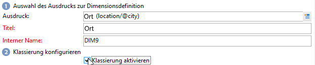

Sie können jede Klasse manuell erstellen oder sie mit einer existierenden Auflistung verknüpfen.

Adobe Campaign bietet zudem einen Assistenten, um die Klassen automatisch zu erzeugen: Die Werte können in n Klassen verteilt oder nach den am häufigsten in der Datenbank vertretenen Werten gruppiert werden.

### Definieren der einzelnen Klassen {#define-each-bin}

Um jede Klasse einzeln zu erstellen, aktivieren Sie die Option **[!UICONTROL Klassen manuell definieren]** und nutzen Sie die Tabelle, um die verschiedenen Klassen zu bestimmen.

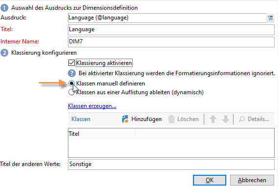

Klicken Sie auf die Schaltfläche **[!UICONTROL Hinzufügen]**, um eine neue Klasse zu erstellen, und listen Sie die in der Klasse zusammenzufassenden Werte auf.

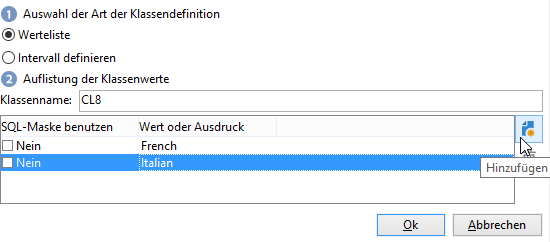

Im unten stehenden Beispiel werden Sprachen in drei Gruppen verteilt: Englisch-Deutsch-Niederländisch, Französisch-Italienisch-Spanisch und Sonstige.

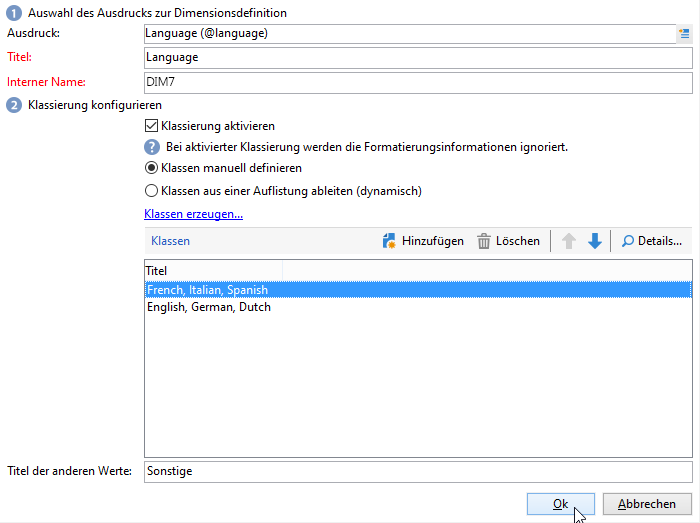

Sie können eine SQL-Maske nutzen, um mehrere Werte nach einem Filter zu gruppieren. Aktivieren Sie hierzu die Option **[!UICONTROL Ja]** in der Spalte **[!UICONTROL SQL-Maske benutzen]** und geben Sie den anzuwendenden SQL-Filter in der Spalte **[!UICONTROL Werte oder Ausdruck]** an.

<!--In the example below, all email domains that start with **yahoo** (yahoo.fr, yahoo.com, yahoo.be, etc.), or with **ymail** (ymail.com, ymail.eu, etc.) will be grouped under the label **YAHOO!**, as well as addresses with the **rocketmail.com** domain.-->

### Klassen dynamisch verwalten {#dynamically-manage-bins}

Die Werte können über Auflistungen dynamisch verwaltet werden. So werden nur die in der Auflistung enthaltenen Werte angezeigt. Bei Änderung der Auflistungswerte wird der Cube-Inhalt automatisch angepasst.

Gehen Sie wie folgt vor, um diesen Klassierungstyp zu erstellen:

1. Erstellen Sie eine neue Dimension und aktivieren Sie die Klassierung.
1. Aktivieren Sie die Option **[!UICONTROL Klassen aus einer Auflistung ableiten (dynamisch)]** und wählen Sie die entsprechende Auflistung aus.

   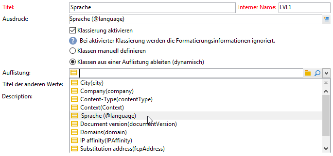

   Bei Aktualisierung der Auflistungswerte werden die Klassen automatisch angepasst, ohne benutzerseitige Intervention.

### Erstellen von Wertebereichen {#create-value-ranges}

Sie können die Werte nach benutzerdefinierten Intervallen gruppieren.

Um die Intervalle manuell zu bestimmen, klicken Sie auf die Schaltfläche **[!UICONTROL Hinzufügen]** und aktivieren Sie die Option **[!UICONTROL Intervall definieren]** :

Geben Sie anschließend die oberen und unteren Grenzwerte an und klicken Sie zur Bestätigung auf **[!UICONTROL OK]**.

### Automatisches Erzeugen von Klassen {#generate-bins-automatically}

Es besteht auch die Möglichkeit, die Klassen automatisch zu erzeugen. Klicken Sie hierzu auf den Link **[!UICONTROL Klassen erzeugen...]**.

Sie können

* **[!UICONTROL die am häufigsten vertretenen Werte abrufen:]**

   Wenn Sie vier Klassen generieren, werden die am häufigsten verwendeten Werte angezeigt, während die anderen gezählt und in der Kategorie &quot;Sonstige&quot;gruppiert werden.

* **[!UICONTROL Klassen in Form von Bereichen erzeugen:]**

   Für dasselbe Beispiel erstellt Adobe Campaign automatisch vier Wertebereiche gleicher Größe, um die Werte in der Datenbank anzuzeigen.

In diesem Fall wird der im Faktenschema gewählte Filter ignoriert.

### Auflistungen {#enumerations}

Zur Erhöhung der Lesbarkeit und Relevanz von Berichten bietet Adobe Campaign die Möglichkeit, spezifische Auflistungen zu erstellen, um unterschiedliche Werte in ein und derselben Klasse zu gruppieren. Diese der Klassierung vorbehaltenen Auflistungen können in Cubes referenziert und in Berichten angezeigt werden.

Auf diese Weise bietet Adobe Campaign eine Auflistung von Domains, mithilfe derer sich die Liste der nach ISP gruppierten E-Mail-Domains von allen Datenbankkontakten wie im unten stehenden Beispiel anzeigen lässt:

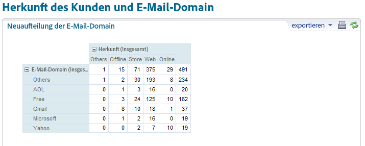

Diese Auflistung ist nach folgendem Modell gestaltet:

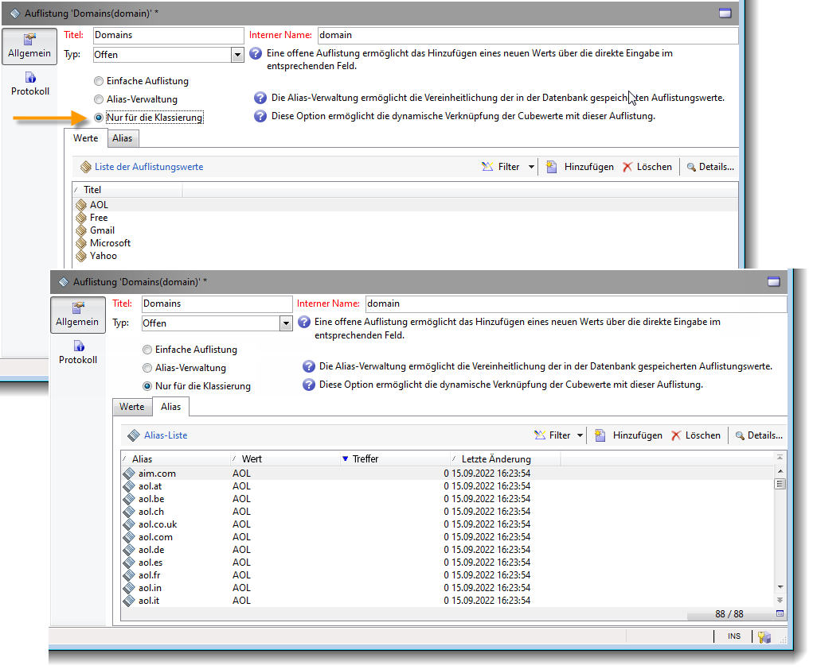

Um einen diese Auflistung verwendenden Bericht zu erstellen, müssen Sie zunächst einen die Dimension **[!UICONTROL E-Mail-Domain]** verwendenden Cube erstellen. Wählen Sie die Option **[!UICONTROL Klassierung aktivieren]** und dann **[!UICONTROL Klassen aus einer Auflistung ableiten (dynamisch)]**. Wählen Sie anschließend die oben dargestellte Auflistung **Domains (domain)** aus. Alle Werte, für die kein Alias definiert worden ist, werden unter dem Titel **Sonstige** gruppiert.

Erstellen Sie anschließend einen auf diesem Cube basierenden Bericht, um die Werte anzuzeigen.

Dabei genügt es, die Auflistung abzuändern, um den entsprechenden Bericht zu aktualisieren. Erstellen Sie beispielsweise den Wert **Adobe** und fügen Sie auf Auflistungsniveau den Alias **adobe.com** hinzu: Der Bericht wird automatisch mit dem Wert Adobe aktualisiert.

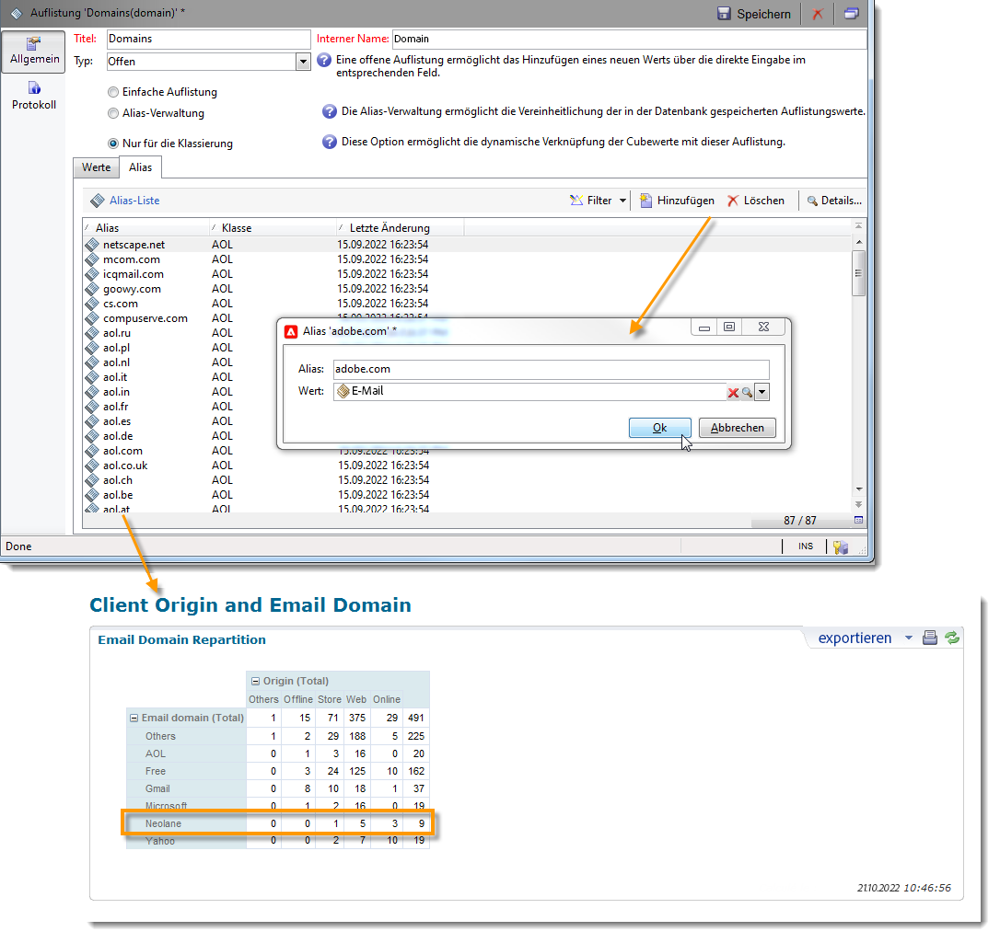

Die Auflistung **[!UICONTROL Domains (domains)]** wird zur Erzeugung der nativen Berichte verwendet, in denen die Domain-Liste angezeigt wird. Sie können diese Liste abändern, um den Inhalt der Berichte anzupassen.

Sie können weitere, der Klassierung vorbehaltene Auflistungen erstellen und diese in anderen Cubes verwenden: Alle Alias-Werte werden in den im ersten Tab der Auflistung definierten Klassen gruppiert.

## Aggregate in Cubes {#calculate-and-use-aggregates}

Cubes bieten die Möglichkeit, Daten vor der eigentlichen Verwendung zu aggregieren.

Diese Vorgehensweise empfiehlt sich insbesondere bei der Verarbeitung von großen Datenvolumen. Aggregate werden automatisch entsprechend den in der dedizierten Workflow-Aktivität definierten Parametern aktualisiert, damit neu abgerufene Daten bei der Kennzahlenberechnung berücksichtigt werden können.

Aggregate werden im entsprechenden Tab des Cubes definiert.

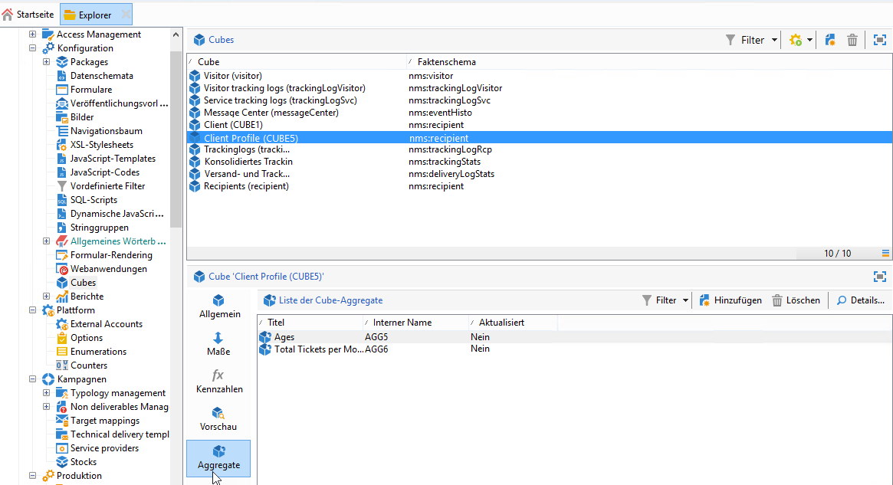

>[!NOTE]
>
>Der Workflow zur Aggregat-Aktualisierung kann im Aggregat selbst konfiguriert werden. Es besteht jedoch auch die Möglichkeit, das Aggregat über einen externen Workflow zu aktualisieren, in welchem der entsprechende Cube referenziert wird.

Gehen Sie wie folgt vor, um ein neues Aggregat zu erstellen:

1. Gehen Sie in den Tab **[!UICONTROL Aggregate]** des Cubes und klicken Sie auf die Schaltfläche **[!UICONTROL Hinzufügen]**.
1. Benennen Sie das Aggregat und fügen Sie die zu berechnenden Dimensionen hinzu.
1. Wählen Sie die Dimension sowie deren Ebene aus. Wiederholen Sie diesen Vorgang für alle zu berechnenden Dimensionen und Ebenen.
1. Gehen Sie in den Tab **[!UICONTROL Workflow]**, um den Aggregations-Workflow zu erstellen.

   * Die Aktivität **[!UICONTROL Planung]** ermöglicht es, die Aktualisierungshäufigkeit der Berechnungen zu bestimmen. Weiterführende Informationen zur Planung finden Sie in [diesem Abschnitt](../../automation/workflow/scheduler.md).
   * Über die Aktivität **[!UICONTROL Aggregat-Update]** wird der anzuwendende Aktualisierungsmodus ausgewählt: vollständig oder teilweise.

      Standardmäßig wird das Aggregat bei jeder Ausführung vollständig aktualisiert. Bei Auswahl der teilweisen Aktualisierung sind mithilfe des entsprechenden Links die Aktualisierungsbedingungen zu definieren.

## Definieren von Kennzahlen {#define-measures}

Die zu berechnenden Kennzahlentypen werden im Tab **[!UICONTROL Kennzahlen]** des Cubes festgelegt. Es können Summen, Durchschnitte, Abweichungen und mehr berechnet werden.

Es können so viele Kennzahlen wie nötig erstellt werden. Wählen Sie anschließend aus, welche Kennzahl Sie in der Tabelle anzeigen oder ausblenden möchten. Weiterführende Informationen hierzu finden Sie in [diesem Abschnitt](#displaying-measures).

Gehen Sie wie folgt vor, um eine neue Kennzahl zu definieren:

1. Klicken Sie auf die oberhalb der Kennzahlenliste gelegene Schaltfläche **[!UICONTROL Hinzufügen]** und wählen Sie den Kennzahlentyp und die Formel zur Berechnung der Kennzahl aus.

   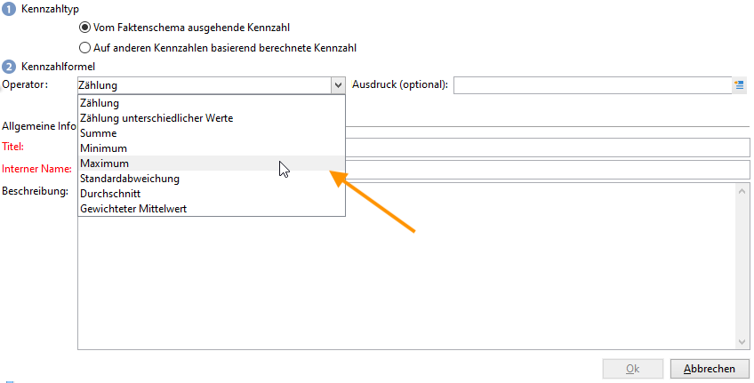

1. Wählen Sie je nach gewählter Funktion den Ausdruck aus, auf den sich die Berechnung bezieht.

   Über die Schaltfläche **[!UICONTROL Erweiterte Auswahl]** können komplexe Formeln erstellt werden. Weitere Informationen hierzu finden Sie in [diesem Abschnitt](../../automation/workflow/query.md).

1. Der Link **[!UICONTROL Kennzahldaten filtern...]** ermöglicht es, das Berechnungsfeld auf bestimmte Daten zu beschränken.

   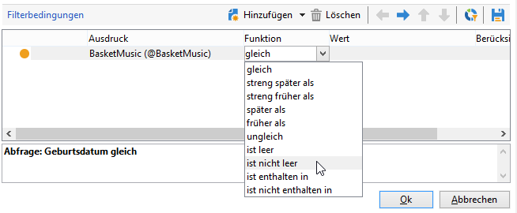

1. Geben Sie den Titel der Kennzahl an und fügen Sie eine Beschreibung hinzu. Klicken Sie dann auf **[!UICONTROL Beenden]**, um die Erstellung abzuschließen.

## Kennzahlen anpassen {#display-measures}

Die Anzeige der Kennzahlen in der Tabelle kann nach Bedarf konfiguriert werden. Folgende Parameter sind verfügbar:

* Anzeigereihenfolge der Kennzahlen. [Weitere Informationen](#display-sequence)
* Informationen, die im Bericht angezeigt/ausgeblendet werden sollen. [Weitere Informationen](#configuring-the-display)
* die anzuzeigenden Kennzahlen: Prozentsatz, Gesamtbetrag, Anzahl der Dezimalstellen etc. [Weitere Informationen](#changing-the-type-of-measure-displayed)

### Anzeigereihenfolge {#display-sequence}

Die im Cube berechneten Kennzahlen werden über die Schaltfläche **[!UICONTROL Kennzahlen]** konfiguriert.

Ihre Anzeigereihenfolge kann durch Verschieben der Zeilen geändert werden. Im nachstehenden Beispiel werden die auf Deutschland bezogenen Daten nach unten verschoben: Sie werden nun in der letzten Spalte angezeigt.

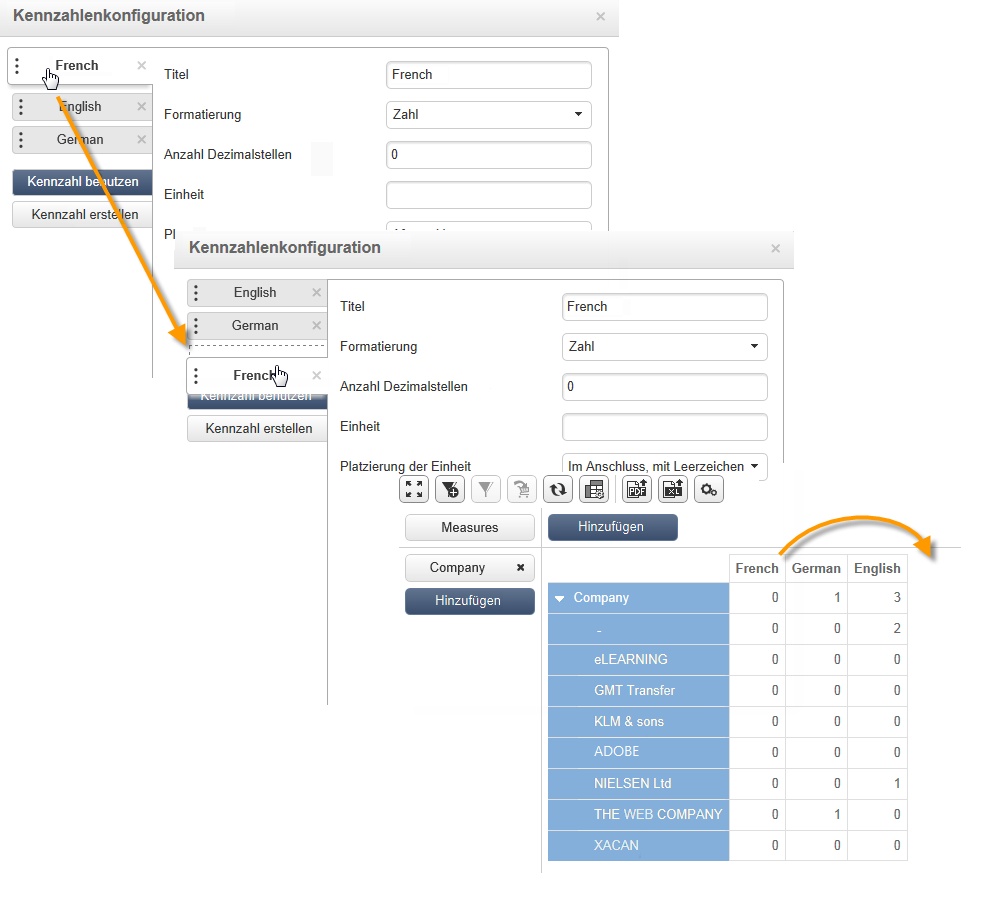

### Konfigurieren der Anzeige {#configuring-the-display}

Die Konfiguration der angezeigten Kennzahlen, Zeilen und Spalten kann für jede Kennzahl einzeln oder global durchgeführt werden. Ein spezifisches Symbol ermöglicht den Zugriff auf die Auswahl der Anzeigemodi.

* Klicken Sie auf das Symbol **[!UICONTROL Konfiguration der Pivot-Tabelle bearbeiten]**, um auf das Konfigurationsfenster für alle Kennzahlen zuzugreifen.

   Sie können bestimmen, ob die Kennzahlen in Zeilen oder Spalten angezeigt und ob ihre Titel ein- oder ausgeblendet werden sollen.

Mithilfe der Farbwahl können die wichtigsten Werte visuell hervorgehoben werden, um die Lesbarkeit der Daten zu verbessern.

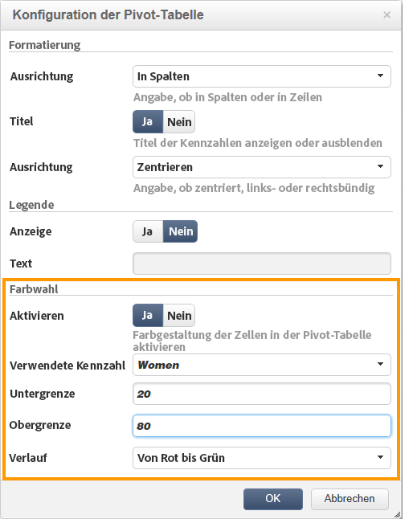

### Ändern des angezeigten Kennzahlentyps {#changing-the-type-of-measure-displayed}

Sie können für jede Kennzahl die anzuwendende Einheit und Formatierung festlegen.

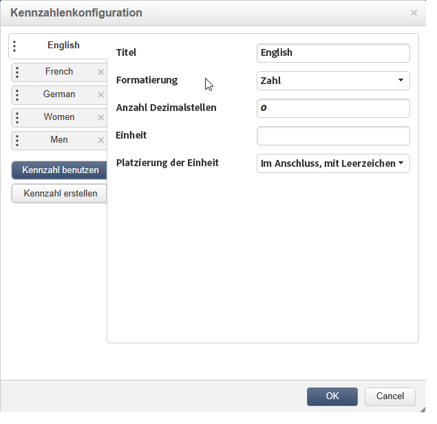

## Freigeben des Berichts {#share-a-report}

Nach der Konfiguration des Berichts können Sie diesen beibehalten und gegebenenfalls mit anderen Benutzern teilen.

Klicken Sie hierzu auf das Symbol **[!UICONTROL Berichteigenschaften anzeigen]** und aktivieren Sie die Option **[!UICONTROL Bericht freigeben]**.

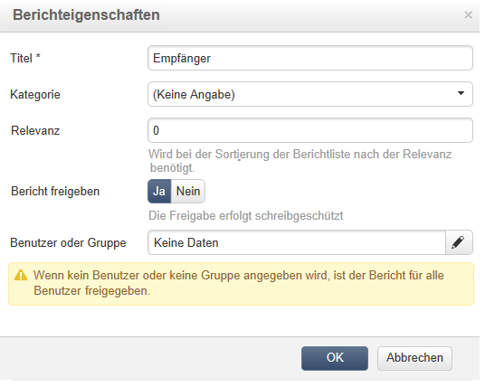

Geben Sie die Kategorie, zu der der Bericht gehört, sowie seine Relevanz an. <!--For more on this, refer in [this page](../../reporting/using/configuring-access-to-the-report.md#report-display-context) to the **Display sequence** and **Defining the filtering options** sections.-->

Um die Änderungen zu bestätigen, muss der Bericht gespeichert werden.

## Erstellen von Filtern {#create-filters}

Sie können Filter erstellen, um nur einen Teil der Daten anzuzeigen.

Gehen Sie dazu wie folgt vor:

1. Klicken Sie auf das Symbol **[!UICONTROL Filter hinzufügen]**.

   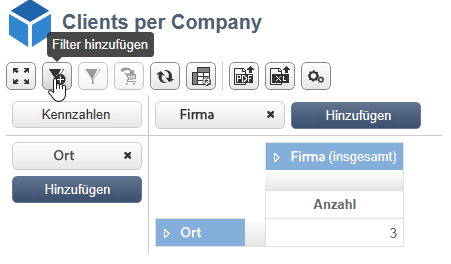

1. Wählen Sie die Dimension, auf die sich der Filter bezieht.

1. Wählen Sie den anzuwendenden Filtertyp und geben Sie seine Genauigkeit an.

   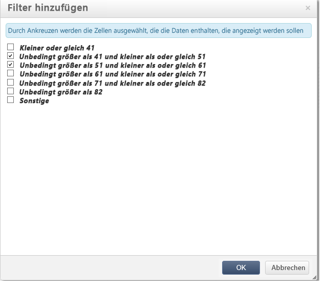

1. Nach seiner Erstellung steht der Filter oberhalb des Berichts zur Verfügung.

   Klicken Sie auf den Filter, um ihn zu bearbeiten. Klicken Sie auf das Kreuz, um den Filter zu löschen.

   Alle Filter werden nebeneinander angezeigt. Ihre Anzahl ist unbegrenzt.

   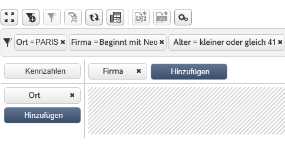

Klicken Sie nach jeder Hinzufügung, Änderung oder Löschung von Filtern auf den Pfeil, um die Berechnung neu zu starten.

Filter können auch basierend auf einer Auswahl erstellt werden. Wählen Sie hierzu die Quellzellen, -zeilen und -spalten und klicken Sie auf das Symbol **[!UICONTROL Filter hinzufügen]**.

Um eine Zeile, Spalte oder Zelle auszuwählen, klicken Sie diese mit der linken Maustaste an. Klicken Sie ein zweites Mal, um sie wieder abzuwählen.

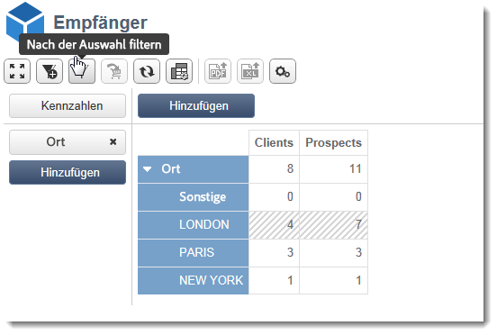

Der Filter wird automatisch angewendet und in der Filterzone oberhalb des Berichts hinzugefügt.

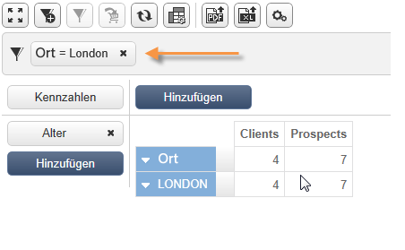
