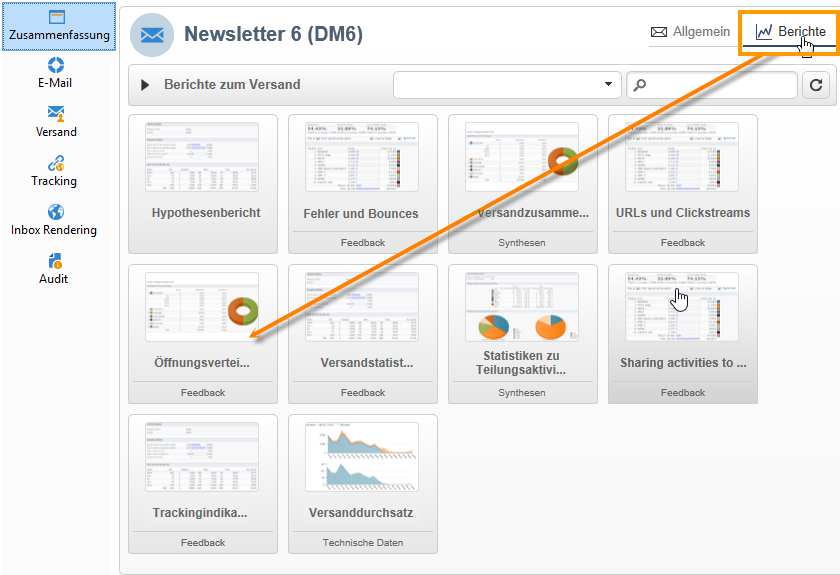
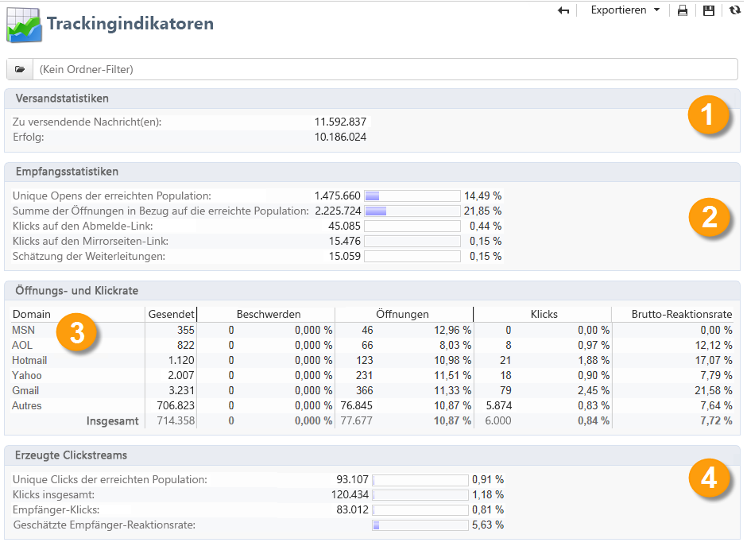
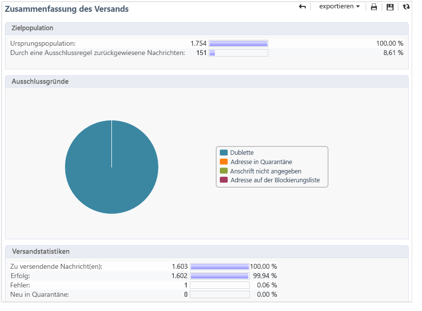

# Versandberichte {#delivery-reports}

Sie können die Ausführung von Sendungen in verschiedenen Berichten verfolgen, auf die über die Versandübersicht zugegriffen werden kann.

Gehen Sie wie folgt vor, um auf Berichte zuzugreifen:

1. Gehen Sie zur Registerkarte **[!UICONTROL Kampagnen]** und klicken Sie auf den Link **[!UICONTROL Versand]**, um die Liste der Sendungen anzuzeigen.
1. Klicken Sie auf den Namen des Versands, auf den Sie zugreifen möchten.
1. Klicken Sie im Tab **[!UICONTROL Zusammenfassung]** auf **[!UICONTROL Berichte]**, um die spezifischen Versandberichte aufzurufen.

   

   Standardmäßig stehen folgende Berichte zur Verfügung:

   * **[!UICONTROL Versanddurchsatz]**
   * **[!UICONTROL Teilen über soziale Netzwerke]**
   * **[!UICONTROL Statistiken zu Freigabeaktivitäten]**
   * **[!UICONTROL Klicks]**
   * **[!UICONTROL Tracking-Statistiken]**
   * **[!UICONTROL URLs und Clickstreams]**
   * **[!UICONTROL Tracking-Indikatoren]**
   * **[!UICONTROL Fehler und Bounces]**
   * **[!UICONTROL Nutzer-Aktivitäten]**
   * **[!UICONTROL Versandzusammenfassung]**
   * **[!UICONTROL Abonnement-Tracking]**
   * **[!UICONTROL Versandstatistiken]**
   * **[!UICONTROL Aufschlüsselung der Öffnungen]**

## Tracking-Indikatoren {#tracking-indicators}

Dieser Bericht enthält die wichtigsten Indikatoren, die die Verfolgung des Empfängerverhaltens beim Erhalt eines Versands ermöglichen. Er bietet Zugriff auf Versand- und Empfangsstatistiken, Öffnungs- und Klickraten, erzeugte Clickstreams, Webtracking-Statistiken sowie Teilungsaktivitäten in sozialen Netzwerken.

>[!NOTE]
>
>Die in Bezug auf Öffnungen berechneten Werte sind immer nur Schätzungen. Dies hängt insbesondere mit der durch E-Mails im Textformat bedingten Fehlerquote zusammen. Die Indikatoren **[!UICONTROL Unterschiedliche Öffnungen (Unique Opens) und Summe der Öffnungen in Bezug auf die erreichte Population]** berücksichtigen diese Fehlerquote. [Weitere Informationen](metrics-calculation.md#tracking-opens-).

**[!UICONTROL 1. Versandstatistiken]**

* **[!UICONTROL Zu versendende Nachricht(en)]**: Gesamtzahl der nach erfolgter Versandanalyse zu versendenden Nachrichten.
* **[!UICONTROL Erfolg]**: Anzahl der erfolgreich verarbeiteten Nachrichten.

**[!UICONTROL 2. Empfangsstatistiken]**

>[!NOTE]
>
>Die Prozentsätze werden in Bezug auf die erfolgreich zugestellten Nachrichten berechnet.

* **[!UICONTROL Unterschiedene Öffnungen für die erreichte Population]**: Schätzung der Anzahl der Zielgruppenempfänger, die eine Nachricht mindestens einmal geöffnet haben. Klicks auf getrackte URLs werden berücksichtigt, da E-Mails geöffnet werden müssen, damit auf einen Link geklickt werden kann.
* **[!UICONTROL Summe der Öffnungen in Bezug auf die erreichte Population]**: Schätzung der Gesamt-Öffnungszahl durch Zielgruppenempfänger.
* **[!UICONTROL Klicks auf den Abmelde-Link]**: Anzahl der Klicks auf den Abmelde-Link.
* **[!UICONTROL Klicks auf den Mirrorseiten-Link]**: Anzahl der Klicks auf den Mirrorseiten-Link. Um berücksichtigt zu werden, muss der Link im Versandassistenten als solcher definiert worden sein (getrackte URLs). <!--Refer to this [page](../../delivery/using/about-delivery-monitoring.md).-->
* **[!UICONTROL Schätzung der Weiterleitungen]**: Schätzung der Anzahl der E-Mails, die von Zielgruppenempfängern an andere Personen weitergeleitet wurden. Dieser Wert ist die Differenz aus den Unique Opens allgemein und den Unique Opens der Zielgruppenempfänger.

   >[!NOTE]
   >
   >Weiterführende Informationen zur Unterscheidung von Personen und Zielgruppenempfängern finden Sie unter [Unterschied zwischen Personen und Zielgruppenempfängern](metrics-calculation.md#targeted-persons---recipients).

**[!UICONTROL 3. Öffnungs- und Klickrate]**

Die Tabelle zeigt - aufgeschlüsselt nach Domains - Sendungen, Öffnungen, Klicks und Brutto-Reaktionsraten. Folgende Indikatoren werden angezeigt:

* **[!UICONTROL Sendungen]**: Gesamtzahl der an die jeweilige Domain gesandten Nachrichten.
* **[!UICONTROL Beschwerden]**: Anzahl der Nachrichten, die von den Empfängern als unerwünscht erklärt wurden, in Bezug auf die Gesamtzahl der an die Domain gesendeten Nachrichten.
* **[!UICONTROL Öffnungen]**: Anzahl unterschiedlicher Zielgruppenempfänger dieser Domain, die mindestens einmal die betreffende Nachricht geöffnet haben, in Bezug auf die Gesamtzahl der an die Domain gesandten Nachrichten.
* **[!UICONTROL Klicks]**: Anzahl der unterschiedlichen Zielgruppenempfänger, die mindestens einmal im entsprechenden Versand geklickt haben, in Bezug auf die Gesamtzahl der an die Domain gesandten Nachrichten.
* **[!UICONTROL Brutto-Reaktionsrate]**: Prozentualer Anteil der Empfänger, die mindestens einmal im betreffenden Versand geklickt haben, in Bezug auf die Empfänger, die mindestens einmal den betreffenden Versand geöffnet haben.

>[!NOTE]
>
>Die in diesem Bericht dargestellten Domain-Namen werden in der auf Cube-Niveau verwendeten Auflistung definiert. Um Standard-Domains zu ändern, hinzuzufügen oder zu entfernen, bearbeiten Sie die **[!UICONTROL Domains]**-Auflistung und passen Sie die Werte und Aliase an. Die Kategorie **[!UICONTROL Sonstige]** enthält Domain-Namen, die keinem Auflistungswert entsprechen.
>
>In der [Dokumentation zu Campaign Classic v7](https://experienceleague.adobe.com/docs/campaign-classic/using/getting-started/administration-basics/managing-enumerations.html?lang=de){target=&quot;_blank&quot;} erfahren Sie, wie Sie auf Ihre Auflistungen zugreifen und sie konfigurieren können.

**[!UICONTROL 4. Erzeugte Clickstreams]**

>[!NOTE]
>
>Die Prozentsätze werden in Bezug auf die erfolgreich zugestellten Nachrichten berechnet.

* **[!UICONTROL Unique Clicks der erreichten Population]**: Anzahl unterschiedlicher Personen, die mindestens einmal im betreffenden Versand geklickt haben.
* **[!UICONTROL Klicks insgesamt]**: Gesamtzahl der Klicks von Zielgruppenempfängern, ausgenommen Abmelde- und Mirrorseite-Links.
* **[!UICONTROL Empfänger-Klicks]**: Anzahl unterschiedlicher Zielgruppenempfänger, die mindestens einmal im betreffenden Versand geklickt haben.
* **[!UICONTROL Geschätzte Empfänger-Reaktionsrate]**: Prozentualer Anteil der Empfänger, die mindestens einmal im betreffenden Versand geklickt haben, in Bezug auf die geschätzte Anzahl der Empfänger, die mindestens einmal den betreffenden Versand geöffnet haben. Klicks auf Abmelde- und Mirrorseite-Links werden nicht berücksichtigt.
<!--
**[!UICONTROL 5. Web tracking]**

* **[!UICONTROL Visited pages]** : Number of web pages visited following message reception.
* **[!UICONTROL Transactions]** : Number of purchases following message reception.
* **[!UICONTROL Total amount]** : Total amount of purchases following message reception. 
* **[!UICONTROL Average transaction amount]** : Average purchase made by distinct delivery recipients. 
* **[!UICONTROL Articles]** : Number of articles purchased by the delivery recipients. 
* **[!UICONTROL Average count of articles per transaction]** : Average number of items per purchase made by distinct recipients.
* **[!UICONTROL Average amount per message]** : Average amount of purchases generated per message.

  >[!NOTE]
  >
  >In order for a visited page, transaction, amount or article to be taken into account, a webtracking tag must be inserted into the matching web page. Webtracking configuration is presented in [this section](../../configuration/using/about-web-tracking.md).

**[!UICONTROL 6. Sharing activities to email and social networks]**

This section shows the number of messages shared on each social network. For more on this, refer to [Sharing to social networks](../../reporting/using/global-reports.md#sharing-to-social-networks).

## URLs and click streams {#urls-and-click-streams}

This report shows the list of pages visited following a delivery. 

You can configure the contents of this report by selecting: the score chart to be displayed, the time filter (since the action launch, over the first 6 hours following launch, etc.) and the data display mode (by label, by URL, by category. Click **[!UICONTROL Refresh]** to confirm your selection.

The following rates are displayed in the upper section of the report:

* **[!UICONTROL Reactivity]** : Ratio of the number of targeted recipients having clicked in a delivery, in relation to the estimated number of targeted recipients having opened a delivery. Clicks on the opt-out link and on the mirror page are not taken into account.

  >[!NOTE]
  >
  >For more information on tracking opens, refer to [this section](metrics-calculation.md#tracking-opens-).

* **[!UICONTROL Distinct clicks]** : Number of distinct people having clicked at least once (excluding unsubscription link and mirror page) in a delivery. The rate displayed is calculated based on the number of messages delivered successfully. 
* **[!UICONTROL Cumulated clicks]** : Total number of clicks by targeted recipients (excluding unsubscription link and mirror page). The rate displayed is calculated based on the number of messages forwarded successfully.

**[!UICONTROL Platform average]** : This average rate, displayed under each rate (reactivity, distinct clicks, and cumulated clicks), is calculated for deliveries sent over the previous six months. Only deliveries with the same typology and on the same channel are taken into account. Proofs are excluded.

The central table provides the following information:

* **[!UICONTROL Clicks]** : Number of cumulated clicks, per link. 
* **[!UICONTROL Clicks (in %)]** : Breakdown of the number of clicks per link, in relation to the total number of cumulated clicks.

**[!UICONTROL Breakdown of clicks in time]**

This chart shows the breakdown of cumulated clicks per day.
-->

## Versandzusammenfassung {#delivery-summary}

Dieser Bericht zeigt die wichtigsten Informationen zu einem Versand.

**[!UICONTROL Zielpopulation]**

Dieser Bereich zeigt zwei Indikatoren:

* **[!UICONTROL Ursprungspopulation]**: Gesamtzahl der Empfänger, die den Versand erhalten sollen.
* **[!UICONTROL Durch eine Regel zurückgewiesene Nachrichten]**: Zahl der Adressen, die während der Analyse beim Anwenden von Typologieregeln ignoriert wurden: Adresse fehlt, in Quarantäne, auf Blockierungsliste usw. <!--For more information on typology rules, refer to this [page](../../delivery/using/steps-validating-the-delivery.md#validation-process-with-typologies).-->

**[!UICONTROL Ausschlussgründe]**

Das Diagramm in der Mitte veranschaulicht die Verteilung der ausgeschlossenen Nachrichten nach Regeln.

**[!UICONTROL Versandstatistiken]**

Dieser Bereich zeigt folgende Indikatoren:

* **[!UICONTROL Zu versendende Nachricht(en)]**: Gesamtzahl der nach erfolgter Versandanalyse zu versendenden Nachrichten.
* **[!UICONTROL Erfolg]**: Anzahl der erfolgreich verarbeiteten Nachrichten. Die zugeordnete Rate wird in Bezug auf die Anzahl zu versendender Nachrichten berechnet.
* **[!UICONTROL Fehler]**: Gesamtzahl an Fehlern in Sendungen und der automatischen Bounce-Verarbeitung. Die zugeordnete Rate wird in Bezug auf die Anzahl zu versendender Nachrichten berechnet.
* **[!UICONTROL Neu in Quarantäne]**: Anzahl der Adressen, die infolge eines fehlgeschlagenen Zustellversuchs unter Quarantäne gestellt wurden (unbekannter Nutzer, ungültige Domain). Die zugeordnete Rate wird in Bezug auf die Anzahl zu versendender Nachrichten berechnet.

## Klicks {#hot-clicks}

Er zeigt den Nachrichteninhalt (HTML und/oder Text) mit dem prozentualen Klickanteil für jeden Link. Links in Gestaltungsbausteinen, der Abmelde-Link, der Mirrorseite-Link und Angebotslinks werden in der Gesamtklickzahl berücksichtigt, in diesem Bericht jedoch nicht angezeigt.

>[!NOTE]
>
>Sollte Ihr Versand Angebote enthalten (Interaction), erscheint im oberen Bereich des Berichts ein Rahmen mit dem Klickanteil der Angebote.

## Tracking-Statistiken {#tracking-statistics}

Dieser Bericht zeigt Statistiken zu Öffnungen, Klicks und Transaktionen.

Er gibt Aufschluss über Empfänger-Reaktionen. Sie können die Anzeige durch Wechsel des Parameters (z. B. 1 Stunde, 3 Stunden, 24 Stunden usw.) variieren. Klicken Sie auf die Schaltfläche **[!UICONTROL Aktualisieren]**, um Ihre Auswahl zu bestätigen.

Die Statistiken werden in Form einer Tabelle und eines Pareto-Diagramms dargestellt, welches die Dauer angibt, die der Versand benötigt hat, um seine höchste Effizienz zu erreichen. Folgende Indikatoren werden angezeigt:

* **[!UICONTROL Öffnungen]**: Geschätzte Dauer, um einen bestimmten Anteil an Öffnungen in Bezug auf die Gesamtzahl der geöffneten Nachrichten zu erreichen. E-Mails im Textformat werden nicht berücksichtigt. [Weitere Informationen](metrics-calculation.md#tracking-opens-).
* **[!UICONTROL Klicks]**: Geschätzte Dauer, um einen bestimmten Anteil an Klicks in Bezug auf die Gesamtzahl der aufgezeichneten Klicks zu erreichen. Klicks auf Abmelde- und Mirrorseite-Links werden nicht berücksichtigt.
<!--
* **[!UICONTROL Transactions]** : Time required to achieve a percentage of the total number of transactions following message reception. In order for a transaction to be taken into account, a transaction type webtracking tag must be inserted into the matching web page. Webtracking configuration is presented in [this section](../../configuration/using/about-web-tracking.md).
-->

## Zusammenfassende Berichte {#cumulated-reports}

Sie haben die Möglichkeit, verschiedene Sendungen in zusammenfassenden Berichten gegenüberzustellen. Markieren Sie die gewünschten Sendungen, um die Liste der verfügbaren Berichte anzuzeigen.

Drücken Sie die Strg-Taste, um nicht direkt aufeinanderfolgende Sendungen zu markieren.

Um Sendungen auszuwählen, die in einem anderen Ordner gespeichert sind, klicken Sie auf das Symbol **[!UICONTROL Unterordner anzeigen]**, das in der Symbolleiste verfügbar ist. Sie werden dann in derselben Liste angezeigt.
