# Allgemeine Berichte {#global-reports}

Diese Berichte beziehen sich auf Aktivitäten, die die Gesamtheit der Daten in der Datenbank betreffen. Begeben Sie sich in den Tab **[!UICONTROL Berichte]**, um auf das Dashboard zuzugreifen.

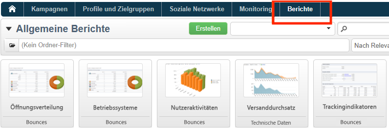

Klicken Sie zur Anzeige eines Berichts auf seinen Namen. Standardmäßig stehen folgende Berichte zur Verfügung:

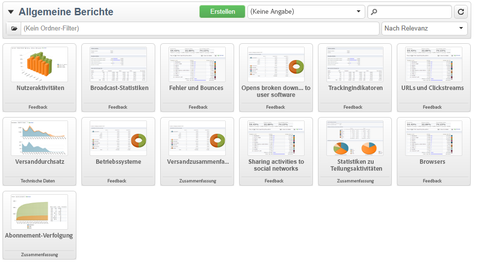

>[!NOTE]
>
>Dieser Abschnitt behandelt nur versandbezogene Berichte.

* **[!UICONTROL Versanddurchsatz]**: siehe [Versanddurchsatz](#delivery-throughput).
* **[!UICONTROL Browser]**: siehe [Browser](#browsers).
* **[!UICONTROL Teilen über soziale Netzwerke]**: siehe [Teilen über soziale Netzwerke](#sharing-to-social-networks).
* **[!UICONTROL Statistiken zu Teilungsaktivitäten]**: siehe [Statistiken zu Teilungsaktivitäten](#statistics-on-sharing-activities).
* **[!UICONTROL Betriebssysteme]**: siehe [Betriebssysteme](#operating-systems).
* **[!UICONTROL URLs und Clickstreams]**: siehe [URLs und Clickstreams](delivery-reports.md#urls-and-click-streams).
* **[!UICONTROL Trackingindikatoren]**: siehe [Trackingindikatoren](delivery-reports.md#tracking-indicators).
* **[!UICONTROL Fehler und Bounces]**: siehe [Fehler und Bounces](#non-deliverables-and-bounces).
* **[!UICONTROL Nutzer-Aktivitäten]**: siehe [Nutzer-Aktivitäten](#user-activities).
* **[!UICONTROL Abonnement-Verfolgung]**: siehe [Abonnement-Verfolgung](#subscription-tracking).
* **[!UICONTROL Versandzusammenfassung]**: siehe [Versandzusammenfassung](delivery-reports.md#delivery-summary).
* **[!UICONTROL Versandstatistiken]**: siehe [Versandstatistiken](#delivery-statistics).
* **[!UICONTROL Öffnungsverteilung]**: siehe [Öffnungsverteilung](#breakdown-of-opens).

## Versanddurchsatz {#delivery-throughput}

Dieser Bericht enthält Informationen zum Datendurchsatz der Sendungen in Bezug auf die gesamte Plattform für einen bestimmten Zeitraum. Zur Messung der Versandgeschwindigkeit von Nachrichten werden zwei Kennzahlen herangezogen: Anzahl an gesendeten Nachrichten pro Stunde und die gesendete Datenmenge in Bits pro Sekunde. Die unten stehende Grafik zeigt in Blau die Anzahl der erfolgreich versandten und in Orange die Anzahl der fehlgeschlagenen Nachrichten.

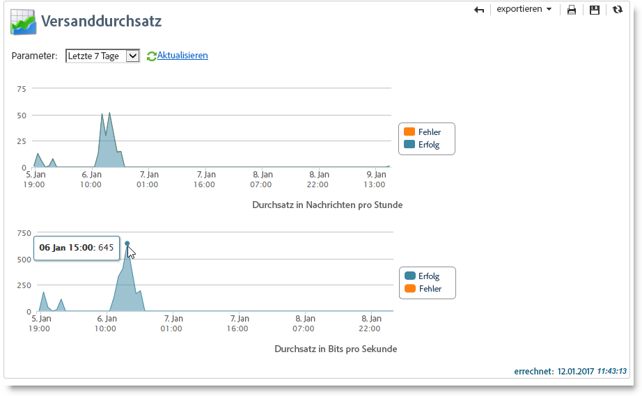

Sie können die Anzeige durch Änderung des Parameters (z. B. 1 Stunde, 3 Stunden, 24 Stunden) variieren. Klicken Sie auf die Schaltfläche **[!UICONTROL Aktualisieren]**, um Ihre Auswahl zu bestätigen.

>[!NOTE]
>
>Sie können die Anzahl der pro Stunde gesendeten Sendungen auch mithilfe der Variablen [Control Panel](https://experienceleague.adobe.com/docs/control-panel/using/sftp-management/sftp-storage-management.html?lang=de).
>
>Das Control Panel steht allen Administratoren zur Verfügung. Die Schritte, um einem Benutzer Administratorzugriff zu gewähren, finden Sie auf [dieser Seite](https://experienceleague.adobe.com/docs/control-panel/using/discover-control-panel/managing-permissions.html?lang=de#discover-control-panel).

## Nutzer-Aktivitäten {#user-activities}

Dieser Bericht zeigt Öffnungen, Klicks und Transaktionen in Form eines Diagramms (Verteilung nach Tagen, Stunden oder halben Stunden).

Folgende Optionen stehen zur Verfügung:

* **[!UICONTROL Öffnungen]**: Gesamtzahl der geöffneten Nachrichten. E-Mails im Textformat werden nicht berücksichtigt. [Weitere Informationen](metrics-calculation.md#tracking-opens-).
* **[!UICONTROL Klicks]**: Gesamtzahl der Klicks auf Links in Sendungen. Klicks auf Abmelde- und Mirrorseite-Links werden nicht berücksichtigt.
<!--
* **[!UICONTROL Transactions]** : Total number of transactions after a message is received. In order for a transaction to be taken into account, a transaction type webtracking tag must be inserted into the matching web page. Webtracking configuration is presented in [this section](../../configuration/using/about-web-tracking.md).
-->

## Fehler und Bounces {#non-deliverables-and-bounces}

Dieser Bericht zeigt die Verteilung der Fehler nach Typ und nach Domain.

Die **[!UICONTROL Anzahl verarbeiteter Nachrichten]** entspricht der Gesamtzahl der vom Versandserver verarbeiteten Nachrichten. Die Anzahl kann u. U. geringer als die Zahl der zu versendenden Nachrichten ausfallen, wenn ein Teil der Nachrichten vor der Verarbeitung durch den Server gestoppt oder ausgesetzt wurden.

**[!UICONTROL Verteilung der Fehler nach Typ]**

>[!NOTE]
>
>Die in diesem Bericht dargestellten Fehler lösen eine Quarantäne der betroffenen Adressen aus. Weiterführende Informationen zur Quarantäneverwaltung finden Sie im Abschnitt [Quarantäneverwaltung](../send/quarantines.md).

Der erste Teil des Berichts zeigt die Verteilung der fehlgeschlagenen Nachrichten nach Typ in Form einer Tabelle und eines Diagramms.

Zu jedem Fehlertyp erscheint:

* die Anzahl der fehlerhaften Nachrichten diesen Typs,
* der prozentuale Anteil der fehlerhaften Nachrichten diesen Typs in Bezug auf die Gesamtzahl der fehlerhaften Nachrichten,
* der prozentuale Anteil der fehlerhaften Nachrichten diesen Typs in Bezug auf die Gesamtzahl der verarbeiteten Nachrichten.

Folgende Indikatoren werden angezeigt:

* **[!UICONTROL Unbekannter Nutzer]**: Fehler bei ungültigen E-Mail-Adressen.
* **[!UICONTROL Ungültige Domain]**: Fehler bei ungültigen oder inexistenten E-Mail-Domains.
* **[!UICONTROL Postfach voll]**: Fehler, der nach fünf fehlgeschlagenen Zustellversuchen erzeugt wird, wenn das Postfach zu viele Nachrichten enthält.
* **[!UICONTROL Konto deaktiviert]**: Fehler, wenn eine Adresse nicht mehr existiert.
* **[!UICONTROL Abgelehnt]**: Fehler, wenn eine Adresse von einem ISP (Internet Service Provider) z. B. infolge der Anwendung einer Sicherheitsregel (Anti-Spam-Software) zurückgewiesen wird.
* **[!UICONTROL Unerreichbar]**: Fehler in der Verteilungskette der Nachricht (Vorfall beim SMTP-Server, zeitweilig unerreichbare Domain usw.).
* **[!UICONTROL Nicht angemeldet]**: Fehler, wenn das Mobiltelefon des Empfängers bei Versand der Nachricht ausgeschaltet war oder über keinen Netzempfang verfügte.

   >[!NOTE]
   >
   >Dieser Indikator bezieht sich auf Sendungen [mobile Kanäle](../send/send.md) nur.

   Jede Zeile der Datentabelle kann durch Anklicken des Symbols `[+]` ausgeklappt werden. Damit kann für jeden Fehlertyp die Verteilung der fehlerhaften Nachrichten nach Domain angezeigt werden.

**[!UICONTROL Verteilung der Fehler nach Domain]**

Der zweite Teil des Berichts zeigt die Verteilung der fehlgeschlagenen Nachrichten nach Domains in Form einer Tabelle und eines Diagramms.

Zu jeder Domain erscheint:

* die Anzahl der fehlerhaften Nachrichten dieser Domain,
* der prozentuale Anteil der fehlerhaften Nachrichten für diese Domain in Bezug auf die Gesamtzahl der verarbeiteten Nachrichten dieser Domain,
* der prozentuale Anteil der fehlerhaften Nachrichten für diese Domain in Bezug auf die Gesamtzahl der fehlerhaften Nachrichten.

Jede Zeile der Datentabelle kann durch Klick auf das Symbol ]+[ ausgeklappt werden. Dies ermöglicht die Anzeige der Verteilung der fehlerhaften Nachrichten nach Fehlertyp für jede Domain.

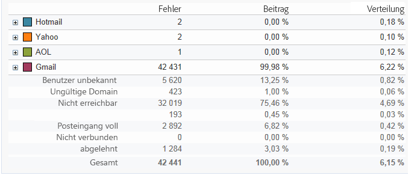

>[!NOTE]
>
>Die in diesem Bericht angezeigten Domain-Namen werden im Cube **[!UICONTROL Versandlogs (broadlogrcp)]** festgelegt und können vom Benutzer angepasst werden. Weiterführende Informationen finden Sie in [diesem Abschnitt](gs-cubes.md). In der Kategorie **[!UICONTROL Sonstige]** werden die Domains zusammengefasst, die keiner der festgelegten Domains entsprechen.

## Browser {#browsers}

Dieser Bericht enthält die Verteilung der Browser, die von den Versandempfängern im ausgewählten Zeitraum verwendet wurden.

>[!NOTE]
>
>Bei den Werten handelt es sich um Schätzungen, da nur die Versandempfänger berücksichtigt werden, die in eine Nachricht geklickt haben.

**Allgemeine Statistiken**

Die allgemeinen Statistiken zur Browserverwendung werden als Tabelle und Diagramm dargestellt.

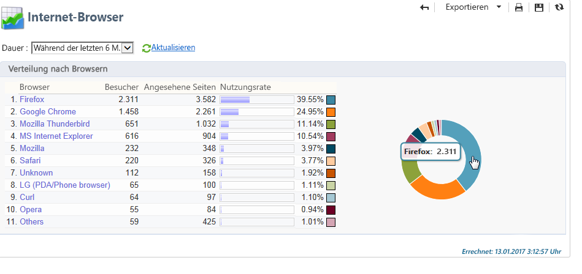

Folgende Indikatoren werden angezeigt:

* **[!UICONTROL Besucher]**: Gesamtzahl der Zielgruppenempfänger nach Domain, die mindestens einmal in einer Nachricht geklickt haben.
* **[!UICONTROL Angesehene Seiten]**: Gesamtzahl der Klicks auf Links in Sendungen nach Browser, bezogen auf alle Sendungen.
* **[!UICONTROL Nutzungsrate]**: Prozentuale Verteilung der Besucher nach Browser in Bezug auf die Gesamt-Besucherzahl.

**Statistiken nach Browsern**

In der Tabelle der allgemeinen Statistiken können Sie auf die Browser-Namen klicken, um für jeden Browser die Verwendungsstatistiken anzuzeigen.

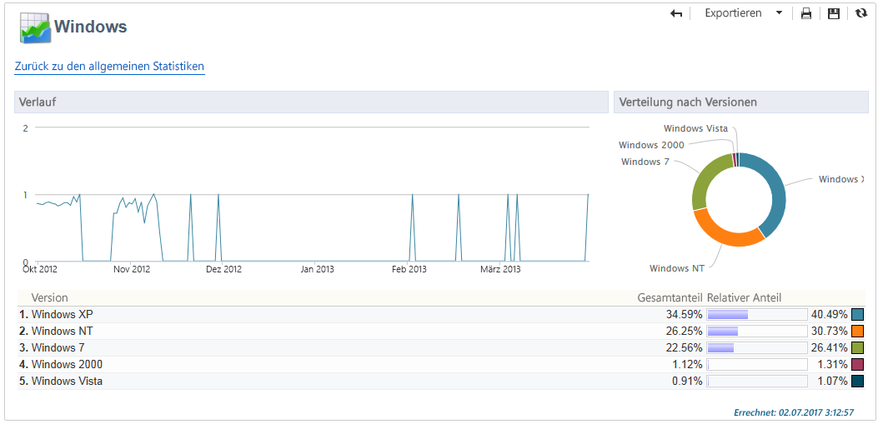

Die Statistiken werden in Form von Kurven, Diagrammen und Tabellen dargestellt.

Der **[!UICONTROL Verlauf]** zeigt die tägliche Besucherrate des ausgewählten Browsers in Bezug auf die höchste gemessene Besucherzahl.

Die **[!UICONTROL Verteilung nach Versionen]** zeigt den prozentualen Anteil der Besucher je Version in Bezug auf die Gesamt-Besucherzahl für den gewählten Browser.

In der Tabelle werden folgende Indikatoren dargestellt:

* **[!UICONTROL Gesamtanteil]**: Prozentualer Anteil der Besucher je Version, bezogen auf die Gesamt-Besucherzahl und auf alle Browser.
* **[!UICONTROL Relativer Anteil]**: Prozentualer Anteil der Besucher je Version, bezogen auf die Gesamt-Besucherzahl und auf den betreffenden Browser.

<!--
### Sharing to social networks {#sharing-to-social-networks}

Viral marketing lets delivery recipients share information with their contact network: they can add a link to their profile (Facebook, Twitter, etc.) or send a message to a friend. Each share and each access to shared information is tracked within the delivery. For more information on viral marketing, refer to [this section](../../delivery/using/viral-and-social-marketing.md).

This report shows the breakdown of shared and opened messages per social network (Facebook, Twitter, etc.) and/or per email.

**[!UICONTROL Email delivery statistics]**

In the email delivery statistics, two values are displayed:

* **[!UICONTROL Number of messages to be delivered]** : Total number of messages processed during delivery analysis.
* **[!UICONTROL Number of successful deliveries]** : Number of messages processed successfully.

**[!UICONTROL Sharing activities and mail open statistics]**

The central table shows the statistics on email shares and opens.

In the **[!UICONTROL Shares]** column, we have the following indicators:

* **[!UICONTROL No. of sharing activities]** : Total number of messages shared on each social network. This value equals the total number of clicks on the icon of the matching **[!UICONTROL Links for sharing to social networks]** personalization block.
* **[!UICONTROL Breakdown]** : This rate represents the breakdown of shares per social network, in relation to the total number of shares.
* **[!UICONTROL Sharing rate]** : This rate represents the breakdown of shares per social network, in relation to the number of messages to be delivered.

In the **[!UICONTROL Opens]** column, we have the following indicators:

* **[!UICONTROL No. of opens]** : Total number of messages opened by people whom the message was forwarded to (via the **[!UICONTROL Links for sharing to social networks]** personalization block). This value equals the number of times the mirror page was displayed. Opens by delivery recipients are not taken into account.
* **[!UICONTROL Breakdown]** : This rate represents the breakdown of opens per social network, in relation to the total number of opens.
* **[!UICONTROL Rate of opens]** : This rate represents the breakdown of opens per social network, in relation to the total number of shares.

**[!UICONTROL Breakdown of sharing activities and opens]**

This section includes two charts which represent the breakdown of sharing activities and opens per social network.

## Statistics on sharing activities {#statistics-on-sharing-activities}

This report shows the evolution of shares to social media in time.

For more information on viral marketing, refer to [this section](../../delivery/using/viral-and-social-marketing.md).

Statistics are presented in the form of a table of values and a chart.

The following indicators are used:

* **[!UICONTROL New contacts]** : Number of new subscriptions following the reception of a message shared via email. This value matches the number of people who received a message shared via email, clicked the **[!UICONTROL Subscription link]** and filled in the subscription form. 
* **[!UICONTROL Opens]** : Total number of messages opened by people whom the message was transferred to (via the **[!UICONTROL Link for sharing to social networks]** personalization block). This value equals the number of times the mirror page was displayed. Opens by delivery recipients are not taken into account.
* **[!UICONTROL Sharing activities]** : Total number of messages shared via social networks. This value matches the total number of clicks on the icon of the **[!UICONTROL Links for sharing to social networks]** personalization block.
-->

## Betriebssysteme {#operating-systems}

Dieser Bericht enthält die Betriebssysteme, die von den Versandempfängern im ausgewählten Zeitraum verwendet wurden.

>[!NOTE]
>
>Bei den Werten handelt es sich um Schätzungen, da nur die Versandempfänger berücksichtigt werden, die in eine Nachricht geklickt haben.

**Allgemeine Statistiken**

Die allgemeinen Statistiken bezüglich der verwendeten Betriebssysteme werden in Form von Diagrammen und Tabellen dargestellt.

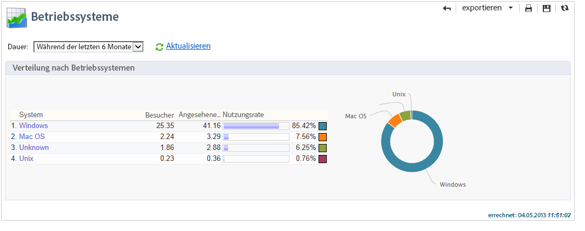

Folgende Indikatoren werden angezeigt:

* **[!UICONTROL Besucher]**: Durchschnittliche Anzahl der Zielgruppenempfänger pro Tag nach Betriebssystem, die mindestens einmal in einer Nachricht geklickt haben.
* **[!UICONTROL Angesehene Seiten]**: Durchschnittliche Anzahl von Klicks auf Links in Sendungen nach Betriebssystem, bezogen auf alle Sendungen.
* **[!UICONTROL Nutzungsrate]**: Prozentuale Verteilung der Besucher nach Betriebssystem in Bezug auf die Gesamt-Besucherzahl.

**Statistiken nach Betriebssystem**

In der Tabelle der allgemeinen Statistiken können Sie auf die Namen der einzelnen Betriebssysteme klicken, um die jeweiligen Verwendungsstatistiken anzuzeigen.

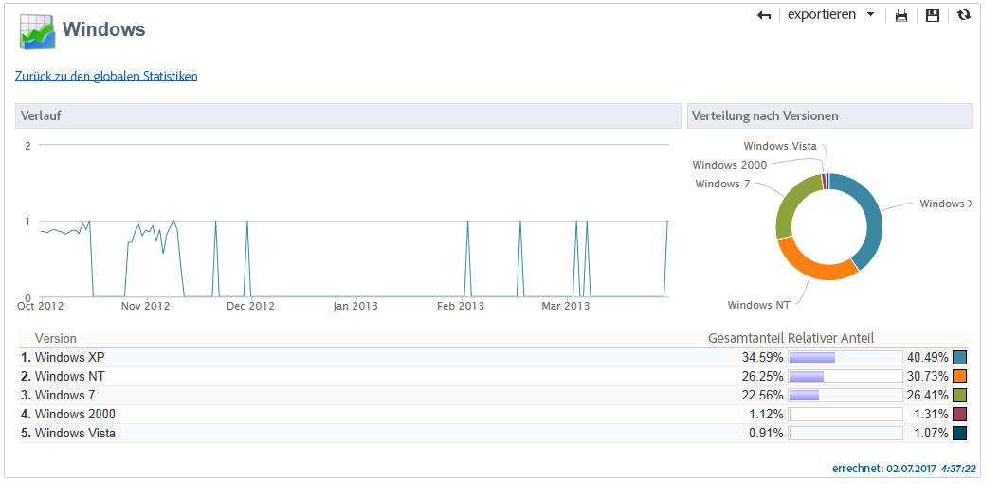

Die Statistiken werden in Form von Kurven, Diagrammen und Tabellen dargestellt.

Der **[!UICONTROL Verlauf]** zeigt die tägliche Nutzungsrate des ausgewählten Betriebssystems in Bezug auf die höchste gemessene Besucherzahl.

Die **[!UICONTROL Verteilung nach Versionen]** zeigt den prozentualen Anteil der Besucher je Version in Bezug auf die Gesamt-Besucherzahl für das gewählte Betriebssystem.

In der Tabelle werden folgende Indikatoren dargestellt:

* **[!UICONTROL Gesamtanteil]**: Prozentualer Anteil der Besucher je Version, bezogen auf die Gesamt-Besucherzahl und auf alle Betriebssysteme.
* **[!UICONTROL Relativer Anteil]**: Prozentualer Anteil der Besucher je Version, bezogen auf die Gesamt-Besucherzahl und alle Browser.

## Abonnement-Verfolgung {#subscription-tracking}

Dieser Bericht enthält Informationen bezüglich der Informationsdienst-Abonnements. An- und Abmeldungen werden im Detail beleuchtet.

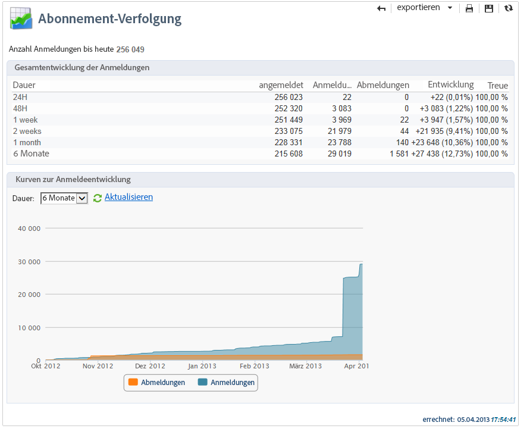

Er kann für ein bestimmtes Abonnement angezeigt werden, indem Sie im Knoten **[!UICONTROL Profile und Zielgruppen > Dienste und Abonnements]** den entsprechenden Titel markieren und auf die Rubrik **[!UICONTROL Berichte]** klicken. Der Bericht **[!UICONTROL Abonnement-Verfolgung]** steht standardmäßig zur Verfügung und gibt über verschiedene Zeiträume hinweg Auskunft über die An- und Abmeldeentwicklung sowie die Treue der Abonnenten. Der Zeitraum des Diagramms kann über die Dropdown-Liste angepasst werden. Klicken Sie auf **[!UICONTROL Aktualisieren]**, um Ihre Wahl zu bestätigen.

Weiterführende Informationen dazu finden Sie auf [dieser Seite](../start/subscriptions.md).

Die Zeile **[!UICONTROL Anzahl Anmeldungen bis heute]** gibt die Gesamtzahl aller Abonnenten zum aktuellen Zeitpunkt an.

**[!UICONTROL Gesamtentwicklung der Anmeldungen]**

In der Tabelle werden folgende Indikatoren dargestellt:

* **[!UICONTROL Angemeldet]**: Anzahl der Abonnenten insgesamt für den entsprechenden Zeitraum.
* **[!UICONTROL Anmeldungen]**: Anzahl der Anmeldungen für den entsprechenden Zeitraum.
* **[!UICONTROL Abmeldungen]**: Anzahl der Abmeldungen für den entsprechenden Zeitraum.
* **[!UICONTROL Entwicklung]**: Anzahl Anmeldungen abzüglich Abmeldungen. Der Prozentsatz in Klammern bezieht sich auf die Gesamtzahl der Abonnenten.
* **[!UICONTROL Treue]**: Treuerate der Abonnenten über den entsprechenden Zeitraum.

**[!UICONTROL Kurven zur Anmeldeentwicklung]**

Das Diagramm veranschaulicht die Abonnemententwicklung über den ausgewählten Zeitraum.

## Versandstatistiken {#delivery-statistics}

Dieser Bericht enthält die Anzahl verarbeiteter E-Mails sowie den prozentualen Anteil an zugestellten Nachrichten, Hard- und Softbounces, Öffnungen, Klicks und Abmeldungen nach Domains.

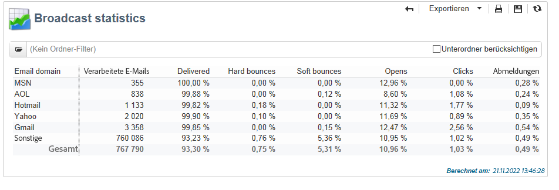

Folgende Indikatoren werden angezeigt:

* **[!UICONTROL Verarbeitete E-Mails]**: Gesamtzahl der E-Mails, die vom Versandserver verarbeitet wurden.
* **[!UICONTROL Zugestellt]**: Prozentualer Anteil der erfolgreich zugestellten E-Mails in Bezug auf die Gesamtzahl der verarbeiteten E-Mails.
* **[!UICONTROL Hardbounces]**: Prozentualer Anteil der Hardbounces in Bezug auf die Gesamtzahl der verarbeiteten E-Mails.
* **[!UICONTROL Softbounces]**: Prozentualer Anteil der Softbounces in Bezug auf die Gesamtzahl der verarbeiteten E-Mails.

   >[!NOTE]
   >
   >Weitere Informationen zu Hard- und Softbounces finden Sie unter [diese Seite](../send/quarantines.md).

* **[!UICONTROL Öffnungen]**: Prozentualer Anteil der unterschiedlichen Zielgruppenempfänger, die mindestens einmal die betreffende Nachricht geöffnet haben, in Bezug auf die Gesamtzahl der verarbeiteten E-Mails.
* **[!UICONTROL Klicks]**: Prozentualer Anteil der unterschiedlichen Zielgruppenempfänger, die mindestens einmal in eine Nachricht geklickt haben, in Bezug auf die Gesamtzahl der verarbeiteten E-Mails.
* **[!UICONTROL Abmeldungen]**: Prozentualer Anteil der Klicks auf einen Abmelde-Link in Bezug auf die Gesamtzahl der verarbeiteten E-Mails.

## Öffnungsverteilung {#breakdown-of-opens}

Dieser Bericht zeigt die Öffnungsverteilung nach Betriebssystem, Geräteart und Browser für den ausgewählten Zeitraum. Für jede Kategorie stehen zwei Diagramme zur Verfügung. Das erste zeigt die Öffnungsstatistiken für Computer und Mobilgeräte an, das zweite nur für Mobilgeräte.

Die Zahl der Öffnungen entspricht der Gesamtzahl der geöffneten Nachrichten. E-Mails im Textformat werden nicht berücksichtigt. Weitere Informationen zum Verfolgen von Öffnungen finden Sie unter [diesem Abschnitt](metrics-calculation.md#tracking-opens-).

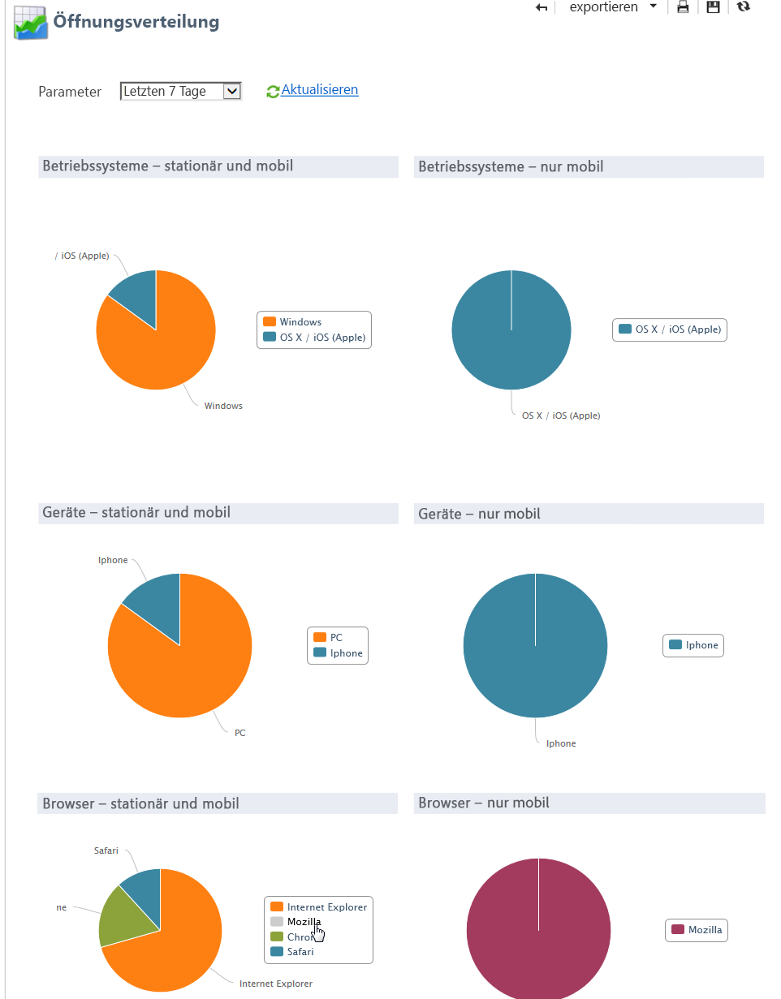

>[!NOTE]
>
>Browser- und Betriebssystemnamen stellen einen Teil der Informationen dar, die vom Benutzeragent des Browsers gesendet werden, für den die Nachricht geöffnet wurde. Adobe Campaign leitet den Gerätetyp anhand der Geräteinformationen ab.
