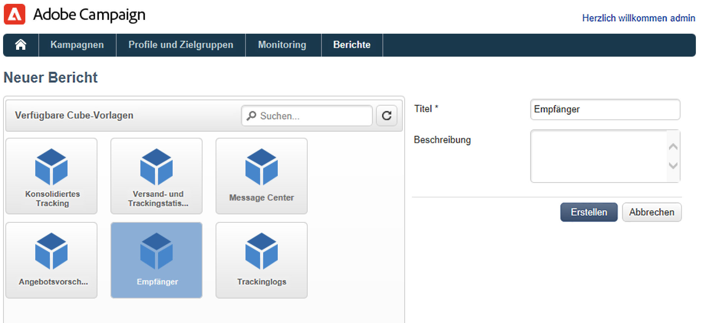
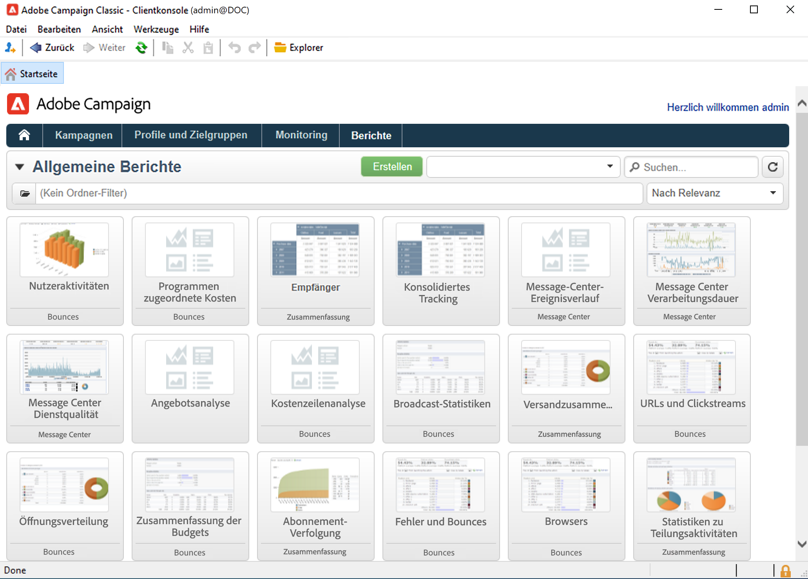
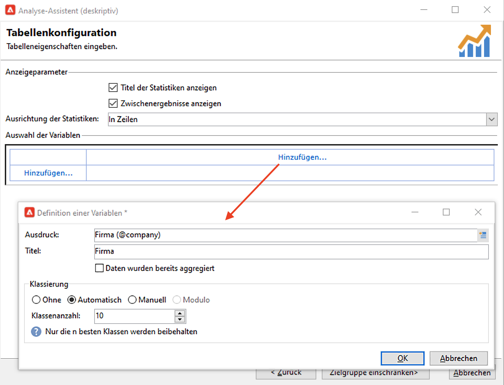

# Erste Schritte mit Reporting{#gs-ac-reports}

Adobe Campaign bietet eine Reihe von Reporting-Tools, die auf dieser Seite aufgelistet sind.

* **Cubes**

   Adobe Campaign verfügt über ein intuitives Tool zur Daten-Exploration, um dynamische Berichte zu erstellen.

   Verwenden Sie das Marketing-Analyse-Modul, um Daten zu analysieren und zu messen, Statistiken zu berechnen und die Berichterstellung und Berechnung zu vereinfachen und zu optimieren. Sie können Berichte erstellen, Zielgruppen-Populationen aufbauen und in Listen speichern, die in Adobe Campaign für Zielgruppenbestimmungs- oder Segmentierungsaufgaben verwendet werden können.

   

   Je nach Komplexität der Abfragen und Berechnungen sowie der bewegten Datenmenge werden die in den Berichten zu analysierenden Daten über eine Abfrage gesammelt und in einer Liste (Workflow vom Typ „Daten-Management“) oder einem Cube (unter Verwendung der Option „Marketing-Analyse“) voraggregiert. Sie werden in Form einer Pivot-Tabelle oder einer Liste mit Gruppierung angezeigt.

   Weiterführende Informationen hierzu finden Sie in [diesem Abschnitt](gs-cubes.md).

* **Native Berichte**

   Adobe Campaign enthält Berichte zu Sendungen, Kampagnen, Plattformaktivitäten, optionalen Funktionen usw. Diese Berichte stehen über die verschiedenen Funktionen zur Verfügung, auf die sie sich beziehen. Sie können an Ihre individuellen Bedürfnisse angepasst werden.

   Verwenden Sie die Registerkarte **Berichte**, um auf diese Berichte zuzugreifen.

   

   Weiterführende Informationen hierzu finden Sie in [diesem Abschnitt](built-in-reports.md).

* **Deskriptive Datenanalyse**

   Adobe Campaign bietet ein visuelles Tool zur Erstellung von Statistiken zu den Daten in der Datenbank. Diese ermöglichen die Erstellung deskriptiver Analysen anhand eines speziellen Assistenten, deren Inhalt und Layout Sie nach Bedarf anpassen können.

   Verwenden Sie das Menü **[!UICONTROL Tools > Deskriptive Analyse...]**, um einen neuen Bericht zu erstellen.

   

    Berichte zur deskriptiven Analyse von Kampagnen werden im Abschnitt [Dokumentation zu Campaign Classic v7](https://experienceleague.adobe.com/docs/campaign-classic/using/reporting/analyzing-populations/about-descriptive-analysis.html?lang=de){target="_blank"}

* **Benutzerdefinierte Berichte**

   Verwenden Sie Adobe Campaign, um Berichte zu den Daten in der Datenbank zu erstellen. Sobald diese erstellt wurden, machen Sie sie in den entsprechenden Kontexten zugänglich.

    Die Schritte zum Erstellen eines Berichts werden im Abschnitt [Dokumentation zu Campaign Classic v7](https://experienceleague.adobe.com/docs/campaign-classic/using/reporting/creating-new-reports/about-reports-creation-in-campaign.html?lang=de){target="_blank"}. Die Erstellung personalisierter Berichte ist erfahrenen Benutzern vorbehalten.
