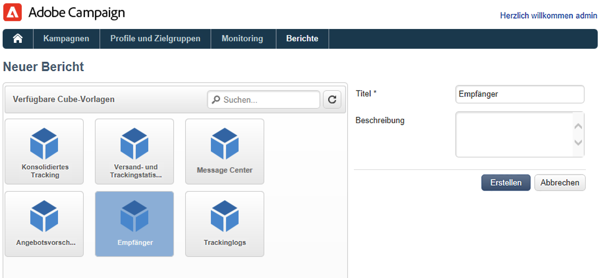
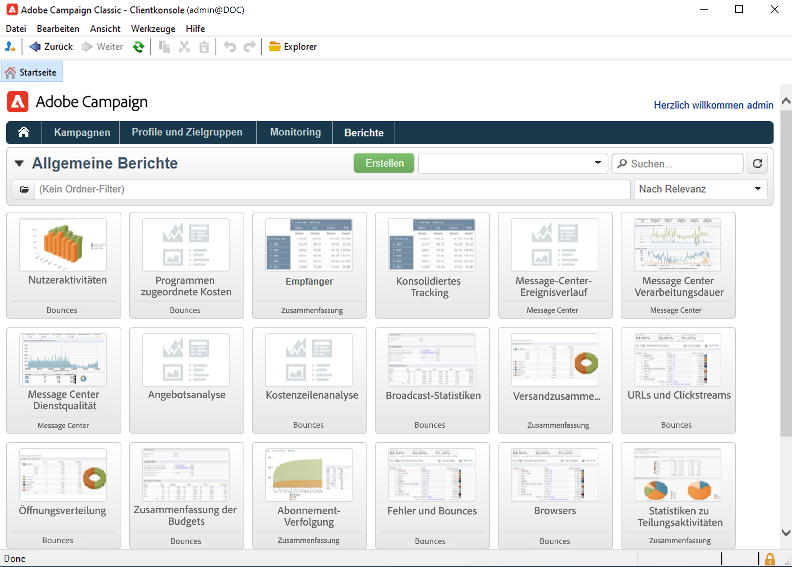
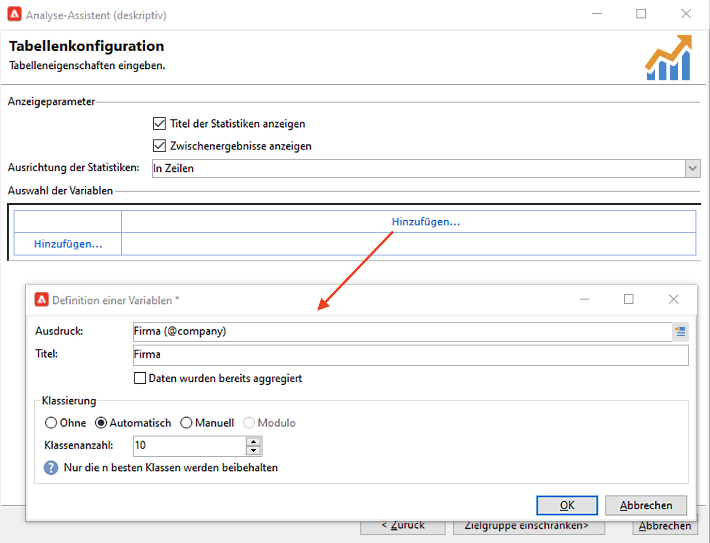

# Erste Schritte mit Reporting{#gs-ac-reports}

Adobe Campaign bietet eine Reihe von Reporting-Tools, die auf dieser Seite aufgelistet sind.

* **Dynamische Berichterstellung**

  Die dynamische Berichterstellung ist über die Web-Benutzeroberfläche von Campaign verfügbar und bietet vollständig anpassbare Echtzeitberichte zur Messung der Wirkung Ihrer Marketing-Aktivitäten. Dadurch kann auf Profildaten zugegriffen werden, was die demografische Analyse nach Profildimensionen wie Geschlecht, Ort und Alter ermöglicht, zusätzlich zur Analyse basierend auf Daten von E-Mail-Kampagnen wie Öffnungen und Klicks. Weitere Informationen finden Sie in der [Dokumentation zur Web-Benutzeroberfläche v7](https://experienceleague.adobe.com/docs/campaign-web/v8/reports/dynamic-reporting/get-started-reporting.html){target="_blank"}.

* **Cubes**

  Adobe Campaign verfügt über ein intuitives Tool zur Daten-Exploration, um dynamische Berichte zu erstellen.

  Verwenden Sie das Marketing-Analyse-Modul, um Daten zu analysieren und zu messen, Statistiken zu berechnen und die Berichterstellung und Berechnung zu vereinfachen und zu optimieren. Sie können Berichte erstellen, Zielgruppen-Populationen aufbauen und in Listen speichern, die in Adobe Campaign für Zielgruppenbestimmungs- oder Segmentierungsaufgaben verwendet werden können.

  

  Je nach Komplexität der Abfragen, Berechnungen und Volumina können die in diesen Berichten analysierten Daten über eine Abfrage gesammelt und in einer Liste (Workflow vom Typ „Daten-Management„) oder in einem Cube (unter Verwendung der Option „Marketing-Analyse„) voraggregiert werden. Sie wird in Form einer Pivot-Tabelle oder einer Gruppenliste angezeigt.

  Weiterführende Informationen hierzu finden Sie in [diesem Abschnitt](gs-cubes.md).

* **Native Berichte**

  Adobe Campaign enthält Berichte zu Sendungen, Kampagnen, Plattformaktivitäten, optionalen Funktionen usw. Diese Berichte stehen über die verschiedenen Funktionen zur Verfügung, auf die sie sich beziehen. Sie können an Ihre individuellen Bedürfnisse angepasst werden.

  Verwenden Sie die Registerkarte **Berichte**, um auf diese Berichte zuzugreifen.

  

  Weiterführende Informationen hierzu finden Sie in [diesem Abschnitt](built-in-reports.md).

* **Deskriptive Datenanalyse**

  Adobe Campaign bietet ein visuelles Tool zur Erstellung von Statistiken zu den Daten in der Datenbank. Mit einem speziellen Assistenten können Sie anschauliche Analyseberichte erstellen und deren Inhalt und Layout an Ihre Bedürfnisse anpassen.

  Verwenden Sie das Menü **[!UICONTROL Tools > Deskriptive Analyse...]**, um einen neuen Bericht zu erstellen.

  

  Die Berichte zur deskriptiven Analyse von Campaign werden in der Dokumentation zu [Campaign Classic v7 &#x200B;](https://experienceleague.adobe.com/docs/campaign-classic/using/reporting/analyzing-populations/about-descriptive-analysis.html?lang=de){target="_blank"}.

* **Benutzerdefinierte Berichte**

  Verwenden Sie Adobe Campaign, um Berichte zu den Daten in der Datenbank zu erstellen. Sobald diese erstellt wurden, machen Sie sie in den entsprechenden Kontexten zugänglich.

  Die Schritte zum Erstellen eines Berichts werden in der [Dokumentation zu Campaign Classic v7 &#x200B;](https://experienceleague.adobe.com/docs/campaign-classic/using/reporting/creating-new-reports/about-reports-creation-in-campaign.html?lang=de){target="_blank"}. Die Erstellung personalisierter Berichte ist erfahrenen Benutzerinnen und Benutzern vorbehalten.
