# Anhängen von Dateien an eine E-Mail{#attaching-files}

## Über E-Mail-Anhänge {#about-email-attachments}

Sie können an einen E-Mail-Versand eine oder mehrere Dateien anhängen.

>[!NOTE]
>
>Zur Vermeidung von Performance-Problemen wird empfohlen, nicht mehr als einen Anhang pro E-Mail hinzuzufügen. Der empfohlene Schwellenwert kann über die Liste der Campaign-Optionen konfiguriert werden. Weitere Informationen finden Sie in der [Dokumentation zu Campaign Classic](https://experienceleague.adobe.com/de/docs/campaign-classic/using/installing-campaign-classic/appendices/configuring-campaign-options#delivery).

Sie haben zwei Möglichkeiten:

* Datei unverändert anhängen.
* Den Inhalt des Anhangs für jeden Empfänger personalisieren. In diesem Fall ist die Erstellung eines **berechneten Anhangs** erforderlich. Der Titel des Anhangs wird für jede Nachricht zum Zeitpunkt des Versands berechnet und kann somit Empfänger-spezifisch sein. Die personalisierten Anhänge vor dem Senden in eine PDF-Datei umwandeln, wenn Sie über die Lizenz für **Variable Digital Printing** verfügen.

>[!NOTE]
>
>Diese Konfiguration wird in der Regel in den Versandvorlagen vorgenommen. Weiterführende Informationen finden Sie in der [Dokumentation zu Campaign Classic](https://experienceleague.adobe.com/docs/campaign-classic/using/sending-messages/using-delivery-templates/about-templates.html?lang=de).

## Schutzmechanismen {#attachments-guardrails}

Um Performance-Probleme zu vermeiden, dürfen die in den E-Mails enthaltenen Bilder nicht größer als 100 KB sein. Diese standardmäßig festgelegte Beschränkung kann in der Option `NmsDelivery_MaxDownloadedImageSize` geändert werden. Adobe empfiehlt jedoch dringend, große Bilder in E-Mail-Sendungen zu vermeiden.

Adobe empfiehlt außerdem, die Größe und Anzahl der angehängten Dateien zu begrenzen. Standardmäßig kann nur eine Datei als Anhang zu einer E-Mail hinzugefügt werden. Dieser Schwellenwert kann in der Option `NmsDelivery_MaxRecommendedAttachments` konfiguriert werden.

Weitere Informationen finden Sie in der Liste der Campaign-Optionen in der [Dokumentation zu Campaign Classic](https://experienceleague.adobe.com/de/docs/campaign-classic/using/installing-campaign-classic/appendices/configuring-campaign-options#delivery):

## Lokale Datei anhängen {#attaching-a-local-file}

Gehen Sie wie folgt vor, um eine lokale Datei an einen Versand anzuhängen.

>[!NOTE]
>
>Sie können auch mehrere Dateien an einen Versand anhängen. Die Anhänge können in jedem beliebigen Format vorliegen, darunter auch im Zip-Format.

1. Wählen Sie den Link **[!UICONTROL Anhänge]**.
1. Klicken Sie auf die Schaltfläche **[!UICONTROL Hinzufügen]**.
1. Klicken Sie auf **[!UICONTROL Datei...]**, um die Datei auszuwählen, die an den Versand angehängt werden soll.

   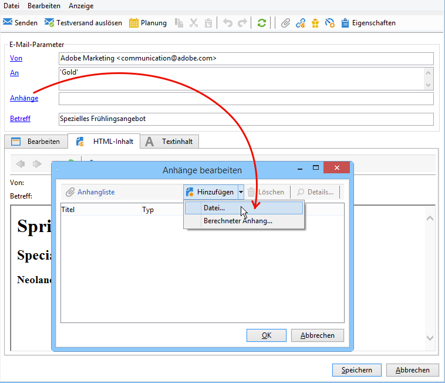

Sie können die Datei auch per Drag-and-Drop direkt in das Versandfeld **[!UICONTROL Anhänge]** ziehen oder das Symbol für **[!UICONTROL Datei anfügen]** in der Symbolleiste des Versandassistenten verwenden.

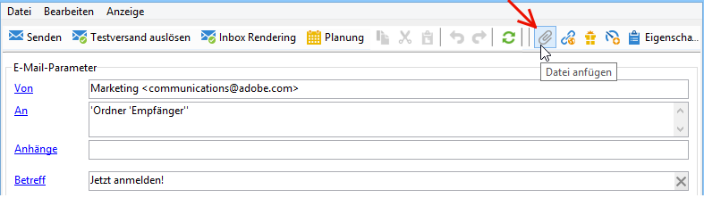

Sobald Sie die Datei ausgewählt haben, wird sie auf den Server geladen, um zum Zeitpunkt des Versandstarts zur Verfügung zu stehen. Sie wird im Feld **[!UICONTROL Anhänge]** aufgeführt.

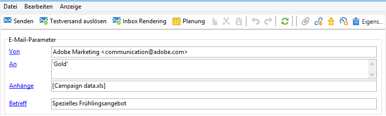

## Berechneten Anhang erstellen {#creating-a-calculated-attachment}

Bei berechneten Anhängen ist es möglich, den Titel des Anhangs zum Zeitpunkt der Analyse oder des Versandstarts zu berechnen. Außerdem können so Empfänger-spezifische Titel erstellt werden. Darüber hinaus besteht die Möglichkeit, die Anhänge als personalisierte PDF-Dateien zu versenden.

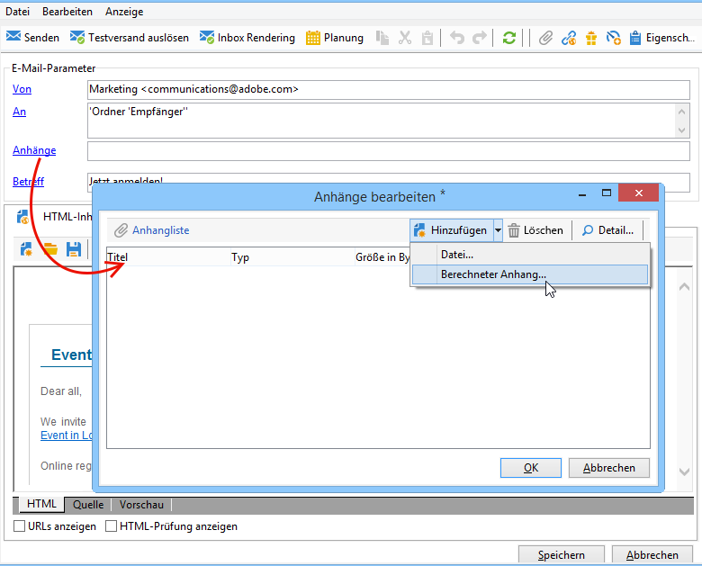

Gehen Sie wie folgt vor, um einen personalisierten Anhang zu erstellen:

1. Wählen Sie den Link **[!UICONTROL Anhänge]**.
1. Klicken Sie auf die Schaltfläche **[!UICONTROL Hinzufügen]** und wählen Sie **[!UICONTROL Berechneter Anhang]**.
1. Wählen Sie in der Dropdown-Liste des **[!UICONTROL Typ]**-Felds eine der folgenden Berechnungsmodi aus:

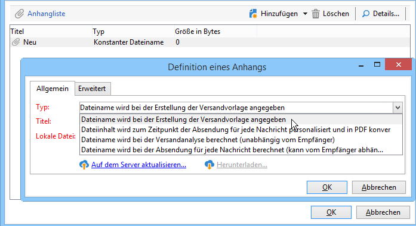

Folgende Optionen stehen zur Verfügung:

* **Dateiname wird bei der Erstellung der Versandvorlage angegeben**
* **Dateiinhalt wird zum Zeitpunkt der Absendung für jede Nachricht personalisiert und in PDF konvertiert**
* **Dateiname wird bei der Versandanalyse berechnet (unabhängig vom Empfänger)**
* **Dateiname wird bei der Absendung für jede Nachricht berechnet (kann vom Empfänger abhängen)**

### Lokale Datei anhängen {#attach-a-local-file}

Wenn der Anhang eine lokale Datei ist, wählen Sie die Option **[!UICONTROL Dateiname wird bei der Erstellung der Versandvorlage angegeben]**. Die Datei wird lokal ausgewählt und auf den Server geladen. Gehen Sie wie folgt vor:

1. Geben Sie im Feld **[!UICONTROL Lokale Datei]** den gewünschten Anhang an.
1. Vergeben Sie gegebenenfalls einen Titel. Der Titel ersetzt den Dateinamen bei der Anzeige in Messaging-Systemen. Wenn nicht anders angeben, wird standardmäßig der Dateiname verwendet.

   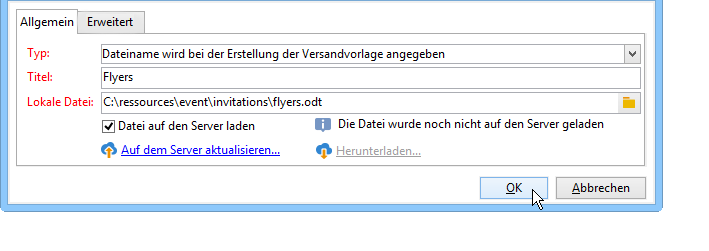

1. Wählen Sie, wenn nötig, die Option **[!UICONTROL Datei auf den Server laden]** und klicken Sie auf den Link **[!UICONTROL Auf dem Server aktualisieren...]**, um den Vorgang zu starten.

   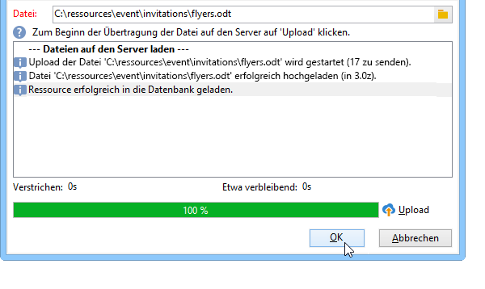

Nun kann die Datei als Anhang der auf dieser Vorlage beruhenden Sendungen verwendet werden.

### Personalisierte Nachricht anhängen {#attach-a-personalized-message}

Mit der Option **[!UICONTROL Dateiinhalt wird zum Zeitpunkt der Absendung für jede Nachricht personalisiert und in PDF konvertiert]** können Sie eine Datei mit Personalisierungsfeldern (z. B. für den Vor- und Nachnamen des Empfängers) auswählen.

Gehen Sie wie folgt vor, um diese Art von Anhang zu konfigurieren:

1. Wählen Sie die hochzuladende Datei aus.
1. Vergeben Sie gegebenenfalls einen Titel.
1. Wählen Sie die Option **[!UICONTROL Datei auf den Server laden]**, klicken Sie auf den Link **[!UICONTROL Auf dem Server aktualisieren]** und starten Sie den Upload in dem sich öffnenden Fenster.
1. Sie können eine Vorschau erstellen, indem Sie auf einen Empfänger klicken.

   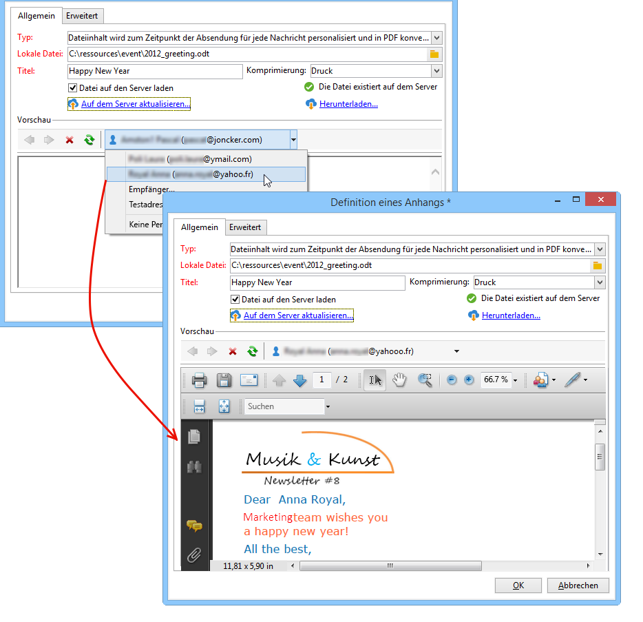

1. Analysieren und starten Sie den Versand.

   Jeder Empfänger enthält eine personalisierte PDF-Datei im E-Mail-Anhang.

   

### Berechnete Datei anhängen {#attach-a-calculated-file}

Sie können den Namen des Anhangs während der Versandvorbereitung berechnen lassen. Wählen Sie dazu die Option **[!UICONTROL Dateiname wird bei der Versandanalyse berechnet (unabhängig vom Empfänger)]** aus.

>[!NOTE]
>
>Diese Option ist nur für Sendungen vorgesehen, die durch einen externen Vorgang oder einen Workflow abgeschickt werden.

1. Geben Sie den Titel an, der für den Anhang verwendet werden soll.
1. Geben Sie den Pfad und den genauen Namen der Datei im Eingabefenster an.

   >[!IMPORTANT]
   >
   >Die Datei muss sich auf dem Server befinden.

   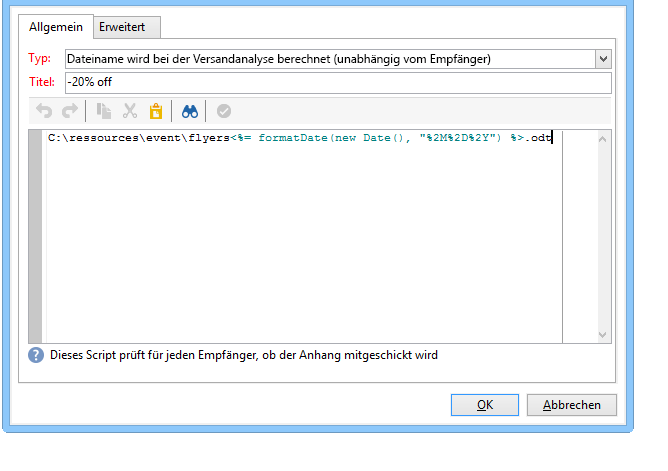

1. Analysieren und starten Sie den Versand.

   Im Analyseprotokoll können Sie die Berechnung des Dateinamens nachvollziehen.

   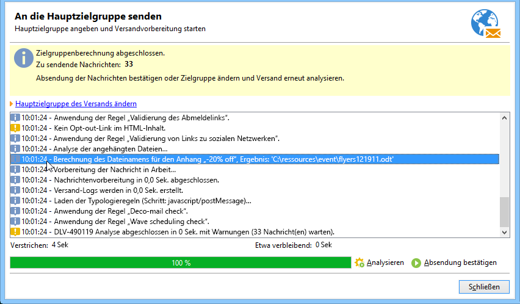

### Personalisierte Datei anhängen {#attach-a-personalized-file}

Bei der Auswahl des Anhangs können Sie die Option **[!UICONTROL Dateiname wird bei der Absendung für jede Nachricht berechnet (kann vom Empfänger abhängen)]** auswählen. Dann können Sie die Personalisierungsdaten des Empfängers dem Namen der zu sendenden Datei zuordnen.

>[!NOTE]
>
>Diese Option ist nur für Sendungen vorgesehen, die durch einen externen Vorgang oder einen Workflow abgeschickt werden.

1. Geben Sie den Titel an, der für den Anhang verwendet werden soll.
1. Geben Sie den Pfad und den genauen Namen der Datei im Editor an. Wenn der Dateiname je nach Empfänger angepasst werden soll, können Sie die entsprechenden Personalisierungsfelder einfügen.

   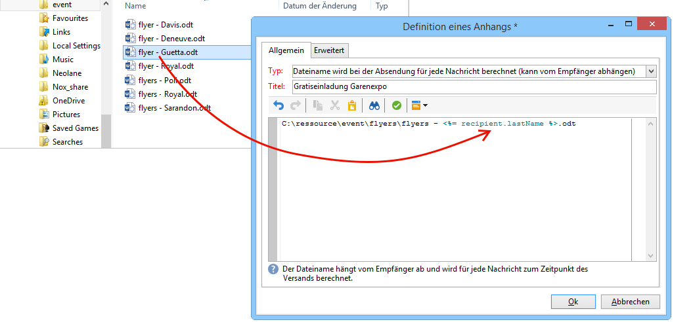

   >[!IMPORTANT]
   >
   >Die Datei muss sich auf dem Server befinden.

1. Analysieren und starten Sie den Versand.

   In unten stehendem Beispiel wurde die angehängte Datei über den mithilfe der Personalisierungsfelder konfigurierten Namen gewählt.

   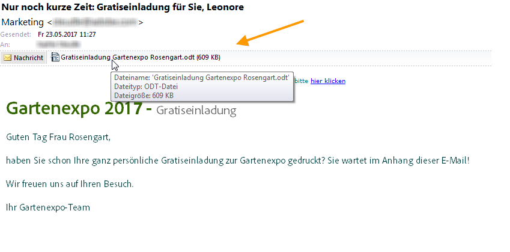

### Einstellungen für den Anhang {#attachment-settings}

Für die ersten beiden Optionen können Sie **[!UICONTROL Datei auf den Server hochladen]** durch Auswahl der entsprechenden Option wählen. Über den Link **[!UICONTROL Datei auf dem Server aktualisieren]** können Sie mit dem Hochladen beginnen.

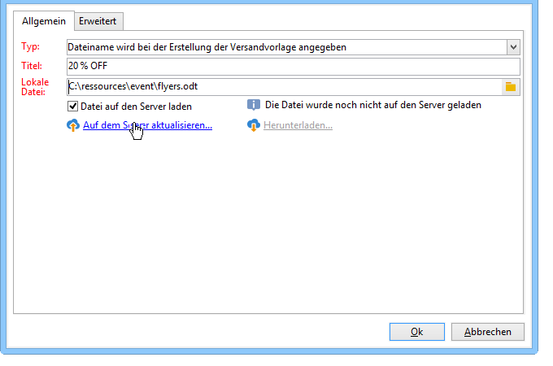

Eine Nachricht bestätigt, dass die Datei erfolgreich hochgeladen wurde:

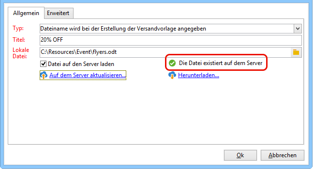

Ein Warnhinweis erscheint, wenn die Datei geändert wurde:

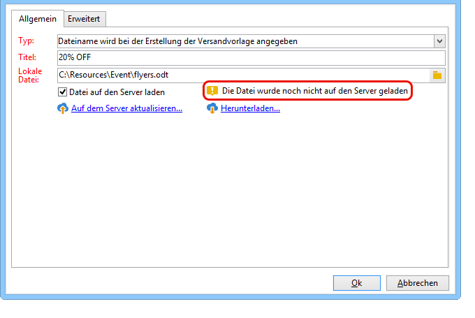

Im **[!UICONTROL Erweitert]**-Tab können Sie für Anhänge die folgenden Optionen konfigurieren:

* Auswahl der Empfänger, die den Anhang erhalten sollen. Kreuzen Sie die Option **[!UICONTROL Empfängerfilter bezüglich des Anhangs aktivieren]** an und geben Sie im Eingabefenster in Form eines JavaScripts das Auswahlkriterium an.
* Erstellung eines Scripts, um den Dateinamen zu personalisieren.

  Geben Sie unter Verwendung der Dropdown-Liste mit den Personalisierungsfeldern im Eingabefenster den gewünschten Text ein. In unten stehendem Beispiel wurde der Dateiname mit dem Tagesdatum und dem Nachnamen des Empfängers personalisiert.

  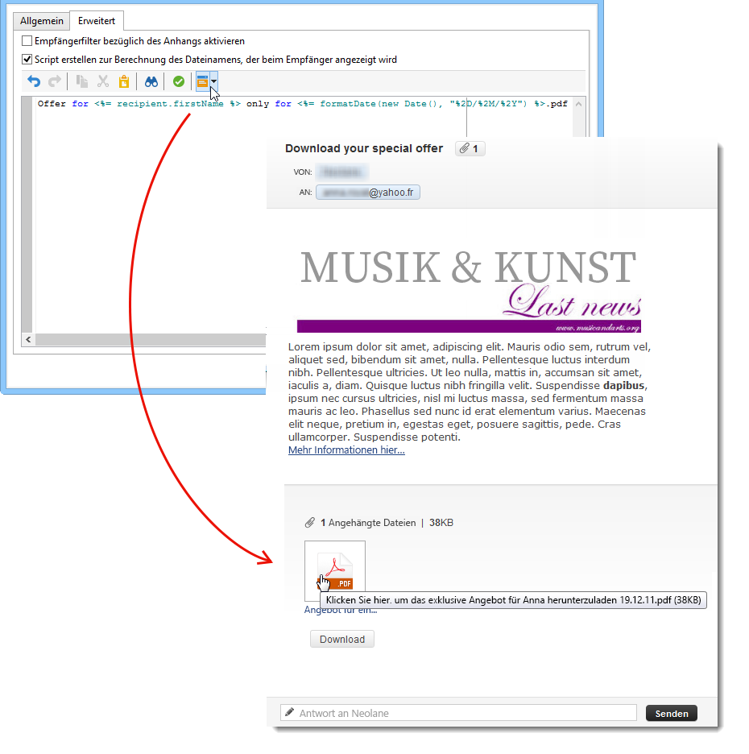
