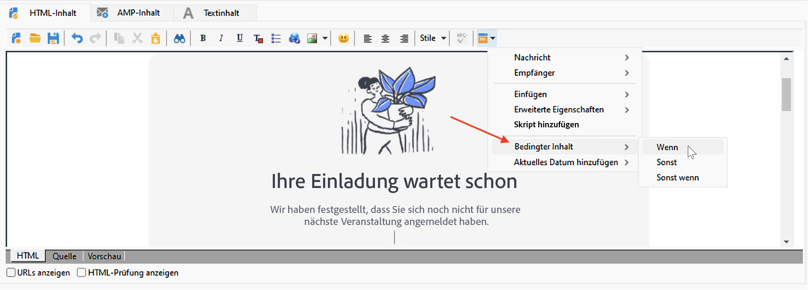
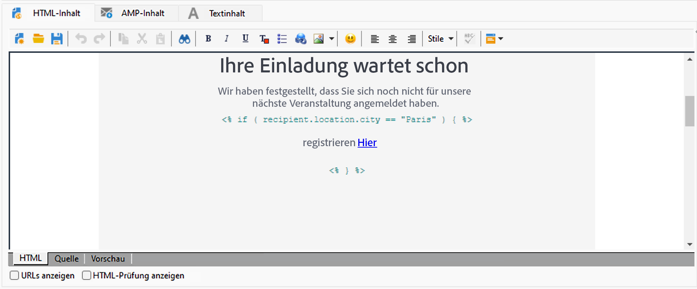

# Bedingte Inhalte erstellen{#conditional-content}

Die Konfiguration bedingter Inhalte erlaubt einen weitreichenden Personalisierungsgrad. Vollständige Absätze oder Bildbereiche werden ersetzt, wenn eine bestimmte Bedingung erfüllt ist.


## Verwenden von Bedingungen in einer E-Mail {#conditions-in-an-email}

Im folgenden Beispiel erfahren Sie, wie Sie eine Nachricht erstellen, die dynamisch auf die Stadt und die Interessen des Empfängers personalisiert ist.

* Nachricht je nach Ort des Empfängers ändern
* Personalisieren Sie den Inhalt des Angebots entsprechend den Interessen des Empfängers.

Gehen Sie wie folgt vor, um einen von einem Feldwert abhängigen bedingten Inhalt zu erstellen:

1. Öffnen Sie einen bestehenden Versand oder erstellen Sie einen neuen E-Mail-Versand.
1. Klicken Sie im E-Mail-Inhaltseditor auf das Personalisierungssymbol und wählen Sie **[!UICONTROL Bedingter Inhalt > Wenn]**.

   

   Die Personalisierungselemente werden in den Nachrichten-Textkörper eingefügt.

1. Füllen Sie die Parameter der **if** Ausdruck.

   * Wählen Sie das erste Element des Ausdrucks aus. **`<FIELD>`** und klicken Sie auf das Personalisierungssymbol, um es durch das Testfeld zu ersetzen.
   * Ersetzen Sie **`<VALUE>`** durch den Wert des Feldes, für das die Bedingung erfüllt wird. Dieser Wert muss in Anführungszeichen gesetzt werden.
   * Geben Sie den Inhalt an, der eingefügt werden soll, wenn die Bedingung erfüllt ist. Dabei kann es sich um einen Text, ein Bild, ein Formular, einen Hypertext-Link usw. handeln.

   

1. Klicken Sie auf **[!UICONTROL Vorschau]** um den Nachrichteninhalt entsprechend dem Empfänger des Versands anzuzeigen. Wählen Sie einen Empfänger aus, für den die Bedingung wahr ist, um den Inhalt zu überprüfen. Wählen Sie dann einen anderen Empfänger aus, für den er falsch ist, und überprüfen Sie erneut.

Sie können weitere Bedingungen hinzufügen und Inhalte in Abhängigkeit von einem oder mehreren Feldwerten konfigurieren. Dies ist mit den Optionen **[!UICONTROL Bedingter Inhalt > Sonst]** und **[!UICONTROL Bedingter Inhalt > Sonst wenn]** möglich. Die Vorgehensweise ist die gleiche wie beim **If**-Ausdruck.

>[!CAUTION]
>
>Die **%> &lt;%** Zeichen müssen nach dem Hinzufügen gelöscht werden **Else** und **Else if** Bedingungen.


## Anwendungsfall: mehrsprachige E-Mail erstellen {#creating-multilingual-email}

Im folgenden Beispiel erfahren Sie, wie Sie eine mehrsprachige E-Mail erstellen. Der Inhalt wird in der Sprache des Empfängers angezeigt.

1. Erstellen Sie eine E-Mail und wählen Sie die Zielpopulation aus. In diesem Beispiel basiert die Bedingung, dass die eine Version oder die andere angezeigt wird, auf der **Sprache** Wert des Empfängerprofils. Diese Werte sind auf **DE**, **FR**, **ES**.
1. Klicken Sie im HTML-Inhalt der E-Mail auf den Tab **[!UICONTROL Quelle]** und fügen Sie folgenden Code ein:

   ```
   <% if (language == "EN" ) { %>
   <DIV id=en-version>Hello <%= recipient.firstName %>,</DIV>
   <DIV>Discover your new offers!</DIV>
   <DIV><a href="https://www.adobe.com/products/en">www.adobe.com/products/en</A></FONT></DIV><%
    } %>
   <% if (language == "FR" ) { %>
   <DIV id=fr-version>Bonjour <%= recipient.firstName %>,</DIV>
   <DIV>Découvrez nos nouvelles offres !</DIV>
   <DIV><a href="https://www.adobe.com/products/fr">www.adobe.com/products/fr</A></DIV><%
    } %>
    <% if (language == "ES" ) { %>
   <DIV id=es-version><FONT face=Arial>
   <DIV>Olà <%= recipient.firstName %>,</DIV>
   <DIV>Descubra nuestros nuevas ofertas !</DIV>
   <DIV><a href="https://www.adobe.com/products/es">www.adobe.com/products/es</A></DIV>
   <% } %>
   ```

1. Überprüfen Sie den E-Mail-Inhalt im Tab **[!UICONTROL Vorschau]**, indem Sie Empfänger mit unterschiedlichen Sprachen auswählen.

   >[!NOTE]
   >
   >Da Sie für den E-Mail-Inhalt keine andere Version definiert haben, müssen Sie die Zielpopulation vor dem Versand der E-Mail filtern.

## Anleitungsvideo {#conditionnal-content-video}

Erfahren Sie, wie Sie einem Versand bedingte Inhalte hinzufügen können, beispielsweise einen mehrsprachigen Newsletter.

>[!VIDEO](https://video.tv.adobe.com/v/335682?quality=12)

