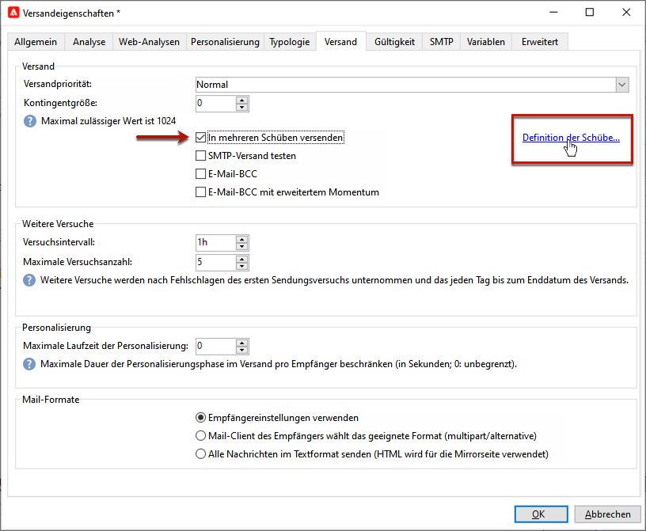

# Konfigurieren und Durchführen des Versands {#configure-delivery}

## Festlegen zusätzlicher Parameter {#delivery-additional-parameters}

Vor der Durchführung des Versands können Sie im Tab **[!UICONTROL Versand]** die Parameter der Versandeigenschaften definieren.

* **[!UICONTROL Versandpriorität]**: Verwenden Sie diese Option, um die Versandreihenfolge für Ihre Sendungen zu ändern, indem Sie die Prioritätsstufe festlegen, von der aus **[!UICONTROL Sehr niedrig]** nach **[!UICONTROL Sehr hoch]** (der Standardwert ist **[!UICONTROL Normal]**).

* **[!UICONTROL Kontingentgröße]**: Mithilfe dieser Option können Sie die Anzahl der in einem XML-Versand-Package enthaltenen Nachrichten festlegen. Wenn der Parameter auf „0“ gesetzt ist, werden die Nachrichten automatisch gruppiert. Die Package-Größe wird durch die `<delivery size>/1024`-Berechnung definiert, mit mindestens 8 und maximal 256 Nachrichten pro Package.

  >[!IMPORTANT]
  >
  >Wenn der Versand durch Duplizieren eines existierenden Versands erstellt wird, wird dieser Parameter zurückgesetzt.

* **[!UICONTROL In mehreren Schüben versenden]**: Verwenden Sie diese Option, um Ihre Nachrichten in mehreren Schüben anstatt gleichzeitig zu versenden. [Weitere Informationen](#sending-using-multiple-waves).

* **[!UICONTROL SMTP-Versand testen]**: Verwenden Sie diese Option, um den Versand per SMTP zu testen. Der Versand wird bis zur Verbindung mit dem SMTP-Server verarbeitet, aber nicht gesendet: Für jeden Empfänger des Versands stellt Campaign eine Verbindung mit dem Server des SMTP-Anbieters her, führt den SMTP-Befehl RCPT TO aus und schließt die Verbindung vor dem SMTP-Befehl DATA.

  >[!NOTE]
  >
  >* Diese Option darf bei Mid-Sourcing nicht festgelegt werden.
  >
  >* Weitere Informationen zur SMTP-Serverkonfiguration finden Sie in [Dokumentation zu Campaign Classic v7](https://experienceleague.adobe.com/docs/campaign-classic/using/installing-campaign-classic/additional-configurations/configure-delivery-settings.html#smtp-relay){target="_blank"}.

* **[!UICONTROL E-Mail-BCC]**: Mit dieser Option können Sie mit der BCC-Funktion E-Mails in einem externen System speichern, indem Sie einfach eine E-Mail-Adresse als BCC zu Ihrer Versandzielgruppe hinzufügen. [Weitere Informationen](email-parameters.md).

## Versenden in mehreren Schüben {#sending-using-multiple-waves}

Um eine gleichmäßige Auslastung der Kapazitäten zu gewährleisten, können Sie Sendungen in mehrere Schübe unterteilen. Konfigurieren Sie die Anzahl der Schübe und ihre Größe in Bezug auf den gesamten Versand.

>[!NOTE]
>
>Sie können nur die Größe und die Zeitverzögerung zwischen zwei aufeinanderfolgenden Schüben definieren. Die Empfängerauswahlkriterien für jeden Schub können nicht konfiguriert werden.

1. Öffnen Sie das Versandeigenschaftenfenster und wählen Sie den **[!UICONTROL Versand]**-Tab aus.
1. Wählen Sie die Option **[!UICONTROL In mehreren Schüben versenden]** aus und danach den Link **[!UICONTROL Definition der Schübe...]**.

   

1. Zur Konfiguration von Schüben haben Sie die folgenden Möglichkeiten:

   * Definieren Sie die Größe eines jeden Schubs. Wenn Sie beispielsweise **[!UICONTROL 30%]** im entsprechenden Feld eingeben, enthält jeder Schub 30 % der Versandnachrichten. Nur der letzte Schub enthält 10 % der Nachrichten.

     Geben Sie im Feld **[!UICONTROL Zeitraum]** die Verzögerung zwischen dem Start zweier aufeinanderfolgender Schübe an. Wenn Sie zum Beispiel **[!UICONTROL 2d]** eingeben, startet der erste Schub sofort, der zweite Schub startet in zwei Tagen, der dritte in vier Tagen usw.

     

   * Definieren Sie einen Kalendereintrag für den Versand eines jeden Schubs.

     Geben Sie in der Spalte **[!UICONTROL Start]** die Verzögerung zwischen dem Start von zwei aufeinanderfolgenden Schüben an. Geben Sie in der Spalte **[!UICONTROL Größe]** eine Zahl oder einen Prozentsatz ein.

     Im unten stehenden Beispiel beinhaltet der erste Schub 25 % der Gesamtzahl der im Versand enthaltenen Nachrichten und beginnt unmittelbar. Die nächsten beiden Schübe vervollständigen den Versand und starten in Intervallen von je sechs Stunden.

     

   Eine spezifische Typologieregel (**[!UICONTROL Prüfung der Schub-Planung]**) stellt sicher, dass der letzte Schub vor der Versand-Deadline eingeplant ist. Kampagnentypologien und ihre Regeln, konfiguriert im **[!UICONTROL Typologie]** den Tab der Versandeigenschaften, siehe [diesem Abschnitt](../../automation/campaign-opt/campaign-typologies.md#typology-rules)<!--ref TBC-->.

   >[!IMPORTANT]
   >
   >Achten Sie darauf, dass die letzten Schübe nicht die Versandgültigkeit überschreiten, die im Tab **[!UICONTROL Gültigkeit]** festgelegt wird. Ansonsten werden manche Nachrichten nicht gesendet.
   >
   >Planen Sie bei der Konfiguration der letzten Schübe auch genügend Zeit für zusätzliche Versuche ein. <!--See [this section]().-->

1. Gehen Sie zur Überwachung Ihrer Sendungen zu den Versandlogs. Näheres hierzu finden Sie auf [dieser Seite](send.md)<!--ref TBC-->.

   Die Versandlogs enthalten die bereits in den verarbeiteten Schüben durchgeführten Sendungen (Status **[!UICONTROL Gesendet]**) sowie die in den restlichen Schüben durchzuführenden Sendungen (Status **[!UICONTROL Ausstehend]**).

Im Folgenden finden Sie die häufigsten Anwendungsbeispiele für Schübe.

* **In der Anfangsphase**

  Wenn E-Mails über eine neue Plattform versendet werden, sind ISPs normalerweise misstrauisch gegenüber den neuen IP-Adressen. Das plötzliche Versenden großer Mengen an E-Mails veranlasst ISPs oft dazu, sie als Spam zu qualifizieren.

  Um zu verhindern, dass Ihre Sendungen als Spam eingestuft werden, können Sie das gesendete Volumen schrittweise mithilfe von Schüben erhöhen. Damit gewährleisten Sie eine problemlose Entwicklung in der Anfangsphase und die Verringerung der Anzahl der ungültigen Adressen.

  Verwenden Sie dazu die Option **[!UICONTROL Schübe in einem Kalender definieren]**. Wählen Sie beispielsweise für den ersten Schub 10 %, für den zweiten 15 % usw.

  

* **Kampagnen, die ein Callcenter beinhalten**

  Bei telefonischen Treuekampagnen verfügen Unternehmen oft über begrenzte Kapazitäten für die Verarbeitung der Anrufe an Abonnenten.

  Mithilfe von Schüben kann die Anzahl der Nachrichten auf 20 pro Tag beschränkt werden, was der täglichen Verarbeitungskapazität eines Callcenters entspricht.

  Wählen Sie dazu die Option **[!UICONTROL Mehrere Schübe mit gleicher Größe planen]** aus. Geben Sie **[!UICONTROL 20]** als Schubgröße und **[!UICONTROL 1d]** im Feld **[!UICONTROL Zeitraum]** ein.

  

<!--
## Adjust delivery failure management {#delivery-failure-management}

### Configure retries {#configure-retries}

Temporarily undelivered messages due to a **Soft** or **Ignored** error are subject to an automatic retry. The delivery failure types and reasons are presented in this [section](../../delivery/using/understanding-delivery-failures.md#delivery-failure-types-and-reasons).

>[!IMPORTANT]
>
>For hosted or hybrid installations, if you have upgraded to the [Enhanced MTA](../../delivery/using/sending-with-enhanced-mta.md), the retry settings in the delivery are no longer used by Campaign. Soft bounce retries and the length of time between them are determined by the Enhanced MTA based on the type and severity of the bounce responses coming back from the message's email domain.

For on-premise installations and hosted/hybrid installations using the legacy Campaign MTA, the central section of the **[!UICONTROL Delivery]** tab for delivery parameters indicates how many retries should be performed the day after the delivery and the minimum delay between retries.

By default, five retries are scheduled for the first day of the delivery with a minimum interval of one hour spread out over the 24 hours of the day. One retry per day is programmed after that and until the delivery deadline, which is defined in the **[!UICONTROL Validity]** tab (see [Defining validity period](#defining-validity-period)).

### Define the validity period {#define-validity-period}

When the delivery has been launched, the messages (and any retries) can be sent until the delivery deadline. This is indicated in the delivery properties, via the **[!UICONTROL Validity]** tab.

* The **[!UICONTROL Delivery duration]** field lets you enter the limit for global delivery retries. This means that Adobe Campaign sends the messages beginning on the start date, and then, for messages returning an error only, regular, configurable retries are performed until the validity limit is reached.

  You can also choose to specify dates. To do this, select **[!UICONTROL Explicitly set validity dates]**. In this case, the delivery and validity limit dates also let you specify the time. The current time is used by default, but you can modify this directly in the input field.

  >[!IMPORTANT]
  >
  >For hosted or hybrid installations, if you have upgraded to the [Enhanced MTA](../../delivery/using/sending-with-enhanced-mta.md), the **[!UICONTROL Delivery duration]** setting in your Campaign email deliveries will be used only if set to **3.5 days or less**. If you define a value higher than 3.5 days, it will not be taken into account.

* **Validity limit of resources**: The **[!UICONTROL Validity limit]** field is used for uploaded resources, mainly for the mirror page and images. The resources on this page are valid for a limited time (to save disk space).

  The values in this field can be expressed in the units listed in [this section](../../platform/using/adobe-campaign-workspace.md#default-units).

## Confirm the delivery {#confirm-delivery}

When the delivery is configured and ready to be sent, make sure you have run the delivery analysis.

To do this, click **[!UICONTROL Send]**, select the desired action and click **[!UICONTROL Analyze]**. For more on this, see [Launching the analysis](../../delivery/using/steps-validating-the-delivery.md#analyzing-the-delivery).

Once done, click **[!UICONTROL Confirm delivery]** to launch the delivery of messages.

You can then close the delivery wizard and track the execution of the delivery from the **[!UICONTROL Delivery]** tab, accessible via the detail of this delivery or via the list of deliveries.

After sending messages, you can monitor and track your deliveries. For more on this, refer to these sections:

* [Monitoring a delivery](send.md)
* [Understanding delivery failures](delivery-failures.md)
* [About message tracking]

## Schedule the delivery sending {#schedule-delivery-sending}

You can defer the delivery of messages in order to schedule the delivery or to manage sales pressure and avoid over-soliciting a population.

1. Click the **[!UICONTROL Send]** button and select the **[!UICONTROL Postpone delivery]** option.

1. Specify a start date in the **[!UICONTROL Contact date]** field.

  

1. You can then start the delivery analysis, then confirm the delivery sending. However, the delivery sending will not start until the date given in the **[!UICONTROL Contact date]** field.

  >[!IMPORTANT]
  >
  >Once you have started the analysis, the contact date that you defined is fixed. If you modify this date, you will have to restart the analysis so that your modifications are taken into account.

  

In the delivery list, the delivery will appear with **[!UICONTROL Pending]** status.

Scheduling can also be configured upstream via the **[!UICONTROL Scheduling]** button of the delivery.

It lets you defer the delivery to a later date or save the delivery in the provisional calendar.

* The **[!UICONTROL Schedule delivery (no automatic execution)]** option lets you schedule a provisional analysis of the delivery.

  When this configuration is saved, the delivery changes to **[!UICONTROL Targeting pending]** status. The analysis will be launched on the specified date.

* The **[!UICONTROL Schedule delivery (automatic execution on planned date)]** option lets you specify the delivery date.

  Click **[!UICONTROL Send]** and select **[!UICONTROL Postpone delivery]** then launch the analysis and confirm delivery. When the analysis is complete, the delivery target is ready and messages will automatically be sent on the specified date.

Dates and times are expressed in the time zone of the current operator. The **[!UICONTROL Time zone]** drop-down list located below the contact date input field lets you automatically convert the entered date and time into the selected time zone.

For instance, if you schedule a delivery to be executed automatically at 8 o'clock London time, the time is automatically converted into the selected time zone:

-->