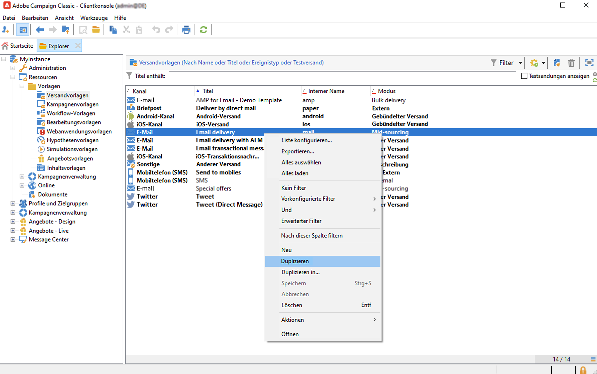
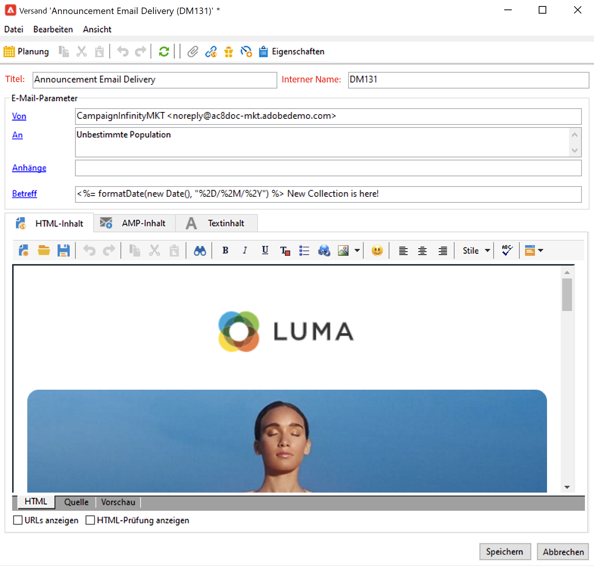
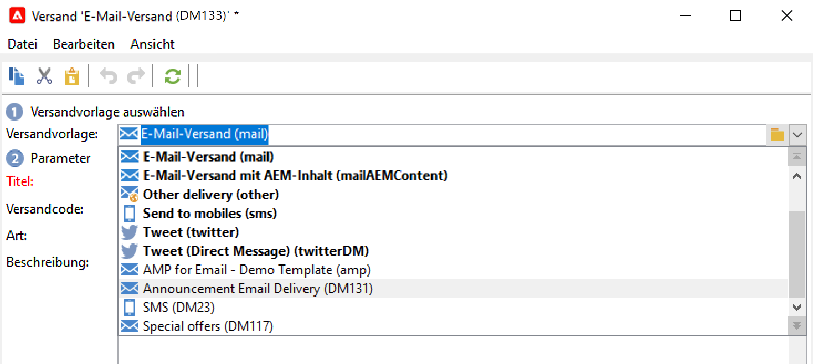
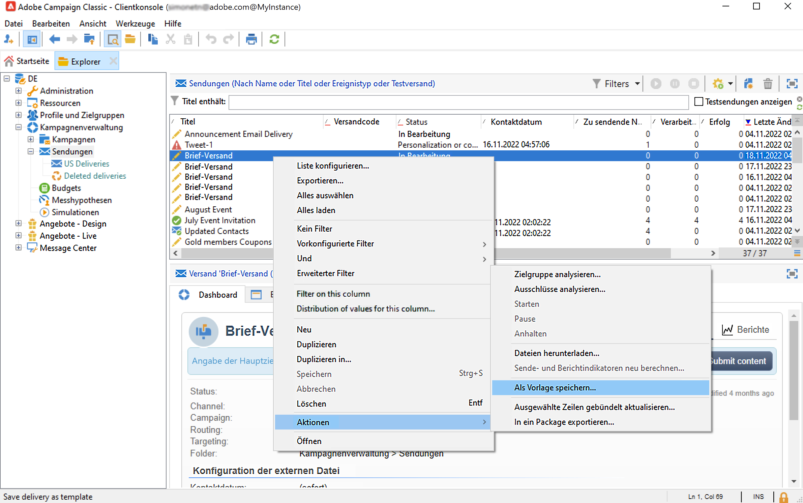
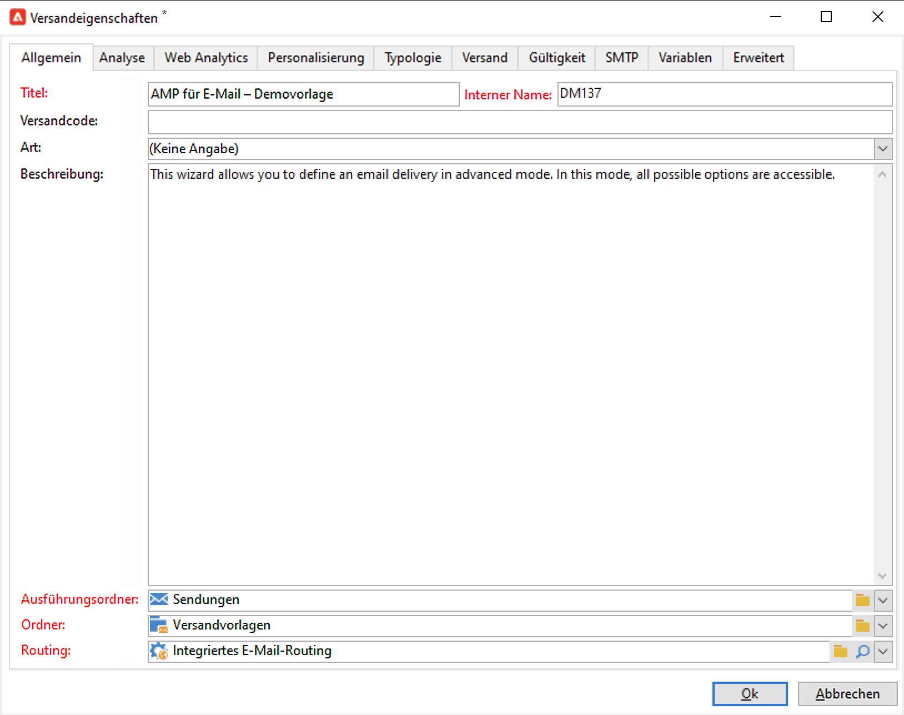
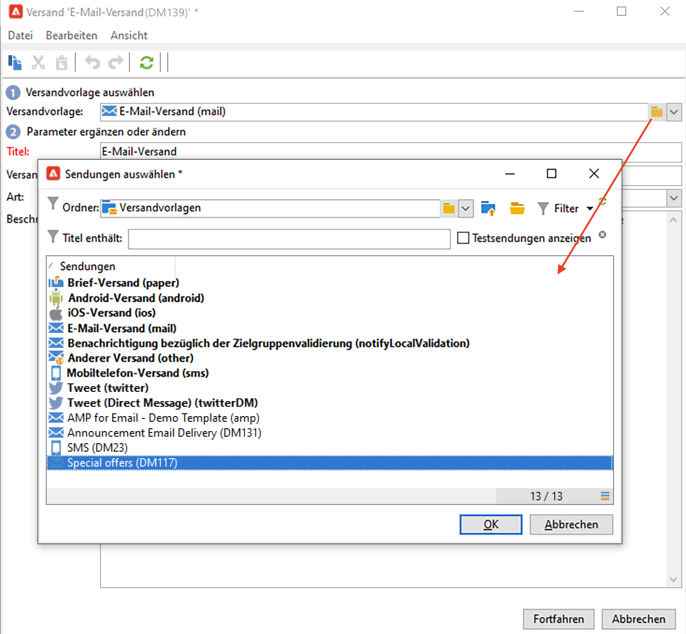
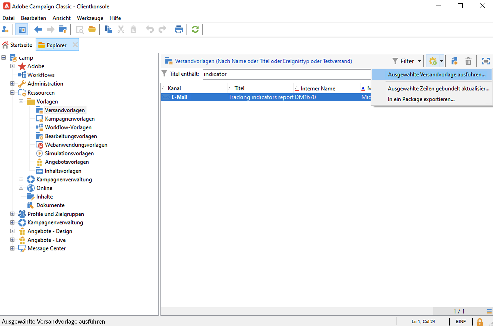

# Mit Versandvorlagen arbeiten{#work-with-delivery-template}

Verwenden Sie Versandvorlagen, um das kreative Erscheinungsbild zu standardisieren, damit Kampagnen schneller ausgeführt und gestartet werden können.

Eine Vorlage kann systematisch Folgendes enthalten:

* Typologien
* Absender- und Antwortadressen
* Grundlegende Gestaltungsbausteine
* Links zu Mirror-Seiten und Abmeldung links
* Inhalt, Firmenlogo oder Signatur
* Andere Versandeigenschaften, z. B. die Gültigkeit der Ressource, die Parameter für erneute Versuche oder die Quarantäneeinstellungen.

 [Entdecken Sie diese Funktion im Video](#delivery-template-video).

## Erstellen einer Vorlage{#create-a-delivery-template}

Um eine Versandvorlage zu erstellen, können Sie eine integrierte Vorlage duplizieren, einen existierenden Versand in eine Vorlage konvertieren oder eine neue Versandvorlage erstellen.

### Angebotsvorlagen duplizieren{#copy-an-existing-template}

Campaign verfügt über eine Reihe integrierter Vorlagen für jeden Kanal: E-Mail, Push, SMS, Briefpost und mehr.

Die einfachste Möglichkeit, eine Versandvorlage zu erstellen, besteht darin, eine integrierte Vorlage zu duplizieren und anzupassen.

Gehen Sie wie folgt vor, um eine Versandvorlage zu duplizieren:

1. Navigieren Sie zu **[!UICONTROL Ressourcen > Vorlagen > Versandvorlagen]** im Adobe Campaign-Explorer angezeigt.
1. Wählen Sie eine integrierte Versandvorlage aus. Integrierte Vorlagen sind in der Liste fett hervorgehoben.
1. Klicken Sie mit der rechten Maustaste und wählen Sie **[!UICONTROL Duplizieren]**.

   

1. Definieren Sie die Vorlageneinstellungen und speichern Sie die neue Vorlage.

   

Die Vorlage wird der Liste der Versandvorlagen hinzugefügt. Sie können sie jetzt bei der Erstellung eines neuen Versands auswählen.

### Vorhandenen Versand in eine Vorlage konvertieren {#convert-an-existing-delivery}

Ein Versand kann für neue wiederholte Versandaktionen in eine Vorlage umgewandelt werden.

Gehen Sie wie folgt vor, um einen Versand in eine Vorlage zu konvertieren:

1. Wählen Sie den Versand aus der Versandliste aus, auf die über die **[!UICONTROL Kampagnenverwaltung]** Knoten des Campaign-Explorer.

1. Klicken Sie mit der rechten Maustaste und wählen Sie **[!UICONTROL Aktionen > Als Vorlage speichern...]**.

   

1. Bearbeiten Sie die Versandeigenschaften und wählen Sie den Ordner aus, in dem die neue Vorlage gespeichert werden soll (im **[!UICONTROL Ordner]** ) und dem Ordner, in dem die auf dieser Vorlage basierenden Sendungen erstellt werden müssen (im **[!UICONTROL Ausführungsordner]** -Feld).

   

### Neue Vorlage erstellen {#create-a-new-template}

>[!NOTE]
>
>Um Konfigurationsfehler zu vermeiden, empfiehlt Adobe, dass Sie [Duplizieren einer integrierten Vorlage](#copy-an-existing-template) und passen die Eigenschaften an, anstatt eine neue Vorlage zu erstellen.

Gehen Sie wie folgt vor, um eine neue Versandvorlage zu konfigurieren:

1. Navigieren Sie zum **Ressourcen** Ordner im Campaign-Explorer und wählen Sie **Vorlagen** then **Versandvorlagen**.
1. Klicken Sie in der Symbolleiste auf **Neu**, um eine neue Versandvorlage zu erstellen.
1. Legen Sie die **Titel** und **Interner Name** des Ordners.
1. Speichern Sie Ihre Vorlage und öffnen Sie sie erneut.
1. Aus dem **Eigenschaften** -Schaltfläche, passen Sie die Einstellungen an.
1. Bestätigen Sie im Tab **Allgemein** die in den Dropdown-Menüs **Ausführungsordner**, **Ordner** und **Routing** ausgewählten Speicherorte oder ändern Sie sie.
1. Tragen Sie der Kategorie **E-Mail-Parameter** den E-Mail-Betreff und die Zielgruppe ein.
1. Fügen Sie Ihren **HTML-Inhalt** ein, um Ihre Vorlage zu personalisieren. Sie können auch einen Mirrorseite-Link und einen Abmelde-Link angeben.
1. Wählen Sie den Tab **Vorschau**. Wählen Sie im Dropdown-Menü **Personalisierung testen** die Option **Empfänger** aus, um sich Ihre Vorlage in der Vorschau anzusehen.
1. Klicken Sie auf **Speicher**. Ihre Vorlage kann jetzt in einem Versand verwendet werden.

## Vorlagen verwenden{#use-a-delivery-template}

### Erstellen eines Versands aus einer Vorlage{#create-a-delivery-from-a-template}

Um einen Versand auf Basis einer existierenden Vorlage zu erstellen, wählen Sie diese aus der Liste der Versandvorlagen aus.

Wenn Ihre Vorlage nicht angezeigt wird, klicken Sie auf die Schaltfläche **[!UICONTROL Link auswählen]** Ordner rechts neben dem Feld, um in Campaign-Ordnern zu suchen.

Wählen Sie im Feld **[!UICONTROL Ordner]** das gesuchte Verzeichnis aus oder klicken Sie auf das Symbol **[!UICONTROL Unterordner anzeigen]**.

Wählen Sie dann die zu verwendende Versandvorlage aus und klicken Sie auf **[!UICONTROL OK]**.

### Vorlagen ausführen {#execute-a-template}

Sie können die Ausführung einer Vorlage direkt über die Vorlagenliste starten, ohne zuvor einen Versand zu erstellen.

Wählen Sie dazu die auszuführende Vorlage aus und klicken Sie mit der rechten Maustaste darauf. Auswählen **[!UICONTROL Aktionen > Ausgewählte Versandvorlage ausführen..]**.

Sie können auch das Menü **[!UICONTROL Datei > Aktionen > Ausgewählte Versandvorlage ausführen...]** verwenden.

Geben Sie die Versandparameter an und klicken Sie auf **[!UICONTROL Senden]**.

Dadurch wird ein Versand im Ordner erzeugt, der mit der Vorlage verknüpft ist. Der Name dieses Versands ist der Name der Versandvorlage, aus der er erstellt wurde.

## Anleitungsvideos {#delivery-template-video}

### Konfigurieren einer Versandvorlage

Das folgende Video zeigt, wie man eine Vorlage für einen Ad-hoc-Versand konfiguriert.

>[!VIDEO](https://video.tv.adobe.com/v/342082?quality=12)

### Einrichten der Eigenschaften von Versandvorlagen

Das folgende Video zeigt, wie die Eigenschaften der Versandvorlage festgelegt werden, und erklärt die einzelnen Eigenschaften im Detail.

>[!VIDEO](https://video.tv.adobe.com/v/338969?quality=12)

### Bereitstellen einer Ad-hoc-Versandvorlage

In diesem Video wird erläutert, wie man eine Ad-hoc-E-Mail-Versandvorlage bereitstellt. Außerdem wird der Unterschied zwischen einem E-Mail-Versand- und einem Versand-Workflow erläutert.

>[!VIDEO](https://video.tv.adobe.com/v/338965?quality=12)

Weitere Anleitungsvideos zu Campaign Classic finden Sie [hier](https://experienceleague.adobe.com/docs/campaign-classic-learn/tutorials/overview.html?lang=de).
