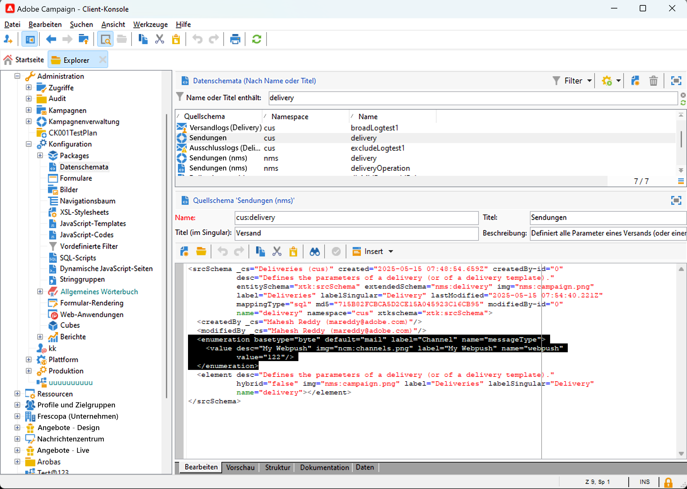
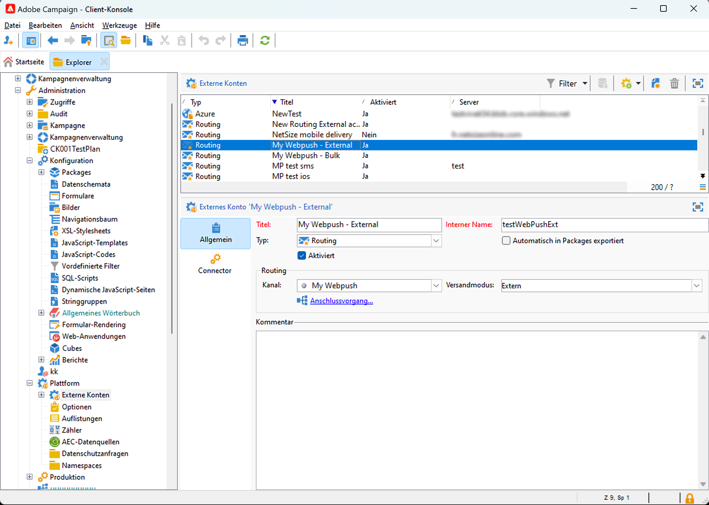
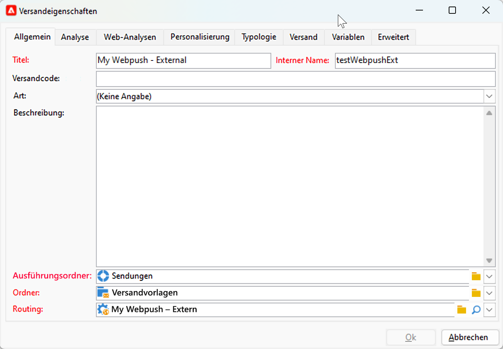

# Erste Schritte mit benutzerdefinierten Kanälen {#gs-custom-channel}

Mit Adobe Campaign können Sie benutzerdefinierte externe Kanäle oder API-Kanäle erstellen, die mit Drittanbietern integriert sind. Sie können dann Sendungen basierend auf diesen Kanälen orchestrieren und ausführen.

Die Versanderstellung und das Versenden können sowohl in der Client-Konsole als auch in der Web-Benutzeroberfläche durchgeführt werden. Die Konfiguration des benutzerdefinierten Kanals wird jedoch nur in der Client-Konsole durchgeführt.

Informationen zum Erstellen und Senden eines Versands auf der Grundlage eines benutzerdefinierten Kanals finden Sie auf dieser [Seite](https://experienceleague.adobe.com/de/docs/campaign-web/v8/msg/gs-custom-channel){target="_blank"}.

Im Folgenden finden Sie die Schritte zum Konfigurieren eines neuen benutzerdefinierten Kanals in der Client-Konsole. Diese Schritte gelten für benutzerdefinierte externe und API-Kanäle:

1. Konfigurieren des Schemas, [weitere Informationen](#configure-schema)
1. Erstellen eines neuen externen Kontos, [weitere Informationen](#create-ext-account)
1. Erstellen einer neuen Versandvorlage, [weitere Informationen](#create-template)

Benutzerdefinierte API-Kanäle erfordern eine zusätzliche Konfiguration. [Weitere Informationen](#api-additional)

## Konfigurieren des Schemas{#configure-schema}

Zunächst müssen Sie das Schema konfigurieren, um den neuen Kanal zur Liste der verfügbaren Kanäle hinzuzufügen.

1. Wählen Sie im Explorer von Campaign **Administration** > **Konfiguration** > **Datenschemata** aus.

1. Erstellen Sie eine Schemaerweiterung, um die messageType-Aufzählung um den neuen Kanal zu erweitern.

   Beispiel:

   ```
   <enumeration basetype="byte" default="mail" label="Channel" name="messageType">
   <value desc="My Webpush" img="ncm:channels.png" label="My Webpush" name="webpush"
          value="122"/>
   </enumeration>
   ```

   {zoomable="yes"}

## Erstellen eines neuen externen Kontos{#create-ext-account}

Anschließend müssen Sie ein neues externes Routing-Konto erstellen.

1. Wählen Sie im Explorer von Campaign **Administration** > **Plattform** > **Externe Konten** aus.

1. Erstellen Sie ein neues externes Konto.

1. Wählen Sie den Kanal aus und ändern Sie den Versandmodus. Wählen Sie **Extern** für benutzerdefinierte externe Kanäle und **Bulk** für benutzerdefinierte API-Kanäle aus.

   {zoomable="yes"}

## Erstellen einer neuen Versandvorlage{#create-template}

Erstellen wir nun die neue Vorlage, die mit dem neuen Kanal verknüpft ist.

1. Wählen Sie über den Explorer von Campaign **Ressourcen** > **Vorlagen** > **Versandvorlagen** aus.

1. Erstellen Sie eine neue Vorlage.

1. Klicken Sie auf **Eigenschaften** und wählen Sie den richtigen Ordner sowie das richtige Routing aus.

   {zoomable="yes"}

Der neue Kanal ist jetzt verfügbar. Sie können Sendungen auf Grundlage dieses Kanals erstellen und ausführen.

## Zusätzliche Konfiguration für benutzerdefinierte APIs{#api-additional}

Im Folgenden finden Sie die wichtigsten zusätzlichen Schritte zum Konfigurieren von benutzerdefinierten API-Kanälen.

### Schema erweitern{#api-additional-schema}

Erweitern Sie in der Client-Konsole das **Versand**-Schema mit allen zusätzlichen Eigenschaften, die für den benutzerdefinierten Kanal erforderlich sind.

Weiterführende Informationen zur Schemaerweiterung finden Sie auf dieser [Seite](../dev/extend-schema.md).

### Einrichten der benutzerdefinierten Bildschirmdefinition{#api-additional-screen}

Richten Sie in der Web-Benutzeroberfläche von Campaign die Definition des benutzerdefinierten Bildschirms ein:

1. Öffnen Sie das **Versand**-Schema und klicken Sie auf **Bildschirmbearbeitung**.

   {zoomable="yes"}

1. Wählen Sie die Registerkarte aus, die Ihrem Kanal entspricht, und definieren Sie, wie die Felder im Inhaltsbildschirm des Versands angezeigt werden. Weiterführende Informationen zur Bildschirmbearbeitung finden Sie auf dieser [Seite](https://experienceleague.adobe.com/docs/campaign-web/v8/conf/schemas.html?lang=de#fields){target="_blank"}.

   {zoomable="yes"}

1. Wählen **im Abschnitt „Vorschau für simulierten**&quot; das dedizierte JSPP aus. Dies ist optional. Dadurch wird die Vorschau im Bildschirm zur Versandsimulation aktiviert. [Weitere Informationen](#api-additional-preview)

### Konfigurieren der Vorschau{#api-additional-preview}

Hierbei handelt es sich um eine optionale Konfiguration. Wenn Sie die Vorschau in der Web-Benutzeroberfläche im Bildschirm zur Versandsimulation aktivieren möchten, müssen Sie ein dediziertes JSSP in der Client-Konsole konfigurieren.

Wenn Sie auf **Vorschau öffnen** im Bildschirm zur Versandsimulation in der Web-Benutzeroberfläche klicken, werden die folgenden Parameter in der URL übergeben:

`https://adobe.campaign.adobe.com/cus/webPushMessagePreview.jssp?deliveryId=%40ToPzTurO9aGzQxYcMArBbA%3D%3D&id=%40oF8Fi17txuLmtiOFj4OIjQ%3D%3D`

* `deliveryId`: Die Versandkennung
* `id`: Die Profilkennung

Wählen Sie in der Client-Konsole **Administration** > **Konfiguration** > **Dynamische JavaScript-Seiten** und erstellen Sie ein neues JSSP. Im Folgenden finden Sie ein Beispiel mit den Parametern, die abgerufen werden müssen.

```
<%@ page import="xtk:shared/nl.js"
%><%
  NL.require("/nl/core/shared/core.js")
    .require('/nl/core/jsspcontext.js')
    .require('/nl/core/shared/dataTypes.js')
    .require('/nl/core/schema.js');
    
  //response.setContentType("text/plain");
  var parameters = request.parameters;
  var deliveryId = decryptString(parameters.deliveryId);
  var oldUserContext = logonEscalation("neolane")
  
   var delivery = xtk.queryDef.create(<queryDef schema="nms:delivery" operation="getIfExists">
                                         <select>
                                           <node expr="[WebpushParameters/@richMediaOptions]" alias="@richMediaOptions"/>
                                           <node expr="[WebpushParameters/@mediaUrlInfo]" alias="@mediaUrlInfo"/>
                                           <node expr="[WebpushParameters/@WebpushMessageType]"/>
                                         </select>
                                         <where>
                                           <condition expr={"@id = " + NL.XTK.toXTKString(deliveryId)}/>
                                         </where>
                                       </queryDef>).ExecuteQuery();

  // Restore previous context
  logonWithContext(oldUserContext)
%>

<!DOCTYPE html ...
```

### Technische Implementierung{#api-additional-technical}

Abhängig von Ihrem benutzerdefinierten Kanal müssen Sie andere Teile der Anwendung konfigurieren, z. B.: externe Konten, Zielgruppen-Mapping, JavaScript-Code für die API usw.

