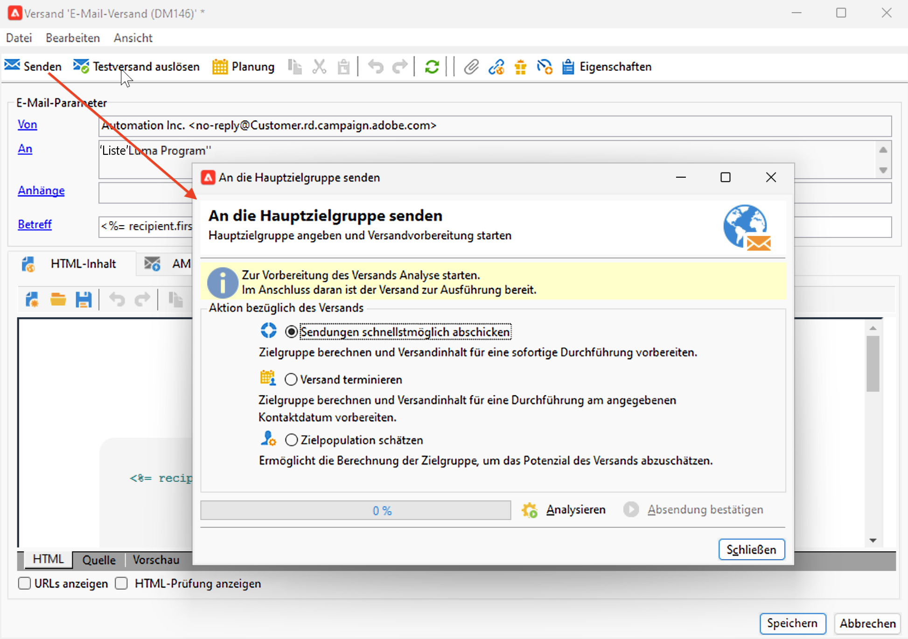
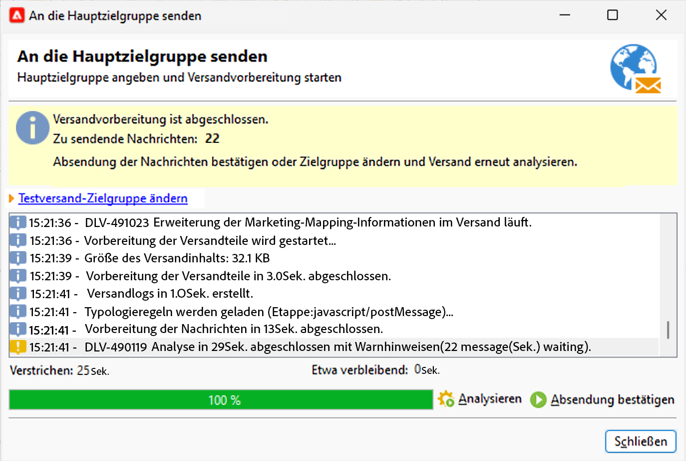
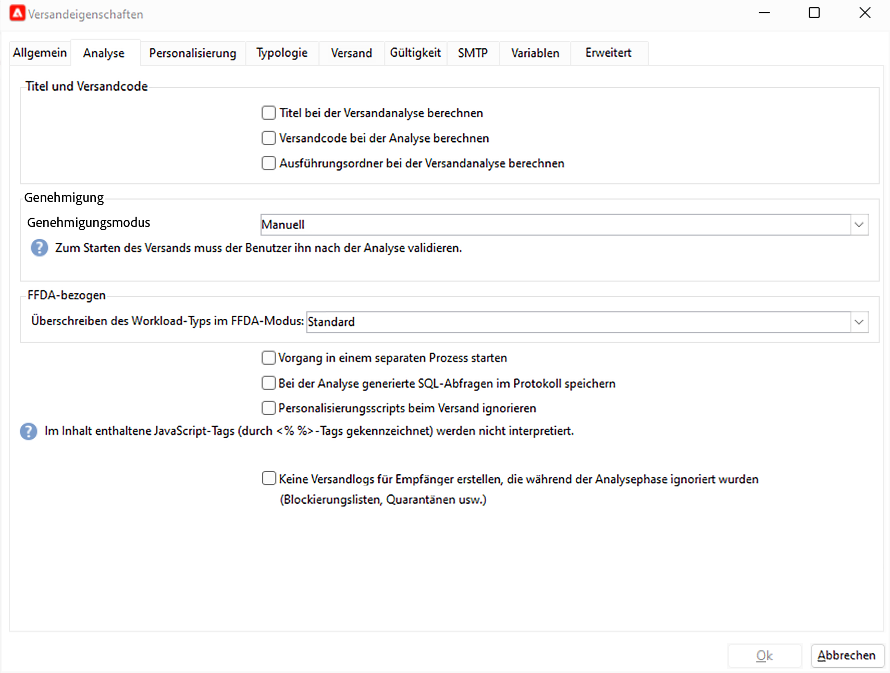

# Versandanalyse {#analyze-delivery}

Die Analyse ist der Versandvorbereitungsschritt. Sie kann gestartet werden, sobald Ihre Zielgruppe definiert wurde und der Nachrichteninhalt bereit ist und getestet wurde. Bei der Versandanalyse wird die Zielgruppe berechnet und der Versandinhalt vorbereitet. Sobald sie abgeschlossen ist, ist der Versand startbereit.

## Starten der Analyse {#start-the-analysis}

Stellen Sie zur Vorbereitung des Versands sicher, dass der Versandinhalt und die Zielgruppe definiert worden sind, und gehen Sie wie folgt vor:

1. Klicken Sie im Versandfenster auf die Schaltfläche **[!UICONTROL Senden]**.
1. Wählen Sie **[!UICONTROL Sendungen schnellstmöglich abschicken]** aus, um die Audience-Berechnung und Inhaltsvorbereitung für einen sofortigen Versand durchzuführen. Sie können den Versand auch auf einen späteren Zeitpunkt verschieben oder eine Schätzung der Population abrufen, ohne den Inhalt vorzubereiten.

   

1. Klicken Sie auf **[!UICONTROL Analysieren]**, um die Analyse manuell zu starten. Die Fortschrittsleiste zeigt den Fortschritt der Analyse an.

   Bei der Versandanalyse wird eine Reihe von Regeln zur Überprüfung angewendet. Diese Regeln werden in einer **Typologie** definiert, die auf der Registerkarte **[!UICONTROL Typologie]** in den Versandeigenschaften ausgewählt wird. Weitere Informationen zu Typologien finden Sie in [diesem Abschnitt](../../automation/campaign-opt/campaign-typologies.md).

   Standardmäßig umfasst die Analyse für E-Mails die folgenden Punkte:

   * Validierung des Betreffs,
   * Validierung von URLs und Bildern,
   * Validierung der URL-Titel,
   * Validierung des Abmelde-Links,
   * Prüfung der Testversandgröße,
   * Prüfung der Gültigkeitsdauer,
   * Prüfung der Schub-Planung.

1. Es ist jederzeit möglich, die Analyse durch Klicken auf die Schaltfläche **[!UICONTROL Stoppen]** zu unterbrechen.

   In der Vorbereitungsphase werden keine Nachrichten gesendet. Sie können die Analyse daher ohne Risiko starten oder abbrechen.

   >[!IMPORTANT]
   >
   >Beim Ausführen friert die Analyse den Versand (oder Testversand) ein. Auf jede Änderung am Versand (oder Testversand) muss eine weitere Analyse folgen, bevor sie anwendbar wird.

   Nach Abschluss der Analyse wird im oberen Bereich des Fensters angezeigt, ob die Sendungsvorbereitung abgeschlossen wurde oder ob Fehler aufgetreten sind. Alle Validierungsschritte, Warnungen und Fehler werden aufgelistet. Farbige Symbole zeigen den Nachrichtentyp an:

   * Ein blaues Symbol steht für eine informative Nachricht.
   * Ein gelbes Symbol steht für einen nicht kritischen Verarbeitungsfehler.
   * Ein rotes Symbol steht für einen kritischen Fehler, der die Durchführung des Versands verhindert.

   {width="800" align="left"}

1. Klicken Sie auf **[!UICONTROL Schließen]**, um Fehler (falls vorhanden) zu korrigieren. Nachdem Sie die Änderungen vorgenommen haben, starten Sie die Analyse neu, indem Sie auf **[!UICONTROL Analysieren]** klicken.

   >[!NOTE]
   >
   >Klicken Sie auf den Link **[!UICONTROL Hauptzielgruppe des Versands ändern]**, wenn die Anzahl der zu sendenden Nachrichten nicht Ihren Erwartungen entspricht. Mit dieser Option können Sie die Definition der Zielgruppe ändern und die Analyse neu starten.

1. Nachdem Sie das Ergebnis der Analyse geprüft haben, klicken Sie auf **[!UICONTROL Versand bestätigen]**, um die Nachricht an die Hauptzielgruppe zu senden.

## Analyseeinstellungen {#analysis-settings}

Navigieren Sie zur Registerkarte **[!UICONTROL Analyse]** in den Versandeigenschaften, um die Einstellungen für die Nachrichtenvorbereitung während der Analysephase zu definieren.

{width="800" align="left"}

Folgende Optionen stehen zur Verfügung:

* **[!UICONTROL Titel und Versandcode]**: Die Optionen in diesem Abschnitt werden in der Versandanalysephase zur Berechnung der Werte dieser Felder verwendet. Das Feld **[!UICONTROL Ausführungsordner bei der Versandanalyse berechnen]** berechnet den Namen des Ordners, der in der Analysephase diese Versandaktion enthält.

* **[!UICONTROL Validierungsmodus]**: In diesem Feld können Sie nach Abschluss der Analyse einen manuellen oder automatischen Versand definieren.

   Wenn bei der Analyse Warnungen erzeugt werden (z. B. wenn im Betreff des Versands bestimmte Zeichen mit einem Akzent versehen wurden usw.), können Sie den Versand so konfigurieren, dass festgelegt wird, ob er trotzdem ausgeführt werden soll oder nicht. Standardmäßig müssen Benutzende den Nachrichtenversand am Ende der Analysephase bestätigen: Hierbei handelt es sich um eine **manuelle** Validierung.

   In der Dropdown-Liste des entsprechenden Felds

   stehen folgende Validierungsmodi zur Verfügung:

   * **[!UICONTROL Manuell]**: Am Ende der Analysephase muss der Benutzer die Absendung bestätigen, um die Nachrichten abzuschicken. Klicken Sie dazu auf die Schaltfläche **[!UICONTROL Start]**, um den Versand zu starten.
   * **[!UICONTROL Halbautomatisch]**: Die Nachrichten werden automatisch abgeschickt, wenn die Analysephase ohne Warnhinweise abschließt.
   * **[!UICONTROL Automatisch]**: Die Nachrichten werden unabhängig vom Ergebnis der Analysephase automatisch abgeschickt.

* **[!UICONTROL Vorgang in einem separaten Prozess starten]**: Mit dieser Option können Sie die Versandanalyse in einem separaten Prozess starten. Standardmäßig verwendet die Analysefunktion den Prozess des Adobe Campaign-Anwendungsservers (web nlserver). Durch Auswählen dieser Option stellen Sie sicher, dass die Analyse auch im Falle eines Anwendungsserver-Problems vollständig durchgeführt wird.
* **[!UICONTROL Zielbestimmungs- und Personalisierungsabfragen im Protokoll speichern]**: Schreibt in der Analysephase die SQL-Abfrage-Logs in das Versandprotokoll.
* **[!UICONTROL Personalisierungsscripts beim Versand ignorieren]**: Mit dieser Option werden im HTML-Inhalt enthaltene JavaScript-Anweisungen nicht interpretiert, sondern 1:1 in den gesendeten Inhalten abgebildet. Die Anweisungen beginnen mit dem Tag `<%=`.
