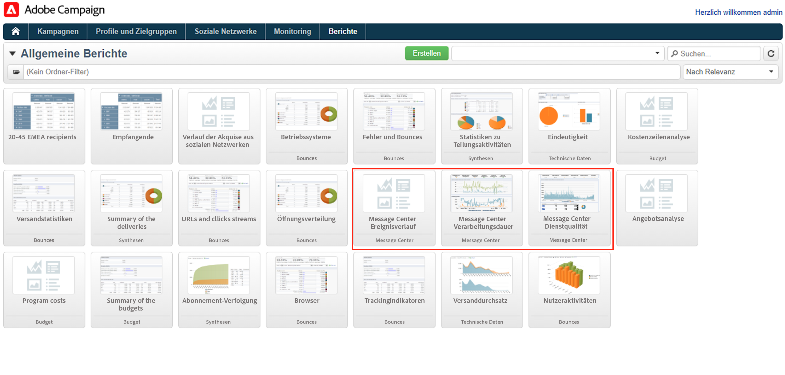
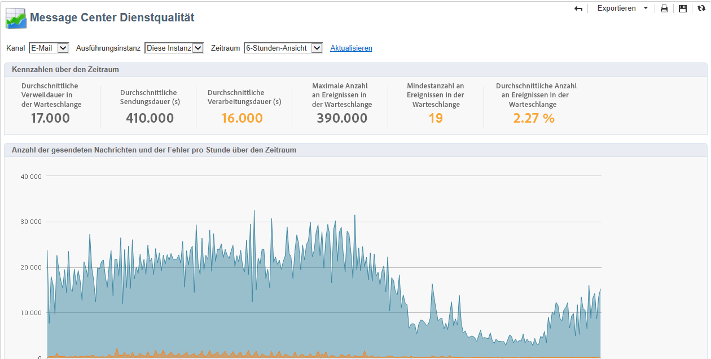
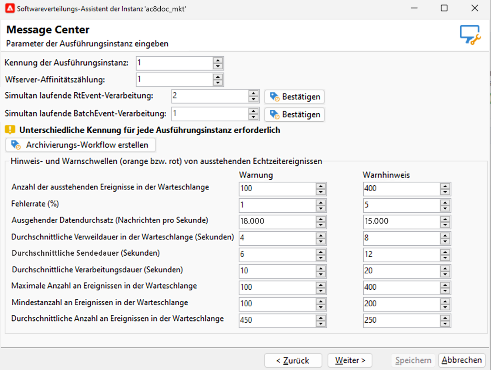

# Senden und Überwachen von Transaktionsnachrichten {#delivery-execution}

## Senden von Nachrichten{#send-transactional-msg}

Sobald die Anreicherung abgeschlossen ist und dem Ereignis eine Versandvorlage zugeordnet wurde, wird der Versand von der Ausführungsinstanz aus gestartet.

>[!NOTE]
>
>Die Transaktionsnachrichten werden vor jedem anderen Versand priorisiert.

Alle Sendungen werden im Ordner **[!UICONTROL Administration > Betreibung > Message Center > Standard > Sendungen]** gruppiert.

Sie werden standardmäßig in Unterordner nach Versandmonat unterteilt. Dies kann in den Eigenschaften der Nachrichtenvorlage geändert werden.

## Überwachen von Nachrichten {#monitor-transactional-msg}

Zur Überwachung Ihrer Transaktionsnachrichten können Sie die [Versandlogs](send.md) einsehen.

Die von der Ausführungsinstanz gesendeten Transaktionsnachrichten werden durch einen technischen Workflow (**[!UICONTROL Message Center-Ausführungsinstanz]**), der stündlich ausgeführt wird, wieder synchronisiert und in die Kontrollinstanz transferiert.

>[!NOTE]
>
>Die Sendungen sammeln die Ereignisse wöchentlich auf der Grundlage der neuesten Ereignisaktualisierung, und nicht am Erstellungsdatum des Ereignisses. Daher kann sich beim Extrahieren von Transaktionsnachrichten-Versandlogs in der Kontrollinstanz die mit jeder Versandlog-Kennung verknüpfte Versandkennung im Laufe der Zeit ändern, wenn das Log aktualisiert wird (z. B. wenn für das Ereignis ein eingehender Bounce empfangen wird).

<!--
To monitor the activity and running of the execution instance(s), see [Transactional messaging reports](transactional-messaging-reports.md).-->

## Reporting{#reporting-transactional-msg}

Adobe Campaign bietet verschiedene Berichte, mit deren Hilfe Sie die Aktivitäten der Ausführungsinstanzen steuern sowie ihre reibungslose Ausführung gewährleisten können.

Der Zugriff auf diese Message Center-Berichte erfolgt über den Tab **[!UICONTROL Berichte]** der **Kontrollinstanz**.

### Message-Center-Ereignisverlauf {#history-events}

Der **[!UICONTROL Ereignisverlauf des Message Centers]** zeigt einen Überblick über die Aktivität des Message-Center-Moduls an, d. h. die Anzahl der als Transaktionsnachrichten verarbeiteten und zugestellten Ereignisse.

Beim Öffnen des Berichts entsprechen die standardmäßig angezeigten Daten der Rate der erfolgreich gesendeten Transaktionsnachrichten. Sie können die unterschiedlichen Knoten aufklappen, um weitere Ebenen anzuzeigen. Wenn Sie mit dem Mauszeiger über eine Ebene fahren, wird sie hervorgehoben.

Sie haben zudem die Möglichkeit, für jeden Zeitraum die Daten jedes Ereignisses zu visualisieren. Die Spalte **[!UICONTROL Ereignisse]** entspricht der Anzahl von der Kontrollinstanz empfangenen Ereignisse. In der Spalte **[!UICONTROL Gesendet]** werden die als Reaktion auf die Ereignisse gesendeten personalisierten Transaktionsnachrichten berechnet.

### Message-Center-Verarbeitungsdauer {#processing-time}

Die **[!UICONTROL Verarbeitungszeit des Message Centers]** zeigt die wichtigsten Indikatoren im Zusammenhang mit der Echtzeit-Warteschlange an. Auf diesen Bericht kann auch über die Registerkarte **[!UICONTROL Überwachung]** der Kontrollinstanz zugegriffen werden.

Sie können globale Statistiken oder Statistiken anzeigen, die sich auf eine bestimmte Ausführungsinstanz beziehen. Sie können die Daten auch nach Kanal und nach einem bestimmten Zeitraum filtern.

Die im Bereich **[!UICONTROL Kennzahlen über den Zeitraum]** angezeigten Indikatoren werden für den ausgewählten Zeitraum berechnet:

* **[!UICONTROL Durchschnittliche Verweildauer in der Warteschlange]**: Durchschnittliche Dauer, die erfolgreich verarbeitete Ereignisse in Message Center verbringen. Es wird nur die Verarbeitungsdauer berücksichtigt.
* **[!UICONTROL Durchschnittliche Sendungsdauer]**: Durchschnittliche Dauer, die erfolgreich verarbeitete Ereignisse in Message Center verbringen. Es wird nur die Dauer des Versands durch die MTAs berücksichtigt.
* **[!UICONTROL Durchschnittliche Verarbeitungsdauer]**: Durchschnittliche Dauer, die erfolgreich verarbeitete Ereignisse in Message Center verbringen. Die Berechnung berücksichtigt die Verarbeitungs- und MTA-Versanddauer.
* **[!UICONTROL Maximale Anzahl an Ereignissen in der Warteschlange]**: Maximale Anzahl der zum gleichen Zeitpunkt in der Message-Center-Warteschlange vorhandenen Ereignisse.
* **[!UICONTROL Minimale Anzahl an Ereignissen in der Warteschlange]**: Minimale Anzahl der zum gleichen Zeitpunkt in der Message-Center-Warteschlange vorhandenen Ereignisse.
* **[!UICONTROL Durchschnittliche Anzahl an Ereignissen in der Warteschlange]**: Durchschnittliche Anzahl der zum gleichen Zeitpunkt in der Message-Center-Warteschlange vorhandenen Ereignisse.

>[!NOTE]
>
>Die Hinweis- und Warnschwellen (orange bzw. rot) der Kennzahlen können im Bereitstellungassistenten von Adobe Campaign konfiguriert werden. Siehe [Überwachungsschwellen](#thresholds).

### Message-Center-Dienstqualität {#service-level}

Die **[!UICONTROL Dienstqualität des Message Centers]** zeigt die Versandstatistiken der Transaktionsnachrichten sowie die Fehleraufschlüsselung. Sie können auf einen Fehlertyp klicken, um dessen Details anzuzeigen.

Auf diesen Bericht kann auch über die Registerkarte **[!UICONTROL Überwachung]** der Kontrollinstanz zugegriffen werden.

Sie können globale Statistiken oder Statistiken anzeigen, die sich auf eine bestimmte Ausführungsinstanz beziehen. Sie können die Daten auch nach Kanal und nach einem bestimmten Zeitraum filtern.

Die im Bereich **[!UICONTROL Kennzahlen über den Zeitraum]** angezeigten Indikatoren werden für den ausgewählten Zeitraum berechnet:

* **[!UICONTROL Eingehend (Ereignis/Std.)]**: Durchschnittliche Anzahl der pro Stunde neu in die Message-Center-Warteschlange eingereihten Ereignisse.
* **[!UICONTROL Eingehend (Ereignisanz.)]**: Anzahl der neuen Ereignisse in der Warteschlange.
* **[!UICONTROL Ausgehend (Durchsatz/Std.)]**: Durschnittliche Anzahl der pro Stunde erfolgreich aus Message Center entlassenen Ereignisse (über einen Versand).
* **[!UICONTROL Ausgehend (Nachrichtenanz.)]**: Anzahl der erfolgreich aus Message Center versandten Nachrichten (über einen Versand).
* **[!UICONTROL Durchschnittliche Sendungsdauer (Sekunden)]**: Durchschnittliche Dauer, die erfolgreich verarbeitete Ereignisse in Message Center verbringen. Die Berechnung berücksichtigt die Verarbeitungs- und MTA-Versanddauer.
* **[!UICONTROL Fehlerrate]**: Anzahl fehlerhafter Ereignisse im Vergleich zur Anzahl der Neuzugänge in der Message-Center-Warteschlange. Folgende Fehler werden berücksichtigt: Routing-Fehler, Ereignis ist abgelaufen (zu lange in der Warteschlange verbliebenes Ereignis), Versandfehler, vom Versand ignoriert (Quarantäne etc.).

>[!NOTE]
>
>Die Hinweis- und Warnschwellen (orange bzw. rot) der Kennzahlen können im Bereitstellungassistenten von Adobe Campaign konfiguriert werden. Siehe [Überwachungsschwellen](#thresholds).

### Schwellenwerte überwachen {#thresholds}

Sie können die Schwellenwerte für Warnung (orange) und Benachrichtigung (rot) der Indikatoren konfigurieren, die in den Berichten **Message Center Service-Level** und **Message-Center-Verarbeitungszeit** erscheinen.

Gehen Sie dazu wie folgt vor:

1. Öffnen Sie den Bereitstellungsassistenten auf der **Ausführungsinstanz** und navigieren Sie zur Seite **[!UICONTROL Message Center]**.
1. Verwenden Sie die Pfeile, um die Schwellenwerte zu ändern.

   
