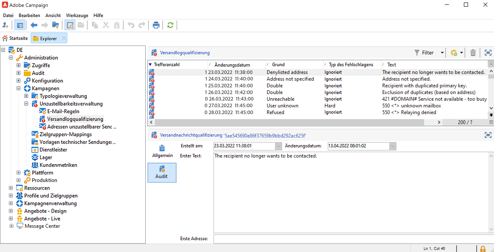

# Ursachen für das Fehlschlagen von Sendungen{#delivery-failures}

Bounces sind das Ergebnis eines Versandversuchs und -fehlers, bei dem der ISP Fehlermeldungen zurückgibt. Die Bounce-Verarbeitung ist ein wichtiger Bestandteil der Listenhygiene. Nach mehrmaligen Bounces einer E-Mail wird sie von diesem Prozess markiert und unterdrückt. Dadurch wird verhindert, dass Systeme weiterhin E-Mails mit ungültigen E-Mail-Adressen versenden. Bounces sind eines der wichtigsten Kriterien, mit denen ISPs die IP-Reputation bestimmen. Es ist wichtig, diese Metrik im Auge zu behalten. Die häufigste Methode zur Messung des Versands von Marketing-Nachrichten ist wahrscheinlich der Vergleich von „Zugestellt“ mit „Bounce“. Je höher der Prozentsatz der zugestellten Mails ist, desto besser.

Wenn eine Nachricht nicht an ein Profil gesendet werden kann, sendet der Remote-Server automatisch eine Fehlermeldung an Adobe Campaign. Dieser Fehler wird qualifiziert, um festzustellen, ob die E-Mail-Adresse, die Telefonnummer oder das Gerät unter Quarantäne gestellt werden soll. Siehe [Bounce-Message-Verwaltung](#bounce-mail-qualification).

Nach dem Versand einer Nachricht können Sie den Versandstatus für jedes Profil sowie den damit verbundenen Fehlertyp und die Ursache in den Versand-Logs einsehen.

Wenn eine E-Mail-Adresse unter Quarantäne gestellt wird oder sich ein Profil auf der Blockierungsliste befindet, wird der Empfänger bei der Versandvorbereitung ausgeschlossen. Ausgeschlossene Nachrichten werden im Versand-Dashboard aufgeführt.

## Warum ist der Nachrichtenversand fehlgeschlagen? {#delivery-failure-reasons}

Es gibt zwei Typen von fehlgeschlagenen Sendungen. Jeder Fehlertyp bestimmt, ob eine Adresse in [Quarantäne](quarantines.md#quarantine-reason) gestellt wird oder nicht.


* **Hardbounces**
Hardbounces sind dauerhafte Fehler, die erzeugt werden, wenn ein ISP feststellt, dass eine E-Mail nicht an eine Abonnentenadresse zugestellt werden kann. Innerhalb von Adobe Campaign werden Hardbounces, die als nicht zustellbar kategorisiert sind, zur Quarantäne hinzugefügt, was bedeutet, dass kein erneuter Versandversuch stattfindet. In manchen Fällen wird ein Hardbounce ignoriert, wenn die Ursache des Fehlers unbekannt ist.

   Im Folgenden finden Sie einige gängige Beispiele für Hardbounces: Adresse existiert nicht, Konto deaktiviert, fehlerhafte Syntax, ungültige Domain


* **Softbounces**
Softbounces sind temporäre Fehler, die von ISPs bei Versandproblemen von E-Mails erzeugt werden. Bei Softbounces werden mehrfache erneute Zustellversuche unternommen (abhängig von den benutzerdefinierten oder vorkonfigurierten Versandeinstellungen), um einen erfolgreichen Versand durchzuführen. Adressen, die kontinuierlich einen Softbounce verursachen, werden erst dann unter Quarantäne gestellt, wenn eine maximale Anzahl erneuter Zustellungen versucht wurde (was wiederum je nach Einstellungen variiert).

   Einige häufige Ursachen für Softbounces sind: Postfach voll, empfangender E-Mail-Server heruntergefahren, Probleme mit der Versender-Reputation.


**Ignoriert**: Vorübergehender Fehler, beispielsweise &quot;Out of office&quot; oder technischer Fehler bei Absendern vom Typ &quot;Postmaster&quot;.


### Qualifizierung von Bounce-Mails {#bounce-mail-qualification}

Die von Campaign zur Qualifizierung von fehlgeschlagenen Sendungen verwendeten Regeln werden im Knoten **[!UICONTROL Administration > Campaign Management > Unzustellbarkeitsverwaltung > Versandlogqualifizierung]** aufgelistet. Sie ist nicht vollständig und wird regelmäßig von Adobe Campaign aktualisiert und kann auch vom Benutzer verwaltet werden.


Die Bounce-Qualifizierungen in der Tabelle **[!UICONTROL Versandlogqualifizierung]** werden nicht für Fehlernachrichten bei **synchronen** Sendungen verwendet. Momentum bestimmt den Bounce-Typ und die Qualifizierung und sendet diese Informationen an Campaign zurück.

**Asynchrone** Bounces werden vom InMail-Prozess über die Regeln für **[!UICONTROL Eingehende E-Mails]** qualifiziert.

Die vom Remote-Server beim ersten Auftreten dieses Fehlertyps zurückgegebene Nachricht wird in der Spalte **[!UICONTROL Erster Text]** der Registerkarte **[!UICONTROL Audit]** angezeigt.



Adobe Campaign filtert diese Nachricht, um den variablen Inhalt (wie IDs, Daten, E-Mail-Adressen, Telefonnummern usw.) zu löschen, und zeigt das gefilterte Ergebnis in der Spalte **[!UICONTROL Text]** an. Die Variablen werden durch **`#xxx#`** ersetzt, mit Ausnahme der Adressen, die durch ersetzt **`*`** werden.

Dadurch können alle Fehlschläge desselben Typs zusammengefasst werden und mehrfache Einträge für ähnliche Fehler in die Versandlogqualifizierungs-Tabelle werden vermieden.

>[!NOTE]
>
>Im Feld **[!UICONTROL Trefferanzahl]** wird die Anzahl der Vorkommnisse der Nachricht in der Liste angezeigt. Die maximale Anzahl ist 100 000. Sie können das Feld bearbeiten, wenn Sie es beispielsweise zurücksetzen möchten.

Folgende Qualifikationsstatus von Bounce Messages treten auf:

* **[!UICONTROL Zu qualifizieren]**: die Bounce Message konnte nicht qualifiziert werden. Die Qualifizierung muss dem Zustellbarkeits-Team zugewiesen werden, um eine effiziente Zustellbarkeit der Plattform zu gewährleisten. Nicht qualifizierte Bounce Messages werden nicht zur Anreicherung der Liste mit E-Mail-Regeln herangezogen.
* **[!UICONTROL Beibehalten]**: Die Bounce Message wurde qualifiziert und wird vom Workflow **Zustellbarkeit** verwendet, um mit den existierenden E-Mail-Regeln verglichen zu werden und eventuell die Liste zu ergänzen.
* **[!UICONTROL Ignorieren]**: Die Bounce Message wird ignoriert, was bedeutet, dass diese Bounce Message nie dazu führt, dass die Adresse des Empfängers unter Quarantäne gestellt wird. Sie wird vom Workflow **Zustellbarkeit** nicht verwendet und auch nicht an Client-Instanzen gesendet.


>[!NOTE]
>
>Bei Ausfall eines ISP werden über Campaign gesendete E-Mails fälschlicherweise als Bounces gekennzeichnet. Um dies zu korrigieren, müssen Sie die Bounce-Qualifizierung aktualisieren.


## Verwaltung von erneuten Zustellversuchen {#retries}

Wenn der Nachrichtenversand aufgrund eines temporären Fehlers fehlschlägt (**Soft** oder **Ignoriert**), versucht Campaign eine erneute Zustellung. Diese weiteren Zustellversuche können bis zum Ende der Versandlaufzeit durchgeführt werden. Die Anzahl und Häufigkeit der weiteren Zustellversuche werden von Momentum basierend auf Typ und Schweregrad der Bounce-Antworten, die vom ISP der Nachricht zurückgegeben werden, festgelegt.

Standardmäßig sind innerhalb der ersten 24 Stunden fünf Versuche im Abstand von mindestens einer Stunde konfiguriert, an den vier folgenden Tagen je ein Versuch. Die Anzahl weiterer Zustellversuche kann global oder für jeden Versand oder jede Versandvorlage geändert werden. Wenn Sie die Versandlaufzeit und weitere Zustellversuche anpassen müssen, wenden Sie sich an den Support von Adobe.

## Synchrone und asynchrone Fehler {#synchronous-and-asynchronous-errors}

Ein Nachrichtenversand kann sofort fehlschlagen. In diesem Fall wird dies als synchroner Fehler qualifiziert. Wenn der Nachrichtenversand zu einem späteren Zeitpunkt fehlschlägt, ist der Fehler asynchron.

Diese Fehlertypen werden wie folgt verwaltet:

* **Synchroner Fehler**: Der vom Adobe Campaign-Versand-Server angesprochene Remote-Server gibt sofort eine Fehlermeldung zurück. Die Nachricht kann nicht an den Server des Profils gesendet werden. Adobe Campaign qualifiziert jeden Fehler, um festzustellen, ob die betroffenen E-Mail-Adressen unter Quarantäne gestellt werden sollten. Siehe [Bounce-Message-Qualifizierung](#bounce-mail-qualification).

* **Asynchroner Fehler**: Eine Bounce Message oder ein Statusbericht (SR) wird vom empfangenden Server verzögert zurückgesendet. Dieser Fehler wird mit einer mit dem Fehler verbundenen Bezeichnung qualifiziert. Asynchrone Fehler können bis zu eine Woche nach einem Versand auftreten.

   >[!NOTE]
   >
   >Für Managed Services-Benutzer erfolgt die Konfiguration des Bounce-Postfachs durch Adobe.

   Die Feedback-Schleife funktioniert wie Bounce-E-Mails: Wenn ein Benutzer eine E-Mail als Spam kennzeichnet, können Sie E-Mail-Regeln in Adobe Campaign so konfigurieren, dass alle Sendungen an diesen Benutzer blockiert werden. Die Adressen dieser Benutzer befinden sich dann auf der Blockierungsliste, obwohl sie nicht auf den Abmelde-Link geklickt haben. Adressen befinden sich in der Blockierungsliste der Quarantänetabelle (**NmsAddress**) und nicht der Empfängertabelle (**NmsRecipient**). Im [Handbuch von Adobe mit Best Practices für die Zustellbarkeit](https://experienceleague.adobe.com/docs/deliverability-learn/deliverability-best-practice-guide/transition-process/infrastructure.html?lang=de#feedback-loops) erfahren Sie mehr über den Mechanismus der Feedback-Schleife.


## E-Mail-Fehlertypen {#email-error-types}

Für den E-Mail-Kanal sind im Folgenden mögliche Ursachen für einen fehlgeschlagenen Versand aufgeführt.

<table> 
 <tbody> 
  <tr> 
   <td> Bezeichnung des Fehlers </td> 
   <td> Fehlertyp </td> 
   <td> Technischer Wert </td> 
   <td> Beschreibung </td> 
  </tr> 
  <tr> 
   <td> Konto deaktiviert </td> 
   <td> Softbounce / Hardbounce </td> 
   <td> 4 </td> 
   <td> Das mit der Adresse verknüpfte Konto ist nicht mehr aktiv. Wenn das Konto längere Zeit nicht abgefragt wird, kann es vom Internetanbieter geschlossen werden, was den Versand an diese Empfängeradresse unmöglich macht. Wenn das Konto vorübergehend wegen einer sechsmonatigen Inaktivität deaktiviert ist und wieder aktiviert werden kann, wird der Status "Mit Fehlern" zugewiesen und der Zustellversuch wird wiederholt, bis der Fehlerzähler 5 erreicht hat. Wenn aus den Fehlern hervorgeht, dass das Konto permanent deaktiviert ist, wird es sofort unter Quarantäne gestellt.<br /> </td> 
  </tr> 
  <tr> 
   <td> Adresse in Quarantäne </td> 
   <td> Hard </td> 
   <td> 9 </td> 
   <td> Die Adresse wurde unter Quarantäne gestellt.<br /> </td> 
  </tr> 
  <tr> 
   <td> Adresse nicht angegeben </td> 
   <td> Hard </td> 
   <td> 7 </td> 
   <td> Empfängeradresse fehlt.<br /> </td> 
  </tr> 
  <tr> 
   <td> Adresse schlechter Qualität </td> 
   <td> Ignoriert </td> 
   <td> 14 </td> 
   <td> Qualitätsindex der Postanschrift ist zu niedrig.<br /> </td> 
  </tr> 
  <tr> 
   <td> Adresse, die auf die Blockierungsliste gesetzt wurde </td> 
   <td> Hard </td> 
   <td> 8 </td> 
   <td> Die Adresse wurde zum Zeitpunkt des Versands der Blockierungsliste hinzugefügt. Dieser Status wird zum Importieren von Daten aus externen Listen und externen Systemen in die Quarantäneliste von Adobe Campaign verwendet.<br /> </td> 
  </tr> 
  <tr> 
   <td> Kontrollgruppenadresse </td> 
   <td> Ignoriert </td> 
   <td> 127 </td> 
   <td> Empfängeradresse ist Teil der Kontrollgruppe.<br /> </td> 
  </tr> 
  <tr> 
   <td> Doppelt </td> 
   <td> Ignoriert </td> 
   <td> 10 </td> 
   <td> Empfängeradresse bereits im Versand enthalten.<br /> </td> 
  </tr> 
  <tr> 
   <td> Fehler ignoriert </td> 
   <td> Ignoriert </td> 
   <td> 25 </td> 
   <td> Die Adresse befindet sich auf der Zulassungsliste. Der Fehler wird daher ignoriert und eine E-Mail gesendet.<br /> </td> 
  </tr> 
  <tr> 
   <td> Ausgeschlossen nach Schlichtung </td> 
   <td> Ignoriert </td> 
   <td> 12 </td> 
   <td> Der Empfänger wurde durch Anwendung einer Typologieregel vom Typ 'Schlichtung' ausgeschlossen.<br /> </td> 
  </tr> 
  <tr> 
   <td> Von einer SQL-Regel ausgeschlossen </td> 
   <td> Ignoriert </td> 
   <td> 11 </td> 
   <td> Der Empfänger wurde durch Anwendung einer Typologieregel vom Typ 'SQL' ausgeschlossen.<br /> </td> 
  </tr> 
  <tr> 
   <td> Ungültige Domain </td> 
   <td> Soft </td> 
   <td> 2 </td> 
   <td> Die Domain der E-Mail-Adresse ist fehlerhaft oder existiert nicht mehr. An dieses Profil werden wiederholte Zustellversuche unternommen, bis die Fehleranzahl 5 erreicht. Danach wird der Datensatz in den Quarantänestatus versetzt und die Zustellversuche werden eingestellt.<br /> </td> 
  </tr> 
  <tr> 
   <td> Postfach voll </td> 
   <td> Soft </td> 
   <td> 5 </td> 
   <td> Das Postfach des Benutzers ist voll und kann keine Nachrichten mehr aufnehmen. An dieses Profil werden wiederholte Zustellversuche unternommen, bis die Fehleranzahl 5 erreicht. Danach wird der Datensatz in den Quarantänestatus versetzt und die Zustellversuche werden eingestellt.<br /> Dieser Fehlertyp wird von einem Bereinigungsprozess verwaltet. Die Adresse erhält nach 30 Tagen wieder einen gültigen Status.<br />Warnung: Damit die Adresse automatisch aus der Quarantäne genommen werden kann, muss der technische Workflow für die Datenbankbereinigung gestartet sein.<br /> </td> 
  </tr> 
  <tr> 
   <td> Nicht angemeldet </td> 
   <td> Ignoriert </td> 
   <td> 6 </td> 
   <td> Das Mobiltelefon des Empfängers war beim Versand der Nachricht ausgeschaltet oder verfügte über keinen Netzempfang.<br /> </td> 
  </tr> 
  <tr> 
   <td> Unbestimmt </td> 
   <td> Unbestimmt </td> 
   <td> 0 </td> 
   <td> Die Adresse wird noch qualifiziert, da der Fehler noch nicht inkrementiert wurde. Dieser Fehlertyp tritt auf, wenn der Server eine bis dahin unbekannte Fehlermeldung sendet: Hierbei kann es sich um einen einmaligen Fehler handeln. Sollte er sich jedoch wiederholen, wird der Fehlerzähler erhöht, was die zuständigen technischen Mitarbeiter auf das Problem aufmerksam macht. Sie können dann über den Knoten <span class="uicontrol">Administration</span> / <span class="uicontrol">Campaign Management</span> / <span class="uicontrol">Unzustellbarkeitsverwaltung</span> in der Baumstruktur eine Nachrichtenanalyse durchführen und diesen Fehler qualifizieren.<br /> </td> 
  </tr> 
  <tr> 
   <td> Kommt nicht für die Angebote infrage </td> 
   <td> Ignoriert </td> 
   <td> 16 </td> 
   <td> Der Empfänger kommt für die Angebote im Versand nicht infrage.<br /> </td> 
  </tr> 
  <tr> 
   <td> Zurückgewiesen </td> 
   <td> Softbounce / Hardbounce </td> 
   <td> 20 </td> 
   <td> Die Adresse wurde wegen eines Sicherheits-Feedbacks unter Quarantäne gestellt, da die Nachricht als Spam gemeldet wurde. Je nach Fehler wird der Zustellversuch wiederholt, bis der Fehlerzähler 5 erreicht hat, oder die Adresse wird sofort unter Quarantäne gestellt.<br /> </td> 
  </tr> 
  <tr> 
   <td> Größe der Zielgruppe begrenzt </td> 
   <td> Ignoriert </td> 
   <td> 17 </td> 
   <td> Maximale Versandgröße wurde für den Empfänger erreicht.<br /> </td> 
  </tr> 
  <tr> 
   <td> Adresse nicht qualifiziert </td> 
   <td> Ignoriert </td> 
   <td> 15 </td> 
   <td> Postanschrift wurde nicht qualifiziert<br /> </td> 
  </tr> 
  <tr> 
   <td> Unerreichbar </td> 
   <td> Softbounce / Hardbounce </td> 
   <td> 3 </td> 
   <td> In der Verteilungskette der Nachricht ist ein Fehler aufgetreten. Hierbei kann es sich um einen Vorfall beim SMTP-Server oder eine zeitweilig unerreichbare Domain handeln etc. Je nach Fehler wird der Zustellversuch wiederholt, bis der Fehlerzähler 5 erreicht hat, oder die Adresse wird sofort unter Quarantäne gestellt.<br /> </td> 
  </tr> 
  <tr> 
   <td> Unbekannter Nutzer </td> 
   <td> Hard </td> 
   <td> 1 </td> 
   <td> Die Adresse existiert nicht. An dieses Profil werden keine weiteren Zustellversuche unternommen.<br /> </td> 
  </tr> 
 </tbody> 
</table>


## Fehlertypen bei Push-Benachrichtigungen {#push-error-types}

Für den Mobile-App-Kanal sind unten mögliche Ursachen für einen fehlgeschlagenen Versand aufgeführt.

### Quarantäne bei iOS-Geräten {#ios-quarantine}

Das HTTP/V2-Protokoll ermöglicht für jeden Push-Versand ein direktes Feedback zu dessen Status. Bei Verwendung des Connectors für das HTTP/V2-Protokoll wird der Feedback-Dienst des Workflows **[!UICONTROL mobileAppOptOutMgt]** nicht mehr aufgerufen. Ein Token gilt als abgemeldet, wenn eine Mobile App deinstalliert oder neu installiert wird.

Wenn der APNS für eine Nachricht den Status &quot;abgemeldet&quot; zurückgibt, wird der Ziel-Token direkt unter Quarantäne gestellt.

<table> 
 <tbody> 
  <tr> 
   <td> <strong>Szenario</strong><br /> </td> 
   <td> <strong>Status</strong><br /> </td> 
   <td> <strong>Fehlernachricht</strong><br /> </td> 
   <td> <strong>Typ des Fehlschlagens</strong><br /> </td> 
   <td> <strong>Grund des Fehlschlagens</strong><br /> </td> 
   <td> <strong>Erneut versuchen</strong><br /> </td> 
  </tr> 
  <tr> 
   <td> Zielgerät eingeschaltet<br /> </td> 
   <td> OK<br /> </td> 
   <td> </td> 
   <td> </td> 
   <td> </td> 
   <td> </td> 
  </tr> 
  <tr> 
   <td> Zielgerät ausgeschaltet<br /> </td> 
   <td> OK<br /> </td> 
   <td> </td> 
   <td> </td> 
   <td> </td> 
   <td> </td> 
  </tr> 
  <tr> 
   <td> Empfänger deaktiviert Benachrichtigungen für die Anwendung<br /> </td> 
   <td> OK<br /> </td> 
   <td> </td> 
   <td> </td> 
   <td> </td> 
   <td> </td> 
  </tr> 
  <tr> 
   <td> Nachrichtenerstellung/Analysephase - Nutzdaten zu groß<br /> </td> 
   <td> Fehlgeschlagen<br /> </td> 
   <td> Nutzdaten zu lang<br /> </td> 
   <td> Soft<br /> </td> 
   <td> Zurückgewiesen<br /> </td> 
   <td> Nein<br /> </td> 
  </tr> 
  <tr> 
   <td> Nachrichtenerstellung/Analysephase - Problem mit Inhalt mit unerwartetem Format<br /> </td> 
   <td> Fehlgeschlagen<br /> </td> 
   <td> Verschiedene Fehlernachrichten je nach Fehler<br /> </td> 
   <td> Soft<br /> </td> 
   <td> Unbestimmt<br /> </td> 
   <td> Nein<br /> </td> 
  </tr> 
  <tr> 
   <td> Problem mit Zertifikat (Passwort, Beschädigung etc.) und Fehler bei Testverbindung mit APNS<br /> </td> 
   <td> Fehlgeschlagen<br /> </td> 
   <td> Verschiedene Fehlernachrichten je nach Fehler<br /> </td> 
   <td> Soft<br /> </td> 
   <td> Zurückgewiesen<br /> </td> 
   <td> Nein<br /> </td> 
  </tr> 
  <tr> 
   <td> Netzwerkverbindung während des Versands abgebrochen<br /> </td> 
   <td> Fehlgeschlagen<br /> </td> 
   <td> Verbindungsfehler<br /> </td> 
   <td> Unbestimmt<br /> </td> 
   <td> Unerreichbar<br /> </td> 
   <td> Ja<br /> </td> 
  </tr> 
  <tr> 
   <td> Zurückweisung von APNS-Nachricht: Abmeldung<br /> Benutzer hat die Mobile App entfernt oder das Token ist abgelaufen<br /> </td> 
   <td> Fehlgeschlagen<br /> </td> 
   <td> Abgemeldet<br /> </td> 
   <td> Hard<br /> </td> 
   <td> Unbekannter Nutzer<br /> </td> 
   <td> Nein<br /> </td> 
  </tr> 
  <tr> 
   <td> Zurückweisung von APNS-Nachricht: alle anderen Fehler<br /> </td> 
   <td> Fehlgeschlagen<br /> </td> 
   <td> Der Grund für Zurückweisung wird in der Fehlernachricht angegeben<br /> </td> 
   <td> Soft<br /> </td> 
   <td> Zurückgewiesen<br /> </td> 
   <td> Nein<br /> </td> 
  </tr> 
 </tbody> 
</table>

### Quarantäne bei Android-Geräten {#android-quarantine}

**Für Android V1**

Für jede Benachrichtigung erhält Adobe Campaign die synchronen Fehler direkt vom FCM-Server. Adobe Campaign verarbeitet diese unmittelbar und erstellt Hard- und Softbounces entsprechend des Schweregrads des Fehlers. Es können weitere Zustellversuche unternommen werden:

* Nutzdatenlänge überschritten, Verbindungsproblem, Problem mit Dienstverfügbarkeit: Neuversuch wird unternommen, Softbounce, Grund für den Fehler ist **[!UICONTROL Abgelehnt]**.
* Gerätequote überschritten: kein Neuversuch, Softbounce, Grund für Fehler ist **[!UICONTROL Abgelehnt]**.
* Ungültiger oder abgemeldeter Token, unerwarteter Fehler, Problem mit Absenderkonto: kein Neuversuch, Hardbounce, Grund für Fehler ist **[!UICONTROL Abgelehnt]**.

Der **[!UICONTROL mobileAppOptOutMgt]**-Workflow wird alle sechs Stunden zur Aktualisierung der **AppSubscriptionRcp**-Tabelle durchgeführt. Für jeden abgemeldeten oder nicht mehr gültigen Token wird das Feld **Deaktiviert** auf **Wahr** gesetzt und das mit dem Gerät verknüpfte Abonnement wird automatisch von künftigen Sendungen ausgeschlossen.

Während der Versandanalyse werden alle Geräte, die von der Zielgruppe ausgeschlossen werden, automatisch zur Tabelle **excludeLogAppSubRcp** hinzugefügt.

>[!NOTE]
>
>Im Folgenden finden Sie die unterschiedlichen Fehlertypen für den Baidu-Connector:
>
>* Verbindungsproblem zu Beginn des Versands: Fehlertyp **[!UICONTROL Undefiniert]**, Grund **[!UICONTROL Unerreichbar]**, Neuversuch wird unternommen.
>* Verbindung während des Versands unterbrochen: Softbounce, Grund für den Fehler **[!UICONTROL Abgelehnt]**, Neuversuch wird unternommen.
>* Während des Versands von Baidu synchroner Fehler zurückgegeben: Hardbounce, Grund für den Fehler **[!UICONTROL Abgelehnt]**, es wird kein Neuversuch unternommen.
>
>Adobe Campaign kontaktiert den Baidu-Server alle zehn Minuten, um den Status der versendeten Nachrichten abzurufen, und aktualisiert die Versandlogs. Wenn eine Nachricht als gesendet gemeldet wird, ändert sich der Status der Nachricht in den Versandlogs in **[!UICONTROL Erhalten]**. Wenn Baidu einen Fehler meldet, wird der Status auf **[!UICONTROL Fehlgeschlagen]** gesetzt.

**Für Android V2**

Der Quarantänemechanismus für Android V2 verwendet denselben Prozess wie für Android V1. Dasselbe gilt für die Aktualisierung von Anmeldungen und Ausschlüssen. Weiterführende Informationen hierzu finden Sie im Abschnitt [Android V1](#android-quarantine).

<table> 
 <tbody> 
  <tr> 
   <td> <strong>Szenario</strong><br /> </td> 
   <td> <strong>Status</strong><br /> </td> 
   <td> <strong>Fehlernachricht</strong><br /> </td> 
   <td> <strong>Typ des Fehlschlagens</strong><br /> </td> 
   <td> <strong>Grund des Fehlschlagens</strong><br /> </td> 
   <td> <strong>Erneut versuchen</strong><br /> </td> 
  </tr> 
  <tr> 
   <td> Nachrichtenerstellung/Analysephase: unzulässige Schlüsselwörter in den benutzerdefinierten Feldern verwendet<br /> </td> 
   <td> Fehlgeschlagen<br /> </td> 
   <td> Folgende Schlüsselwörter dürfen nicht benutzt werden: {1}<br /> </td> 
   <td> Soft<br /> </td> 
   <td> </td> 
   <td> Nein<br /> </td> 
  </tr> 
  <tr> 
   <td> Nachrichtenerstellung/Analysephase: Nutzdaten zu groß<br /> </td> 
   <td> Fehlgeschlagen<br /> </td> 
   <td> Die Benachrichtigung ist zu groß: {1} Bit statt maximal {2}.<br /> </td> 
   <td> Soft<br /> </td> 
   <td> Zurückgewiesen<br /> </td> 
   <td> Nein<br /> </td> 
  </tr> 
  <tr> 
   <td> Netzwerkverbindung während des Versands abgebrochen<br /> </td> 
   <td> Fehlgeschlagen<br /> </td> 
   <td> Keine Antwort von Firebase Cloud Messaging für die Adresse: {1}<br /> </td> 
   <td> Soft<br /> </td> 
   <td> Unerreichbar<br /> </td> 
   <td> Ja<br /> </td> 
  </tr> 
  <tr> 
   <td> Zurückweisung von FCM-Nachricht: Der FCM-Server ist vorübergehend nicht verfügbar (z. B. durch Timeouts). <br /> </td> 
   <td> Fehlgeschlagen<br /> </td> 
   <td> Firebase Cloud Messaging ist zurzeit nicht verfügbar<br /> </td> 
   <td> Soft<br /> </td> 
   <td> Unerreichbar<br /> </td> 
   <td> Ja<br /> </td> 
  </tr> 
  <tr> 
   <td> Zurückweisung von FCM-Nachricht: Fehler bei der Authentifizierung des Absenderkontos<br /> </td> 
   <td> Fehlgeschlagen<br /> </td> 
   <td> Entwicklerkonto konnte nicht identifiziert werden, bitte Kennung und Kennwort prüfen.<br /> </td> 
   <td> Soft<br /> </td> 
   <td> Zurückgewiesen<br /> </td> 
   <td> Nein<br /> </td> 
  </tr> 
  <tr> 
   <td> Zurückweisung von FCM-Nachricht: Gerätequote überschritten<br /> </td> 
   <td> Fehlgeschlagen<br /> </td> 
   <td> </td> 
   <td> Soft<br /> </td> 
   <td> Zurückgewiesen<br /> </td> 
   <td> Ja<br /> </td> 
  </tr> 
  <tr> 
   <td> Zurückweisung von FCM-Nachricht: ungültige Registrierung/nicht registriert<br /> </td> 
   <td> Fehlgeschlagen<br /> </td> 
   <td> </td> 
   <td> Hard<br /> </td> 
   <td> Unbekannter Nutzer<br /> </td> 
   <td> Nein<br /> </td> 
  </tr> 
  <tr> 
   <td> Zurückweisung von FCM-Nachricht: alle anderen Fehler<br /> </td> 
   <td> Fehlgeschlagen<br /> </td> 
   <td> Der Firebase Cloud Messaging Server hat einen unerwarteten Fehlercode ausgegeben: {1} </td> 
   <td> </td> 
   <td> Zurückgewiesen<br /> </td> 
   <td> Nein<br /> </td> 
  </tr> 
    <tr> 
   <td> Zurückweisung von FCM-Nachricht: ungültiges Argument<br /> </td> 
   <td> Fehlgeschlagen<br /> </td> 
   <td> INVALID_ARGUMENT </td> 
   <td> Ignoriert</td> 
   <td> Unbestimmt<br /> </td> 
   <td> Nein<br /> </td> 
  </tr>
    <tr> 
   <td> Zurückweisung von FCM-Nachricht: Authentifizierungsfehler bei Drittanbieter<br /> </td> 
   <td> Fehlgeschlagen<br /> </td> 
   <td> THIRD_PARTY_AUTH_ERROR </td> 
   <td> Ignoriert</td>
   <td> Zurückgewiesen<br /> </td> 
   <td> Ja<br /> </td> 
  </tr>
    <tr> 
   <td> Zurückweisung von FCM-Nachricht: Sender ID stimmt nicht überein<br /> </td> 
   <td> Fehlgeschlagen<br /> </td> 
   <td> SENDER_ID_MISMATCH </td> 
   <td> Soft</td>
   <td> Unbekannter Nutzer<br /> </td> 
   <td> Nein<br /> </td> 
  </tr>
    <tr> 
   <td> Zurückweisung von FCM-Nachricht: abgemeldet<br /> </td> 
   <td> Fehlgeschlagen<br /> </td>
   <td> UNREGISTERED </td> 
   <td> Hard</td> 
   <td> Unbekannter Nutzer<br /> </td> 
   <td> Nein<br /> </td> 
  </tr>
    <tr> 
   <td> Zurückweisung von FCM-Nachricht: intern<br /> </td> 
   <td> Fehlgeschlagen<br /> </td> 
   <td> INTERNAL </td> 
   <td> Ignoriert</td> 
   <td> Zurückgewiesen<br /> </td> 
   <td> Ja<br /> </td> 
  </tr>
    <tr> 
   <td> Zurückweisung von FCM-Nachricht: nicht verfügbar<br /> </td> 
   <td> Fehlgeschlagen<br /> </td> 
   <td> UNAVAILABLE</td> 
   <td> Ignoriert</td> 
   <td> Zurückgewiesen<br /> </td> 
   <td> Ja<br /> </td> 
  </tr>
    <tr> 
   <td> Zurückweisung von FCM-Nachricht: unerwarteter Fehlercode<br /> </td> 
   <td> Fehlgeschlagen<br /> </td> 
   <td> Unerwarteter Fehlercode</td> 
   <td> Ignoriert</td> 
   <td> Zurückgewiesen<br /> </td> 
   <td> Nein<br /> </td> 
  </tr>
  <tr> 
   <td> Authentifizierung: Verbindungsproblem<br /> </td> 
   <td> Fehlgeschlagen<br /> </td> 
   <td> Verbindung zum Authentifizierungs-Server nicht möglich </td> 
   <td> Ignoriert</td>
   <td> Zurückgewiesen<br /> </td> 
   <td> Ja<br /> </td> 
  </tr>
    <tr> 
   <td> Authentifizierung: Nicht autorisierter Client oder Perimeter in Anfrage.<br /> </td> 
   <td> Fehlgeschlagen<br /> </td> 
   <td> unauthorized_client </td> 
   <td> Ignoriert</td>
   <td> Zurückgewiesen<br /> </td> 
   <td> Nein<br /> </td> 
  </tr>
    <tr> 
   <td> Authentifizierung: Der Client ist nicht berechtigt, Zugriffs-Token mit dieser Methode abzurufen, oder der Client ist für keinen der angeforderten Perimeter autorisiert.<br /> </td> 
   <td> Fehlgeschlagen<br /> </td> 
   <td> unauthorized_client </td> 
   <td> Ignoriert</td>
   <td> Zurückgewiesen<br /> </td> 
   <td> Nein<br /> </td> 
  </tr>
    <tr> 
   <td> Authentifizierung: Zugriff verweigert<br /> </td> 
   <td> Fehlgeschlagen<br /> </td>
   <td> access_denied</td> 
   <td> Ignoriert</td>
   <td> Zurückgewiesen<br /> </td> 
   <td> Nein<br /> </td> 
  </tr>
    <tr> 
   <td> Authentifizierung: ungültige E-Mail-Adresse<br /> </td> 
   <td> Fehlgeschlagen<br /> </td> 
   <td> invalid_grant </td> 
   <td> Ignoriert</td> 
   <td> Zurückgewiesen<br /> </td> 
   <td> Nein<br /> </td> 
  </tr>
    <tr> 
   <td> Authentifizierung: ungültiger JWT<br /> </td> 
   <td> Fehlgeschlagen<br /> </td> 
   <td> invalid_grant </td> 
   <td> Ignoriert</td> 
   <td> Zurückgewiesen<br /> </td> 
   <td> Nein<br /> </td> 
  </tr>
    <tr> 
   <td> Authentifizierung: ungültige JWT-Signatur<br /> </td> 
   <td> Fehlgeschlagen<br /> </td> 
   <td> invalid_grant </td> 
   <td> Ignoriert</td> 
   <td> Zurückgewiesen<br /> </td> 
   <td> Nein<br /> </td> 
  </tr>
    <tr> 
   <td> Authentifizierung: ungültiger OAuth-Perimeter oder ungültige ID-Token-Zielgruppe angegeben<br /> </td> 
   <td> Fehlgeschlagen<br /> </td> 
   <td> unauthorized_client</td> 
   <td> Ignoriert</td> 
   <td> Zurückgewiesen<br /> </td> 
   <td> Nein<br /> </td> 
  </tr>
    <tr> 
   <td> Authentifizierung: OAuth-Client deaktiviert<br /> </td> 
   <td> Fehlgeschlagen<br /> </td> 
   <td> disabled_client</td> 
   <td> Ignoriert</td> 
   <td> Zurückgewiesen<br /> </td> 
   <td> Nein<br /> </td> 
  </tr>
 </tbody> 
</table>

## Quarantäne für SMS {#sms-quarantines}

**Für Standard-Connectoren**

Die Besonderheiten für den SMS-Kanal sind unten aufgeführt.

>[!NOTE]
>
>Die Tabelle **[!UICONTROL Versandlogqualifizierung]** gilt nicht für den Connector **Erweitertes allgemeines SMPP**.

<table> 
 <tbody> 
  <tr> 
   <td> <strong>Szenario</strong><br /> </td> 
   <td> <strong>Status</strong><br /> </td> 
   <td> <strong>Fehlernachricht</strong><br /> </td> 
   <td> <strong>Typ des Fehlschlagens</strong><br /> </td> 
   <td> <strong>Grund des Fehlschlagens</strong><br /> </td> 
  </tr> 
  <tr> 
   <td> An Anbieter gesendet<br /> </td> 
   <td> Gesendet<br /> </td> 
   <td> </td> 
   <td> </td> 
   <td> </td> 
  </tr> 
  <tr> 
   <td> Auf Mobiltelefon erhalten<br /> </td> 
   <td> Erhalten<br /> </td> 
   <td> </td> 
   <td> </td> 
   <td> </td> 
  </tr> 
  <tr> 
   <td> Fehler von Provider gemeldet<br /> </td> 
   <td> Fehlgeschlagen<br /> </td> 
   <td> Fehler beim Abrufen von Daten (SR oder MO)<br /> </td> 
   <td> Soft<br /> </td> 
   <td> Unerreichbar<br /> </td> 
  </tr> 
  <tr> 
   <td> Ungültige MT-Quittierung<br /> </td> 
   <td> Fehlgeschlagen<br /> </td> 
   <td> Fehler '{1}' bei der Verarbeitung des Empfangsbestätigungs-Frames eines Sendeauftrags<br /> </td> 
   <td> Soft<br /> </td> 
   <td> Unerreichbar<br /> </td> 
  </tr> 
  <tr> 
   <td> Fehler beim Senden von MT<br /> </td> 
   <td> Fehlgeschlagen<br /> </td> 
   <td> Fehler beim Senden der Nachrichten<br /> </td> 
   <td> Soft<br /> </td> 
   <td> Unerreichbar<br /> </td> 
  </tr> 
 </tbody> 
</table>

**Für den Connector für erweitertes allgemeines SMPP**

Bei Verwendung des SMPP-Protokolls zum Senden von SMS-Nachrichten wird die Fehlerverwaltung anders gehandhabt.

Der SMPP-Connector ruft zum Filtern des Inhalts mithilfe regulärer Ausdrücke (regexes) Daten von der zurückgegebenen Empfangsbestätigung ab. Diese Daten werden dann mit den Informationen in der Tabelle **[!UICONTROL Versandlogqualifizierung]** abgeglichen. Der Zugriff darauf erfolgt über das Menü **[!UICONTROL Administration]** > **[!UICONTROL Kampagnenverwaltung]** > **[!UICONTROL Unzustellbarkeitsverwaltung]**.

Bevor ein neuer Fehlertyp qualifiziert wird, wird der Fehlergrund immer standardmäßig auf **Abgelehnt** gesetzt.

>[!NOTE]
>
>Die Typen und Ursachen für Fehlschläge sind dieselben wie für E-Mails.
>
>Erkundigen Sie sich bei Ihrem Provider nach einer Liste mit Status- und Fehlercodes, um in der Versandlogqualifizierungs-Tabelle die korrekten Fehlertypen und -ursachen anzugeben.

Beispiel einer generierten Nachricht:

```
SR Generic DELIVRD 000|#MESSAGE#
```

* Alle Fehlernachrichten beginnen mit **SR**, sodass SMS-Fehlercodes von E-Mail-Fehlercodes unterschieden werden können.
* Der zweite Teil der Fehlernachricht (in diesem Beispiel **Allgemein**) bezieht sich auf den Namen der SMSC-Implementierung entsprechend der Definition im Feld **[!UICONTROL Name der SMSC-Implementierung]** des externen SMS-Kontos.

   Da derselbe Fehlercode bei jedem Provider eine andere Bedeutung haben kann, sehen Sie in diesem Feld, welcher Provider den Fehlercode erstellt hat. Den Fehler können Sie dann in der entsprechenden Dokumentation des Providers einsehen.

* Der dritte Teil der Fehlernachricht (in diesem Beispiel **DELIVRD**) entspricht dem Statuscode, der von der Empfangsbestätigung unter Verwendung des – im externen SMS-Konto definierten – regulären Ausdruck zur Statusextraktion abgerufen wurde.

   Dieser reguläre Ausdruck ist im Tab **[!UICONTROL SMSC-Besonderheiten]** des externen Kontos spezifiziert.
Standardmäßig erfolgt die Regex-Extraktion des **stat:**-Felds entsprechend der Definition im Bereich **Appendix B** der **SMPP 3.4-Spezifikation**.

* Der vierte Teil der Fehlernachricht (in diesem Beispiel **000**) entspricht dem Fehlercode, der von der Empfangsbestätigung unter Verwendung des im externen SMS-Konto definierten regulären Ausdrucks zur Fehlercode-Extraktion extrahiert wurde.

   Dieser reguläre Ausdruck ist im Tab **[!UICONTROL SMSC-Besonderheiten]** des externen Kontos spezifiziert.

   Standardmäßig erfolgt die Regex-Extraktion des **err:**-Felds entsprechend der Definition im Bereich **Anhang B** der **SMPP 3.4-Spezifikation**.

* Alles, was hinter dem senkrechten Strich (|) steht, wird nur in der Spalte **[!UICONTROL Erster Text]** der Tabelle **[!UICONTROL Versandlogqualifizierung]** dargestellt. Nach der Bereinigung der Nachricht wird dieser Inhalt durch **#MESSAGE#** ersetzt. Dadurch wird vermieden, dass für ähnliche Fehler mehrere Einträge vorgenommen werden. Das Verfahren ist dasselbe wie für E-Mails.

Der Connector für erweitertes allgemeines SMPP wendet eine Heuristik an, um sinnvolle Standardwerte zu finden: Ein mit **DELIV** beginnender Status wird als erfolgreich bewertet, da dies den üblicherweise von Providern verwendeten Statuswerten **DELIVRD** oder **DELIVERED** entspricht. Alle anderen Statuswerte verursachen einen Hardbounce.
