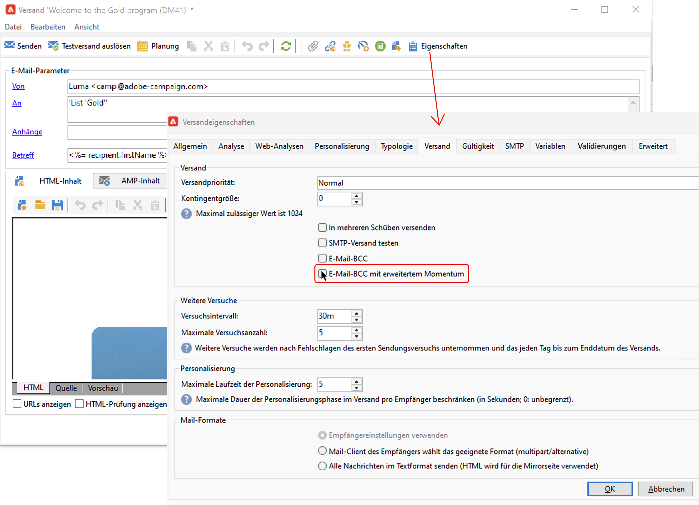

# Senden einer Kopie Ihrer Nachrichten an eine BCC-Adresse {#bcc}

<!--
>[!NOTE]
>
>This capability is available starting Campaign v8.3. To check your version, refer to [this section](../start/compatibility-matrix.md#how-to-check-your-campaign-version-and-buildversion)-->

## Über BCC für E-Mails {#gs-bcc}

Sie können Adobe Campaign so konfigurieren, dass eine Kopie der von der Plattform gesendeten E-Mails beibehalten wird. Mit dieser Option können Sie Nachrichten an eine dedizierte BCC-E-Mail-Adresse (Blind Carbon Copy) senden, von der aus sie mithilfe eines externen Systems verarbeitet und archiviert werden können.

>[!CAUTION]
>
>Aus Datenschutzgründen müssen BCC-E-Mails von einem Archivierungssystem bearbeitet werden, in dem personenbezogene Daten (PII, Personally Identifiable Information) sicher aufbewahrt werden.

Adobe Campaign selbst ermöglicht keine Verwaltung von archivierten Dateien. Die .eml-Dateien, die den gesendeten E-Mails entsprechen, können dann auf einen Remote-Server wie z. B. einen SMTP-E-Mail-Server übertragen werden.

Das Archivierungsziel ist die von Ihnen ausgewählte BCC-E-Mail-Adresse, die für die Empfängerinnen und Empfänger des Versands unsichtbar bleibt. Nachdem die BCC-E-Mail-Adresse definiert wurde, müssen Sie die entsprechende Option auf der Ebene der [Versandvorlage](create-templates.md) aktivieren.

>[!NOTE]
>
>Wenn Sie Managed Cloud Services verwenden, [wenden Sie sich an Adobe](../start/campaign-faq.md#support){target="_blank"}, um die für die Archivierung zu verwendende BCC-E-Mail-Adresse mitzuteilen.

## Aktivieren von BCC für E-Mails {#enable-bcc}

Gehen Sie wie folgt vor, um BCC für eine bestimmte [Versandvorlage](create-templates.md) zu aktivieren:

1. Navigieren Sie im Campaign-Explorer zum Ordner „Versandvorlagen“. Standardmäßig werden Versandvorlagen im Ordner **[!UICONTROL Ressourcen]** > **[!UICONTROL Vorlagen]** > **[!UICONTROL Versandvorlagen]** gespeichert.
1. Bearbeiten Sie die Versandvorlage, um sie mit BCC zu aktualisieren.
1. Wählen Sie die Schaltfläche **[!UICONTROL Eigenschaften]** aus.
1. Aktivieren Sie auf der **[!UICONTROL Versand]** die Option **[!UICONTROL E-Mail-BCC mit erweitertem]**).

   

1. Klicken Sie zum Bestätigen auf **[!UICONTROL OK]**.

Eine Kopie aller gesendeten Nachrichten wird für jeden Versand, der auf dieser Vorlage basiert, an die für Ihre Plattform konfigurierte E-Mail-BCC-Adresse gesendet.

## Leitlinien und Empfehlungen {#recommendations-bcc}

Bei der Verwendung von E-Mail-BCC mit Adobe Campaign gelten die folgenden Leitlinien und Empfehlungen:

* Sie können nur eine einzige BCC-E-Mail-Adresse verwenden.

* Stellen Sie sicher, dass die BCC-Adresse über genügend Aufnahmekapazität verfügt, um alle gesendeten E-Mails zu archivieren.

* E-Mail-BCC <!--with Enhanced MTA--> sendet die Nachrichten an die BCC-E-Mail-Adresse, bevor sie an die Empfänger gesendet werden. Dies kann dazu führen, dass BCC-Nachrichten gesendet werden, auch wenn die Original-Sendungen möglicherweise einen Bounce erzeugt haben. Weitere Informationen zu Bounces finden Sie unter [Fehlgeschlagene Sendungen](delivery-failures.md).

* E-Mails, die an die BCC-Adresse gesendet werden, sollten nicht geöffnet und angeklickt werden, da diese Aktivitäten im Abschnitt **[!UICONTROL Öffnungen gesamt]** und **[!UICONTROL Klicks]** aus der Versandanalyse zu falschen Berechnungen führen können.

<!--Only successfully sent emails are taken in account, bounces are not.-->
