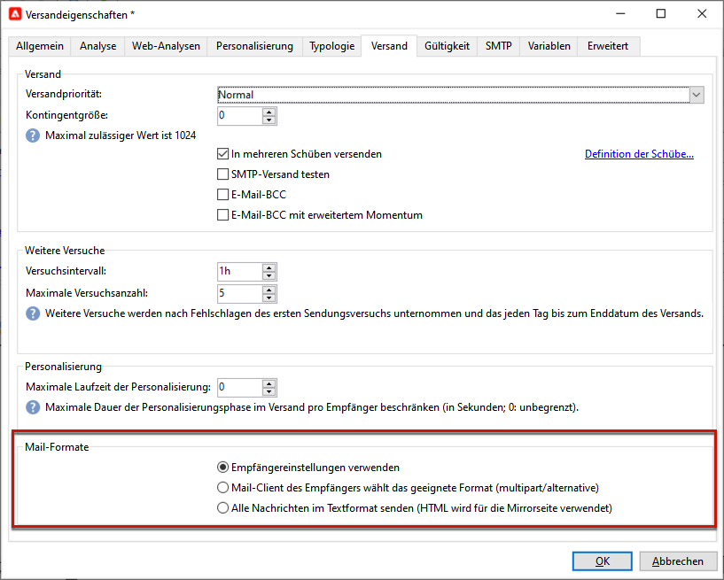
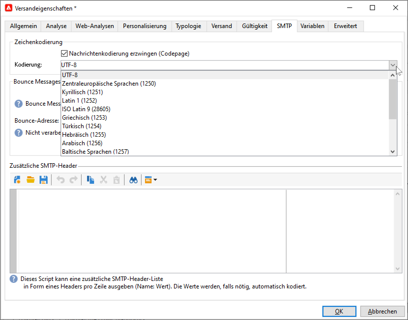
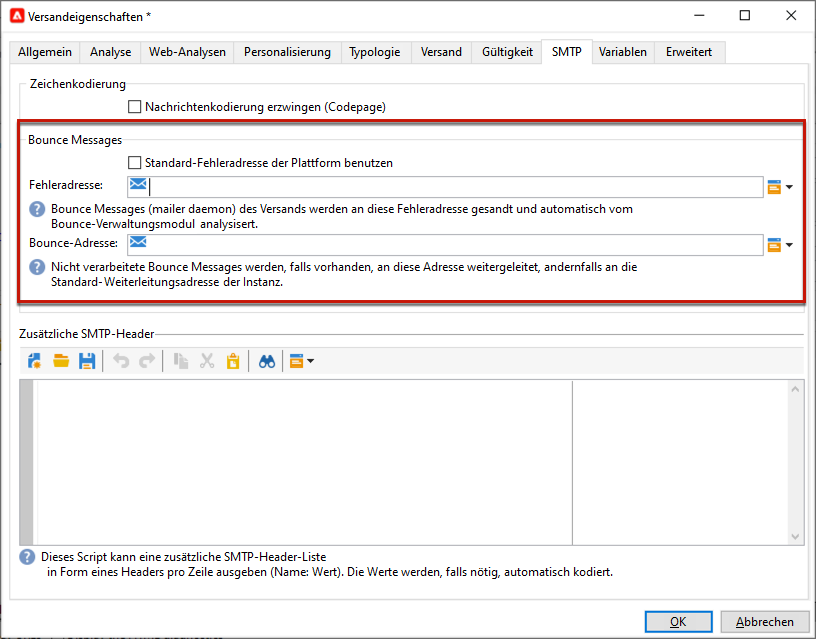
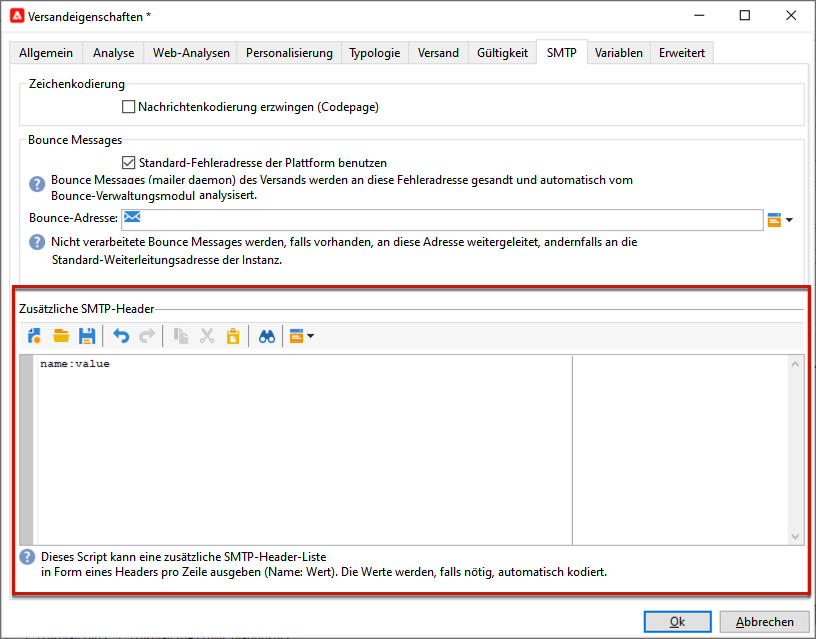

# E-Mail-Parameter {#email-parameters}

In diesem Abschnitt werden die in den Versandeigenschaften verfügbaren Optionen und Parameter beschrieben, die für den E-Mail-Versand spezifisch sind.

## Verwenden von E-Mail BCC {#email-bcc}

Sie können Adobe Campaign so konfigurieren, dass eine Kopie der von Ihrer Plattform gesendeten E-Mails aufbewahrt wird. Diese Option wird im Abschnitt [diese Seite](email-bcc.md).

## Auswählen von Nachrichtenformaten {#selecting-message-formats}

Sie können das Format der gesendeten E-Mail-Nachrichten ändern. Bearbeiten Sie hierzu die Versandeigenschaften und klicken Sie auf die Schaltfläche **[!UICONTROL Versand]** Registerkarte.

Im unteren Bereich des Fensters haben Sie die Wahl zwischen:

* **[!UICONTROL Empfängerangaben berücksichtigen]** (Standardmodus)

  Das Nachrichtenformat wird anhand der im Empfängerprofil im Feld **[!UICONTROL E-Mail-Format]** gespeicherten Informationen bestimmt. Wenn ein Empfänger ein bestimmtes Format angegeben hat, wird ihm die Nachricht in diesem Format zugestellt. Wenn das Feld leer ist, wird die Nachricht im Multipart-Alternative-Format versandt (siehe unten).

* **[!UICONTROL E-Mail-Programm des Empfängers das beste Format wählen lassen]**

  Die Nachricht enthält beide Formate: Text und HTML. Das beim Empfänger angezeigte Format hängt von der Konfiguration des E-Mail-Programms ab (Multipart-Alternative).

  >[!IMPORTANT]
  >
  >Diese Option umfasst beide Versionen der Nachricht. Dadurch verringert sich der Versanddurchsatz, da die Nachricht größer ist.

* **[!UICONTROL Alle Nachrichten im Textformat senden]**

  Die Nachricht wird im Textformat gesendet. Das HTML-Format wird nicht gesendet, sondern nur für die Mirrorseite verwendet, auf die ein Empfänger gelangt, wenn er auf den entsprechenden Link in der Nachricht klickt.

<!--
>[!NOTE]
>
>For more on defining the email content, see [this section]().-->

## Festlegen der Zeichencodierung {#character-encoding}

Auf dem Tab **[!UICONTROL SMTP]** der Versandparameter können Sie im Abschnitt **[!UICONTROL Zeichenkodierung]** eine bestimmte Kodierung festlegen.

Die Standardkodierung ist UTF-8. Wenn einige E-Mail-Anbieter Ihrer Empfänger keine UTF-8-Standardkodierung unterstützen, sollten Sie eine bestimmte Kodierung einrichten, sodass Sonderzeichen den Empfängern Ihrer E-Mails korrekt angezeigt werden.

Gehen wir davon aus, dass Sie eine E-Mail mit japanischen Zeichen versenden möchten. Um sicherzustellen, dass Ihren Empfängern in Japan alle Zeichen korrekt dargestellt werden, sollten Sie eine Kodierung verwenden, die anstelle der standardmäßigen UTF-8-Kodierung japanische Zeichen unterstützt.

Wählen Sie dazu die Option **[!UICONTROL Nachrichtenkodierung erzwingen (Codepage)]** im Abschnitt **[!UICONTROL Zeichenkodierung]** und wählen Sie eine Kodierung aus der angezeigten Dropdown-Liste.

## Verwalten von Bounce Messages {#managing-bounce-emails}

Auf der Registerkarte **[!UICONTROL SMTP]** der Versandeigenschaften lässt sich der Umgang mit Bounce Messages konfigurieren.

* **[!UICONTROL Fehler-an-Adresse]**: Standardmäßig gehen Bounce Messages im Standard-Fehlerpostfach der Plattform ein. Es besteht jedoch die Möglichkeit, für einen Versand durch Abwählen der Standardoption eine spezifische Fehleradresse anzugeben.

* **[!UICONTROL Bounce-Adresse]**: Sie können auch eine andere Adresse definieren, an die die nicht verarbeiteten Bounce Messages weitergeleitet werden. Diese Adresse ermöglicht es, die Gründe für das Bounce-Verhalten zu untersuchen, wenn E-Mails von der Anwendung nicht automatisch qualifiziert werden konnten.

Jedes dieser Felder kann mithilfe des dedizierten Symbols personalisiert werden. In [diesem Abschnitt](personalization-fields.md) erfahren Sie mehr über Personalisierungsfelder.

Weitere Informationen zur Bounce-Message-Verwaltung finden Sie in [diesem Abschnitt](delivery-failures.md#bounce-mail-management).

## Hinzufügen von SMTP-Headern {#adding-smtp-headers}

Sie können Ihren Sendungen auch SMTP-Header hinzufügen. Verwenden Sie dazu den entsprechenden Abschnitt des **[!UICONTROL SMTP]** im Versand.

Das in diesem Fenster erfasste Script muss pro Zeile einen Header im Format **Name: Wert** enthalten.

Werte werden bei Bedarf automatisch verschlüsselt.

>[!IMPORTANT]
>
>Das Hinzufügen eines Skripts zum Einfügen zusätzlicher SMTP-Header ist fortgeschrittenen Benutzern vorbehalten.
>
>Die Syntax des Scripts muss die Anforderungen für diesen Inhaltstyp (keine überflüssigen Leerzeichen, keine Leerzeilen usw.) erfüllen.

## Mirrorseite generieren {#generating-mirror-page}

Eine Mirrorseite ist eine HTML-Seite, die über einen Webbrowser online abgerufen werden kann und deren Inhalt mit dem der E-Mail identisch ist. Dies kann nützlich sein, wenn bei Ihren Empfängern Rendering-Probleme auftreten oder Bilder beschädigt sind, wenn sie versuchen, Ihre E-Mail in ihrem Posteingang anzuzeigen.

Erfahren Sie, wie Sie einen Link zur Mirrorseite in [diesem Abschnitt](mirror-page.md)
