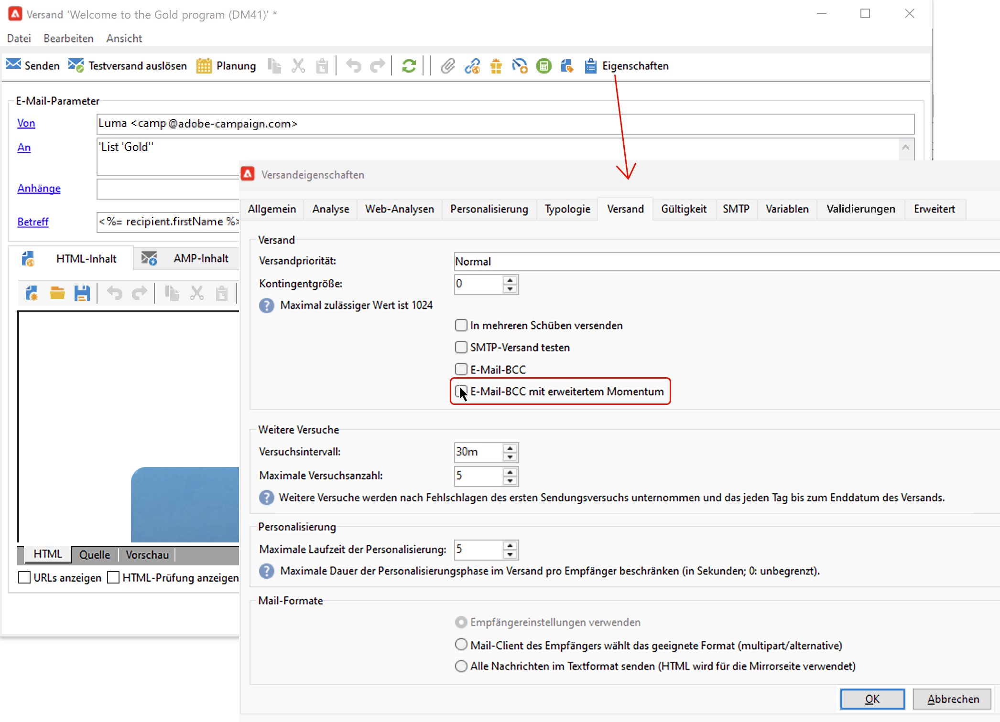

# E-Mail-Parameter {#email-parameters}

In diesem Abschnitt werden die Optionen und Parameter beschrieben, die in den Versandeigenschaften verfügbar sind, die für den E-Mail-Versand spezifisch sind.

## Email BCC verwenden {#email-bcc}

<!--
>[!NOTE]
>
>This capability is available starting Campaign v8.3. To check your version, refer to [this section](../start/compatibility-matrix.md#how-to-check-your-campaign-version-and-buildversion)-->

Sie können Adobe Campaign so konfigurieren, dass von den von der Plattform gesendeten E-Mails eine Kopie beibehalten wird.

Adobe Campaign selbst ermöglicht keine Verwaltung von archivierten Dateien. Sie können die Nachrichten Ihrer Wahl an eine dedizierte BCC-E-Mail-Adresse (Blind Carbon Copy) senden, von der aus sie mithilfe eines externen Systems verarbeitet und archiviert werden können. Die .eml-Dateien, die den gesendeten E-Mails entsprechen, können dann auf einen Remote-Server wie z. B. einen SMTP-E-Mail-Server übertragen werden.

>[!CAUTION]
>
>Aus Datenschutzgründen müssen BCC-E-Mails von einem Archivierungssystem bearbeitet werden, in dem personenbezogene Daten (PII, Personally Identifiable Information) sicher aufbewahrt werden.

Das Archivierungsziel ist die von Ihnen ausgewählte BCC-E-Mail-Adresse, die für die Versandempfänger unsichtbar bleibt.

 Wenn Sie Managed Cloud Services verwenden, [wenden Sie sich an Adobe](../start/campaign-faq.md#support){target="_blank"}, um die für die Archivierung zu verwendende BCC-E-Mail-Adresse mitzuteilen.

Nachdem die BCC-E-Mail-Adresse definiert wurde, müssen Sie die entsprechende Option auf Versandebene aktivieren.

>[!CAUTION]
>
>**[!UICONTROL E-Mail-BCC]** ist standardmäßig nicht aktiviert. Sie müssen die Funktion auf der E-Mail-Versand- oder Versandvorlagenebene manuell aktivieren.

Gehen Sie dazu wie folgt vor:

1. Gehen Sie zu **[!UICONTROL Kampagnenverwaltung]** > **[!UICONTROL Sendungen]** oder **[!UICONTROL Ressourcen]** > **[!UICONTROL Vorlagen]** > **[!UICONTROL Versandvorlagen]**.
1. Wählen Sie den gewünschten Versand aus oder duplizieren Sie die Standardvorlage **[!UICONTROL E-Mail-Versand]**, und wählen Sie dann die duplizierte Vorlage aus.
1. Wählen Sie die **[!UICONTROL Eigenschaften]**-Schaltfläche aus.
1. Gehen Sie in den **[!UICONTROL Versand]**-Tab.
1. Aktivieren Sie die Option **[!UICONTROL E-Mail-BCC.]**

   

1. Klicken Sie auf **[!UICONTROL OK]**.

Eine Kopie aller gesendeten Nachrichten für jeden Versand, der auf dieser Vorlage basiert, wird an die dafür konfigurierte BCC-E-Mail-Adresse gesendet.

Beachten Sie die folgenden Besonderheiten und Empfehlungen:

* Sie können nur eine einzige BCC-E-Mail-Adresse verwenden.

* Stellen Sie sicher, dass die BCC-Adresse über genügend Aufnahmekapazität verfügt, um alle gesendeten E-Mails zu archivieren.

* E-Mail-BCC <!--with Enhanced MTA--> sendet die Nachrichten an die BCC-E-Mail-Adresse, bevor sie an die Empfänger gesendet werden. Dies kann dazu führen, dass BCC-Nachrichten gesendet werden, auch wenn die Original-Sendungen möglicherweise einen Bounce erzeugt haben. Weitere Informationen zu Bounces finden Sie unter [Fehlgeschlagene Sendungen](delivery-failures.md).

* Wenn die an eine BCC-Adresse gesendeten E-Mails geöffnet und angeklickt werden, wird dies in der Versandanalyse in **[!UICONTROL Gesamtöffnungen]** und **[!UICONTROL Klicks]** berücksichtigt, was zu falschen Berechnungen führen könnte.

<!--Only successfully sent emails are taken in account, bounces are not.-->

## Nachrichtenformate auswählen {#selecting-message-formats}

Sie können das Format der zu versendenden E-Mails konfigurieren. Klicken Sie hierzu auf die Schaltfläche **[!UICONTROL Eigenschaften]** und begeben Sie sich in den Tab .

Im unteren Bereich des Fensters haben Sie die Wahl zwischen:

* **[!UICONTROL Empfängerangaben berücksichtigen]** (Standardmodus)

  Das Nachrichtenformat wird anhand der im Empfängerprofil im Feld **[!UICONTROL E-Mail-Format]** gespeicherten Informationen bestimmt. Wenn ein Empfänger ein bestimmtes Format angegeben hat, wird ihm die Nachricht in diesem Format zugestellt. Wenn das Feld leer ist, wird die Nachricht im Multipart-Alternative-Format versandt (siehe unten).

* **[!UICONTROL E-Mail-Programm des Empfängers das beste Format wählen lassen]**

  Die Nachricht enthält beide Formate: Text und HTML. Das beim Empfänger angezeigte Format hängt von der Konfiguration des E-Mail-Programms ab (Multipart-Alternative).

  >[!IMPORTANT]
  >
  >Diese Option umfasst beide Versionen des Dokuments. Dadurch wird der Versanddurchsatz reduziert, da die Nachrichtengröße größer ist.

* **[!UICONTROL Alle Nachrichten im Textformat senden]**

  Die Nachricht wird im Textformat gesendet. Das HTML-Format wird nicht gesendet, sondern nur für die Mirrorseite verwendet, auf die ein Empfänger gelangt, wenn er auf den entsprechenden Link in der Nachricht klickt.

<!--
>[!NOTE]
>
>For more on defining the email content, see [this section]().-->

## Zeichenkodierung festlegen {#character-encoding}

Auf dem Tab **[!UICONTROL SMTP]** der Versandparameter können Sie im Abschnitt **[!UICONTROL Zeichenkodierung]** eine bestimmte Kodierung festlegen.

Die Standardkodierung ist UTF-8. Wenn einige E-Mail-Anbieter Ihrer Empfänger keine UTF-8-Standardkodierung unterstützen, sollten Sie eine bestimmte Kodierung einrichten, sodass Sonderzeichen den Empfängern Ihrer E-Mails korrekt angezeigt werden.

Gehen wir davon aus, dass Sie eine E-Mail mit japanischen Zeichen versenden möchten. Um sicherzustellen, dass Ihren Empfängern in Japan alle Zeichen korrekt dargestellt werden, sollten Sie eine Kodierung verwenden, die anstelle der standardmäßigen UTF-8-Kodierung japanische Zeichen unterstützt.

Wählen Sie dazu die Option **[!UICONTROL Nachrichtenkodierung erzwingen (Codepage)]** im Abschnitt **[!UICONTROL Zeichenkodierung]** und wählen Sie eine Kodierung aus der angezeigten Dropdown-Liste.

## Bounce Messages verwalten {#managing-bounce-emails}

Die **[!UICONTROL SMTP]** in den Versandeigenschaften können Sie auch die Verwaltung von Bounce Messages konfigurieren.

* **[!UICONTROL Fehleradressen]**: Bounce Messages werden standardmäßig in der Standard-Fehlerbox der Plattform empfangen. Sie können aber auch eine bestimmte Fehleradresse für einen Versand definieren.

* **[!UICONTROL Bounce-Adresse]**: Sie können auch eine andere Adresse definieren, an die die nicht verarbeiteten Bounce Messages weitergeleitet werden. Diese Adresse ermöglicht es, die Gründe für das Bounce-Verhalten zu untersuchen, wenn E-Mails von der Anwendung nicht automatisch qualifiziert werden konnten.

Jedes dieser Felder kann mithilfe des dedizierten Symbols personalisiert werden. Weitere Informationen zu Personalisierungsfeldern finden Sie in [diesem Abschnitt](personalization-fields.md).

Weitere Informationen zur Bounce-Message-Verwaltung finden Sie in [diesem Abschnitt](delivery-failures.md#bounce-mail-management).

## SMTP-Header hinzufügen {#adding-smtp-headers}

Sie haben die Möglichkeit, Ihren Sendungen weitere SMTP-Header hinzuzufügen. Gehen Sie hierfür in den Tab **[!UICONTROL SMTP]** in den Versandeigenschaften.

Das in diesem Fenster erfasste Script muss pro Zeile einen Header im Format **Name: Wert** enthalten.

Werte werden bei Bedarf automatisch verschlüsselt.

>[!IMPORTANT]
>
>Das Hinzufügen zusätzlicher SMTP-Header ist eine Aufgabe für erfahrene Benutzer.
>
>Die Syntax des Scripts muss die Anforderungen für diesen Inhaltstyp (keine überflüssigen Leerzeichen, keine Leerzeilen usw.) erfüllen.

<!--
## Generate mirror page {#generating-mirror-page}

The mirror page is an HTML page accessible online via a web browser. Its content is identical to the email. It can be useful if your recipients are experiencing rendering issues or broken images when trying to view your email in their inbox.

Learn how to insert a link to the mirror page in [this section](mirror-page.md).-->