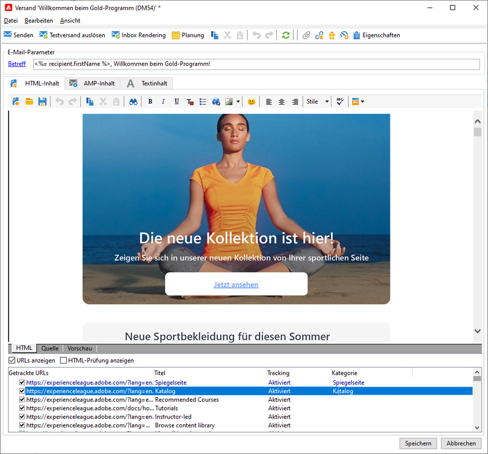
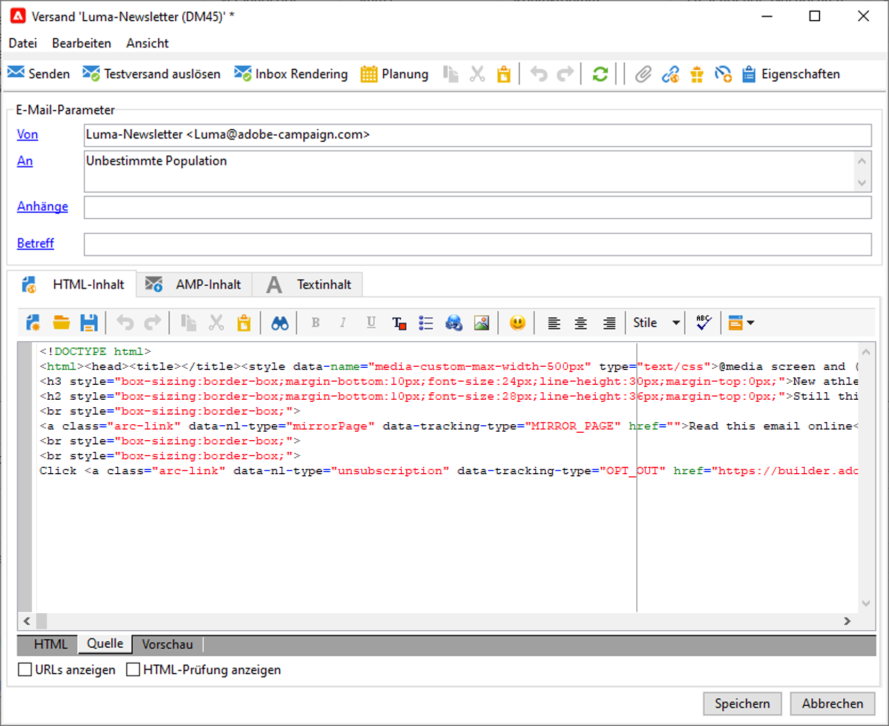
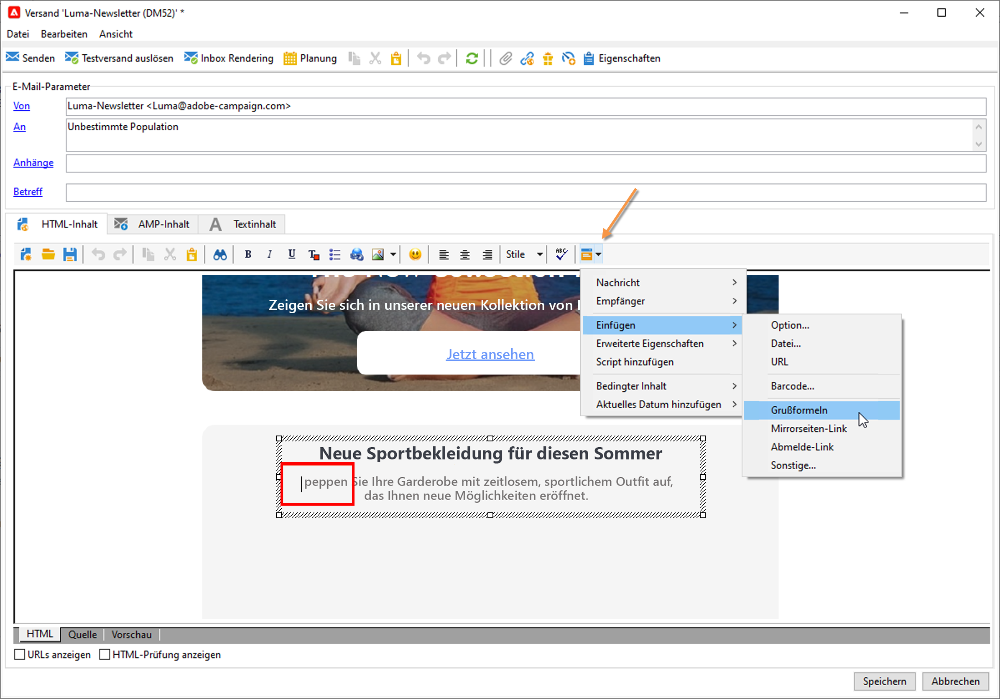
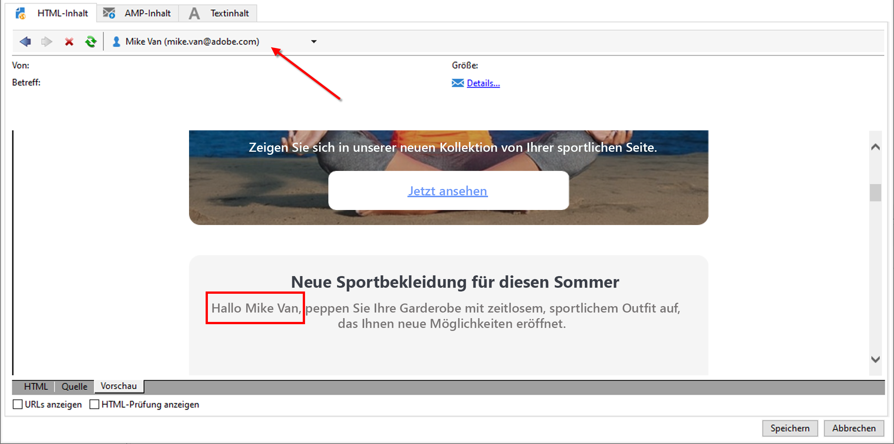
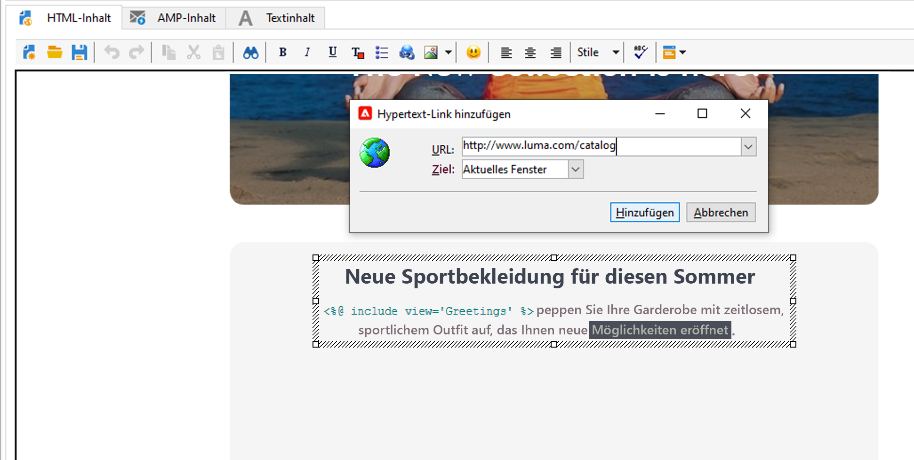

# E-Mails entwerfen und senden

Ein E-Mail-Versand richtet personalisierte E-Mails an eine zuvor bestimmte Zielpopulation.

 Weitere Informationen finden Sie in der [Dokumentation zu Campaign Classic v7](https://experienceleague.adobe.com/docs/campaign-classic/using/sending-messages/sending-emails/about-email-channel.html?lang=de){target="_blank"}

## Den ersten E-Mail-Versand erstellen

Erstellen Sie personalisierte und kontextuelle E-Mails, die mit dem übrigen Kundenerlebnis konsistent sind.

Im folgenden Beispiel erfahren Sie, wie Sie einen E-Mail-Versand in Adobe Campaign erstellen, der personalisierte Daten, Links zu einer externen URL und einen Link zur Mirror-Seite enthält.

1. **Erstellen eines Versands**

   Um einen neuen Versand zu erstellen, gehen Sie zur Registerkarte **Kampagnen**, klicken Sie auf **Sendungen** und anschließend auf die Schaltfläche **Erstellen** oberhalb der Liste der vorhandenen Sendungen.

   

1. **Auswählen der Vorlage**

   Wählen Sie eine Versandvorlage aus und geben Sie Ihrem Versand eine Bezeichnung. Diese Bezeichnung ist nur für Benutzer der Adobe Campaign-Konsole sichtbar, nicht aber für die Empfänger. Diese Bezeichnung wird in der Liste der Sendungen angezeigt. Bestätigen Sie die Angaben mit der Schaltfläche **[!UICONTROL Fortfahren]**.

   

1. **Importieren von Content**

   Klicken Sie auf die Registerkarte **Quelle**, um Ihren HTML-Inhalt einzufügen.

   

1. **Personalisieren Ihrer Nachricht**

   * Hinzufügen der Vor- und Nachnamen der Empfänger

      Um den Vor- und Nachnamen der Zielgruppenprofile in den Nachrichteninhalt einzufügen, platzieren Sie den Cursor an der gewünschten Stelle, klicken Sie auf das letzte Symbol in der Symbolleiste, klicken Sie dann auf **[!UICONTROL Einfügen]** und wählen Sie **[!UICONTROL Grußformeln]** aus.

      

      Navigieren Sie zur Registerkarte &quot;Vorschau&quot;, um die Personalisierung durch die Auswahl eines Empfängers zu überprüfen.

      

   * Einfügen eines getrackten Links

      Um Versandempfänger über ein Bild oder einen Text zu einer externen Adresse weiterzuleiten, wählen Sie diese aus und klicken Sie in der Symbolleiste auf das Symbol **[!UICONTROL Link hinzufügen]**.

      Geben Sie die URL für den Link im Feld **URL** im Format **https://www.myURL.com** ein und bestätigen Sie dann Ihre Eingabe.

      

   * Hinzufügen einer Mirror-Seite

      Um Empfängern zu ermöglichen, Ihren Versandinhalt in einem Webbrowser zu sehen, können Sie einen Link zu einer Mirror-Seite Ihrer Nachricht einfügen.

      Platzieren Sie den Cursor an der gewünschten Stelle, klicken Sie auf das letzte Symbol in der Symbolleiste, klicken Sie auf **[!UICONTROL Einfügen]** und wählen Sie **[!UICONTROL Mirrorseiten-Link]** aus.
   Wenn der Inhalt fertig ist, klicken Sie auf **Speichern**: Er wird nun in Ihrer Versandliste auf der Registerkarte **[!UICONTROL Kampagnen > Sendungen]** angezeigt. Ihr erster E-Mail-Versand ist fertig. Definieren Sie nun die Audience, validieren Sie den Versand und führen Sie ihn aus.

In diesem [Anwendungsfall](https://experienceleague.adobe.com/docs/campaign/automation/workflows/use-cases/deliveries/load-delivery-content.html?lang=de) erfahren Sie, wie Sie E-Mail-Inhalte importieren können.

Weitere Informationen finden Sie in diesen Abschnitten der **Dokumentation zu Campaign Classic v7**:

* Erstellen einer E-Mail in Campaign
    [Weitere Informationen zum Erstellen von E-Mails](https://experienceleague.adobe.com/docs/campaign-classic/using/sending-messages/sending-emails/defining-the-email-content.html?lang=de){target="_blank"}
* Erstellen und Verwenden von E-Mail-Vorlagen
    [Weitere Informationen zu E-Mail-Vorlagen](https://experienceleague.adobe.com/docs/campaign-classic/using/sending-messages/using-delivery-templates/about-templates.html?lang=de){target="_blank"}
* Auswählen der Audience für Ihre E-Mail
    [Weitere Informationen zur Definition der Zielpopulation](https://experienceleague.adobe.com/docs/campaign-classic/using/sending-messages/key-steps-when-creating-a-delivery/steps-defining-the-target-population.html?lang=de){target="_blank"}
* Validieren eines Versands und Durchführen von Testsendungen
    [Wichtige Schritte zur Validierung eines Versands](https://experienceleague.adobe.com/docs/campaign-classic/using/sending-messages/key-steps-when-creating-a-delivery/steps-validating-the-delivery.html?lang=de){target="_blank"}
* [Testadressen](https://experienceleague.adobe.com/docs/campaign-classic/using/sending-messages/using-seed-addresses/about-seed-addresses.html?lang=de) hinzufügen{target="_blank"}

## Testen und Validieren von E-Mails

Campaign bietet mehrere Möglichkeiten, E-Mails zu testen und zu validieren, bevor Sie sie an Ihre Audiences senden.

 [Wenden Sie die in der Dokumentation zu Campaign Classic v7](https://experienceleague.adobe.com/docs/campaign-classic/using/sending-messages/key-steps-when-creating-a-delivery/delivery-bestpractices/check-before-sending.html?lang=de) aufgeführten Best Practices an.{target="_blank"}

Sie haben folgende Möglichkeiten:

* Versand-Analyse-Protokolle überprüfen
* Durchführen eines Testversands
* Testadressen hinzufügen
* Kontrollgruppen verwenden
* E-Mail-Rendering prüfen

 [Weitere Informationen finden Sie in der Dokumentation zu Campaign Classic v7](https://experienceleague.adobe.com/docs/campaign-classic/using/sending-messages/key-steps-when-creating-a-delivery/steps-validating-the-delivery.html?lang=de){target="_blank"}
