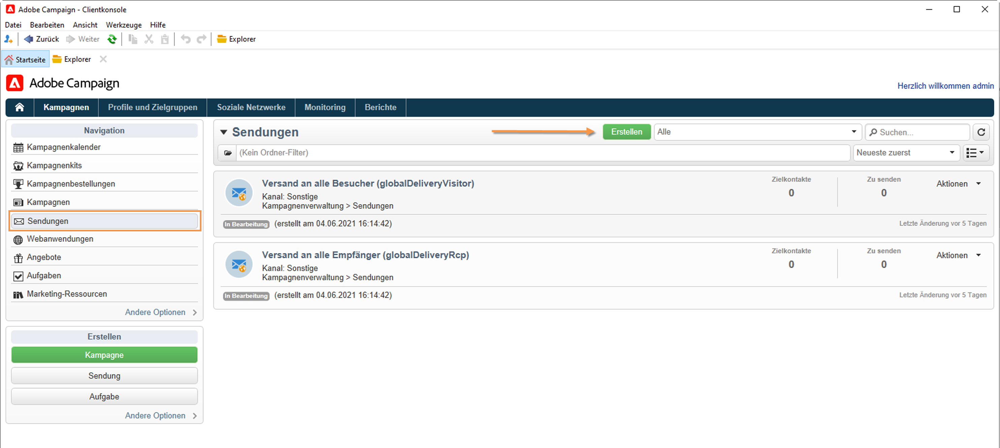

# E-Mails entwerfen und senden

Ein E-Mail-Versand richtet personalisierte E-Mails an eine zuvor bestimmte Zielpopulation.

[!DNL :arrow_upper_right:] Weitere Informationen finden Sie in der Dokumentation zu  [Campaign Classic v7](https://experienceleague.adobe.com/docs/campaign-classic/using/sending-messages/sending-emails/about-email-channel.html?lang=de).

## Den ersten E-Mail-Versand erstellen

Erstellen Sie personalisierte und kontextrelevante E-Mails, die mit dem übrigen Kundenerlebnis konsistent sind.

[!DNL :arrow_upper_right:] [Informationen zum Erstellen eines E-Mail-Versands finden Sie in der Dokumentation zu Campaign Classic v7 .](https://experienceleague.adobe.com/docs/campaign-classic/using/designing-content/editing-html-content/use-case--creating-an-email-delivery.html?lang=de)

Im folgenden Beispiel erfahren Sie, wie Sie einen E-Mail-Versand in Adobe Campaign erstellen, der personalisierte Daten, Links zu einer externen URL, einen Link zur Mirrorseite und einen Link zu einem Webformular enthält.

1. Versand erstellen

   Um einen neuen Versand zu erstellen, gehen Sie zum Tab **Kampagnen**, klicken Sie auf **Sendungen** und dann auf die Schaltfläche **Erstellen** oberhalb der Liste der vorhandenen Sendungen.

   

1. Vorlage auswählen

   Wählen Sie eine Versandvorlage aus und geben Sie Ihrem Versand eine Bezeichnung. Diese Bezeichnung ist nur für Benutzer der Adobe Campaign-Konsole sichtbar, nicht aber für die Empfänger. Diese Bezeichnung wird in der Liste der Sendungen angezeigt. Bestätigen Sie die Angaben mit der Schaltfläche **[!UICONTROL Fortfahren]**.

   

1. Inhalt importieren

   Klicken Sie auf die Registerkarte **Quelle** , um Ihren HTML-Inhalt einzufügen.

   

1. Nachricht personalisieren

   * Vor- und Nachnamen der Empfänger anzeigen

      Um den Vor- und Nachnamen der Empfänger in ein Textfeld Ihres Versands einzufügen, klicken Sie auf das gewünschte Textfeld und platzieren Sie den Cursor an die Stelle, wo der Name angezeigt werden soll. Klicken Sie auf das erste Symbol in der Pop-up-Symbolleiste und danach auf **[!UICONTROL Gestaltungsbaustein]**. Wählen Sie **[!UICONTROL Grußformeln]** und danach **[!UICONTROL OK]** aus.

   * Link in ein Bild einfügen

      Um Empfänger eines Versands über ein Bild zu einer externen Adresse weiterzuleiten, klicken Sie auf das jeweilige Bild, um die Symbolleiste zu öffnen, platzieren Sie den Cursor auf das erste Symbol und wählen Sie dann **[!UICONTROL Link auf eine externe URL]** aus.

      Geben Sie die URL für den Link im Feld **URL** im Format **https://www.myURL.com** ein und bestätigen Sie dann Ihre Eingabe.

      Der Link kann jederzeit im rechten Fensterbereich geändert werden.

   * Link in Text einfügen

      Um einen externen Link in den Text Ihres Versands einzufügen, wählen Sie Text aus und klicken Sie auf das erste Symbol der Pop-up-Symbolleiste. Wählen Sie **[!UICONTROL Link auf eine externe URL]** aus und geben Sie im Feld **[!UICONTROL URL]** die Adresse des Links ein.

      Der Link kann jederzeit im rechten Fensterbereich geändert werden.

   * Mirrorseite hinzufügen

      Um Empfängern zu ermöglichen, Ihren Versandinhalt in einem Webbrowser zu sehen, können Sie in Ihrem Versand einen Link zu einer Mirrorseiten integrieren.

      Klicken Sie auf das Textfeld, in dem der Link erscheinen soll. Klicken Sie auf das erste Symbol in der Pop-up-Symbolleiste und wählen Sie **[!UICONTROL Gestaltungsbaustein]** und danach **[!UICONTROL Mirrorseiten-Link (MirrorPage)]** aus. Wählen Sie zur Bestätigung **[!UICONTROL Speichern]** aus.

   * Einen Link auf eine Webanwendung integrieren

      Mit dem Digital Content Editor können Sie über die Adobe Campaign-Konsole Links auf Webanwendungen integrieren, z. B. auf eine Landingpage oder Formularseite.

      Wählen Sie ein Textfeld für Ihren Link auf eine Webanwendung aus und klicken Sie dann auf das erste Symbol. Wählen Sie **[!UICONTROL Link auf eine Webanwendung]** und danach die gewünschte Anwendung aus, indem Sie auf das Symbol am Ende des Feldes **Webanwendung** klicken.

1. Nachrichten senden

   Nachdem der Inhalt integriert wurde, speichern Sie den Versand, indem Sie auf **Speichern** klicken. Er wird nun in Ihrer Liste der Sendungen angezeigt, die Sie auf dem Tab **[!UICONTROL Kampagnen > Sendungen]** finden.

## Inhalt erstellen und Zielgruppe auswählen

Sie können Ihre Audience sowie Ihren E-Mail-Inhalt direkt in Campaign erstellen oder importieren. Verwenden Sie die folgenden Links, um mehr über folgende Funktionen zu erfahren:

* E-Mail in Campaign erstellen
   [!DNL :arrow_upper_right:] [Erfahren Sie, wie Sie eine E-Mail erstellen](https://experienceleague.adobe.com/docs/campaign-classic/using/sending-messages/sending-emails/defining-the-email-content.html?lang=de)
* E-Mail-Inhalt importieren
   [!DNL :arrow_upper_right:] [Anwendungsfall: Erstellen eines Workflows zum Laden des Versandinhalts](https://experienceleague.adobe.com/docs/campaign-classic/using/automating-with-workflows/use-cases/deliveries/loading-delivery-content.html?lang=de)
* E-Mail-Vorlage erstellen und verwenden
   [!DNL :arrow_upper_right:] [Weitere Informationen zu E-Mail-Vorlagen](https://experienceleague.adobe.com/docs/campaign-classic/using/sending-messages/using-delivery-templates/about-templates.html?lang=de)
* E-Mail-Audience auswählen
   [!DNL :arrow_upper_right:] [Erfahren Sie, wie Sie die Zielpopulation definieren](https://experienceleague.adobe.com/docs/campaign-classic/using/sending-messages/key-steps-when-creating-a-delivery/steps-defining-the-target-population.html?lang=de)
* Versand validieren und Testsendungen durchführen
   [!DNL :arrow_upper_right:] [Wichtige Schritte zur Validierung eines Versands](https://experienceleague.adobe.com/docs/campaign-classic/using/sending-messages/key-steps-when-creating-a-delivery/steps-validating-the-delivery.html?lang=de)
* [Testadressen](https://experienceleague.adobe.com/docs/campaign-classic/using/sending-messages/using-seed-addresses/about-seed-addresses.html?lang=de) hinzufügen

## Testen und Validieren von E-Mails

Campaign bietet mehrere Möglichkeiten, E-Mails zu testen und zu validieren, bevor Sie sie an Ihre Audiences senden.

[!DNL :arrow_upper_right:] [Best Practices anwenden, die in der Campaign Classic v7-Dokumentation aufgeführt sind](https://experienceleague.adobe.com/docs/campaign-classic/using/sending-messages/key-steps-when-creating-a-delivery/delivery-bestpractices/check-before-sending.html?lang=de)

Sie haben folgende Möglichkeiten:

* Versand-Analyse-Protokolle überprüfen
* Testversand durchführen
* Testadressen hinzufügen
* Kontrollgruppen verwenden
* E-Mail-Rendering prüfen

[!DNL :arrow_upper_right:] [Weitere Informationen finden Sie in der Dokumentation zu Campaign Classic v7 .](https://experienceleague.adobe.com/docs/campaign-classic/using/sending-messages/key-steps-when-creating-a-delivery/steps-validating-the-delivery.html)

## E-Mails überwachen

Nach dem Versand können Sie im Versand-Dashboard den Versandstatus überprüfen und auf Versandprotokolle und Berichte zugreifen, die bestätigen, dass die Nachrichten korrekt versendet wurden.

[!DNL :arrow_upper_right:] [Weitere Informationen finden Sie in der Dokumentation zu Campaign Classic v7 .](https://experienceleague.adobe.com/docs/campaign-classic/using/sending-messages/key-steps-when-creating-a-delivery/delivery-bestpractices/track-and-monitor.html?lang=de)

