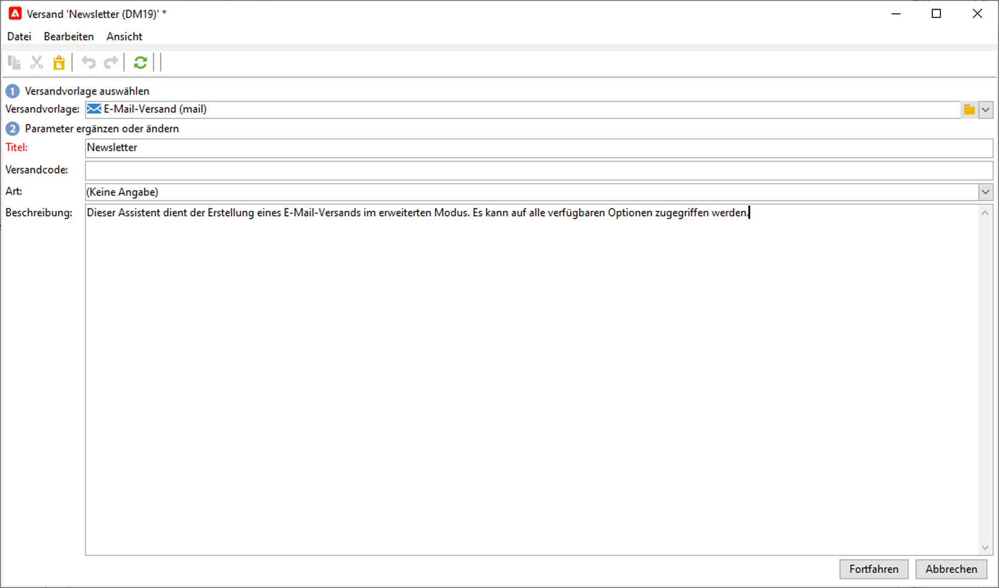

# E-Mails entwerfen und senden

Ein E-Mail-Versand richtet personalisierte E-Mails an eine zuvor bestimmte Zielpopulation.

[!DNL :arrow_upper_right:] Weitere Informationen finden Sie in der Dokumentation zu  [Campaign Classic v7](https://experienceleague.adobe.com/docs/campaign-classic/using/sending-messages/sending-emails/about-email-channel.html?lang=de).

## Den ersten E-Mail-Versand erstellen

Erstellen Sie personalisierte und kontextrelevante E-Mails, die mit dem übrigen Kundenerlebnis konsistent sind.

Im folgenden Beispiel erfahren Sie, wie Sie einen E-Mail-Versand in Adobe Campaign erstellen, der personalisierte Daten, Links zu einer externen URL und einen Link zur Mirrorseite enthält.

1. **Versand erstellen**

   Um einen neuen Versand zu erstellen, gehen Sie zum Tab **Kampagnen**, klicken Sie auf **Sendungen** und dann auf die Schaltfläche **Erstellen** oberhalb der Liste der vorhandenen Sendungen.

   

1. **Vorlage auswählen**

   Wählen Sie eine Versandvorlage aus und geben Sie Ihrem Versand eine Bezeichnung. Diese Bezeichnung ist nur für Benutzer der Adobe Campaign-Konsole sichtbar, nicht aber für die Empfänger. Diese Bezeichnung wird in der Liste der Sendungen angezeigt. Bestätigen Sie die Angaben mit der Schaltfläche **[!UICONTROL Fortfahren]**.

   

1. **Inhalt importieren**

   Klicken Sie auf die Registerkarte **Quelle** , um Ihren HTML-Inhalt einzufügen.

   

1. **Nachricht personalisieren**

   * Vor- und Nachnamen der Empfänger hinzufügen

      Um den Vor- und Nachnamen der Zielgruppenprofile in den Nachrichteninhalt einzufügen, platzieren Sie den Cursor an die Stelle, an der Sie sie einfügen möchten, klicken Sie auf das letzte Symbol in der Symbolleiste, klicken Sie dann auf **[!UICONTROL Include]** und wählen Sie **[!UICONTROL Grußformeln]** aus.

      

      Navigieren Sie zum Tab Vorschau , um die Personalisierung durch Auswahl eines Empfängers zu überprüfen.

      

   * Getrackten Link einfügen

      Um Empfänger eines Versands über ein Bild oder einen Text zu einer externen Adresse weiterzuleiten, wählen Sie diese aus und klicken Sie auf das Symbol **[!UICONTROL Link]** in der Symbolleiste.

      Geben Sie die URL für den Link im Feld **URL** im Format **https://www.myURL.com** ein und bestätigen Sie dann Ihre Eingabe.

      

   * Mirrorseite hinzufügen

      Fügen Sie einen Link zur Mirrorseite Ihrer Nachricht hinzu, damit die Empfänger Ihren Versandinhalt in einem Webbrowser anzeigen können.

      Platzieren Sie den Cursor an die Stelle, an der Sie diesen Link einfügen möchten, klicken Sie auf das letzte Symbol in der Symbolleiste, klicken Sie auf **[!UICONTROL Include]** und wählen Sie **[!UICONTROL Link zur Mirrorseite]** aus.
   Sobald der Inhalt fertig ist, klicken Sie auf **Speichern**: Sie wird nun in Ihrer Versandliste im Tab **[!UICONTROL Kampagnen > Sendungen]** angezeigt. Ihr erster E-Mail-Versand ist fertig. Definieren Sie nun die Audience, validieren Sie den Versand und senden Sie ihn.

Weitere Informationen finden Sie in den folgenden Abschnitten der Campaign Classic v7-Dokumentation:

* E-Mail in Campaign erstellen
   [!DNL :arrow_upper_right:] [Erfahren Sie, wie Sie eine E-Mail erstellen](https://experienceleague.adobe.com/docs/campaign-classic/using/sending-messages/sending-emails/defining-the-email-content.html?lang=de)
* E-Mail-Inhalt importieren
   [!DNL :arrow_upper_right:] [Anwendungsfall: Erstellen eines Workflows zum Laden des Versandinhalts](https://experienceleague.adobe.com/docs/campaign-classic/using/automating-with-workflows/use-cases/deliveries/loading-delivery-content.html?lang=de)
* E-Mail-Vorlage erstellen und verwenden
   [!DNL :arrow_upper_right:] [Weitere Informationen zu E-Mail-Vorlagen](https://experienceleague.adobe.com/docs/campaign-classic/using/sending-messages/using-delivery-templates/about-templates.html?lang=de)
* E-Mail-Audience auswählen
   [!DNL :arrow_upper_right:] [Erfahren Sie, wie Sie die Zielpopulation definieren](https://experienceleague.adobe.com/docs/campaign-classic/using/sending-messages/key-steps-when-creating-a-delivery/steps-defining-the-target-population.html?lang=de)
* Versand validieren und Testsendungen durchführen
   [!DNL :arrow_upper_right:] [Wichtige Schritte zur Validierung eines Versands](https://experienceleague.adobe.com/docs/campaign-classic/using/sending-messages/key-steps-when-creating-a-delivery/steps-validating-the-delivery.html?lang=de)
* [Testadressen](https://experienceleague.adobe.com/docs/campaign-classic/using/sending-messages/using-seed-addresses/about-seed-addresses.html?lang=de) hinzufügen

## Testen und Validieren von E-Mails

Campaign bietet mehrere Möglichkeiten, E-Mails zu testen und zu validieren, bevor Sie sie an Ihre Audiences senden.

[!DNL :arrow_upper_right:] [Best Practices anwenden, die in der Campaign Classic v7-Dokumentation aufgeführt sind](https://experienceleague.adobe.com/docs/campaign-classic/using/sending-messages/key-steps-when-creating-a-delivery/delivery-bestpractices/check-before-sending.html?lang=de)

Sie haben folgende Möglichkeiten:

* Versand-Analyse-Protokolle überprüfen
* Testversand durchführen
* Testadressen hinzufügen
* Kontrollgruppen verwenden
* E-Mail-Rendering prüfen

[!DNL :arrow_upper_right:] [Weitere Informationen finden Sie in der Dokumentation zu Campaign Classic v7 .](https://experienceleague.adobe.com/docs/campaign-classic/using/sending-messages/key-steps-when-creating-a-delivery/steps-validating-the-delivery.html)

## E-Mails überwachen

Nach dem Versand können Sie im Versand-Dashboard den Versandstatus überprüfen und auf Versandprotokolle und Berichte zugreifen, die bestätigen, dass die Nachrichten korrekt versendet wurden.

[!DNL :arrow_upper_right:] [Weitere Informationen finden Sie in der Dokumentation zu Campaign Classic v7 .](https://experienceleague.adobe.com/docs/campaign-classic/using/sending-messages/key-steps-when-creating-a-delivery/delivery-bestpractices/track-and-monitor.html?lang=de)

