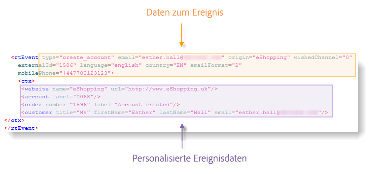
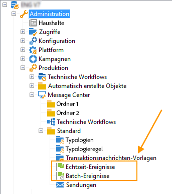
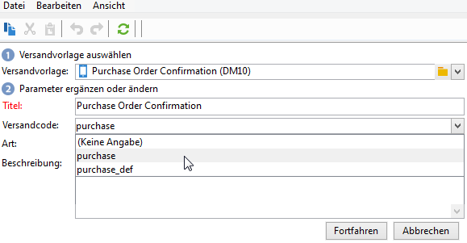

# Ereignisverarbeitung {#event-processing}

Im Zusammenhang mit dem Transaktionsnachrichtenversand wird von einem externen Informationssystem ein Ereignis generiert und über die Methoden **[!UICONTROL PushEvent]** und **[!UICONTROL PushEvents]** an Adobe Campaign gesendet. Diese Methoden werden in [diesem Abschnitt](event-description.md) beschrieben.

Dieses Ereignis enthält Daten, die mit dem Ereignis verknüpft sind, z. B.:

* sein [Typ](transactional.md#create-event-types): Bestellbestätigung, Kontoerstellung auf einer Website usw.,
* die E-Mail-Adresse oder Telefonnummer,
* sonstige Informationen zur Anreicherung und Personalisierung der Transaktionsnachricht vor dem Versand: Kundenkontaktdaten, Sprache der Nachricht, E-Mail-Format usw.

Beispiel für Ereignisdaten:

Um Transaktionsnachrichten-Ereignisse zu verarbeiten, werden die folgenden Schritte auf der/den Ausführungsinstanz(en) ausgeführt:

1. [Ereignissammlung](#event-collection)
1. [Weiterleitung des Ereignisses zu einer Nachrichtenvorlage](#routing-towards-a-template)
1. Anreicherung des Ereignisses mit Personalisierungsdaten
1. [Versandausführung](delivery-execution.md)
1. [Recycling von Ereignissen](#event-recycling), bei denen der mit ihnen verknüpfte Versand fehlgeschlagen ist (über einen Adobe Campaign-Workflow)

Sobald alle Schritte ausgeführt wurden, erhält jeder Zielgruppenempfänger eine personalisierte Nachricht.

## Erfassen von Ereignissen {#event-collection}

Die vom Informationssystem erzeugten Ereignisse können auf zwei Weisen abgerufen werden:

* Nutzung von SOAP-Methoden, die die Ereignisse Adobe Campaign zuführen: Die PushEvent-Methode ermöglicht den Versand eines Ereignisses, die PushEvents-Methode den Versand mehrerer Ereignisse auf einmal. [Weitere Informationen](event-description.md).

* Durch das Erstellen eines Workflows mit dem Modul [Federated Data Access](../connect/fda.md) können Sie Ereignisse abrufen, indem Sie Dateien importieren oder ein SQL-Gateway verwenden.

Wenn sie erfasst sind, werden die Ereignisse von technischen Workflows auf die Echtzeit- und Batch-Warteschlangen der Ausführungsinstanzen verteilt, bis sie mit einer [Nachrichtenvorlage](transactional-template.md) verknüpft werden.

>[!NOTE]
>
>Auf den Ausführungsinstanzen dürfen die Ordner **[!UICONTROL Echtzeit-Ereignisse]** oder **[!UICONTROL Batch-Ereignisse]** nicht als Ansichten festgelegt werden, da dies zu Problemen mit Zugriffsrechten führen könnte. Weitere Informationen zum Festlegen eines Ordners als Ansicht finden Sie in [diesem Abschnitt](../audiences/folders-and-views.md#turn-a-folder-to-a-view).

## Übertragen eines Ereignisses an eine Vorlage {#event-to-template}

Nach der Veröffentlichung der Nachrichtenvorlage auf den Ausführungsinstanzen werden automatisch zwei Vorlagen erstellt: eine, die mit einem Echtzeit-Ereignis verknüpft wird, und eine, die mit einem Batch-Ereignis verknüpft wird.

Beim Routing-Schritt wird ein Ereignis mit der entsprechenden Nachrichtenvorlage verknüpft. Dies erfolgt basierend auf:

* dem in den Eigenschaften des Ereignisses angegebenen Ereignistyp:

  

* dem in den Eigenschaften der Nachrichtenvorlage angegebenen Ereignistyp:

  

Standardmäßig erfolgt das Routing auf Basis folgender Informationen:

* dem Ereignistyp
* dem verwendeten Kanal (standardmäßig: E-Mail)
* der auf dem Veröffentlichungsdatum basierenden letzten Versandvorlage

## Überprüfen des Ereignisstatus {#event-statuses}

Alle verarbeiteten Ereignisse werden in einer einzigen Ansicht im Ordner **Ereignisverlauf** oder im Explorer gruppiert. Sie können nach Ereignistyp oder **Status** kategorisiert werden.

Mögliche Status sind:

* **Ausstehend**

   * Ein ausstehendes Ereignis kann ein Ereignis sein, das gerade erfasst und noch nicht verarbeitet wurde. Die Spalte **[!UICONTROL Fehleranzahl]** gibt den Wert 0 an. Die E-Mail-Vorlage wurde noch nicht verknüpft.
   * Ein ausstehendes Ereignis kann auch ein verarbeitetes Ereignis sein, dessen Bestätigung jedoch fehlerhaft ist. Die Spalte **[!UICONTROL Fehleranzahl]** zeigt einen Wert an, der nicht 0 ist. Um zu erfahren, wann dieses Ereignis erneut verarbeitet wird, konsultieren Sie die Spalte **[!UICONTROL Prozess angefordert am]**.

* **Versand ausstehend**
Das Ereignis wurde verarbeitet und die Versandvorlage ist verknüpft. Die E-Mail ist versandbereit und der Standard-Versandprozess wird angewendet. Details können direkt im Versand eingesehen werden.
* **Gesendet**, **Ignoriert** und **Versandfehler**
Diese Versandstatus werden über den Workflow **updateEventsStatus** wiederhergestellt. Für weitere Informationen können Sie den entsprechenden Versand öffnen.
* **Ereignis wurde nicht berücksichtigt**
Die Routing-Phase der Transaktionsnachricht ist fehlgeschlagen. Ein Beispiel hierfür wäre, dass Adobe Campaign die E-Mail, die als Vorlage für das Ereignis dient, nicht finden konnte.
* **Ereignis ist abgelaufen**
Die maximale Anzahl an Versandversuchen wurde erreicht. Das Ereignis wird als nichtig angesehen.

## Ereignisse wiederverwenden {#event-recycling}

Wenn der Versand einer Nachricht über einen bestimmten Kanal fehlschlägt, kann Adobe Campaign über einen anderen Kanal einen erneuten Versandversuch starten. Wenn beispielsweise der Versand einer Nachricht über den SMS-Kanal fehlschlägt, wird die Nachricht über den E-Mail-Kanal erneut versandt.

Konfigurieren Sie hierzu einen Workflow, der alle Ereignisse mit **Versandfehler** neu erstellt und ihnen einen sich vom ersten Kanal unterscheidenden Kanal zuordnet.

>[!CAUTION]
>
>Dieser Schritt kann nur mithilfe eines Workflows durchgeführt werden und sollte daher erfahrenen Benutzern vorbehalten bleiben. Wenden Sie sich für weitere Informationen hierzu an Ihren Adobe-Kundenbetreuer.
