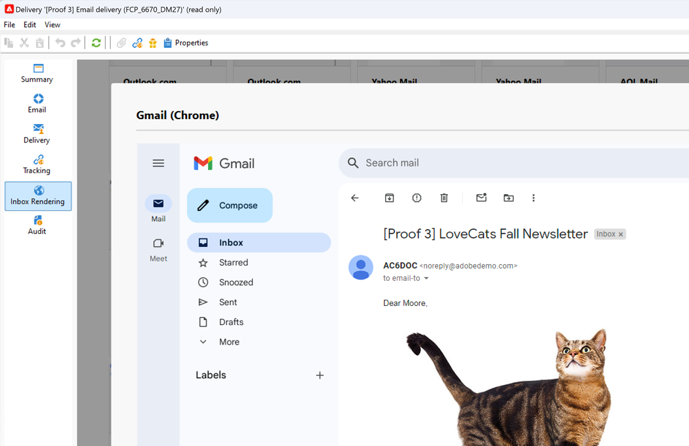

# Inbox Rendering{#inbox-rendering}

## Über Inbox Rendering {#about-inbox-rendering}

Bevor Sie die Schaltfläche **Senden** betätigen, sollten Sie sicherstellen, dass Ihre Nachricht den Empfängern in unterschiedlichen Webclients, Webmails und Geräten optimal dargestellt wird.

Zu diesem Zweck nutzt Adobe Campaign die webbasierte E-Mail-Test-Software [Litmus](https://litmus.com/email-testing){target="_blank"}, mit der die Darstellung der Seiten sichtbar und in einem Bericht verfügbar gemacht werden kann. Dadurch haben Sie die Möglichkeit, sich die gesendete Nachricht als Vorschau in den unterschiedlichen Umgebungen der Empfänger anzusehen und die Kompatibilität mit den wichtigsten Desktops und Anwendungen zu überprüfen.

>[!CAUTION]
>Inbox Rendering ist nicht kompatibel mit dem [wiederkehrenden Versand](../../automation/workflow/recurring-delivery.md).

Litmus verfügt über zahlreiche Funktionen zur E-Mail-Validierung und Vorschau. Autoren von E-Mail-Inhalten können Nachrichten in der Vorschau in über 70 E-Mail-Rendering-Systemen betrachten, wie z. B. im Gmail-Posteingang oder im Apple Mail Client.

Die für das **Inbox Rendering** in Adobe Campaign verfügbaren Clients für Mobilgeräte, SMS und Webmail finden Sie auf der Litmus-[Website](https://litmus.com/email-testing){target="_blank"} (wählen Sie dazu die Option zum **Anzeigen aller E-Mail-Clients** aus).

>[!NOTE]
>
>Zum Testen der Personalisierung in Sendungen ist kein Inbox Rendering nötig. Die Personalisierung kann auch mit Adobe Campaign-Tools, z. B. der **[!UICONTROL Vorschau]** und [Testsendungen](preview-and-proof.md#send-proofs), überprüft werden.

## Über Litmus-Token {#about-litmus-tokens}

Da Litmus ein Dienst eines Drittanbieters ist, wird für jede Nutzung eine Gebühr erhoben. Jedes Mal, wenn ein Benutzer die Litmus-Funktion aufruft, wird ein bestimmter Betrag vom Guthaben abgezogen.

In Adobe Campaign entspricht das Guthaben der Anzahl der verfügbaren Renderings (auch Tokens genannt).

>[!NOTE]
>
>Die Anzahl der verfügbaren Litmus-Token hängt von der von Ihnen erworbenen Campaign-Lizenz ab. Diese Information können Sie Ihrem Lizenzabkommen entnehmen.

Jedes Mal, wenn Sie in einem Versand die Funktion **[!UICONTROL Inbox Rendering]** verwenden, wird die verfügbare Anzahl der Token um jeweils eins verringert.

>[!IMPORTANT]
>
>Token werden für jedes einzelne Rendering abgezogen, und nicht für den gesamten Inbox-Rendering-Bericht.
>
>* Das bedeutet, dass jedes Mal, wenn ein Inbox-Rendering-Bericht erstellt wird, pro E-Mail-Client ein Token abgezogen wird: ein Token für das Rendering in Outlook 2000, einer für das Rendering in Outlook 2010, einer für das Rendering in Apple Mail 9 usw.
>* Wenn Sie für denselben Versand das Inbox Rendering wiederholen, wird die Anzahl der verfügbaren Token nochmals um die Anzahl der erzeugten Renderings reduziert.
>

Die Anzahl der restlichen verfügbaren Token wird im [Inbox-Rendering-Bericht](#inbox-rendering-report) angezeigt.

Normalerweise wird die Inbox-Rendering-Funktion zum Testen des HTML-Gerüsts einer neu erstellten E-Mail verwendet. Pro Rendering sind ca. 70 Token erforderlich (abhängig von der Anzahl der getesteten Umgebungen). In manchen Fällen sind aber mehrere Inbox-Rendering-Berichte erforderlich, um Ihren Versand vollständig zu testen. Es könnte deshalb eine größere Anzahl von Token nötig sein, um mehrere Prüfungen durchzuführen.

## Inbox-Rendering-Bericht aufrufen {#accessing-the-inbox-rendering-report}

Nachdem Sie Ihren E-Mail-Versand erstellt und seinen Inhalt sowie die Zielpopulation definiert haben, folgen Sie den unten stehenden Schritten.

Weiterführende Informationen zur Erstellung, Konzeption und Ausrichtung eines Versands finden Sie in [diesem Abschnitt](defining-the-email-content.md).

1. Wählen Sie in der Symbolleiste des Versands die Schaltfläche **[!UICONTROL Inbox Rendering]** aus.

1. Wählen Sie **[!UICONTROL Analysieren]** aus, um den Aufnahmeprozess zu starten.

   

   Ein Testversand wird durchgeführt. Die Rendering-Miniaturansichten können wenige Minuten nach dem Versand der E-Mails in diesem Testversand aufgerufen werden. Weiterführende Informationen dazu finden Sie in [diesem Abschnitt](preview-and-proof.md#send-proofs).

1. Nach dem Absenden erscheint der Testversand in der Versandliste. Dort kann er durch einen Doppelklick geöffnet werden.

   

1. Gehen Sie zum Tab **Inbox Rendering** des Testversands.

   

   Der Inbox-Rendering-Bericht wird angezeigt.

## Inbox-Rendering-Bericht {#inbox-rendering-report}

Dieser Bericht enthält Informationen zum Inbox Rendering, d. h. zur Darstellung der E-Mail in der Inbox der Empfangenden. Die Renderings können unterschiedlich aussehen, je nachdem, ob die E-Mail in einem Browser, auf einem Mobilgerät oder über eine E-Mail-Anwendung geöffnet wird.

Im oberen Bereich wird in einer grafischen, farbcodierten Darstellung die Aufteilung der Anzahl der empfangenen, unerwünschten (Spam) und nicht empfangenen Nachrichten angezeigt und die Anzahl der Nachrichten, deren Empfang aussteht.

{width="40%" align="left"}

Bewegen Sie den Mauszeiger über das Diagramm, um Informationen zu jeder Farbe aufzurufen. Klicken Sie auf ein Element in der Liste, um die entsprechende Kategorie im Diagramm auszublenden oder anzuzeigen.

Der Hauptteil des Berichts ist in drei Teile unterteilt: **[!UICONTROL Mobilgerät]**, **[!UICONTROL Desktop]** und **[!UICONTROL Webmails]**. Scrollen Sie im Bericht nach unten, um alle in diese drei Kategorien eingeteilten Renderings anzusehen.

Klicken Sie auf eine der Karten, um das entsprechende Rendering im Detail anzusehen. Das Rendering wird für das jeweils ausgewählte Empfangsmedium angezeigt.

