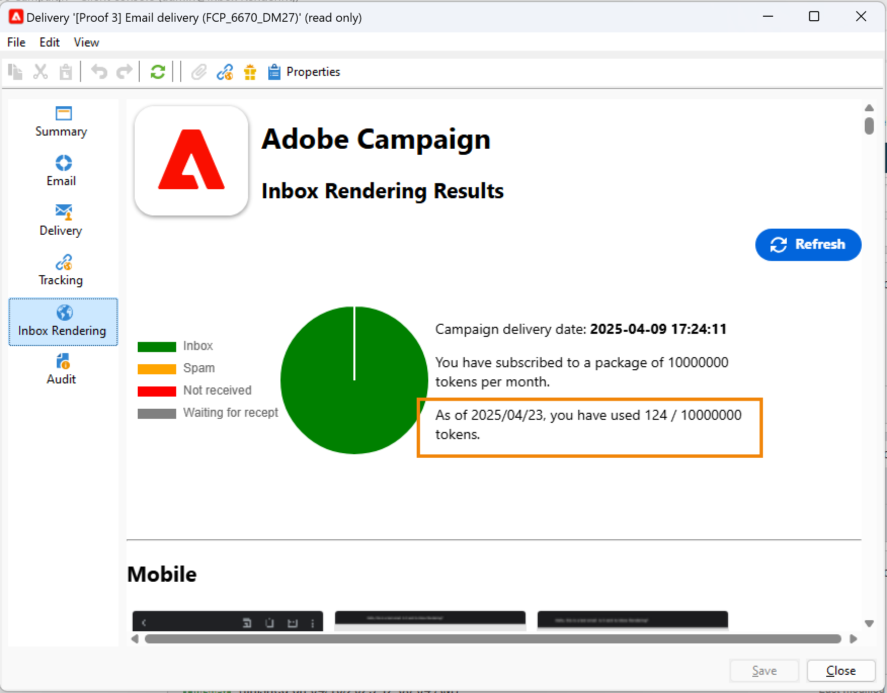
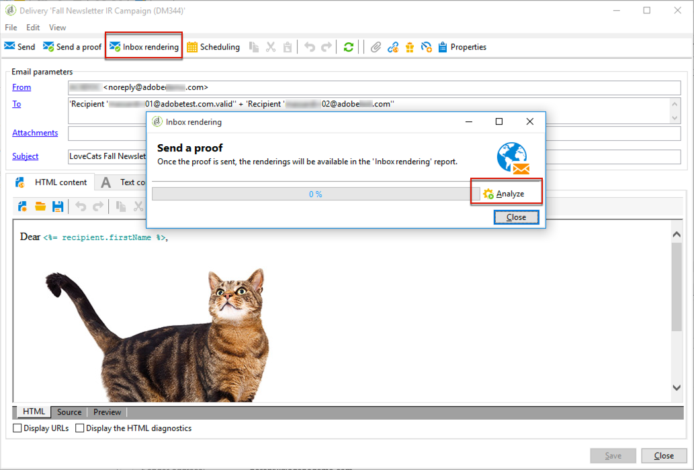
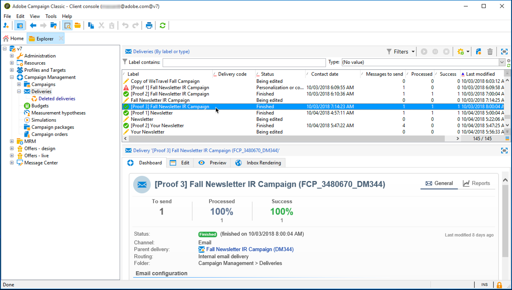
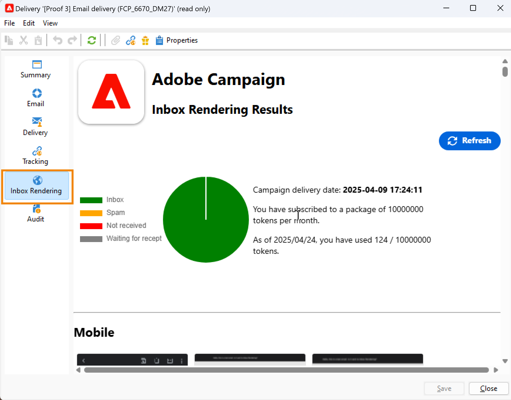
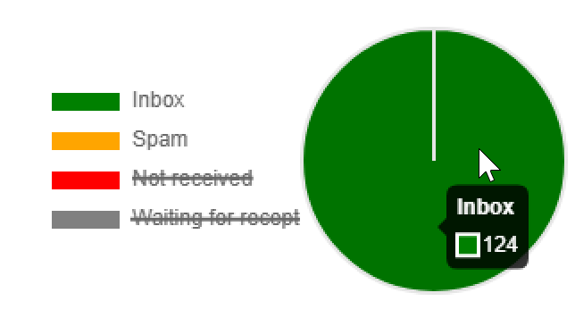
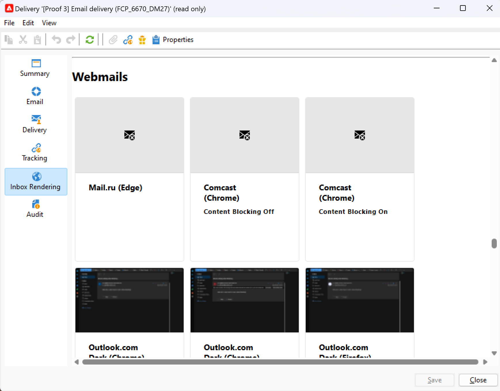
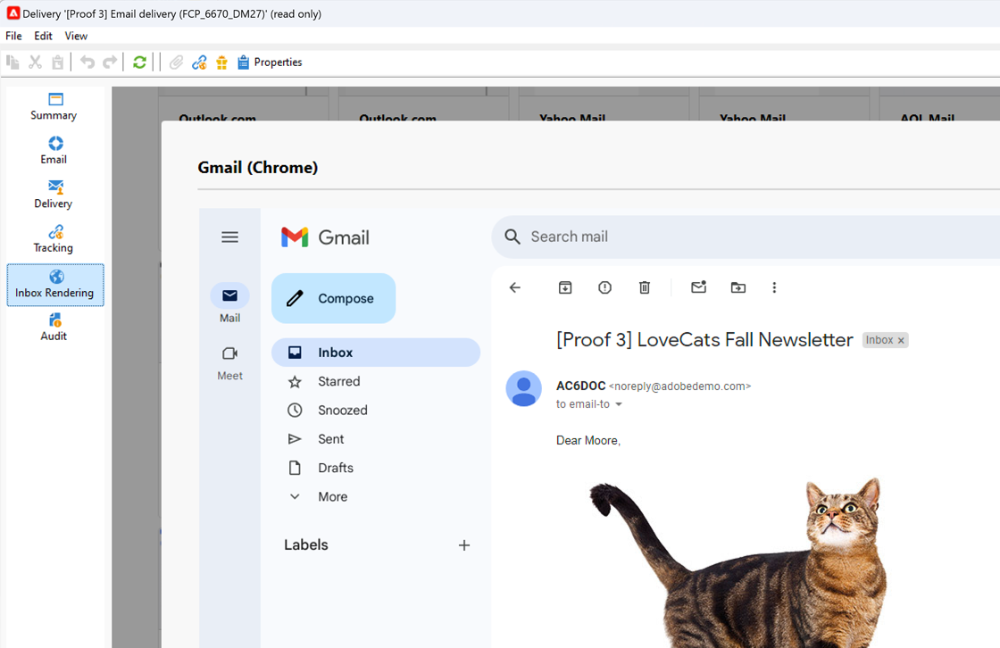

# Rendern des Posteingangs{#inbox-rendering}

## Über Inbox Rendering {#about-inbox-rendering}

Bevor Sie die Schaltfläche **Senden** betätigen, sollten Sie sicherstellen, dass Ihre Nachricht den Empfängern in unterschiedlichen Webclients, Webmails und Geräten optimal dargestellt wird.

Um dies zu ermöglichen, nutzt Adobe Campaign die [Litmus](https://litmus.com/email-testing){target="_blank"} Web-basierte E-Mail-Testlösung, um die Renderings zu erfassen und in einem dedizierten Bericht verfügbar zu machen. Auf diese Weise können Sie eine Vorschau der gesendeten Nachricht in den verschiedenen Kontexten anzeigen, in denen sie empfangen werden kann, und die Kompatibilität mit den wichtigsten Desktops und Anwendungen überprüfen.

>[!CAUTION]
>Inbox Rendering ist nicht kompatibel mit dem [wiederkehrenden Versand](../../automation/workflow/recurring-delivery.md).

Litmus ist eine funktionsreiche E-Mail-Validierungs- und Vorschau-Anwendung. Damit können Ersteller von E-Mail-Inhalten ihren Nachrichteninhalt in über 70 E-Mail-Renderern in der Vorschau anzeigen, z. B. im Gmail-Posteingang oder im Apple Mail-Client.

Die für das **Inbox Rendering** in Adobe Campaign verfügbaren Clients für Mobilgeräte, SMS und Webmail finden Sie auf der Litmus-[Website](https://litmus.com/email-testing){target="_blank"} (wählen Sie dazu die Option zum **Anzeigen aller E-Mail-Clients** aus).

>[!NOTE]
>
>Zum Testen der Personalisierung in Sendungen ist kein Inbox Rendering nötig. Die Personalisierung kann auch mit Adobe Campaign-Tools, z. B. der **[!UICONTROL Vorschau]** und [Testsendungen](preview-and-proof.md#send-proofs), überprüft werden.

## Über Litmus-Token {#about-litmus-tokens}

Da Litmus ein Drittanbieterdienst ist, funktioniert es nach einem Kredit-pro-Nutzung-Modell. Jedes Mal, wenn ein Benutzer die Litmus-Funktion aufruft, wird eine Gutschrift abgezogen.

In Adobe Campaign entspricht das Guthaben der Anzahl der verfügbaren Renderings (auch Tokens genannt).

>[!NOTE]
>
>Die Anzahl der verfügbaren Litmus-Token hängt von der von Ihnen erworbenen Campaign-Lizenz ab. Überprüfen Sie Ihre Lizenzvereinbarung.

Jedes Mal, wenn Sie in einem Versand die Funktion **[!UICONTROL Inbox Rendering]** verwenden, wird die verfügbare Anzahl der Token um jeweils eins verringert.

>[!IMPORTANT]
>
>Token werden für jedes einzelne Rendering abgezogen, und nicht für den gesamten Inbox-Rendering-Bericht.
>
>* Das bedeutet, dass jedes Mal, wenn ein Inbox-Rendering-Bericht erstellt wird, pro E-Mail-Client ein Token abgezogen wird: ein Token für das Rendering in Outlook 2000, einer für das Rendering in Outlook 2010, einer für das Rendering in Apple Mail 9 usw.
>* Wenn Sie für denselben Versand das Inbox Rendering wiederholen, wird die Anzahl der verfügbaren Token nochmals um die Anzahl der erzeugten Renderings reduziert.
>

Die Anzahl der restlichen verfügbaren Token wird im [Inbox-Rendering-Bericht](#inbox-rendering-report) angezeigt.

Normalerweise wird die Rendering-Funktion für den Posteingang verwendet, um das HTML-Framework einer neu entworfenen E-Mail zu testen. Für jedes Rendering sind etwa 70 Token erforderlich (je nach der Anzahl der Umgebungen, in denen im Allgemeinen getestet wird). In einigen Fällen benötigen Sie jedoch möglicherweise mehrere Inbox Rendering-Berichte, um Ihren Versand vollständig zu testen. Daher kann es mehr Token erfordern, um mehrere Prüfungen durchzuführen.

## Inbox-Rendering-Bericht aufrufen {#accessing-the-inbox-rendering-report}

Nachdem Sie Ihren E-Mail-Versand erstellt und seinen Inhalt sowie die Zielpopulation definiert haben, folgen Sie den unten stehenden Schritten.

Weiterführende Informationen zur Erstellung, Planung und Zielgruppenbestimmung eines Versands finden Sie auf dieser [Seite](defining-the-email-content.md).

1. Wählen Sie in der Symbolleiste des Versands die Schaltfläche **[!UICONTROL Inbox Rendering]** aus.

1. Wählen Sie **[!UICONTROL Analysieren]** aus, um den Aufnahmeprozess zu starten.

   

   Ein Testversand wird durchgeführt. Die Rendering-Miniaturen können in diesem Korrekturabzug einige Minuten nach dem Senden der E-Mails aufgerufen werden. Weiterführende Informationen dazu finden Sie in [diesem Abschnitt](preview-and-proof.md#send-proofs).

1. Nach dem Versand wird der Testversand in der Versandliste angezeigt. Doppelklicken Sie darauf.

   

1. Gehen Sie zum Tab **Inbox Rendering** des Testversands.

   

   Der Inbox-Rendering-Bericht wird angezeigt.

## Inbox-Rendering-Bericht {#inbox-rendering-report}

Dieser Bericht zeigt die Inbox Renderings so an, wie sie dem Empfänger angezeigt werden. Die Renderings können je nachdem, wie der Empfänger den E-Mail-Versand öffnet, unterschiedlich sein: im Browser, auf einem Mobilgerät oder über eine E-Mail-Anwendung.

Im oberen Bereich wird in einer grafischen, farbcodierten Darstellung die Aufteilung der Anzahl der empfangenen, unerwünschten (Spam) und nicht empfangenen Nachrichten angezeigt und die Anzahl der Nachrichten, deren Empfang aussteht.

{width="40%" align="left"}

Bewegen Sie den Mauszeiger über das Diagramm, um Informationen zu jeder Farbe aufzurufen. Klicken Sie auf ein Element in der Liste, um die entsprechende Kategorie im Diagramm auszublenden oder anzuzeigen.

Der Hauptteil des Berichts ist in drei Teile unterteilt: **[!UICONTROL Mobilgerät]**, **[!UICONTROL Desktop]** und **[!UICONTROL Webmails]**. Scrollen Sie im Bericht nach unten, um alle in diese drei Kategorien eingeteilten Renderings anzusehen.

Klicken Sie auf eine der Karten, um das entsprechende Rendering im Detail anzusehen. Das Rendering wird für das jeweils ausgewählte Empfangsmedium angezeigt.

