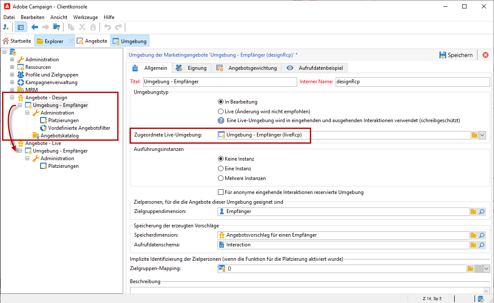
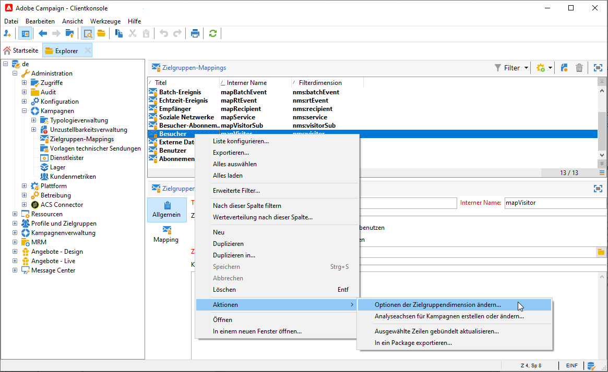
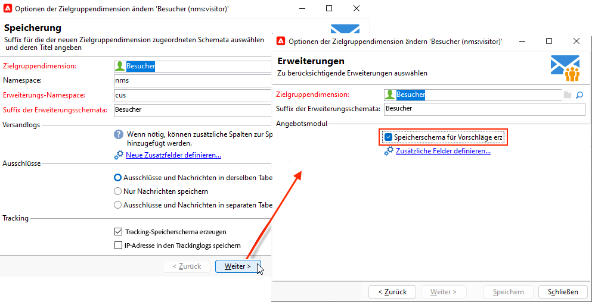

# Live- und Design-Umgebung{#live-design-environments}

Interaction arbeitet mit zwei Angebotsumgebungstypen:

* **[!UICONTROL Design-Umgebungen]**, in denen Angebote erstellt und geändert werden können. Vor Validierung der Angebote oder etwaiger Änderungen stehen sie nicht zur Unterbreitung zur Verfügung.
* **[!UICONTROL Live-Umgebungen]**, in denen die validierten Angebote zur Unterbreitung zur Verfügung stehen. Die hier enthaltenen Angebote sind schreibgeschützt.

Jeder **[!UICONTROL Design-Umgebung]** entspricht eine **[!UICONTROL Live-Umgebung]**. Nach Erstellung eines Angebots unterlaufen sein Inhalt und die konfigurierten Eignungsregeln einen Validierungszyklus, nach dessen erfolgreichem Abschluss das Angebot automatisch für die **[!UICONTROL Live-Umgebung]** freigegeben wird. Nun kann es in Sendungen verwendet werden.

Standardmäßig ist eine **[!UICONTROL Design]**-Umgebung und eine **[!UICONTROL Live]**-Umgebung mit ihr verknüpft. Beide Umgebung sind für die Zielgruppe der [integrierten Empfänger-Tabelle](../dev/datamodel.md#ootb-profiles) vorkonfiguriert.

>[!NOTE]
>
>Zur Zielgruppe der Empfänger-Tabelle müssen Sie den Zielgruppen-Mapping-Assistenten verwenden, um die Umgebung zu erstellen. [Weitere Informationen](#creating-an-offer-environment).

Versand-Manager können nur die **[!UICONTROL Live]**-Umgebung Ansicht und Angebot nutzen, um sie bereitzustellen. Angebot-Manager können die Umgebung **[!UICONTROL Design]** und die Ansicht der Umgebung **[!UICONTROL Live]** verwenden. [Weitere Informationen](interaction-operators.md).

## Erstellen einer Angebot-Umgebung {#creating-an-offer-environment}

Die Kampagne verfügt standardmäßig über eine integrierte Umgebung zur Zielgruppe der Empfänger-Tabelle (identifizierte Angebot). Gehen Sie wie folgt vor, um eine andere Tabelle Zielgruppe:

1. Gehen Sie zu **[!UICONTROL Administration]** > **[!UICONTROL Kampagnenverwaltung]** > **[!UICONTROL Versand-Zuordnungen]**, klicken Sie mit der rechten Maustaste auf die gewünschte Versand-Zuordnung und wählen Sie **[!UICONTROL Aktionen]** > **[!UICONTROL Ändern Sie die Optionen der Zielgruppendimension]**.

   

1. Klicken Sie auf **[!UICONTROL Weiter]**, wählen Sie die Option **[!UICONTROL Datenspeicherung für Vorschläge erstellen]** und klicken Sie auf **[!UICONTROL Speichern]**.

   

   >[!NOTE]
   >
   >Wenn die Option bereits aktiviert ist, deaktivieren Sie sie und überprüfen Sie sie erneut.

1. Adobe Campaign erstellt zwei Umgebung - **[!UICONTROL Design]** und **[!UICONTROL Live]** - mit Targeting-Informationen aus dem zuvor aktivierten Zielgruppen-Mapping. Die Umgebung ist mit den Targeting-Informationen vorkonfiguriert.
