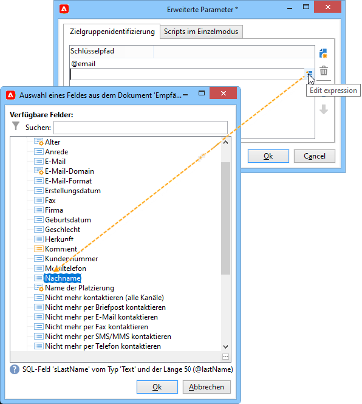
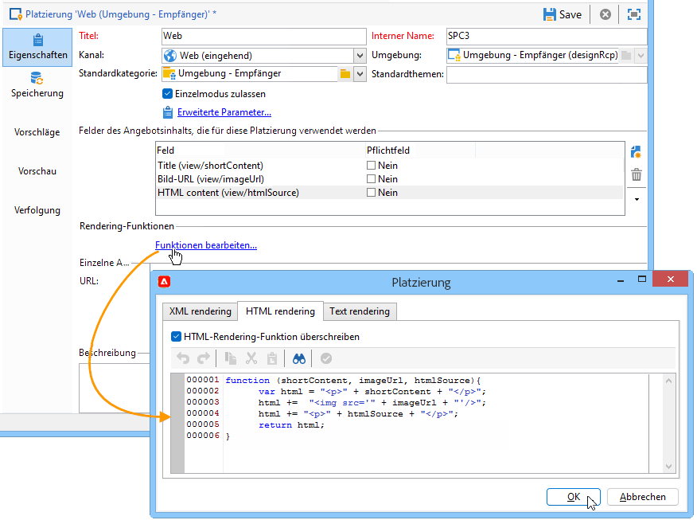
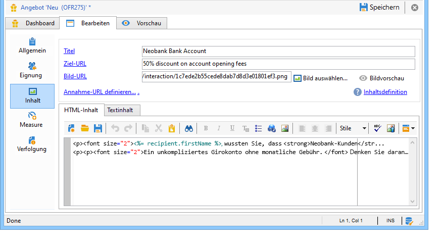
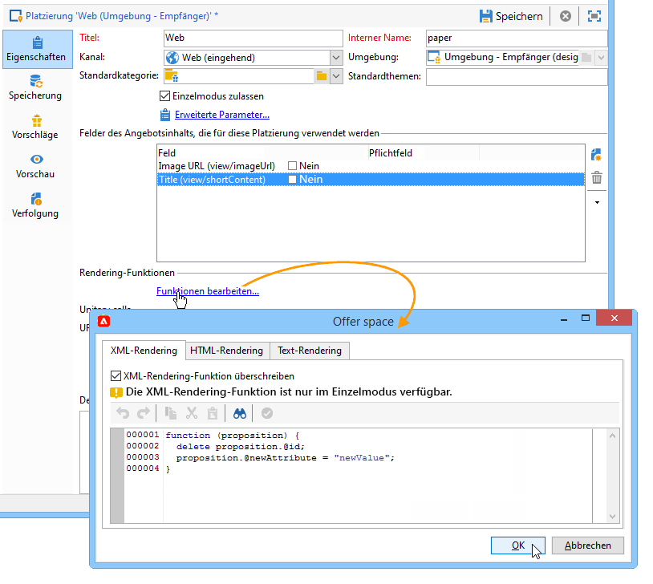

# Hinzufügen eines Angebots auf einer Webseite{#add-an-offer-in-web}

Um das Angebotsmodul auf einer Webseite aufzurufen, fügen Sie einen JavaScript-Aufruf direkt in die Seite ein. Dieser Aufruf gibt den Angebotsinhalt in einem Zielelement zurück.

Die URL des Aufruf-Scripts stellt sich wie folgt dar:

```
<script id="interactionProposalScript" src="https://<SERVER_URL>/nl/interactionProposal.js?env=" type="text/javascript"></script>
```

Der Parameter &quot;**env**&quot; erhält den internen Namen der anonymen Interaktionen vorbehaltenen Live-Umgebung.

Um ein Angebot zu unterbreiten, müssen somit eine Umgebung und eine Platzierung in Adobe Campaign erstellt sowie eine HTML-Seite konfiguriert werden.

Unten stehend werden verschiedene Integrationsmöglichkeiten mit JavaScript beispielhaft dargestellt.

## Option 1: HTML-Modus {#html-mode}

### Anonyme Angebote unterbreiten {#presenting-an-anonymous-offer}

**Schritt 1: Angebotsmodul vorbereiten**

1. Konfigurieren Sie in Adobe Campaign eine anonyme Umgebung.
1. Erstellen Sie dann eine dieser Umgebung zugeordnete Platzierung.
1. Erstellen Sie schließlich ein Angebot und eine der Platzierung entsprechende Darstellung.

**Schritt 2: Inhalt der HTML-Seite aktualisieren**

Die HTML-Seite muss ein Element mit dem Attribut @id mit dem internen Namen der erstellten Platzierung (&quot;i_internal name space&quot;) enthalten. Das Angebot wird durch Interaction in dieses Element eingefügt.

Im vorliegenden Beispiel nimmt das Attribut @id den Wert &quot;i_SPC12&quot; an, wobei &quot;SPC12&quot; der interne Name der zuvor erstellten Platzierung ist:

```
<div id="i_SPC12"></div>
```

Im vorliegenden Beispiel stellt sich die URL des Script-Aufrufs wie folgt dar (&quot;OE3&quot; ist der interne Name der Live-Umgebung):

```
<script id="interactionProposalScript" src="https://instance.adobe.org:8080/nl/interactionProposal.js?env=OE3" type="text/javascript"></script>
```

>[!CAUTION]
>
>Das `<script>`-Element darf nicht in sich geschlossen sein.

Dieser statische Aufruf generiert automatisch einen dynamischen Aufruf, der alle vom Angebotsmodul benötigten Parameter enthält.

Auf diese Weise können Sie mehrere Platzierungen auf derselben Seite verwenden, die durch einen einzelnen Aufruf des Angebotsmoduls verwaltet werden.

**Schritt 3: Ergebnisse auf der HTML-Seite anzeigen**

Der Inhalt der Angebotsdarstellung wird vom Angebotsmodul an die HTML-Seite zurückgegeben:

```
<div id="banner_header">
 <div id="i_SPC12">
   <table>
    <tbody>
        <tr>
            <td><h3>Fly to Japan!</h3></td>
        </tr>
        <tr>
            <td></td>
            <td>
            <p>Discover Japan for 2 weeks at an unbelievable price!!</p>
            <p><b>2345 Dollars - All inclusive</b></p>
        </td>
        </tr>
    </tbody>
    </table>
 </div>
<script src="https://instance.adobe.org:8080/nl/interactionProposal.js?env=OE3" id="interactionProposalScript" type="text/javascript"></script>
</div>
```

### Angebote für identifizierte Kontakte {#presenting-an-identified-offer}

Um einem identifizierten Kontakt ein Angebot zu unterbreiten, ähnelt der Prozess dem detaillierten [in diesem Abschnitt](#presenting-an-anonymous-offer).

Fügen Sie im Inhalt der Webseite das folgende Script hinzu, das den Kontakt beim Aufruf des Angebotsmoduls identifiziert:

```
<script type="text/javascript">
  interactionTarget = <contact_identifier>;
</script>
```

1. Klicken Sie in der Platzierung, die von der Webseite aus aufgerufen werden soll, auf **[!UICONTROL Erweiterte Parameter]** und fügen Sie mindestens einen Identifikationsschlüssel hinzu.

   

   Im vorliegenden Beispiel handelt es sich um einen zusammengesetzten Identifikationsschlüssel, da er sowohl auf die E-Mail-Adresse als auch auf den Namen des Kontakts Bezug nimmt.

1. Bei der Anzeige der Webseite ermöglicht die Auswertung des Scripts die Weitergabe der Empfänger-ID an das Angebotsmodul. Wenn die ID zusammengesetzt ist, werden die Schlüssel in derselben Reihenfolge angezeigt wie in den erweiterten Einstellungen und durch eine |.

   Im folgenden Beispiel hat sich der Kontakt bei der Website angemeldet und wurde durch seine E-Mail-Adresse und seinen Namen bei der Abfrage des Angebotsmoduls erkannt.

   ```
   <script type="text/javascript">
     interactionTarget = myEmail|myName;
   </script>
   ```

### HTML-Rendering-Funktion verwenden {#using-an-html-rendering-function}

Die Verwendung einer HTML-Rendering-Funktion bietet den Vorteil, das die HTML-Darstellung des Angebots automatisch erzeugt wird.

1. Klicken Sie in der Angebotsplatzierung auf den Link **[!UICONTROL Funktionen bearbeiten...]**.
1. Kreuzen Sie die Option **[!UICONTROL HTML-Rendering-Funktion überschreiben]** an.
1. Geben Sie dann im Tab **[!UICONTROL HTML-Rendering]** die den in der Platzierung für den Angebotsinhalt definierten Feldern entsprechenden Variablen ein.

   

   Im vorliegenden Beispiel wird das Angebot in Form eines Webseitenbanners unterbreitet. Es besteht aus einem anklickbaren Bild mit Untertitel, entsprechend den im Angebotsinhalt definierten Feldern.

## Option 2: XML-Modus {#xml-mode}

### Angebote unterbreiten {#presenting-an-offer}

Kampagne **Interaction** -Modul können Sie einen XML-Knoten an die HTML-Seite zurückgeben, die das Angebotsmodul aufruft. Dieser XML-Knoten kann von Funktionen verarbeitet werden, die auf Kundenseite entwickelt werden.

Der Aufruf des Angebotsmoduls sieht wie folgt aus:

```
<script type="text/javascript" id="interactionProposalScript" src="https://<SERVER_URL>/nl/interactionProposal.js?env=&cb="></script>
```

* Der Parameter &quot;**env**&quot; erhält den internen Namen der Live-Umgebung.

* Der optionale Parameter &quot;**cb**&quot; erhält den Namen der Funktion, die den vom Angebotsmodul zurückgegebenen XML-Knoten auswerten wird (Callback).

* Der optionale Parameter &quot;**t**&quot; erhält bei Interaktionen mit identifizierten Kontakten die Kennung des Kontakts. Der Parameter kann auch mit der Variablen **interactionTarget** übergeben werden.

* Der optionale Parameter &quot;**c**&quot; erhält die Liste der internen Kategorienamen.

* Der optionale Parameter &quot;**th**&quot; erhält die Liste der Themen.

* Der optionale Parameter &quot;**gctx**&quot; erhält die globalen Aufrufdaten (Kontext) der gesamten Seite.

Der zurückgegebene XML-Knoten stellt sich wie folgt dar:

```
<propositions>
 <proposition id="" offer-id="" weight="" rank="" space="" div=""> //proposition identifiers
   ...XML content defined in Adobe Campaign...
 </proposition>
 ...
</propositions>
```

Im folgenden Anwendungsbeispiel werden die Konfigurationen beschrieben, die in Adobe Campaign durchgeführt werden sollen, um den XML-Modus zu aktivieren. Anschließend wird das Ergebnis des Modulaufrufs auf der HTML-Seite angezeigt.

1. **Umgebung und Platzierung erstellen**

   Weiterführende Informationen zur Erstellung einer Umgebung finden Sie im Abschnitt [diese Seite](interaction-env.md).

   Die Erstellung einer Platzierung wird im Abschnitt [diese Seite](interaction-offer-spaces.md).

1. **Erweitern des Angebotsschemas, um neue Felder hinzuzufügen**

   Das Schema definiert die Felder Titel 2 und Preis.

   Im vorliegenden Beispiel trägt es den Namen **cus:offer**.

   ```
   <srcSchema _cs="Marketing offers (cus)" created="2013-01-18 17:14:20.762Z" createdBy-id="0"
              desc="" entitySchema="xtk:srcSchema" extendedSchema="nms:offer" img="nms:offer.png"
              label="Marketing offers" labelSingular="Marketing offers" lastModified="2013-01-18 15:20:18.373Z"
              mappingType="sql" md5="F14A7AA009AE1FCE31B0611E72866AC3" modifiedBy-id="0"
              name="offer" namespace="cus" xtkschema="xtk:srcSchema">
     <createdBy _cs="Administrator (admin)"/>
     <modifiedBy _cs="Administrator (admin)"/>
     <element img="nms:offer.png" label="Marketing offers" labelSingular="Marketing offer"
              name="offer">
       <element label="Content" name="view">
         <element label="Price" name="price" type="long" xml="true"/>
         <element label="Title 2" name="title2" type="string" xml="true"/>
   
         <element advanced="true" desc="Price calculation script." label="Script price"
                  name="price_jst" type="CDATA" xml="true"/>
         <element advanced="true" desc="Title calculation script." label="Script title"
                  name="title2_jst" type="CDATA" xml="true"/>
       </element>
     </element>
   </srcSchema>
   ```

   >[!CAUTION]
   >
   >Jedes Element muss zweimal definiert werden. CDATA-Elemente (&quot;_jst&quot;) können Personalisierungsfelder enthalten.
   >
   >Nach der Schemaerweiterung ist eine Aktualisierung der Datenbankstruktur erforderlich!

   Sie können das Angebotsschema erweitern, um neue Felder sowohl im Batch- als auch im Einzelmodus sowie in jedem beliebigen Format (Text, HTML und XML) hinzuzufügen.

1. **Erweiterung der Angebotsformel, um neue Felder zu bearbeiten und ein vorhandenes Feld zu ändern**

   Öffnen Sie das Formular **Angebot (nms)**.

   Fügen Sie im Abschnitt &quot;Views&quot; die zwei neuen Felder mit folgendem Inhalt ein:

   ```
   <input label="Title 2" margin-right="5" prebuildSubForm="false" type="subFormLink" xpath="title2_jst">
        <form label="Edit title 2" name="editForm" nothingToSave="true">
            <input nolabel="true" toolbarAlign="horizontal" type="jstEdit" xpath="." xpathInsert="/ignored/customizeTitle2">
            <container>
                <input menuId="viewMenuBuilder" options="inbound" type="customizeBtn" xpath="/ignored/customizeTitle2"/>
            </container>
            </input>
        </form>
    </input>
    <input nolabel="true" type="edit" xpath="title2_jst"/>
    <input label="Price" margin-right="5" prebuildSubForm="false" type="subFormLink" xpath="price_jst">
        <form label="Edit price" name="editForm" nothingToSave="true">
        <input nolabel="true" toolbarAlign="horizontal" type="jstEdit" xpath="." xpathInsert="/ignored/customizePrice">
            <container>
                <input menuId="viewMenuBuilder" options="inbound" type="customizeBtn" xpath="/ignored/customizePrice"/>
            </container>
        </input>
        </form>
    </input>
    <input colspan="2" label="Prix" nolabel="true" type="number" xpath="price_jst"/>
   ```

   Kommentieren Sie das Ziel-URL-Feld:

   

   >[!CAUTION]
   >
   >Die Formularfelder (`<input>`) müssen auf die im zuvor erstellten Schema definierten CDATA-Elemente verweisen.

   Im Formular der Angebotsdarstellungen schlagen sich die Änderungen wie folgt nieder:

   

   Die Felder **[!UICONTROL Titel 2]** und **[!UICONTROL Preis]** wurden eingefügt und das Feld **[!UICONTROL Ziel-URL]** wird nicht mehr angezeigt.

1. **Angebot erstellen**

   Die Erstellung von Angeboten wird im Abschnitt [diese Seite](interaction-offer.md).

   Im vorliegenden Anwendungsbeispiel wird das Angebot wie folgt konfiguriert:

   

1. **Angebot validieren**

   Validieren Sie das Angebot oder lassen Sie es validieren und aktivieren Sie es in der zuvor erstellten Platzierung, um es in der entsprechenden Live-Umgebung verfügbar zu machen.

1. **Abfrage des Angebotsmoduls und Ergebnis in der HTML-Seite**

   Der Aufruf des Angebotsmoduls auf der HTML-Seite sieht wie folgt aus:

   ```
   <script id="interactionProposalScript" src="https://<SERVER_URL>/nl/interactionProposal.js?env=OE7&cb=alert" type="text/javascript">
   ```

   Der Parameter &quot;**env**&quot; nimmt als Wert den internen Namen der Live-Umgebung an.

   Der Parameter &quot;**cb**&quot; nimmt als Wert den Namen der Funktion an, die den vom Angebotsmodul zurückgegebenen XML-Knoten auswerten soll. Im vorliegenden Beispiel öffnet die aufgerufene Funktion ein Modalfenster (alert()-Funktion).

   Der vom Angebotsmodul zurückgegebene XML-Knoten sieht wie folgt aus:

   ```
   <propositions>
    <proposition id="a28002" offer-id="10322005" weight="1" rank="1" space="SPC14" div="i_SPC14">
     <xmlOfferView>
      <title>Travel to Russia</title>
      <price>3456</price>
      <description>Discover this vacation package!INCLUDES 10 nights. FEATURES buffet breakfast daily. BONUS 5th night free.</description>
      <image>
       <path>https://myinstance.com/res/Track/ae1d2113ed732d58a3beb441084e5960.jpg</path>
       <alt>Travel to Russia</alt>
      </image>
     </xmlOfferView>
    </proposition>
   </propositions>
   ```

### Rendering-Funktion verwenden {#using-a-rendering-function-}

Es ist möglich, eine Angebotsunterbreitung mithilfe einer XML-Rendering-Funktion zu erstellen. Diese Funktion ändert den XML-Knoten, der beim Aufruf des Angebotsmoduls an die HTML-Seite zurückgegeben wird.

1. Klicken Sie in der Angebotsplatzierung auf den Link **[!UICONTROL Funktionen bearbeiten...]**.
1. Kreuzen Sie die Option **[!UICONTROL XML-Rendering-Funktion überschreiben]** an.
1. Fügen Sie im Tab **[!UICONTROL XML-Rendering]** die gewünschte Funktion ein.

   Die Funktion kann folgendem Beispiel entsprechen:

   ```
   function (proposition) {
     delete proposition.@id;
     proposition.@newAttribute = "newValue";
   } 
   ```



## SOAP-Integration einrichten

Die für die Angebotsverwaltung verfügbaren SOAP-Webservices unterscheiden sich von den in Adobe Campaign gewöhnlich verwendeten. Sie sind über die im vorangehenden Kapitel beschriebene Interaction-URL zugänglich und ermöglichen es, ein Angebot für einen spezifischen Kontakt vorzuschlagen oder zu aktualisieren.

### Angebotsvorschläge {#offer-proposition}

Für Angebotsvorschläge über SOAP muss der Befehl **nms:proposition#Propose** hinzugefügt werden, gefolgt von im Anschluss erläuterten Parametern:

* **targetId** - Primärschlüssel des Kontakts (es kann sich um einen zusammengesetzten Schlüssel handeln).
* **maxCount** - gibt die Anzahl an Angebotsvorschlägen für den Kontakt an.
* **context** - erlaubt das Einfügen von Kontextdaten in das Platzierungsschema. Wenn das verwendete Schema **nms:interaction** lautet, sollte **`<empty>`** hinzugefügt werden.
* **categories** - bezeichnet die Kategorie, der die vorgeschlagenen Angebote angehören müssen.
* **themes** - bezeichnet die Themen, denen die vorgeschlagenen Angebote entsprechen müssen.
* **uuid** - Wert des permanenten Adobe-Campaign-Cookies (&quot;uuid230&quot;).
* **nlid** - Wert des Adobe-Campaign-Sitzungs-Cookies (&quot;nlid&quot;).
* **noProp** - Angabe des Werts &quot;true&quot;, wenn keine Vorschläge eingefügt werden sollen.

>[!NOTE]
>
>**targetId** und **maxCount** sind Pflichtparameter, die Angabe der anderen ist optional.

Als Antwort auf die Abfrage gibt der SOAP-Dienst folgende Parameter zurück:

* **interactionId** - Kennung der Interaktion.
* **propositions** - das die Liste der Vorschläge enthaltene XML-Element. Jeder Vorschlag verfügt über eine Kennung und eine spezifische HTML-Darstellung.

### Angebotsaktualisierung {#offer-update}

Ergänzen Sie die URL mit dem Befehl **nms:interaction#UpdateStatus** und folgenden Parametern:

* **proposition** - die die vom Angebotsmodul ausgegebene Vorschlagskennung enthaltende Zeichenkette. Siehe [Angebotsvorschläge](#offer-proposition).
* **status** - Zahl, die den neuen Status des Angebots angibt. Die möglichen Werte sind in der Auflistung **propositionStatus**, im Schema **nms:common** aufgeführt. Beispielsweise entspricht die Zahl 3 werksmäßig dem Status **Akzeptiert**.
* **context** - XML-Element, mit dem Sie Kontextdaten zum Platzierungsschema hinzufügen können. Wenn das verwendete Schema **nms:interaction** lautet, sollte **`<empty>`** hinzugefügt werden.

### Anwendungsbeispiel eines SOAP-Aufrufs {#example-using-a-soap-call}

Unten stehend ein Beispiel-Code eines SOAP-Aufrufs:

```
<%
  var space = request.parameters.sp
  var cnx = new HttpSoapConnection(
    "https://" + request.serverName + ":" + request.serverPort + "/interaction/" + env + "/" + space,
    "utf-8",
    HttpSoapConnection.SOAP_12)
  var session = new SoapService(cnx, "nms:interaction")
  var action = request.parameters.a
  if( action == undefined )
    action = 'propose'

  try
  {
    switch( action )
    {
    case "update":
      var proposition = request.parameters.p
      var status      = request.parameters.st
      session.addMethod("UpdateStatus", "nms:interaction#UpdateStatus",
       ["proposition", "string",
        "status",      "string",
        "context",     "NLElement"],
       [])
      session.UpdateStatus(proposition, status, <undef/>)
      var redirect = request.parameters.r
      if( redirect != undefined )
        response.sendRedirect(redirect)
      break;

    case "propose":
      var count = request.parameters.n
      var target = request.parameters.t
      var categorie = request.parameters.c
      var theme = request.parameters.th
      var layout = request.parameters.l
      if( count == undefined )
        count = 1
      session.addMethod("Propose", "nms:proposition#Propose",
       ["targetId",      "string",
        "maxCount",      "string",
         "categories",    "string",
         "themes",        "string",
        "context",       "NLElement"],
       ["interactionId", "string",
        "propositions",  "NLElement"])
      response.setContentType("text/html")
      var result = session.Propose(target, count, category, theme, <empty/>)
      var props = result[1]
  %><table><tr><%
      for each( var propHtml in props.proposition.*.mdSource )
      {
        %><td><%=propHtml%></td><%
      }
  %></tr></table><%
      break;
    }
  }
  catch( e )
  {
  }
  %>
```
