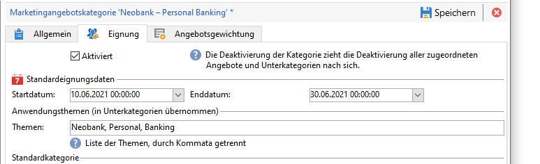
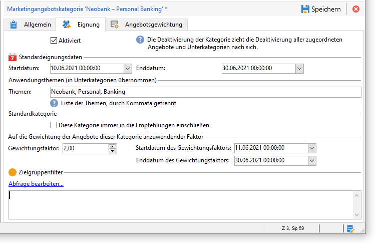

# Erstellen eines Angebotskatalogs

Als **Angebot-Manager** sind Sie für das Erstellen des Angebotskatalogs verantwortlich.

Ein Angebotskatalog ist mit einer einzigen bereits vorhandenen Umgebung verknüpft. Angebot in diesem Katalog können nur mit den in derselben Umgebung angegebenen Leerzeichen verknüpft werden.

Bevor Sie Ihre Angebote erstellen, müssen Sie zunächst eine [Umgebung](interaction-env.md) angeben, die alle Merkmale (Berechtigung, Einschränkungen der Zielgruppe, Unterbreitungsregeln) eines Satzes von Angeboten enthält, die nach Kategorien sortiert sind, sowie die Liste ihrer Leerzeichen.

## Angebotskategorien erstellen{#creating-offer-categories}

Angebote sind in Kategorien/Unter-Kategorien unterteilt. Kategorien werden in der Umgebung **[!UICONTROL Design]** erstellt und automatisch in der Umgebung **[!UICONTROL Live]** bereitgestellt (d. h. bereitgestellt), wenn die darin enthaltenen Angebot genehmigt wurden. Die **[!UICONTROL Design]**-Umgebung enthält eine standardmäßige Kategorie zum Empfangen aller Angebot. Unter-Kategorien können erstellt werden, um den Katalog-Angeboten eine Hierarchie hinzuzufügen.

Für jede Kategorie können Sie **die Berechtigungsdaten** definieren. Dies ist der Zeitraum, in dem die in der Kategorie enthaltenen Angebot ihrer Zielgruppe präsentiert werden können. Sie können auch die Gewichtung einer Kategorie anpassen, um der Präsentation des Angebots Priorität einzuräumen.

Gehen Sie wie folgt vor, um eine neue Kategorie zu erstellen:

1. Browser zum Ordner **[!UICONTROL Angebotskatalog]**.

   

1. Klicken Sie mit der rechten Maustaste und wählen Sie im Kontextmenü die Option **[!UICONTROL Angebotskategorie-Ordner hinzufügen]** aus.

   

1. Benennen Sie die Kategorie. Der Titel kann später auch über den **[!UICONTROL Allgemein]**-Tab der Kategorie geändert werden.

   

   >[!NOTE]
   >
   >Wiederholen Sie diese Schritte gegebenenfalls, bis Sie die gewünschte Anzahl an Kategorien erstellt haben.

   Nun haben Sie je nach Bedarf die Möglichkeit,

   * im Tab **[!UICONTROL Eignung]** Daten für die Verwendung zuzuweisen.

      

   * im Feld **[!UICONTROL Themen]** Schlüsselwörter anzugeben, die eine spätere Auswahl der in der Kategorie enthaltenen Angebote erleichtern.

      

      >[!NOTE]
      >
      >Bei Abfrage des Angebotsmoduls werden nur die Angebote ausgegeben, deren Themen oder Kategorien mit den in der Abfrage angegebenen Parametern übereinstimmen.

   * im Feld **[!UICONTROL Angebotsgewichtung]** können Sie die Gewichtung von einer Kategorie zugehörigen Angeboten für einen von Ihnen festgelegten Zeitraum erhöhen.

      

Über den Link **[!UICONTROL Planung und Eignungsregeln des Angebots]** im Dashboard der in der Kategorie enthaltenen Angebote können Sie auf die Details der Eignungskonfiguration zugreifen.

## hinzufügen einer Fallback-Kategorie

Um sicherzustellen, dass alle Empfänger einen Angebotsvorschlag erhalten, können Sie eine oder mehrere Angebot-Kategorien in die Empfehlungen einfügen.

Diese Ausweich-Angebot müssen eine niedrige Gewichtung (aber nicht null) aufweisen, sodass sie nur berücksichtigt werden, wenn keine Angebot mit höherer Gewichtung förderfähig sind.

Darüber hinaus darf es keine Unterbreitungsregel für diese Angebote geben, um sicherzustellen, dass sie immer in die Empfehlungen aufgenommen werden. Das bedeutet, dass der Empfänger während eines Vorschlags, wenn kein Angebot mit höherer Gewichtung verfügbar ist, mindestens ein Angebot von dieser Kategorie erhält.

Gehen Sie wie folgt vor, um eine Ausweich-Kategorie in die Empfehlungen aufzunehmen:

1. Navigieren Sie zu Ihrem Angebotskatalog.
1. Klicken Sie auf die Registerkarte **[!UICONTROL Berechtigung]** und wählen Sie **[!UICONTROL Diese Kategorie immer in die Option recommendations]** einschließen.
1. Klicken Sie auf **[!UICONTROL Speichern]**.

   

