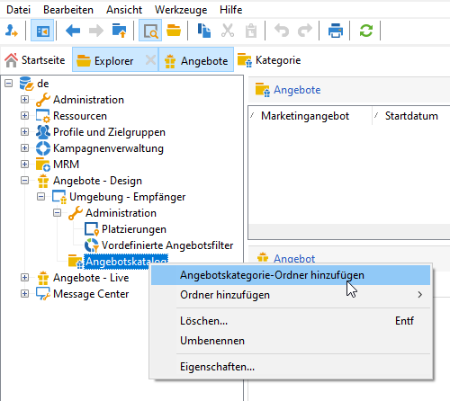

# Angebotskatalog erstellen

Als **Angebotsverantwortlicher** sind Sie für die Erstellung des Angebotskatalogs verantwortlich.

Ein Angebotskatalog ist mit einer bereits existierenden Umgebung verknüpft. Angebote in diesem Katalog können nur mit den in derselben Umgebung angegebenen Platzierungen verknüpft werden.

Vor der Erstellung Ihrer Angebote müssen Sie zunächst eine [Umgebung](interaction-env.md) angeben, die alle Merkmale (Eignung, Einschränkungen der Zielgruppe, Unterbreitungsregeln) eines Angebotssatzes enthält, der in Kategorien unterteilt ist, sowie die Liste ihrer Platzierungen.

## Angebotskategorien erstellen{#creating-offer-categories}

Das Angebot ist in Kategorien/Unterkategorien unterteilt. Kategorien werden in der Umgebung **[!UICONTROL Design]** erstellt und automatisch in der Umgebung **[!UICONTROL Live]** bereitgestellt (d. h. zur Verfügung gestellt), wenn die darin enthaltenen Angebote validiert werden. Die Umgebung **[!UICONTROL Design]** enthält eine Standardkategorie für den Empfang aller Angebote. Unterkategorien können erstellt werden, um den Katalogangeboten eine Hierarchie hinzuzufügen.

Für jede Kategorie können Sie **Eignungsdaten** definieren. Dies ist der Zeitraum, in dem die in der Kategorie enthaltenen Angebote ihrer Zielgruppe unterbreitet werden können. Sie können auch die Gewichtung einer Kategorie anpassen, um der Angebotsunterbreitung Priorität einzuräumen.

Gehen Sie wie folgt vor, um eine neue Kategorie zu erstellen:

1. Browser zum Ordner **[!UICONTROL Angebotskatalog]** .

   

1. Klicken Sie mit der rechten Maustaste und wählen Sie im Kontextmenü die Option **[!UICONTROL Angebotskategorie-Ordner hinzufügen]** aus.

   

1. Benennen Sie die Kategorie. Der Titel kann später auch über den **[!UICONTROL Allgemein]**-Tab der Kategorie geändert werden.

   

   >[!NOTE]
   >
   >Wiederholen Sie diese Schritte gegebenenfalls, bis Sie die gewünschte Anzahl an Kategorien erstellt haben.

   Nun haben Sie je nach Bedarf die Möglichkeit,

   * im Tab **[!UICONTROL Eignung]** Daten für die Verwendung zuzuweisen.

      

   * **[!UICONTROL Bearbeiten Sie]** die Abfrage, um Filter auf die Angebotszielgruppe anzuwenden.

   * Eine Zusammenfassung der Eignungsregeln. Klicken Sie auf den Link **[!UICONTROL Planung und Eignungsregeln des Angebots]**, um sie anzuzeigen.

## Fallback-Kategorie hinzufügen

Um sicherzustellen, dass alle Empfänger einen Angebotsvorschlag erhalten, können in den Empfehlungen systematisch eine oder mehrere Angebotskategorien hinzugefügt werden.

Diese Fallback-Angebote müssen eine niedrige Gewichtung (aber nicht null) aufweisen, sodass sie nur berücksichtigt werden, wenn keine Angebote mit höherer Gewichtung infrage kommen.

Darüber hinaus darf auf diese Angebote keine Unterbreitungsregel angewendet werden, um sicherzustellen, dass sie immer in die Empfehlungen aufgenommen werden. Wenn also während eines Vorschlags kein Angebot mit höherer Gewichtung verfügbar ist, erhält der Empfänger mindestens ein Angebot aus dieser Kategorie.

Gehen Sie wie folgt vor, um eine Fallback-Kategorie in die Empfehlungen aufzunehmen:

1. Navigieren Sie zu Ihrem Angebotskatalog.
1. Klicken Sie auf den Tab **[!UICONTROL Eignung]** und wählen Sie die Option **[!UICONTROL Diese Kategorie immer in die Recommendations]**-Option einschließen.
1. Klicken Sie auf **[!UICONTROL Speichern]**.

   

