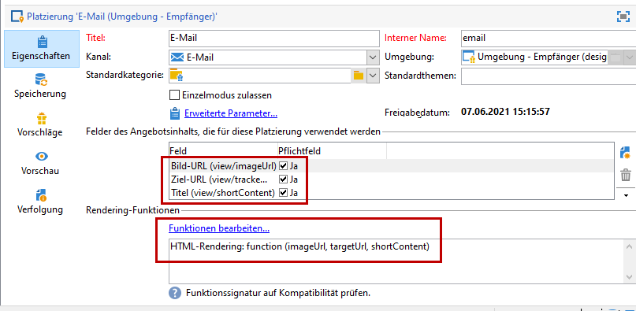
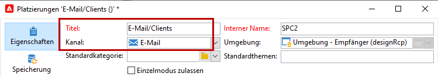
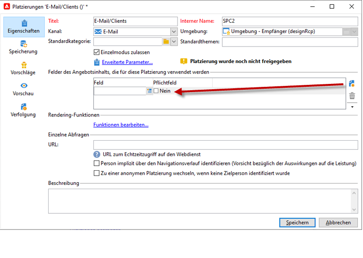
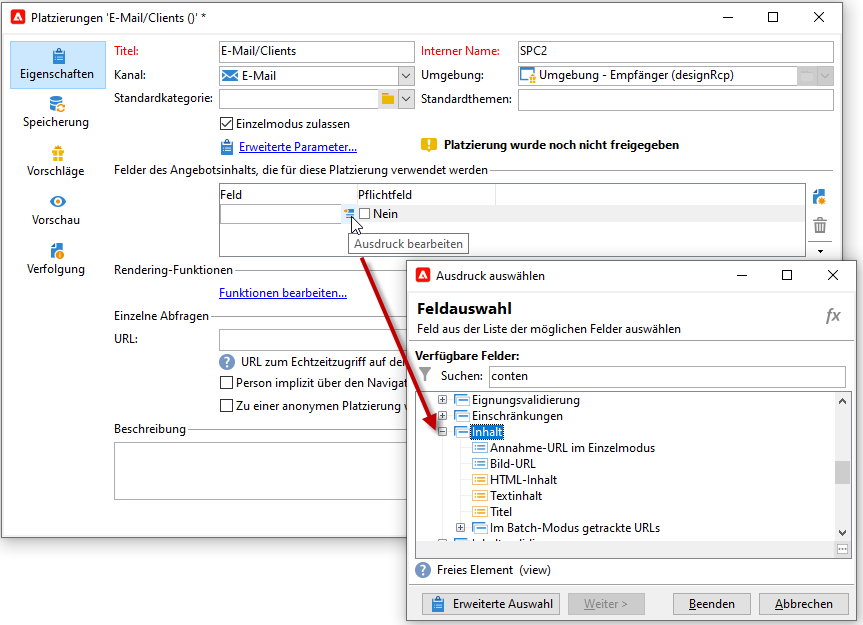
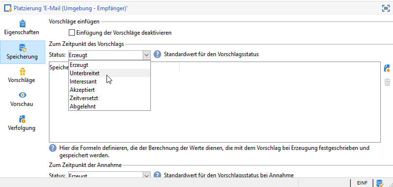
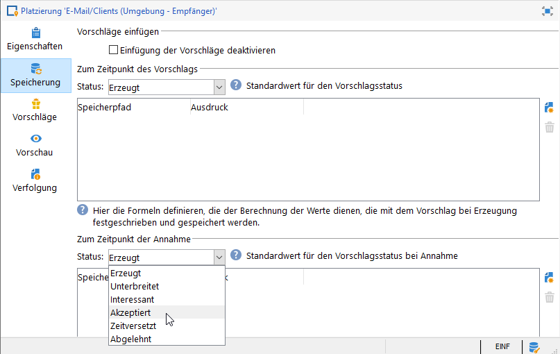
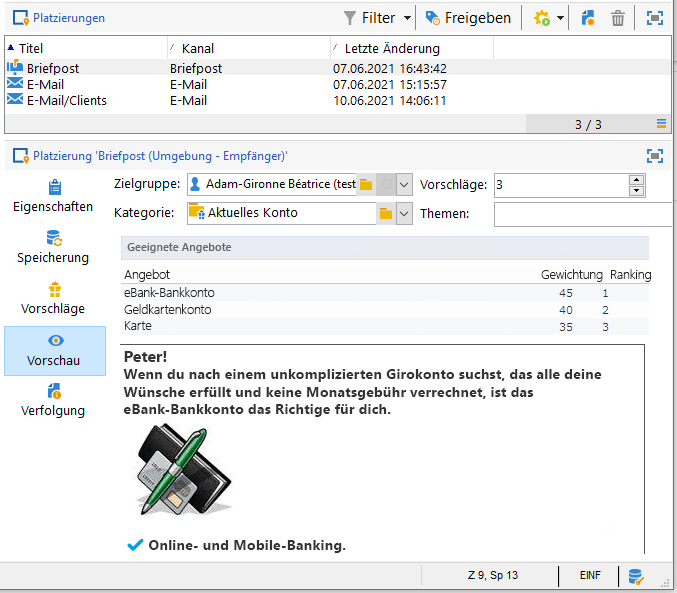
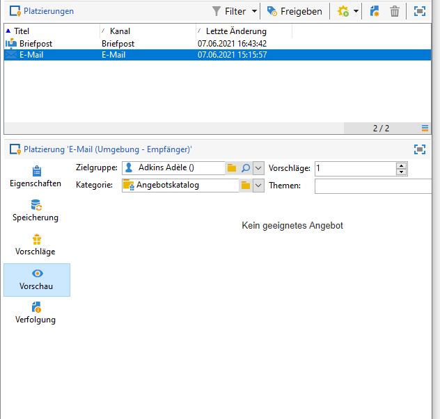

# Angebotsplatzierungen{#creating-offer-spaces}

Der Inhalt des Angebotskatalogs wird in Platzierungen konfiguriert. Standardmäßig kann der Inhalt die folgenden Felder umfassen: **[!UICONTROL Titel]**, **[!UICONTROL Ziel-URL]**, **[!UICONTROL Bild-URL]**, **[!UICONTROL HTML-Inhalt]** und **[!UICONTROL Textinhalt]**. Die Feldsequenz wird in der Platzierung konfiguriert.

Als **technischer Administrator** können Sie Platzierungen in der Design-Umgebung erstellen. Sie müssen Zugriff auf den Unterordner &quot;Platzierung&quot;haben. Nach der Erstellung werden diese Platzierungen während der Genehmigung des Angebots automatisch in die Live-Umgebung dupliziert.

In den erweiterten Parametern können Sie Identifikationsschlüssel für Kontakte definieren. Diese können aus mehreren Elementen (z. B. Name und E-Mail-Adresse) zusammengesetzt sein. Die Vorgehensweise wird im Abschnitt [Angebote für identifizierte Kontakte](../../interaction/using/integration-via-javascript--client-side-.md#presenting-an-identified-offer) erläutert.

Das HTML-Rendering wird über eine Renderfunktion erstellt. Die Reihenfolge der in der Renderfunktion definierten Felder muss mit der im Inhalt konfigurierten Sequenz identisch sein.



Gehen Sie wie folgt vor, um eine neue Platzierung zu erstellen:

1. Klicken Sie in der Liste der Platzierungen auf **[!UICONTROL Neu]**.

   

1. Benennen Sie die Platzierung und wählen Sie aus der Dropdown-Liste den E-Mail-Kanal aus.

   

1. Aktivieren Sie die Option **[!UICONTROL Einheitlichen Modus]** aktivieren

1. Klicken Sie dann im Bereich **[!UICONTROL Felder des Angebotsinhalts]** auf **[!UICONTROL Hinzufügen]**.

   

1. Wählen Sie aus dem **[!UICONTROL Inhalt]**-Knoten unter Berücksichtigung der Reihenfolge folgende Felder aus: **[!UICONTROL Titel]**, **[!UICONTROL Bild-URL]**, **[!UICONTROL HTML-Inhalt]** und schließlich **[!UICONTROL Ziel-URL]**.

   

1. Aktivieren Sie die Option **[!UICONTROL Erforderlich]**, um jedes Feld als Pflichtfeld festzulegen.

   >[!NOTE]
   >
   >Diese Option wird auf der Vorschau verwendet und macht Platzierungen ungültig, wenn ein Pflichtfeld im Angebot fehlt. Wenn ein Angebot jedoch bereits auf einer Platzierung lebt, werden diese Kriterien nicht berücksichtigt.

   

1. Klicken Sie auf **[!UICONTROL Funktionen bearbeiten...]**, um eine Rendering-Funktion zu erstellen.

   Diese Funktionen werden zum Generieren von Angebotsdarstellungen auf einer Platzierung verwendet. Es gibt mehrere mögliche Formate: HTML oder Text.

   **Hinweis** : Das XML-Format ist auf eingehende Interaktionen beschränkt, die temporär nicht verfügbar sind. [Mehr dazu](../start/capability-matrix.md#gs-unavailable-features)

   _

1. Gehen Sie in den **[!UICONTROL HTML-Rendering]**-Tab und kreuzen Sie die Option **[!UICONTROL HTML-Rendering-Funktion überschreiben]** an.
1. Geben Sie nun Ihre Rendering-Funktion ein.

   

Bei Bedarf können Sie HTML- und Textwiedergabefunktionen überladen. [Weitere Informationen](../../interaction/using/about-inbound-channels.md).

## Status von Angebotsvorschlägen {#offer-proposition-statuses}

Der Status des Angebotsvorschlags hängt von den Interaktionen mit der Zielgruppe ab. Das Kampagne Interaction-Modul verfügt über eine Reihe von Werten, die während des gesamten Lebenszyklus auf den Angebotsvorschlag angewendet werden können. Sie müssen die Plattform so konfigurieren, dass sich der Status ändert, wenn der Angebotsvorschlag erstellt und akzeptiert wird.

>[!NOTE]
>
>Statusupdate ist ein asynchroner Prozess. Er wird vom Tracking-Workflow ausgeführt, der jede Stunde ausgelöst wird.

### Liste des Angebot-Status {#status-list}

Verfügbare Angebot-Status sind:

* **[!UICONTROL Akzeptiert]**
* **[!UICONTROL Geplant]**
* **[!UICONTROL Erzeugt]**
* **[!UICONTROL Interessant]**
* **[!UICONTROL Unterbreitet]**
* **[!UICONTROL Zurückgewiesen]**

Diese Werte werden nicht standardmäßig angewendet: müssen konfiguriert werden.

>[!NOTE]
>
>Der Status eines Angebotsvorschlags wird automatisch in &quot;Unterbreitet&quot; geändert, wenn das Angebot mit einem Versand verknüpft ist, dessen Status &quot;Gesendet&quot; lautet.

### Status des Angebots bei Erstellung des Vorschlags {#configuring-the-status-when-the-proposition-is-created}

Wenn ein Angebotsvorschlag **created** ist, wird sein Status aktualisiert.

Konfigurieren Sie in der Umgebung **[!UICONTROL Design]** für jede Platzierung den Status, der angewendet werden soll, wenn ein Vorschlag erstellt wird, abhängig von den Informationen, die Sie in den Angebot-Berichten anzeigen möchten.

Gehen Sie dazu wie folgt vor:

1. Gehen Sie in den **[!UICONTROL Speicherung]**-Tab der zu konfigurierenden Platzierung.
1. Wählen Sie den Status aus, der beim Erstellen auf den Vorschlag angewendet werden soll.

   

### Status des Angebots, wenn das Angebot angenommen wird {#configuring-the-status-when-the-proposition-is-accepted}

Sobald ein Angebotsvorschlag **accept** akzeptiert wurde, verwenden Sie einen der Standardwerte, um den neuen Status des Vorschlags zu konfigurieren. Das Update wird angewendet, wenn ein Empfänger auf einen Link im Angebot klickt.

Gehen Sie dazu wie folgt vor:

1. Gehen Sie in den **[!UICONTROL Speicherung]**-Tab der zu konfigurierenden Platzierung.
1. Wählen Sie den Status aus, den der Vorschlag erhalten soll, nachdem er akzeptiert wurde.

   

<!--
**Inbound interaction**

The **[!UICONTROL Storage]** tab lets you define statuses for **proposed** and **accepted** offer propositions only. For inbound interaction, the status of offer propositions should be specified directly in the URL for calling the offer engine, rather than through the interface. This way, you will be able to specify which status to apply in other cases, for example if an offer proposition is rejected.

```
<BASE_URL>?a=UpdateStatus&p=<PRIMARY_KEY_OF_THE_PROPOSITION>&st=<NEW_STATUS_OF_THE_PROPOSITION>&r=<REDIRECT_URL>
```

For instance, the proposition (identifier **40004**) that matches the **Home insurance** offer displayed on the **Neobank** site contains the following URL:

```
<BASE_URL>?a=UpdateStatus&p=<40004>&st=<3>&r=<"http://www.neobank.com/insurance/subscribe.html">
```

As soon as a visitor clicks the offer, and therefore the URL, the **[!UICONTROL Accepted]** status (value **3**) is applied to the proposition and the visitor is redirected to a new page of the **Neobank** site to take out the insurance contract.

>[!NOTE]
>
>If you want to specify another status in the url (for example if an offer proposition is rejected), use the value corresponding to the desired status. Example: **[!UICONTROL Rejected]** = "5", **[!UICONTROL Presented]** = "1" and so on.
>
>Statuses and their values can be retrieved in the **[!UICONTROL Offer propositions (nms)]** data schema. For more on this, refer to [this page](../../configuration/using/data-schemas.md).

**Outbound interaction**
-->

Sie können den Status **[!UICONTROL Interessiert]** automatisch auf einen Angebotsvorschlag anwenden, wenn der Versand einen Link enthält. Fügen Sie dem Link einfach den Wert **_urlType=&quot;11&quot;** hinzu:

```
<a _urlType="11" href="<DEST_URL>">Link inserted into the delivery</a>
```

## Vorschau der Angebote in der Platzierung {#offer-preview-per-space}

Auf der Registerkarte **[!UICONTROL Vorschau]** können Sie die Angebot, für die der Empfänger berechtigt ist, nach einer bestimmten Methode Ansicht werden. Im folgenden Beispiel kann der Empfänger drei Angebot-Vorschläge per Post erhalten.



Wenn ein Empfänger für keine Angebote zugelassen ist, wird dies in der Vorschau angezeigt.



<!--
The preview can ignore contexts when they are restricted to a space. This is the case when the interaction schema has been extended to add fields referenced in a space using an inbound channel (for more on this, refer to [Extension example](../../interaction/using/extension-example.md)).
-->
