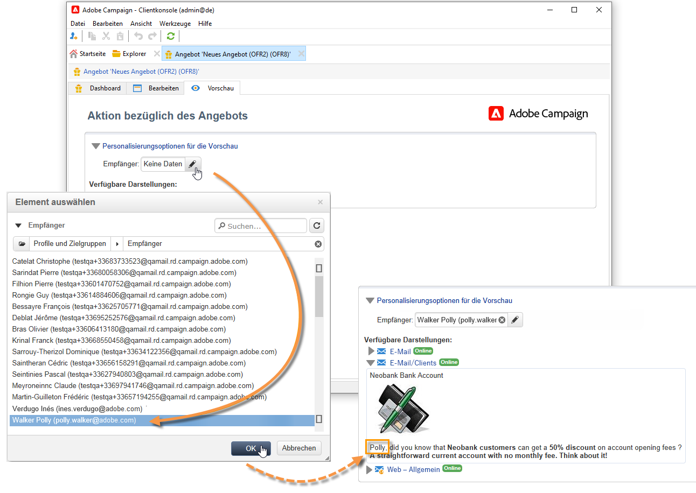

# Angebot erstellen

Gehen Sie wie folgt vor, um ein Angebot zu erstellen:

1. Navigieren Sie zur Registerkarte **[!UICONTROL Kampagnen]** und klicken Sie auf den Link **[!UICONTROL Angebot]**.

1. Wählen Sie die **[!UICONTROL Erstellen]**-Schaltfläche aus.

1. Benennen Sie das Angebot und wählen Sie die Kategorie aus, zu der es gehören soll.

1. Klicken Sie auf **[!UICONTROL Speichern]**, um die Erstellung abzuschließen.

   Das Angebot ist nun in der Plattform verfügbar und kann konfiguriert werden.

## Berechtigungseinstellungen

Sie können jetzt die Registerkarte **[!UICONTROL Berechtigung]** verwenden, um Folgendes zu definieren:

* Der Zeitraum, in dem das Angebot förderfähig ist. [Mehr dazu](#eligibility-period)
* Filter auf der Bevölkerung der Zielgruppe des Angebots. [Mehr dazu](#filters-on-the-target)
* Die Gewichtung des Angebots. [Mehr dazu](#offer-weight)

### Angebot-Zulassungszeitraum{#eligibility-period}

Definieren Sie auf der Registerkarte **[!UICONTROL Berechtigung]** des Angebots den Zeitraum für die Berechtigung des Angebots. Verwenden Sie die Dropdown-Listen, um einen Beginn und ein Enddatum im Kalender auszuwählen.


Außerhalb dieses Zeitraums wird das Angebot nicht ausgewählt. Wenn Sie auch die Berechtigungsdaten für die Angebot-Kategorie konfiguriert haben, gilt der restriktivste Zeitraum.

### hinzufügen Filter auf der Zielgruppe {#filters-on-the-target}

Wenden Sie auf der Registerkarte **[!UICONTROL Berechtigung]** des Angebots Filter auf die Angebot-Zielgruppe an.

Klicken Sie dazu auf den Link **[!UICONTROL Abfrage bearbeiten]** und wählen Sie den anzuwendenden Filter aus.


Wenn bereits vordefinierte Filter erstellt wurden, können Sie diese in der Liste der Benutzerfilter auswählen. [Weitere Informationen](interaction-predefined-filters.md).


### Festlegen der Angebot-Gewichtung {#offer-weight}

Um dem Angebotsmodul die Möglichkeit zu geben, zwischen verschiedenen für eine Person geeigneten Angeboten zu wählen, ist es empfehlenswert, jedem Angebot eine Gewichtung zuzuweisen. Sie können darüber hinaus Filter auf die Zielgruppe anwenden oder die Platzierung, auf die sich das Gewicht beziehen soll, einschränken. Ein Angebot mit einer höheren Gewichtung wird demzufolge einem Angebot mit niedriger Gewichtung vorgezogen.

Es besteht weiterhin die Möglichkeit, für ein Angebot verschiedene Gewichtungen zu definieren, z. B. in Bezug auf einen Zeitraum, eine Zielgruppe oder auch eine Platzierung.

Ein Angebot kann für Kontakte im Alter von 18 bis 25 Jahren eine Gewichtung A aufweisen und eine Gewichtung B für alle Kontakte über 25 Jahre. Einem Angebot, dessen Verwendungszeitraum auf die Sommermonate beschränkt ist, kann im Juli eine Gewichtung A und im August eine Gewichtung B zugewiesen werden.

>[!NOTE]
>
>Die zugewiesene Gewichtung kann vorübergehend entsprechend den Parametern der Kategorie geändert werden, zu der das Angebot gehört. [Weitere Informationen](interaction-offer-catalog.md#creating-offer-categories).

Gehen Sie wie folgt vor, um eine Gewichtung zu konfigurieren:

1. Klicken Sie auf der Registerkarte **[!UICONTROL Berechtigung]** des Angebots auf **[!UICONTROL Hinzufügen]**.

   

1. Ändern Sie die Beschriftung und weisen Sie eine Gewichtung zu. Der Standardwert ist 1.

   

   >[!CAUTION]
   >
   >Bei Angabe von 0 wird das Angebot als für die Zielgruppe nicht infrage kommend angesehen.

1. Geben Sie gegebenenfalls ein Start- und ein Enddatum ein.

   

1. Beschränken Sie bei Bedarf die Anwendung der Gewichtung auf eine bestimmte Platzierung.

   

1. Konfigurieren Sie einen Zielgruppenfilter.

   

1. Klicken Sie zum Abschluss auf **[!UICONTROL OK]**.

   

   >[!NOTE]
   >
   >Wenn ein bestimmtes Angebot mit verschiedenen Gewichtungen für einen Kontakt infrage kommt, wählt das Angebotsmodul die höchste Gewichtung aus. Das Angebotsmodul schlägt pro Abfrage einem Kontakt jedes Angebot maximal einmal vor.

### Übersicht der für ein Angebot konfigurierten Eignungsregeln {#a-summary-of-offer-eligibility-rules}

Im Dashboard des Angebots können Sie auf die Details der Eignungskonfiguration zugreifen.

Klicken Sie hierfür auf den Link **[!UICONTROL Planung und Eignungsregeln des Angebots]**.


## Erstellen Sie den Angebot-Inhalt {#creating-the-offer-content}

Verwenden Sie die Registerkarte **[!UICONTROL Content]**, um den Angebot-Inhalt zu definieren.


1. Definieren Sie die verschiedenen Parameter des Angebot-Inhalts.

   * **[!UICONTROL Titel]**: Geben Sie den Titel an, der bei Unterbreitung des Angebots angezeigt werden soll. (Hinweis: Es handelt sich hierbei nicht um den Titel, der im Tab **[!UICONTROL Allgemein]** vergeben wurde.)
   * **[!UICONTROL Ziel-URL]** : Geben Sie die URL Ihres Angebots an. Es muss mit &quot;http://&quot;oder &quot;https://&quot;Beginn werden.
   * **[!UICONTROL Bild-URL]**: Geben Sie die URL oder einen Zugangspfad für das Bild Ihres Angebots an.
   * **[!UICONTROL HTML-Inhalt]**/**[!UICONTROL Textinhalt]**: Geben Sie den Body Ihres Angebots in den Tab Ihrer Wahl ein. Um Tracking zu generieren, muss der **[!UICONTROL HTML-Inhalt]** aus HTML-Elementen bestehen, die in ein `<div>`-Typelement eingeschlossen werden können. Beispielsweise erzeugt ein `<table>`-Element auf der HTML-Seite Folgendes:

   ```
      <div> 
       <table>
        <tr>
         <th>Month</th>
         <th>Savings</th>   
        </tr>   
        <tr>    
         <td>January</td>
         <td>$100</td>   
        </tr> 
       </table> 
      </div>
   ```

   Erfahren Sie, wie Sie die Akzeptanz-URL in [diesem Abschnitt](interaction-offer-spaces.md#configuring-the-status-when-the-proposition-is-accepted) definieren.

   

   Durch Klick auf den Link **[!UICONTROL Inhaltsdefinition]** können Sie prüfen, welche Felder in der Platzierungskonfiguration als Pflichtfelder definiert wurden. [Weitere Informationen](interaction-offer-spaces.md).

   

   In unserem Beispiel muss das Angebot mindestens einen Titel, ein Bild, einen HTML-Inhalt und eine Ziel-URL aufweisen.

## Vorschau des Angebots {#previewing-the-offer}

Sobald der Angebot-Inhalt konfiguriert ist, können Sie das Angebot so Vorschau, wie es für seinen Empfänger angezeigt wird.

Gehen Sie dazu wie folgt vor:

1. Klicken Sie auf den **[!UICONTROL Vorschau]**-Tab.

   

1. Wählen Sie die Darstellung aus, die Sie prüfen möchten.

   

1. Wenn Sie den Inhalt des Angebots personalisiert haben, ist die Auswahl eines Empfängers erforderlich, um die Personalisierung prüfen zu können.

   

<!--

## Create a hypothesis on an offer {#creating-a-hypothesis-on-an-offer}

You can create hypotheses on your offer propositions. This lets you determine the impact of your offers on purchases carried out for the product concerned.

>[!NOTE]
>
>These hypotheses are carried out via Response Manager. Please check your license agreement.

Hypotheses carried out on an offer proposition are referenced in their **[!UICONTROL Measure]** tab.

Creating hypotheses is detailed in [this page](../../campaign/using/about-response-manager.md).

-->

## Angebot genehmigen und aktivieren{#approve-offers}

Sie können das Angebot jetzt genehmigen und aktivieren, um es in der Umgebung **Live** verfügbar zu machen.

:arrow_upper_right: Weitere Informationen finden Sie in der [Campaign Classic-Dokumentation](https://experienceleague.adobe.com/docs/campaign-classic/using/managing-offers/managing-an-offer-catalog/approving-and-activating-an-offer.html?lang=en#approving-offer-content)

## Angebotsdarstellung verwalten{#offer-presentation}

Mit Kampagne können Sie den Fluss der Angebotsvorschlag mithilfe von Unterbreitungsregeln steuern. Diese Regeln, die für die Interaktion mit der Kampagne spezifisch sind, sind **Typologieregeln**. Sie ermöglichen es Ihnen, Angebot auszuschließen, die auf dem Verlauf der bereits an einen Empfänger gerichteten Vorschläge basieren. Sie werden in der Umgebung referenziert.

:arrow_upper_right: Weitere Informationen finden Sie in der [Campaign Classic-Dokumentation](https://experienceleague.adobe.com/docs/campaign-classic/using/managing-offers/managing-an-offer-catalog/managing-offer-presentation.html?lang=en#managing-offers)

## Angebot-Simulation

Mithilfe von Simulationen können Sie die Verteilung der Angebote einer Kategorie oder einer Umgebung evaluieren, bevor Sie den Vorschlag den Empfängern unterbreiten.

Bei der Simulation werden die Kontexte und Eignungsregeln berücksichtigt, die zuvor für Angebote und ihre Unterbreitungsregeln galten. Auf diese Weise können Sie verschiedene Versionen Ihres Angebotsvorschlags testen und verfeinern, ohne tatsächlich ein Angebot zu verwenden oder eine Zielgruppe zu häufig oder zu wenig anzusprechen, da die Simulation keine Auswirkungen auf die Zielgruppenempfänger hat.

:arrow_upper_right: Weitere Informationen zur Angebot-Simulation finden Sie in der [Campaign Classic-Dokumentation](https://experienceleague.adobe.com/docs/campaign-classic/using/managing-offers/simulating-offers/about-offers-simulation.htm)
