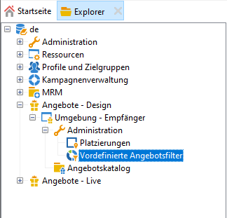
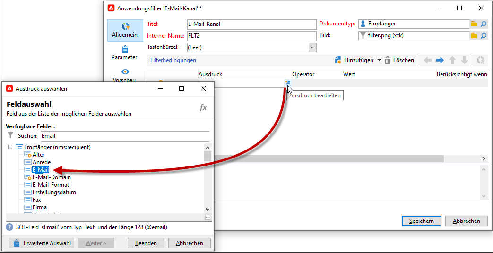

# Vordefinierte Filter erstellen{#creating-predefined-filters}

Erstellen Sie vordefinierte Filter, um Eignungsregeln für die Zielpopulation zu definieren, die bei der Angebotserstellung einfach wiederverwendet werden können. Sie sind für jede Umgebung spezifisch und berücksichtigen die Angebotsparameter.

Gehen Sie wie folgt vor, um einen vordefinierten Filter zu erstellen:

1. Navigieren Sie zum Ordner **[!UICONTROL Administration]** und wählen Sie **[!UICONTROL Vordefinierte Angebotsfilter]** aus.

   

1. Klicken Sie auf **[!UICONTROL Neu]**.

   

1. Benennen Sie den Filter.

   

1. Wählen Sie nun das Feld aus, auf das sich die Filterbedingung beziehen soll.

   

1. Geben Sie den Operator und gegebenenfalls einen Wert an und speichern Sie die Abfrage.

   

1. Durch Klick auf den **[!UICONTROL Vorschau]**-Tab können Sie das Ergebnis des Filters prüfen.

   

