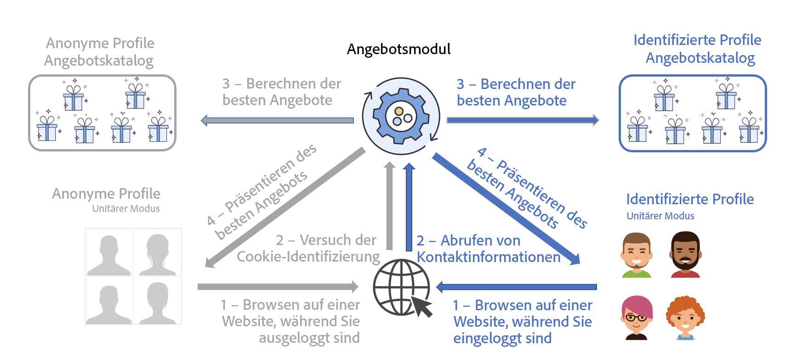

# Unterbreiten des besten Angebots{#interaction-present-offers}

Angebote können in verschiedenen Platzierungen über [eingehende oder ausgehende Kanäle](interaction-architecture.md#interaction-types) unterbreitet werden. Dieses Kapitel behandelt einige Besonderheiten von eingehenden Kanälen.

Damit Angebote vom Angebotsmodul ausgewählt werden können, müssen sie zuvor genehmigt worden sein und in einer Live-Umgebung verfügbar sein.

 Weitere Informationen finden Sie in der [Dokumentation zu Campaign Classic v7](https://experienceleague.adobe.com/docs/campaign-classic/using/managing-offers/managing-an-offer-catalog/approving-and-activating-an-offer.html?lang=de#approving-offer-content)

Im Kontext eines eingehenden Kontakts kann der Benutzer, der die Seite durchsucht, von der Website identifiziert werden oder nicht. Das Angebotsmodul bietet für identifizierte Profile und für anonyme Profile verschiedene Angebote an.

Um in eingehenden Kanälen Angebote vorschlagen zu können, muss die Abfrage an das Angebotsmodul an der Stelle konfiguriert werden, an der die Angebote unterbreitet werden sollen. Der gängigste Fall einer eingehenden Interaktion ist der Besuch einer Web-Seite.

>[!NOTE]
>
>Im Falle von eingehenden Interaktionen muss das Angebotsmodul dahingehend konfiguriert werden, ein oder mehrere Angebote zu aktualisieren und vorzuschlagen.
>
>Außerdem müssen Sie für Ihre Platzierungen den Einzelmodus zulassen. Weitere Informationen hierzu finden Sie auf [dieser Seite](interaction-offer-spaces.md).
