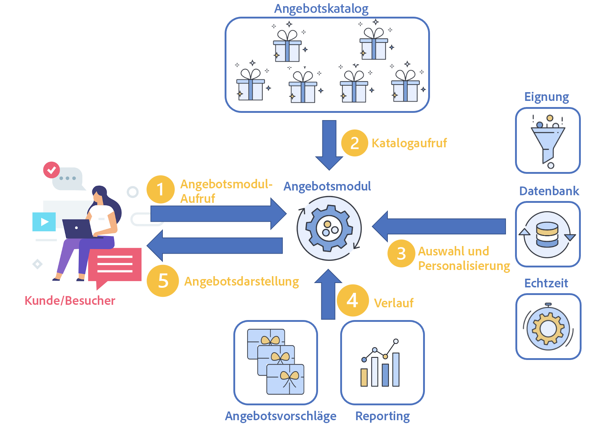

# Echtzeit-Interaktionen verwalten

Campaign enthält eine **Interaction** -Modul, mit dem Sie während einer Interaktion mit einem bestimmten Kontakt (einem Kunden oder einer Zielgruppe) in Echtzeit reagieren können, indem Sie ihm ein oder mehrere angepasste Angebote unterbreiten. Dies können beispielsweise einfache Kommunikationsnachrichten, Sonderangebote für ein oder mehrere Produkte oder Services sein.

Sie können einen Angebotskatalog erstellen, der mit Ihren ausgehenden Kanälen (E-Mail, Briefpost, SMS) verbunden ist, um das beste Angebot auszuwählen, das einem Kontakt in einem bestimmten Kontext gesendet werden soll. Die Auswahl des besten Angebots für einen Empfänger basiert auf **Eignungsregeln**. Die Auswahl eines Angebots aus einem Paket relevanter Angebote wird mithilfe von Prioritätsregeln bestimmt. Die Regeln zur Angebotsunterbreitung berücksichtigen den Verlauf des Kontakts und helfen zu vermeiden, dass der Kontakt nicht mehrmals dasselbe Angebot erhält.

Neben der Verwaltung des Angebotskatalogs bietet Interaction die Möglichkeit, Eignungsregeln und ihnen zugeordnete Anwendungsthemen zu definieren. Der Inhalt der Angebote kann je nach Kanal mithilfe der verschiedenen Darstellungen personalisiert werden. Das Simulationsmodul erlaubt es Ihnen zudem, vor Unterbreitung eines Angebots seine voraussichtliche Wirkung einzuschätzen.

Zuerst erfolgt ein Kontakt zwischen einem Kunden und einem Unternehmen über einen Kommunikationskanal: Dabei kann es sich um eine Website (ausgehende Interaktion), eine E-Mail, SMS, eine Push-Benachrichtigung (eingehende Interaktionen) handeln. [Weitere Informationen](#interaction-types)

Dieser Kontakt führt zu einem Aufruf des Angebotsmoduls. (1)

Wenn das Angebotsmodul aufgerufen wird, werden je nach der Anzahl der auf den Vorschlag bezogenen Angebotseinstellungen ein oder mehrere Angebote aus dem Angebotskatalog ausgewählt. (2)

Anschließend werden die Eignungsregeln angewendet: Die besten Angebote werden anhand der Eignungsregeln, des Start- und Enddatums der Angebote, der Profildaten und des Echtzeit-Verhaltens des Kunden ausgewählt. (3)

Der Verlauf der Profilvorschläge wird nach der Auswahl aktualisiert, um doppelte Angebote zu vermeiden. (4)

Schließlich wird das beste Angebot für die Zielgruppe vorgeschlagen. (5)

## Erste Schritte mit Angeboten

Die wichtigsten Schritte zu Beginn sind unten aufgeführt.

### Konfigurieren der Plattform

Stellen Sie vor dem Start als Campaign-**Administrator** sicher, dass Sie die folgenden Aufgaben in Design-Umgebungen ausgeführt haben:

1. Erstellen Sie Benutzerprofile. [Weitere Informationen](interaction-operators.md)
1. (optional) Erstellen Sie für jede Zielgruppendimension eine Angebotsumgebung. [Weitere Informationen](interaction-env.md)
1. Erstellen Sie Typologieregeln für jede Umgebung. [Weitere Informationen](interaction-offer.md#offer-presentation)
1. Erstellen Sie Angebotsplatzierungen für jede Umgebung und konfigurieren Sie die Rendering-Funktionen. [Mehr dazu](interaction-offer-spaces.md)
Wenn eine Platzierung in einem Einzelmodus-Kanal als identifiziert definiert wurde, müssen ihre erweiterten Parameter angegeben werden.

   >[!NOTE]
   >
   >Wenn eine Platzierung in einem Einzelmodus-Kanal als identifiziert definiert wurde, müssen ihre erweiterten Parameter angegeben werden.

1. Konfigurieren Sie das Angebotsmodul für eingehende Interaktionen, um ein oder mehrere Angebote zu unterbreiten und zu aktualisieren.

   Die verschiedenen Integrationsmodi werden im Abschnitt [diesem Abschnitt](interaction-present-offers.md).

   >[!NOTE]
   >
   >Bei Erstellung einer Platzierung für den Web-Kanal (eingehend) ist auch die Seite zu konfigurieren, auf der das Angebot angezeigt werden soll.

### Erstellen und Veröffentlichen des Angebotskatalogs {#managing-the-offer-catalog-}

Als **Angebotsverantwortlicher** müssen Sie die folgenden Aufgaben ausführen:

1. Erstellen Sie Angebotskategorien in Design-Umgebungen. [Weitere Informationen](interaction-offer-catalog.md#creating-offer-categories)
1. Erstellen Sie Angebote in Design-Umgebungen. [Weitere Informationen](interaction-offer.md)
1. Validieren und veröffentlichen Sie Angebote in einer oder mehreren Platzierungen, um sie für den Versandverantwortlichen in den Live-Umgebungen verfügbar zu machen. [Weitere Informationen](interaction-offer.md#approve-offers)

### Verwenden des Angebotskatalogs {#using-the-offer-catalog-}

Als **Versandverantwortlicher** müssen Sie die folgenden Aufgaben ausführen:

1. Erstellen Sie eine Kampagne.
1. Referenzieren Sie ein Angebot in der Kampagne oder im Versand. [Weitere Informationen](interaction-send-offers.md).

## Glossar

Bevor Sie beginnen, erfahren Sie mehr über angebotsspezifische Begriffe und entsprechende Anleitungen.

* **Umgebung**: Einheit aus Angebotskatalog und Integrationspunkten (Platzierungen). Eine Umgebung wird einer Zielgruppendimension zugeordnet. Es gibt zwei verschiedene Umgebungstypen:

   * **Angebote - Design**: Umgebung, in der Angebote erstellt sowie Typologieregeln definiert werden, die darüber entscheiden, ob ein bestimmtes Angebot einer Zielperson unterbreitet wird oder nicht. Des Weiteren werden hier sowohl die Tabelle der in der Angebotszielgruppe enthaltenen Individuen als auch die Tabelle, in der die Angebotsvorschläge gespeichert werden, angegeben. Der Knoten **[!UICONTROL Angebote - Design]** enthält in Unterverzeichnissen diverse Umgebungen, vordefinierte Filter und Angebotskataloge. Jedes **[!UICONTROL Angebote - Design]**-Ereignis entspricht einer aus ihr erzeugten **[!UICONTROL Live-Umgebung]******.
   * **Live-Umgebung**: Aus einem **[!UICONTROL Angebote - Design]**-Ereignis entstandene schreibgeschützte Umgebung, welche die Angebote enthält, deren Inhalt und Eignung in **[!UICONTROL Angebote - Design]** erstellt und validiert wurden. Die Angebote können an dieser Stelle nicht mehr geändert werden und sind dazu bestimmt, beispielsweise auf einer Webseite oder in einem Versand unterbreitet zu werden.

* **Platzierung**: Ordner, der den Speicherort definiert, an dem das Angebot verfügbar gemacht wird. Wenn Sie ein Leerzeichen definieren, können Sie den verwendeten Kanal angeben und angeben, ob er im Einzelmodus verwendet werden kann (standardmäßig: Erstellen Sie den Inhalt des Angebots mithilfe von Rendering-Funktionen und geben Sie das Angebot der präsentierten Angebote an. Ein Leerzeichen ist eine Schnittstelle zwischen dem Kanal und dem Angebotsmodul.

   >[!CAUTION]
   >
   >Eine Platzierung ist nicht das gleiche wie ein Kommunikationskanal, sondern entspricht dem Integrationspunkt im entsprechenden Kanal. So können beispielsweise zwei Angebote auf einer Webseite verschiedenen Platzierungen zugeordnet werden. In diesem Fall weist ein Kanal zwei Platzierungen auf.
   >
   >Die Platzierungen werden zu Beginn eines Projekts festgelegt und können im späteren Verlauf nicht mehr geändert werden.

* **Angebotskatalog**: Gesamtheit aller in Adobe Campaign erstellten Angebote, die bei Interaktionen unterbreitet werden können. Jeder Knoten der hierarchischen Katalogstruktur entspricht einer Angebotskategorie.
* **Kategorie**: Mit einem Angebotskatalog einer Platzierung verknüpfter Ordner, der dazu dient, Angebote nach ihrer Art, ihrer Gültigkeit und ihren Anwendungsthemen zu organisieren. Eine Kategorie kann Unterkategorien enthalten, die alle auf Ebene der übergeordneten Kategorie definierten Eigenschaften übernehmen.
* **Themen**: Auf Ebene der Kategorie festgelegte Stichwörter, die es ermöglichen, Angebote bei ihrer Unterbreitung über einen aus- oder eingehenden Kanal zu filtern. Die Angebotsauswahl kann auf eine oder mehrere Kategorien begrenzt werden.

   >[!NOTE]
   >
   >Untergeordnete Kategorien übernehmen automatisch die Themen, die in der übergeordneten Kategorie definiert wurden.

* **Eignungsregeln**: Regeln, die sicherstellen sollen, dass ein Angebot bestmöglich dem Empfänger entspricht, dem es unterbreitet wird. Sie können sich auf eine Umgebung, eine Angebotskategorie oder ein Angebot beziehen.

   Auf Umgebungsniveau enthalten die Eignungsregeln die Unterbreitungsregeln, die auf Angebote und Zielpersonen angewendet werden.

   Auf Kategorieniveau ermöglichen es die Eignungsregeln, die Gültigkeit von Kategorien zeitlich zu begrenzen sowie Anwendungsthemen und Kriterien der Zielgruppenbestimmung zu definieren. Außerdem kann den Kategorien für einen bestimmten Zeitraum ein erhöhter Gewichtsfaktor zugewiesen werden. Kategorien vereinfachen die Angebotsverwaltung, da die auf diesem Niveau erstellten Regeln automatisch auf alle enthaltenen Angebote angewendet werden.

   Auf Angebotsniveau lassen sich mithilfe der Eignungsregeln die Gültigkeit von Angeboten zeitlich begrenzen sowie Kriterien der Zielgruppenbestimmung definieren.

* **Schlichtung**: Etappe der Angebotsauswahl, bei der die für eine Platzierung infrage kommenden Angebote nach ihrer auf Kategorie- und Angebotsniveau definierten Gewichtung geordnet werden. Das Angebot mit der höchsten Gewichtung ist demzufolge prioritär bei der Unterbreitung.
* **Kontakt**: Person am Ursprung einer eingehenden Interaktion. Bei einer Abfrage des Angebotsmoduls wird der Kontakt einer Zielgruppendimension zugeordnet. Es werden zwei Kontakttypen unterschieden:

   * **[!UICONTROL Identifizierter Kontakt]**: Kontakt, der sich explizit im Kanal identifiziert hat (z. B. durch Angabe einer Benutzerkennung und eines Kennworts). Bei ausgehenden Interaktionen sind alle Kontakte systematisch identifiziert.
   * **[!UICONTROL Anonymer Kontakt]**: Kontakt, der sich nicht explizit im Kanal identifiziert hat, der jedoch mithilfe eines Cookies implizit identifiziert werden kann. Diese Art von Kontakten tritt nur bei eingehenden Interaktionen auf.

      >[!NOTE]
      >
      >Nicht identifizierbare anonyme Kontakte werden der Zielgruppendimension der Besucher zugeordnet.

* **Ausgehende Interaktion**: Abfrage des Angebotsmoduls über eine Kontaktliste (zum Versand von E-Mails, Briefpost usw.). Auf jeden Kontakt werden die gleichen Regeln und Prozesse angewendet. Dieser Interaktionstyp wird im Allgemeinen im Batch-Modus verarbeitet.
* **Eingehende Interaktion**: Abfrage des Angebotsmoduls aufgrund einer von einem Kontakt ausgehenden Aktion auf einem Kanal (Webseitenbesuch, Anruf im Callcenter). Dieser Interaktionstyp wird in der Regel im Einzelmodus verarbeitet.
* **Batch-Modus**: Im Batch-Modus wird das beste Angebot für eine Gruppe von Kontakten ausgewählt. Eignungs- und Prioritätsregeln werden auf alle Kontakte der Gruppe angewendet. Dieser Modus kommt in der Regel bei ausgehenden Interaktionen zum Einsatz.
* **Einzelmodus**: Pro Vorgang wird ein einzelner Kontakt verarbeitet. Dieser Modus kommt in der Regel bei eingehenden Interaktionen oder bei Transaktionsnachrichten zum Einsatz.
* **Identifikationsmodus**: bezieht sich auf den Status eines Kontakts:

   * **[!UICONTROL explizit]**: Der Kontakt konnte identifiziert werden, da er sich in der Kanalschnittstelle mit seinen Kundendaten angemeldet hat.
   * **[!UICONTROL implizit]**: Der Kontakt konnte mithilfe eines Cookies (Sitzungs- oder permanenter Cookie) identifiziert werden. Er kann entweder wie ein anonymer oder wie ein identifizierter Kontakt behandelt werden.
   * **[!UICONTROL anonym]**: Der Kontakt konnte nicht identifiziert werden.

* **Geeignetes Angebot**: Angebot, das bestimmten, zuvor definierten Bedingungen entspricht und somit einer Zielgruppe auf mit ihrer Markenerfahrung kohärente Weise unterbreitet werden kann.
* **Unterbreitungsregeln**: Typologieregeln, die auf Basis der einem Kontakt bereits vorgeschlagenen Angebote bestimmte Angebote von der Unterbreitung ausschließen. Die Regeln werden auf Ebene der Umgebung der Angebote verzeichnet.
* **Gewichtung**: Formeln, die die exakte Berechnung der Relevanz eines Angebots für einen Kontakt ermöglichen, sodass aus allen geeigneten Angeboten das beste ausgewählt werden kann. Die Gewichtung wird auf Ebene der Angebote definiert, welche nach absteigender Gewichtung sortiert werden.
* **Rendering-Funktion**: Auf Ebene der Platzierung definierte Funktion, welche die Darstellung eines Angebots ausgehend von auf Angebotsebene definierten Attributen konstruiert. Drei Arten von Rendering-Funktionen stehen zur Verfügung: HTML, XML und Text.
* **Angebotsvorschlag**: Aktion, die darin besteht, einem Empfänger ein oder mehrere Angebote auf einer gegebenen Platzierung zu unterbreiten (beispielsweise auf einem Webseiten-Banner oder in einer E-Mail bzw. SMS). Das Ergebnis der Aktion wird in der Tabelle der Angebotsvorschläge gespeichert. Die Speicherung der Vorschläge selbst ist optional.
* **Simulation**: Modul, das es ermöglicht, die Angebotsunterbreitung vor der tatsächlichen Unterbreitung bei Zielpersonen zu evaluieren.
* **Vorschau**: Anzeige der Darstellung des Angebots in seiner Platzierung. Die Vorschau kann aus dem Konfigurationsfenster des Angebots oder dem Kontaktprofil heraus aufgerufen werden.
* **vordefinierte Filter**: vordefinierte Filterregeln können Angebotsparameter (z. B. einen Angebotscode) berücksichtigen. Sie können nach der Erstellung von Angeboten wiederverwendet werden.
* **Darstellung eines Angebots**: Informationen, die vom jeweiligen Kanal abgerufen werden, um das Angebot anzuzeigen. Die Darstellung kann mithilfe der Rendering-Funktion einer Platzierung konstruiert oder direkt in der Schnittstelle (z. B. im HTML-Block) erfasst werden. Ein Angebot kann je nach Platzierung unterschiedliche Darstellungen aufweisen.
* **Platzierungswechsel**: Option in einer identifizierten Platzierung, die den Wechsel zu einer anonymen Platzierung auslöst, wenn ein Kontakt weder ex- noch implizit identifiziert werden konnte.
