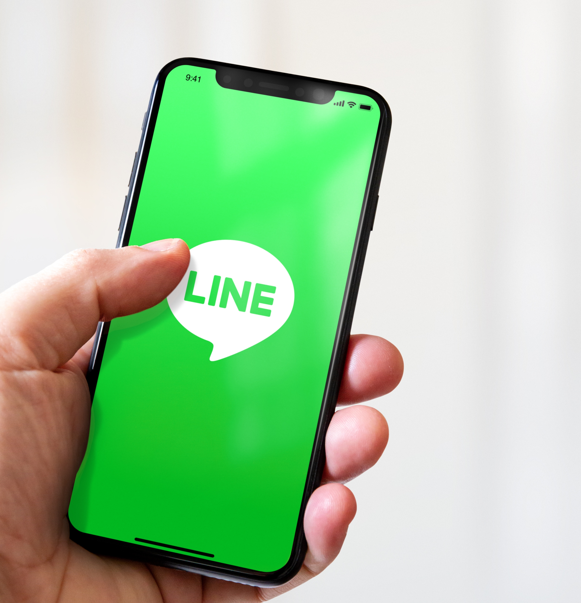

# Erstellung eines LINE-Versands

LINE ist ein Programm für kostenloses Instant Messaging, Sprach- und Videoanrufe, das für alle Smartphones und für Desktop verfügbar ist. Sie können Adobe Campaign verwenden, um LINE-Nachrichten zu senden.

Informationen zum Erstellen [ ersten LINE-Versands finden Sie in der Dokumentation ](https://experienceleague.adobe.com/docs/campaign-classic/using/sending-messages/line-channel.html?lang=de#example--create-and-send-a-personalized-line-message){target="_blank"} Campaign Classic v7 unter diesem End-to-End-Beispiel).

{width="50%" align="left"}

Weitere Informationen finden Sie in der [Dokumentation zu Campaign Classic v7](https://experienceleague.adobe.com/docs/campaign-classic/using/sending-messages/line-channel.html?lang=de){target="_blank"}.

