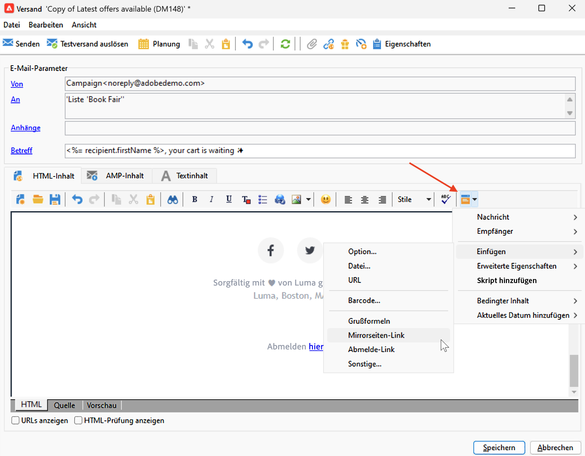
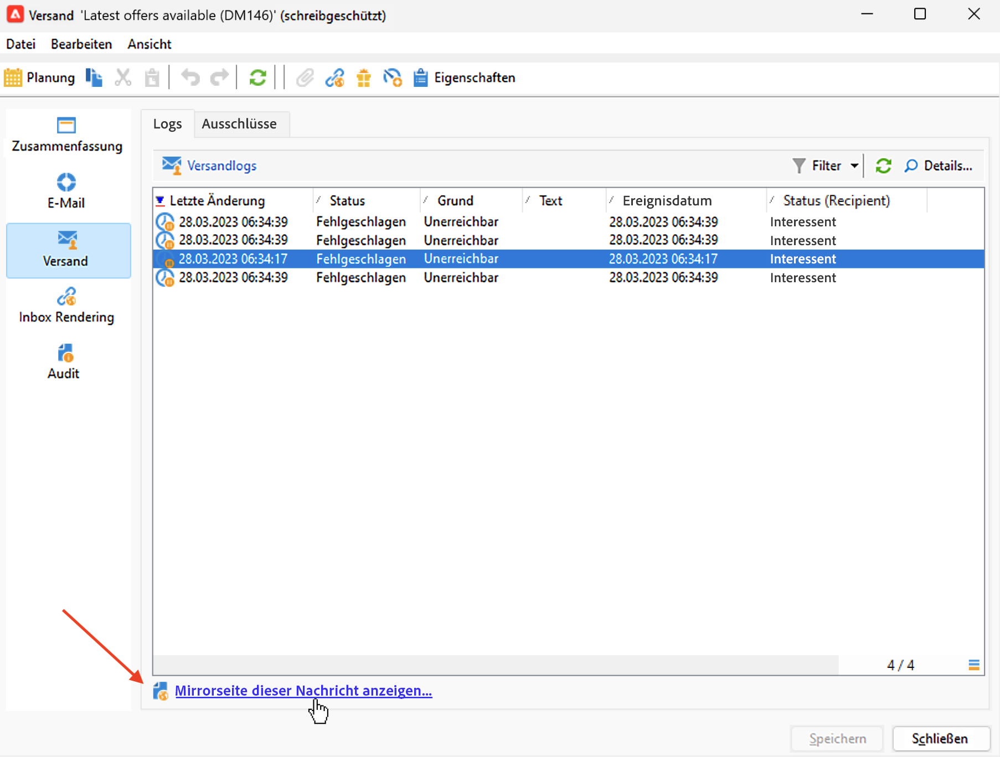

# Verlinken auf die Mirrorseite{#mirror-page}

## Über die Mirrorseite{#about-mirror-page}

Die Mirrorseite ist eine Online-Version Ihrer E-Mail.

Während die meisten E-Mail-Clients Bilder ohne Probleme rendern, können einige Voreinstellungen aus Sicherheitsgründen verhindern, dass Bilder angezeigt werden. Benutzerinnen und Benutzer können die Mirrorseite einer E-Mail aufrufen, etwa wenn bei der Anzeige in ihrem Posteingang Rendering-Probleme auftreten oder Bilder beschädigt sind. Es wird außerdem empfohlen, aus Gründen der Barrierefreiheit oder um zum Social Sharing zu ermutigen, eine Online-Version bereitzustellen.

Die von Adobe Campaign erzeugte Mirrorseite enthält alle Personalisierungsdaten.

{width="600" align="left"}

## Hinzufügen eines Links zur Mirrorseite{#link-to-mirror-page}

Es empfiehlt sich, einen Link zur Mirrorseite einzufügen. Dieser Link kann beispielsweise lauten: „Diese E-Mail in Ihrem Browser anzeigen“ oder „Online lesen“. Er befindet sich häufig in der Kopf- oder Fußzeile der E-Mail.

In Adobe Campaign können Sie einen Link zur Mirrorseite in den E-Mail-Inhalt einfügen, indem Sie den dedizierten **Gestaltungsbaustein** verwenden. Der integrierte Gestaltungsbaustein **Link zur Mirrorseite** fügt den folgenden Code in Ihren E-Mail-Inhalt ein: `<%@ include view='MirrorPage' %>`.

{width="800" align="left"}

Weitere Informationen zum Einfügen von Gestaltungsbausteinen finden Sie unter [Gestaltungsbausteine](personalization-blocks.md).

## Erzeugen der Mirrorseite{#mirror-page-generation}

Standardmäßig wird die Mirrorseite von Adobe Campaign automatisch erzeugt, wenn der E-Mail-Inhalt nicht leer ist und einen Link zur Mirrorseite enthält (auch Mirrorlink genannt).

Sie können den Erzeugungsmodus der E-Mail-Mirrorseite steuern. Optionen sind in den Versandeigenschaften verfügbar. So greifen Sie auf diese Optionen zu:

1. Navigieren Sie zur Registerkarte **[!UICONTROL Gültigkeit]** in den E-Mail-Eigenschaften.
1. Überprüfen Sie im Abschnitt **Verwaltung der Mirrorseite** die Dropdown-Liste **[!UICONTROL Modus]**.

{width="800" align="left"}

Zusätzlich zum Standardmodus stehen die folgenden Optionen zur Verfügung:

* **[!UICONTROL Mirrorseitenerzeugung forcieren]**: Verwenden Sie diesen Modus, um die Mirrorseite selbst dann zu erzeugen, wenn im Versand kein Link zur Mirrorseite eingefügt wurde.
* **[!UICONTROL Keine Mirrorseite erzeugen]**: Verwenden Sie diesen Modus, um das Erzeugen einer Mirrorseite zu vermeiden, selbst wenn der Link im Versand vorhanden ist.
* **[!UICONTROL Von der Nachrichtenkennung aus zugängliche Mirrorseite erzeugen]**: Wenn der Mirrorseiten-Link im E-Mail-Inhalt nicht vorhanden ist, verwenden Sie diese Option, um den Zugriff auf den Inhalt der Mirrorseite im Versandprotokoll-Fenster zu ermöglichen (siehe unten).

## Überprüfen der Mirrorseite für eine Empfängerin oder einen Empfänger{#mirror-page-access}

Sie können mit Personalisierungsdaten den Inhalt der Mirrorseite für eine bestimmte Empfängerin oder einen Empfänger eines Versands aufrufen.

So greifen Sie auf diese Mirrorseite zu:

1. Öffnen Sie den Versand nach dem Versenden und navigieren Sie zur Registerkarte **[!UICONTROL Versand]**.

1. Wählen Sie eine Empfängerin oder einen Empfänger aus und klicken Sie auf die Schaltfläche **[!UICONTROL Mirrorseite für diese Nachricht anzeigen...]**

   {width="800" align="left"}

   Die Mirrorseite wird in einem eigenen Bildschirm mit Personalisierungsdaten für die ausgewählte Empfängerin bzw. den ausgewählten Empfänger angezeigt.
