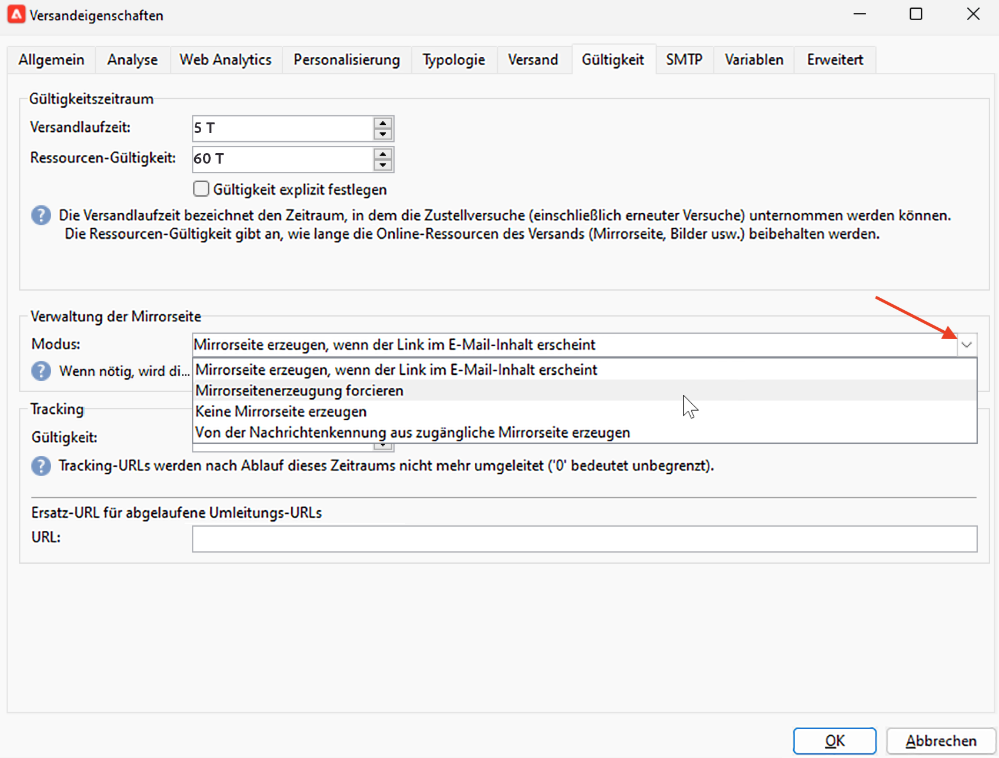

# Link zur Mirrorseite{#mirror-page}

## Über die Mirrorseite{#about-mirror-page}

Die Mirrorseite ist eine Online-Version Ihrer E-Mail.

Während die meisten E-Mail-Clients Bilder ohne Probleme rendern, können einige Vorgaben aus Sicherheitsgründen verhindern, dass Bilder angezeigt werden. Benutzer können die Mirrorseite einer E-Mail aufrufen, z. B. wenn bei der Anzeige in ihrem Posteingang Rendering-Probleme auftreten oder Bilder beschädigt sind. Es wird auch empfohlen, aus Gründen der Barrierefreiheit eine Online-Version bereitzustellen oder die Social-Freigabe zu fördern.

Die von Adobe Campaign generierte Mirrorseite enthält alle Personalisierungsdaten.

## Link zur Mirrorseite hinzufügen{#link-to-mirror-page}

Es empfiehlt sich, einen Link zur Mirrorseite einzufügen. Dieser Link kann beispielsweise &quot;Diese E-Mail in Ihrem Browser anzeigen&quot;oder &quot;Diese online lesen&quot;lauten. Sie befindet sich häufig in der Kopf- oder Fußzeile der E-Mail.

In Adobe Campaign können Sie einen Link zur Mirrorseite in den E-Mail-Inhalt einfügen, indem Sie die dedizierte **Gestaltungsbaustein**. Die integrierten **Link zur Mirrorseite** Gestaltungsbaustein Hiermit wird der folgende Code in den E-Mail-Inhalt eingefügt: `<%@ include view='MirrorPage' %>`.

<!--For more on personalization blocks insertion, refer to [Personalization blocks](personalization-blocks.md).-->

## Mirrorseitenerstellung{#mirror-page-generation}

Standardmäßig wird die Mirrorseite von Adobe Campaign automatisch generiert, wenn der E-Mail-Inhalt nicht leer ist und er einen Link zur Mirrorseite enthält (auch Mirrorlink genannt).

Sie können den Erstellungsmodus der E-Mail-Mirrorseite steuern. Optionen sind in den Versandeigenschaften verfügbar. So greifen Sie auf diese Optionen zu:

1. Navigieren Sie zum **[!UICONTROL Gültigkeit]** in den E-Mail-Eigenschaften.
1. Im **Verwaltung der Mirrorseite** Abschnitt, überprüfen Sie die **[!UICONTROL Modus]** Dropdown-Liste.

Zusätzlich zum Standardmodus sind die folgenden Optionen verfügbar:

* **[!UICONTROL Mirrorseitenerstellung erzwingen]**: Verwenden Sie diesen Modus, um die Mirrorseite zu erstellen, selbst wenn im Versand kein Link zur Mirrorseite eingefügt wurde.
* **[!UICONTROL Mirrorseite nicht generieren]**: Verwenden Sie diesen Modus, um die Erstellung einer Mirrorseite zu vermeiden, selbst wenn der Link im Versand vorhanden ist.
* **[!UICONTROL Erzeugt eine Mirrorseite, auf die nur die Nachrichtenkennung zugreifen kann]**: Verwenden Sie diese Option, um den Zugriff auf den Inhalt der Mirrorseite mit Personalisierungsdaten im Versandlog-Fenster zu ermöglichen. So greifen Sie auf diese Mirrorseite zu: Öffnen Sie nach dem Versand den Versand und navigieren Sie zu seiner **[!UICONTROL Versand]** Registerkarte. Wählen Sie einen Empfänger aus und klicken Sie auf die Schaltfläche **[!UICONTROL Mirrorseite für diese Nachricht anzeigen...]** Link. Die Mirrorseite wird in einer neuen Registerkarte angezeigt.

