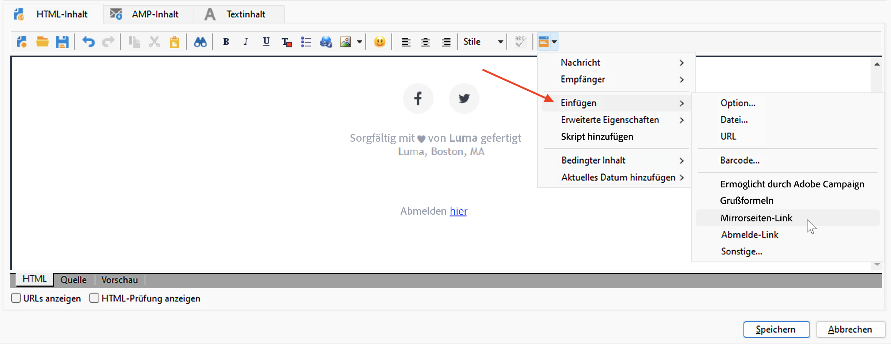
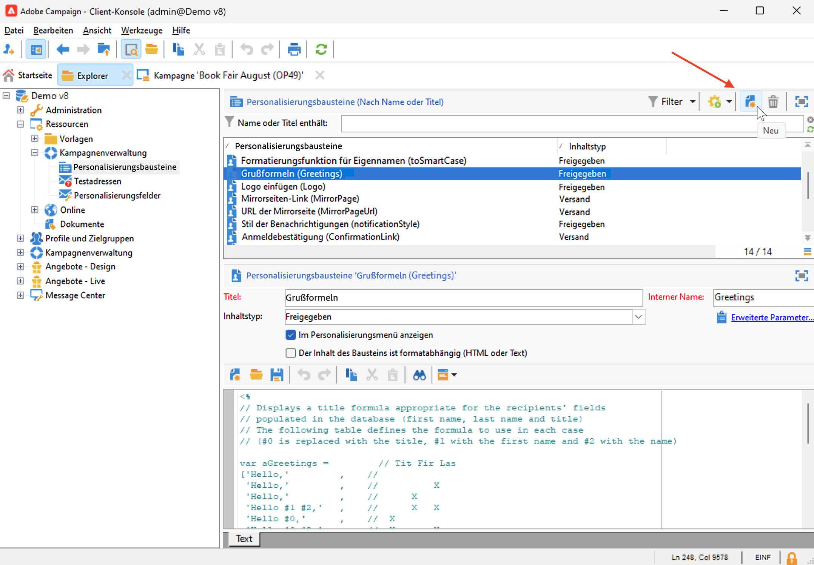
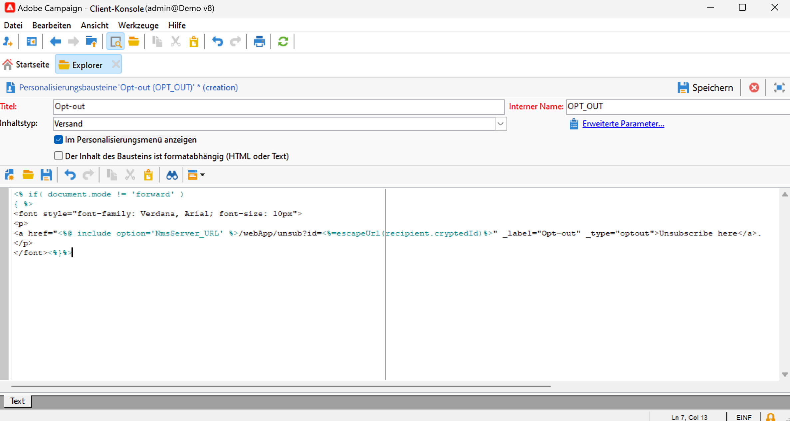

# Verwenden von Gestaltungsbausteinen{#personalization-blocks}

Gestaltungsbausteine sind dynamische Inhalte, die ein spezifisches Rendering enthalten, das Sie in Ihre Sendungen einfügen können. Sie ermöglichen beispielsweise das Einfügen eines Logos, einer bestimmten Anrede oder auch eines Links zu einer Mirrorseite.

Um auf personalisierte Inhaltsbausteine zuzugreifen, navigieren Sie zum Knoten **[!UICONTROL Ressourcen > Kampagnen-Management > Gestaltungsbausteine]** des Explorers. Integrierte Gestaltungsbausteine werden in [diesem Abschnitt](#ootb-personalization-blocks) aufgelistet.

Sie können auch neue Bausteine definieren, um die Personalisierung Ihrer Sendungen zu optimieren. [Weitere Informationen](#create-custom-personalization-blocks).

## Einfügen von Gestaltungsbausteinen {#insert-personalization-blocks}

Gehen Sie folgendermaßen vor, um Gestaltungsbausteine in eine Nachricht einzufügen:

1. Klicken Sie im Inhaltseditor des Versand-Assistenten auf das Personalisierungssymbol und wählen Sie danach das Menü **[!UICONTROL Einfügen]** aus.
1. Wählen Sie einen Gestaltungsbaustein aus der Liste aus oder klicken Sie auf das Menü **[!UICONTROL Sonstige...]**, um auf die vollständige Liste zuzugreifen.

   

1. Der Gestaltungsbaustein wird in Form eines Skripts eingefügt und in der Personalisierungsphase automatisch an das Empfängerprofil angepasst.
1. Navigieren Sie zur Registerkarte **[!UICONTROL Vorschau]** und wählen Sie eine Person aus, um den Inhalt dieses Bausteins für eine bestimmte Empfängerin oder einen bestimmten Empfänger anzuzeigen.

Sie können auch den Quell-Code eines Gestaltungsbausteins im Versandinhalt verwenden, indem Sie die Option **[!UICONTROL HTML-Quell-Code des Bausteins einfügen]** auswählen.

## Integrierte Gestaltungsbausteine {#ootb-personalization-blocks}

Integrierte Gestaltungsbausteine sind:

* **[!UICONTROL Ermöglicht durch Adobe Campaign]**: Hiermit wird das Logo „Ermöglicht durch Adobe Campaign“ eingefügt.
* **[!UICONTROL Formatierungsfunktion für Eigennamen]**: Hiermit wird die JavaScript-Funktion **[!UICONTROL toSmartCase]** generiert, mit der der erste Buchstabe eines jeden Worts in einen Großbuchstaben umgewandelt wird.
* **[!UICONTROL Grußformeln]**: fügt Grußformeln mit dem vollständigen Namen der Empfängerin bzw. des Empfängers ein, gefolgt von einem Komma. Beispiel: „Sehr geehrter Herr Mustermann,“.
* **[!UICONTROL Logo einfügen]**: Fügt ein Logo ein, das in den Instanzeinstellungen definiert ist.
* **[!UICONTROL Mirrorseiten-Link]**: Hiermit wird ein Link zur [Mirrorseite](mirror-page.md) eingefügt. Das Standardformat lautet: „Wenn diese Nachricht nicht richtig angezeigt wird, bitte hier klicken“.
* **[!UICONTROL Mirrorseiten-URL]**: Hiermit wird die URL der Mirrorseite eingefügt, damit Versand-Designerinnen und -Designer den Link prüfen können.
* **[!UICONTROL Annahme-URL eines Angebots im Einzelmodus]**: Hiermit wird eine URL eingefügt, die es ermöglicht, ein Angebot auf **[!UICONTROL Angenommen]** zu setzen. (Dieser Baustein ist verfügbar, wenn das Interaction-Modul aktiviert ist)
* **[!UICONTROL Anmeldebestätigung]**: Hiermit wird ein Link eingefügt, mit dem die Anmeldung bestätigt werden kann.
* **[!UICONTROL Anmelde-Link]**: Hiermit wird ein Anmelde-Link eingefügt. Dieser Link wird in den Instanzeinstellungen definiert. Der Standardinhalt lautet: „Klicken Sie hier, um sich zu registrieren.“
* **[!UICONTROL Anmelde-Link (mit Werber)]**: Hiermit wird ein Anmelde-Link eingefügt, über den der Besucher bzw. die Besucherin sowie der Versand identifiziert werden können. Dieser Link wird in den Instanzeinstellungen definiert.
* **[!UICONTROL Anmeldungsseiten-URL]**: Hiermit wird eine Abonnement-URL eingefügt
* **[!UICONTROL Stil der Inhalts-E-Mails]** und **[!UICONTROL Stil der Benachrichtigungen]**: Hiermit wird Code erstellt, mit dem eine E-Mail mit nativen HTML-Stilen formatiert werden kann.
* **[!UICONTROL Abmelde-Link]**: Fügt einen Link ein, der es ermöglicht, das Abo aller Sendungen zu kündigen (Blockierungsliste). Der standardmäßig verknüpfte Inhalt ist: „Sie erhalten diese Nachricht, da Sie mit ***Name Ihres Unternehmens*** oder einem Tochterunternehmen in Kontakt standen. Um keine Nachrichten mehr von ***Name Ihres Unternehmens*** zu erhalten, klicken Sie hier.“

## Erstellen von benutzerdefinierten Gestaltungsbausteinen {#create-custom-personalization-blocks}

Über das Personalisierungssymbol können Sie neue, personalisierte Inhaltsbausteine definieren.

Gehen Sie wie folgt vor, um einen Gestaltungsbaustein zu erstellen:

1. Navigieren Sie zum Ordner **[!UICONTROL Ressourcen > Kampagnen-Management > Gestaltungsbausteine]** des Campaign-Explorers.
1. Klicken Sie über der Liste der integrierten Bausteine auf **[!UICONTROL Neu]**.

   

1. Füllen Sie die Einstellungen des Gestaltungsbausteins aus:

   

   * Geben Sie den Titel des Bausteins ein. Dieser Titel wird im Einfügefenster des Personalisierungsfelds angezeigt.
   * Wählen Sie einen **Versand**-Inhaltstyp aus.
   * Aktivieren Sie die Option **[!UICONTROL Im Personalisierungsmenü anzeigen]**, um den Baustein über das Einfügen-Symbol der Personalisierungsfelder verfügbar zu machen.
   * Aktivieren Sie bei Bedarf die Option **[!UICONTROL Der Inhalt des Bausteins ist formatabhängig]**, um zwei verschiedene Bausteine für HTML- und Text-E-Mails zu definieren.
   * Geben Sie den Inhalt des Gestaltungsbausteins (in HTML, Text, JavaScript usw.) ein und klicken Sie auf **[!UICONTROL Speichern]**.

Nach der Speicherung ist der neue Gestaltungsbaustein im Versand-Editor verfügbar.

## Tutorial-Video {#personalization-blocks-video}

Im folgenden Video erfahren Sie, wie Sie dynamische Inhaltsbausteine erstellen und diese zur Personalisierung des Inhalts Ihres E-Mail-Versands verwenden können.

>[!VIDEO](https://video.tv.adobe.com/v/342088?quality=12)
