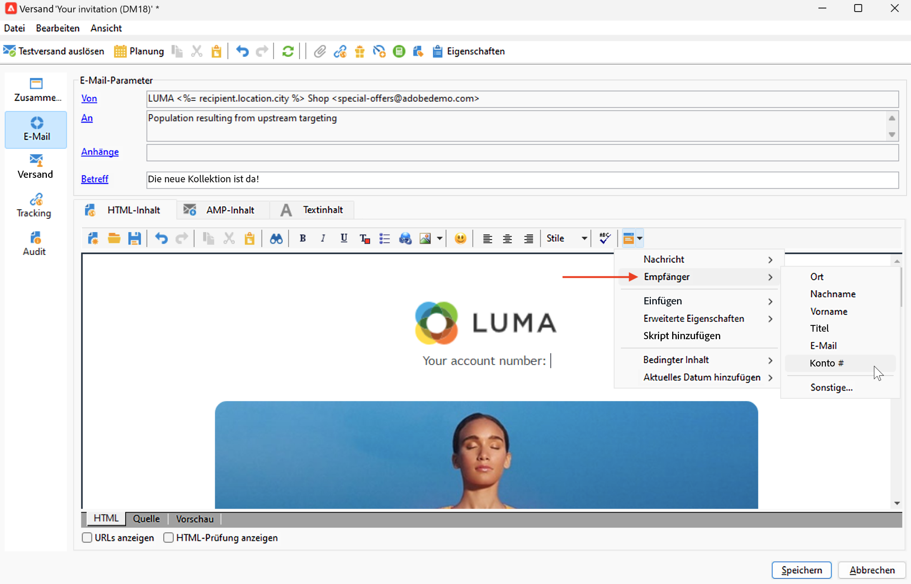
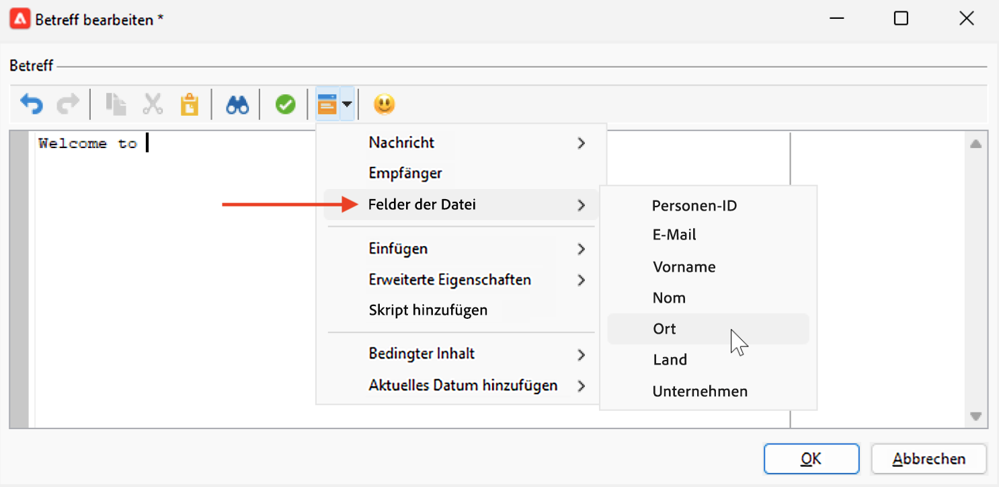
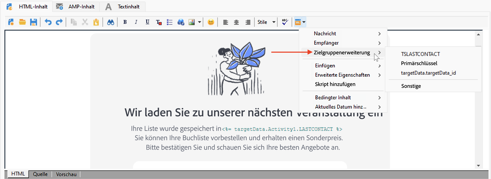

# Quellen von Personalisierungsdaten{#personalization-data}

Personalisierungsdaten können aus verschiedenen Datenquelle bezogen werden: aus der Campaign-Datenbank, einer externen Datei oder einer externen Datenbank.

## Campaign-Datenbank als Datenquelle

In den häufigsten Fällen werden Personalisierungsdaten in der Datenbank gespeichert. Beispielsweise sind „Empfänger-Personalisierungsfelder“ alle in der Empfängertabelle definierten Felder, entweder Standardfelder (typischerweise: Nachname, Vorname, Adresse, Stadt, Geburtsdatum usw.) oder benutzerdefinierte Felder.

## Externe Datei als Datenquelle

Sie können eine externe Datei verwenden, die alle in Spalten definierten Felder enthält. Diese Datei wird bei der Definition eines Nachrichtenversands als Eingabe verwendet. Sie können entscheiden, ob Sie diese Profile in die Datenbank einfügen möchten oder nicht.

Um die Datei auszuwählen, die als Datenquelle verwendet werden soll, klicken Sie im Fenster zur Nachrichtenerstellung auf den Link „An“ und wählen Sie die Option **In einer externen Datei definiert** aus. Wenn die Datei geladen wurde, können Sie in den Personalisierungsoptionen über die Option **Felder aus der Datei** auf die Empfängerdaten zugreifen.

## FDA als Datenquelle

Personalisierungsdaten können über [Federated Data Access](../connect/fda.md) aus einer externen Tabelle extrahiert werden.  Wenn Sie Ihre Sendungen mithilfe von Daten aus der externen Datenbank personalisieren möchten, sammeln Sie die Daten zur Verwendung in einem Workflow, um sie in einer temporären Tabelle zur Verfügung zu stellen.

Fügen Sie dazu eine **Abfrage**-Aktivität im Zielgruppenbestimmungs-Workflow hinzu und verwenden Sie den Link **Daten hinzufügen...**, um die externe Datenbank auszuwählen. Der detaillierte Prozess ist in [diesem Abschnitt](../../automation/workflow/query.md#adding-data) verfügbar.

Verwenden Sie dann die Daten aus der temporären Tabelle, um Ihren Versand zu personalisieren. Wenn die Abfrageaktivität konfiguriert ist, greifen Sie über den Eintrag **Erweiterung des Zieldatensatzes** in den Personalisierungsoptionen auf die externen Daten zu.

Bei der Verwendung externer Daten, auf die über den FDA zugegriffen wird, wird empfohlen, die Nachrichtenpersonalisierung in einem dedizierten Workflow mit der Option **Personalisierungsdaten mit einem Workflow vorbereiten** vorab zu verarbeiten, wie unten beschrieben.

### Optimieren der Personalisierung {#optimize-personalization}

Mit der folgenden Option können Sie die Personalisierung optimieren: Verwenden Sie dazu im **[!UICONTROL Analyse]**-Tab der Versandeigenschaften die Option **[!UICONTROL Personalisierungsdaten mit einem Workflow vorbereiten]**.

Diese Option ermöglicht es, im Zuge der Versandanalyse automatisch einen Workflow zu erstellen und auszuführen, welcher alle auf eine Zielgruppe bezogenen Daten in einer temporären Tabelle speichert (insbesondere Daten aus über FDA verknüpften Tabellen).

Wenn Sie die Option aktivieren, kann sich die Performance der Versandanalyse bei der Verarbeitung großer Datenmengen erheblich verbessern, insbesondere wenn die Personalisierungsdaten aus einer externen Tabelle via FDA stammen. [Weitere Informationen](../connect/fda.md).

Um diese Option zu verwenden, gehen Sie wie folgt vor:

1. Erstellen Sie eine Kampagne.
1. Fügen Sie auf der Registerkarte **[!UICONTROL Zielgruppenbestimmungen und Workflows]** eine **Abfrage**-Aktivität zu Ihrem Workflow hinzu.
1. Fügen Sie eine **[!UICONTROL E-Mail-Versand]**-Aktivität zum Workflow hinzu und öffnen Sie ihn.
1. Gehen Sie zum Tab **[!UICONTROL Analyse]** der **[!UICONTROL Versandeigenschaften]** und wählen Sie die Option **[!UICONTROL Personalisierungsdaten mit einem Workflow vorbereiten]** aus.
1. Konfigurieren Sie den Versand und starten Sie den Workflow, um mit der Analyse zu beginnen.

Nach Abschluss der Analyse werden die Personalisierungsdaten mithilfe eines technischen Workflows, der während der Analyse eingerichtet wird, in einer temporären Tabelle gespeichert.

Dieser Workflow ist nicht in der Adobe-Campaign-Benutzeroberfläche sichtbar. Er ist lediglich ein technisches Hilfsmittel, um Personalisierungsdaten rasch zu speichern und zu handhaben.

Gehen Sie nach dem Abschluss der Analyse zu den Workflow-**[!UICONTROL Eigenschaften]** und wählen Sie den Tab **[!UICONTROL Variablen]** aus. Dort wird der Name der temporären Tabelle angezeigt. Mit diesem Namen können Sie einen SQL-Aufruf durchführen, um die darin enthaltenen IDs anzuzeigen.

## Personalisierungdaten in einem Workflow 

Wenn ein Versand im Kontext eines Workflows erstellt wird, können Sie die Daten aus der temporären Workflow-Tabelle verwenden. Die in der temporären Arbeitstabelle des Workflows gespeicherten Daten stehen für Personalisierungsaufgaben zur Verfügung. Daten können in Personalisierungsfeldern verwendet werden.

Diese Daten werden im Menü **[!UICONTROL Erweiterung des Zieldatensatzes]** gruppiert. Weiterführende Informationen hierzu finden Sie in [diesem Abschnitt](../../automation/workflow/use-workflow-data.md#target-data).
