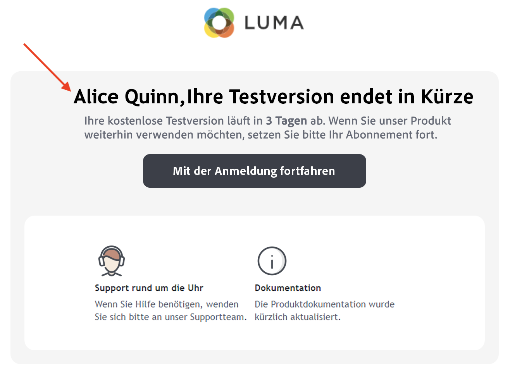
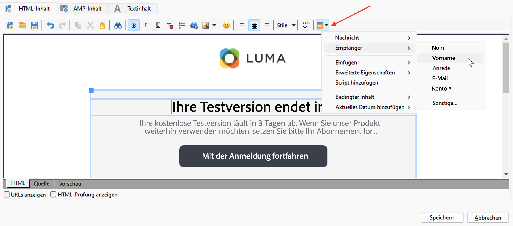
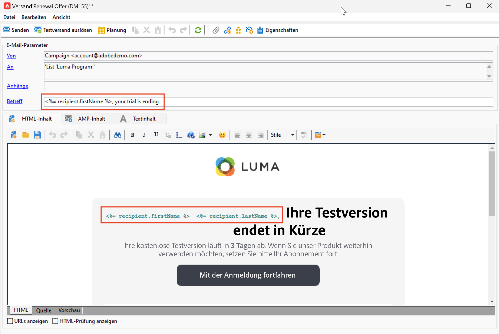

# Hinzufügen von Personalisierungsfeldern{#personalization-fields}

Verwenden Sie Personalisierungsfelder, um personalisierte Inhalte auf Basis der von Ihnen für eine Empfängerin oder einen Empfänger festgelegten Regeln einzeln bereitzustellen.

Ein Personalisierungsfeld ist eine Referenz für einzelne Datenfelder, die bei der Personalisierung eines Versands für einen bestimmten Empfänger verwendet wird. Der tatsächliche Datenwert wird während der Versandanalyse eingefügt.

## Syntax

Ein Personalisierungs-Tag hat immer die folgende Syntax: `<%=table.field%>`.

Um beispielsweise den in der Empfängertabelle gespeicherten Empfängernamen einzufügen, verwendet das Personalisierungsfeld die Syntax `<%= recipient.lastName %>`.

>[!CAUTION]
>
>Inhalt von Personalisierungsfeldern darf 1.024 Zeichen nicht überschreiten.

## Personalisierungsfeld einfügen {#insert-a-personalization-field}

Klicken Sie zum Einfügen von Personalisierungsfeldern auf das Symbol der Dropdown-Liste, das für jedes Kopfzeilen-, Betreff- und Nachrichtentextfeld zur Verfügung steht.

Die Personalisierungsfelder werden eingefügt und können von Adobe Campaign interpretiert werden: Bei der Nachrichtenvorbereitung werden die Felder durch den Wert für eine bestimmte Empfängerin bzw. einen bestimmten Empfänger ersetzt.

Diese Ersetzung kann dann auf der Registerkarte **[!UICONTROL Vorschau]** getestet werden.

<!--Learn more about message preview in [this page]().-->

## Anwendungsfall: Personalisieren des E-Mail-Betreffs {#personalization-fields-uc}

Im folgenden Anwendungsbeispiel erfahren Sie, wie Sie den Betreff und Text einer E-Mail mit Empfängerdaten personalisieren:

1. Erstellen Sie einen neuen Versand oder öffnen Sie einen vorhandenen E-Mail-Versand.
1. Navigieren Sie zum Link **[!UICONTROL Betreff]**, um den Betreff der Nachricht zu bearbeiten.
1. Enter &quot; **Sonderangebot für** „und verwenden Sie die Schaltfläche in der Symbolleiste, um ein Personalisierungsfeld einzufügen. Auswählen **[!UICONTROL Empfänger > Titel]**.
1. Wiederholen Sie den Vorgang, um den Nachnamen der Empfänger einzufügen. Vergessen Sie die Leerzeichen zwischen den Personalisierungsfeldern nicht.
1. Wählen Sie zur Bestätigung **[!UICONTROL OK]** aus.
1. Im nächsten Schritt wird der Nachrichten-Textkörper angepasst. Klicken Sie dazu in das Inhaltsfeld der Nachricht und danach auf die Schaltfläche zum Einfügen von Personalisierungsfeldern.
1. Wählen Sie **[!UICONTROL Empfänger > Sonstige...]**.
1. Markieren Sie das Feld, das die gewünschte Information enthält, und klicken Sie auf **[!UICONTROL OK]**.
1. Klicken Sie nun auf den **[!UICONTROL Vorschau]**-Tab und wählen Sie einen Empfänger aus, um sich das Ergebnis der Personalisierung anzusehen.

## Tutorial-Video {#personalization-field-video}

Im folgenden Video erfahren Sie, wie Sie der Betreffzeile und dem Inhalt eines E-Mail-Versands ein Personalisierungsfeld hinzufügen.

>[!VIDEO](https://video.tv.adobe.com/v/24925?quality=12)
