# Personalisierte Gutscheine{#personalized-coupons}

Durch das Hinzufügen von Gutscheinen zu Ihren Sendungen können Ihre Empfänger einen größeren Nutzen für Produkte und Services erzielen. Mit dem Campaign-Couponmodul können Sie eine Reihe von Gutscheinen erstellen, die Sie künftigen Marketing-Angeboten hinzufügen möchten. Wenn Sie bereit sind, einen Versand zu erstellen, weisen Sie die entsprechenden Coupons zu. Da Gutscheine für einen bestimmten Zeitraum gültig sind, ist ein zugewiesener Gutschein eindeutig mit seiner Versandnachricht verknüpft. Außerdem bestätigt Campaign, dass ausreichend Coupons für die Anzahl der Nachrichten vorhanden sind, bevor der Versand durchgeführt wird.

>[!AVAILABILITY]
>
>Die Couponverwaltung ist in Campaign v8 nicht im Kontext einer Enterprise-Bereitstellung (FFDA) verfügbar. Weitere Informationen finden Sie in der [Dokumentation zu Campaign v8](../architecture/enterprise-deployment.md).

Die Couponverwaltung basiert auf einem Kit, das installiert werden muss. Um festzustellen, ob Sie dieses Kit zur Couponverwaltung installiert haben, gehen Sie zu **[!UICONTROL Administration > Konfiguration > Kit-Verwaltung > Installierte Kits.]**

Coupondaten können im CSV- und XML-Format importiert und exportiert werden. [Weitere Informationen](../start/import.md).

## Erstellen eines Coupons {#creating-a-coupon}

Für die Erstellung von Coupons bietet Ihnen das Couponverwaltungsmodul zwei Möglichkeiten:

* **Anonym**: ein Standardgutschein für ausgewählte Empfänger oder Empfängerlisten
* **Individuell**: ein personalisierter Gutschein für ausgewählte Empfänger

Bevor Sie die folgenden Schritte ausführen, entscheiden Sie sich für einen Gutscheintyp:

1. Wählen Sie im Campaign-Navigationsbaum **[!UICONTROL Ressourcen > Kampagnenverwaltung > Coupons]**.

   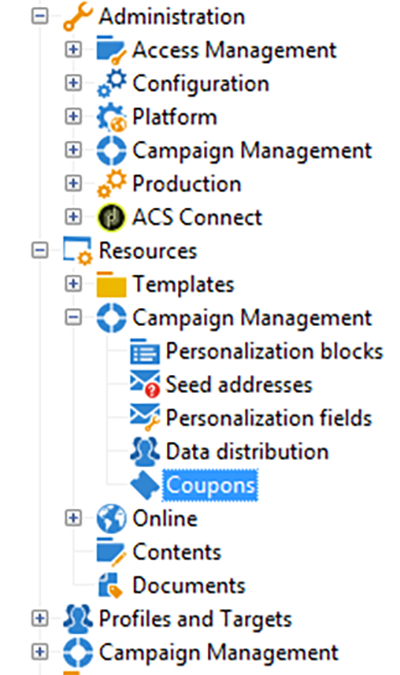

1. Klicken Sie auf die Schaltfläche **[!UICONTROL Neu]**.
1. Geben Sie im **[!UICONTROL Titelfeld]** den Namen des Gutscheins ein. In das Feld **[!UICONTROL Couponcode]** wurde automatisch ein eindeutiger Code eingefügt. Sie können den Code beibehalten oder einen neuen eingeben.

   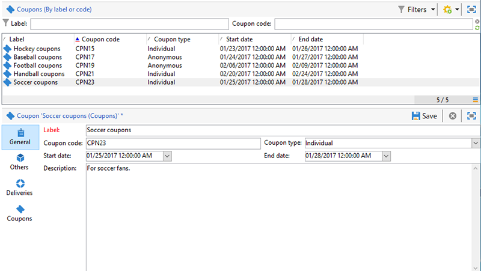

1. Wählen Sie das **[!UICONTROL Startdatum]** und das **[!UICONTROL Enddatum]**, um den Gültigkeitszeitraum des Gutscheins festzulegen.
1. Wählen Sie in **[!UICONTROL Coupontyp]** zwischen einem anonymen und einem individuellen Gutschein.

   **[!UICONTROL Anonyme Gutscheine]**: Anonyme Gutscheine sind für alle Empfänger gleich. Bestätigen Sie im Menü **Coupontyp** Ihre Auswahl eines anonymen Gutscheins und wählen Sie danach **Speichern**, um den Gutschein zu erstellen.

   **[!UICONTROL Individuelle Gutscheine]** : Ein individueller Gutschein kann mit zusätzlichen Gutscheincodes weiter personalisiert werden. Beispielsweise wird ein individueller Gutschein für einen Verkauf in einem Sportartikelgeschäft erstellt. Die Empfängerliste ist jedoch lang, und sie zeigen nicht die gleiche Begeisterung für eine einzige Sportart. Sie können den einzelnen Gutscheinen je nach Sport Codenamen hinzufügen (z. B. Fußball, Fußball, Baseball usw.) und senden jeden Code an die entsprechenden Empfänger.

   1. Bei der Auswahl individueller Gutscheine erscheint links unten ein neuer Coupons-Tab. Wählen Sie in diesem **[!UICONTROL Coupons]**-Tab **[!UICONTROL Hinzufügen]** aus.
   1. Geben Sie für den individuellen Gutschein einen eindeutigen Code ein, wenn Sie vom Pop-up dazu aufgefordert werden.
   1. Klicken Sie auf **[!UICONTROL Speichern]**, um den Gutschein zu erstellen.

   Weitere Informationen zum Tab „Gutscheine“ finden Sie unter [Konfigurieren von individuellen Gutscheinen](#configuring-individual-coupons).

   >[!NOTE]
   >
   >Individuelle Gutscheine können gesammelt importiert werden. Weiterführende Informationen zum Importieren und Exportieren finden Sie in [diesem Abschnitt](../start/import.md).

### Konfigurieren von individuellen Gutscheinen {#configuring-individual-coupons}

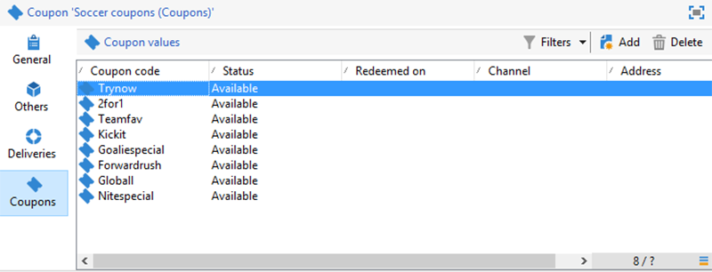

Die Registerkarte „Gutscheine“ ist nur bei individuellen Gutscheinen verfügbar. Nachdem ein Gutschein mit einem Versand verknüpft wurde, enthält die Registerkarte Gutscheine die folgenden Details:

* **[!UICONTROL Status]**: Verfügbarkeit des Gutscheins
* **[!UICONTROL Eingelöst am]**: das Datum, an dem der Gutschein eingelöst wurde
* **[!UICONTROL Kanal]**: der für den Versand des Gutscheins verwendete Kanal
* **[!UICONTROL Adresse]**: die E-Mail-Adresse der Empfänger

Die Werte für **[!UICONTROL Status]**, **[!UICONTROL Kanal]** und **[!UICONTROL Adresse]** werden automatisch ausgefüllt. Nur die Werte für **[!UICONTROL Eingelöst am]** werden nicht von Campaign abgerufen. Sie können aber durch den Import einer Datei eingefügt werden, in der die Details für die Gutscheineinlösung enthalten sind.

## Einfügen eines Gutscheins in einen E-Mail-Versand {#inserting-a-coupon-into-an-email-delivery}

Im folgenden Beispiel wird von der Startseite aus ein Versand erstellt. Detaillierte Anweisungen zum Erstellen eines Versands finden Sie in [diesem Abschnitt](email.md)
1. Gehen Sie zu **[!UICONTROL Kampagnen]** und wählen Sie **[!UICONTROL Sendungen]** aus.
1. Wählen Sie **[!UICONTROL Erstellen]** aus.

   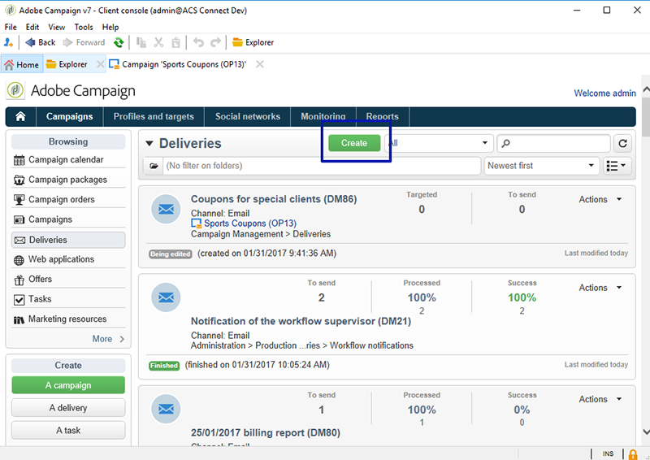

1. Geben Sie im **[!UICONTROL Titelfeld]** einen Namen ein und wählen Sie **[!UICONTROL Fortfahren]** aus.
1. Wählen Sie **[!UICONTROL An]** aus, um Empfänger hinzuzufügen.
1. Wählen Sie **[!UICONTROL Hinzufügen]** aus, um Empfänger für den Versand auszuwählen. Wählen Sie nach der Auswahl der Empfänger **[!UICONTROL OK]**, um zum Versand zurückzukehren.

   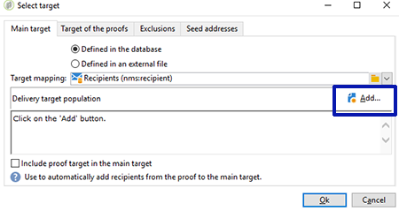

1. Geben Sie einen Betreff ein und fügen Sie der Nachricht einen Inhalt hinzu.

   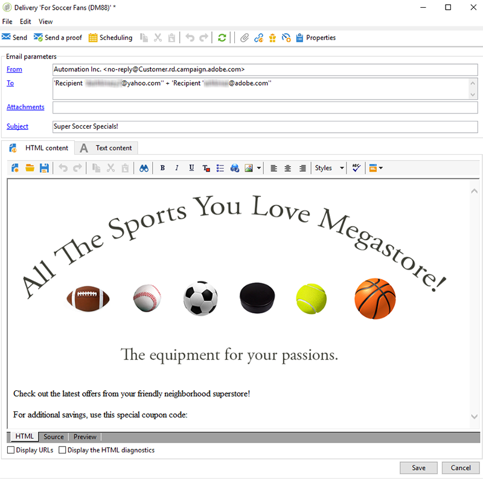

1. Wählen Sie in der Symbolleiste **[!UICONTROL Eigenschaften]** und danach den Tab **[!UICONTROL Erweitert]** aus.
1. Wählen Sie das Ordnersymbol für **[!UICONTROL Couponverwaltung]** aus.

   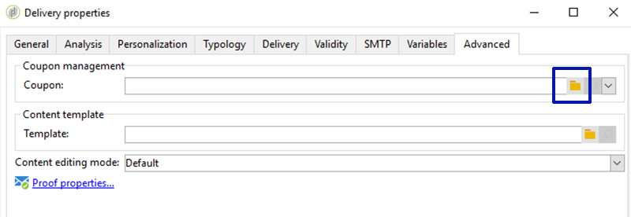

1. Wählen Sie den Gutschein und danach **[!UICONTROL OK]** aus. Wählen Sie erneut **[!UICONTROL OK]** aus.

   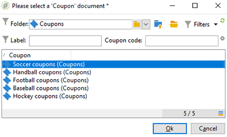

1. Klicken Sie auf die Nachricht, um zu kennzeichnen, wo Sie den Gutschein platzieren möchten.

   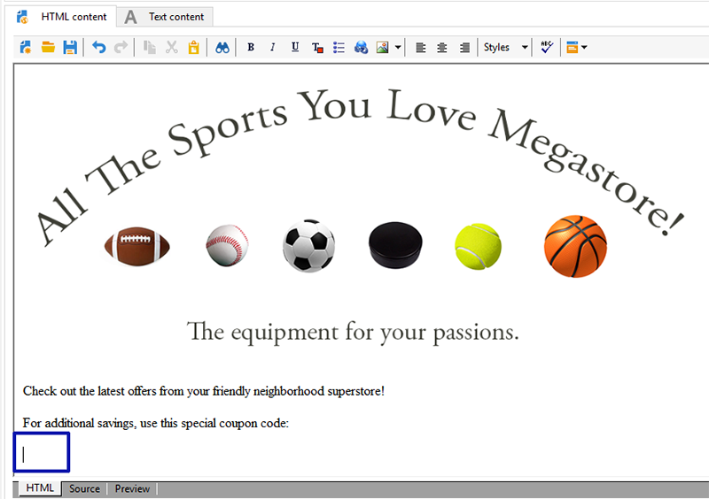

1. Wählen Sie das Personalisierungssymbol aus, um je nach Gutscheintyp die folgende Auswahl zu treffen:

   * Anonymer Gutschein: **[!UICONTROL Coupon > Couponcode]**

     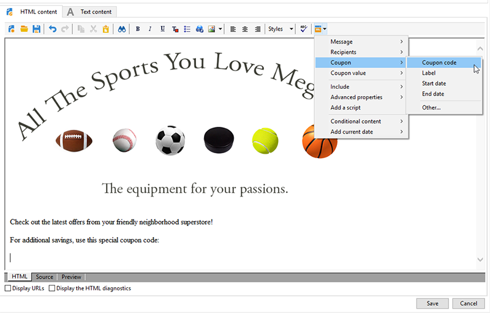

   * Individueller Gutschein: **[!UICONTROL Couponwert > Couponcode]**

     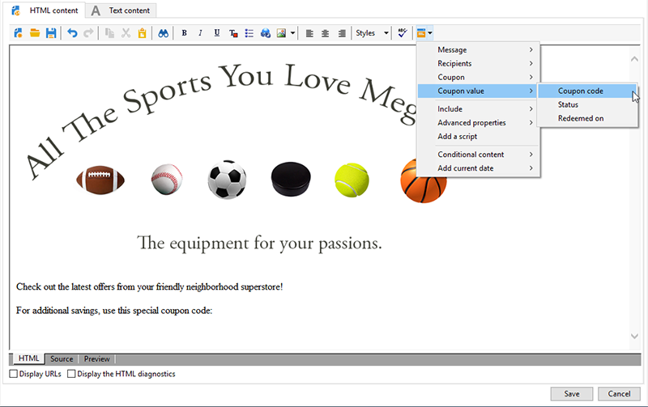

     Der Coupon wird nicht über den von Ihnen zugewiesenen Namen in die Nachricht eingefügt, sondern in Form von Code. Der Code wird im vorkonfigurierten Datenmodell von Campaign verwendet.

   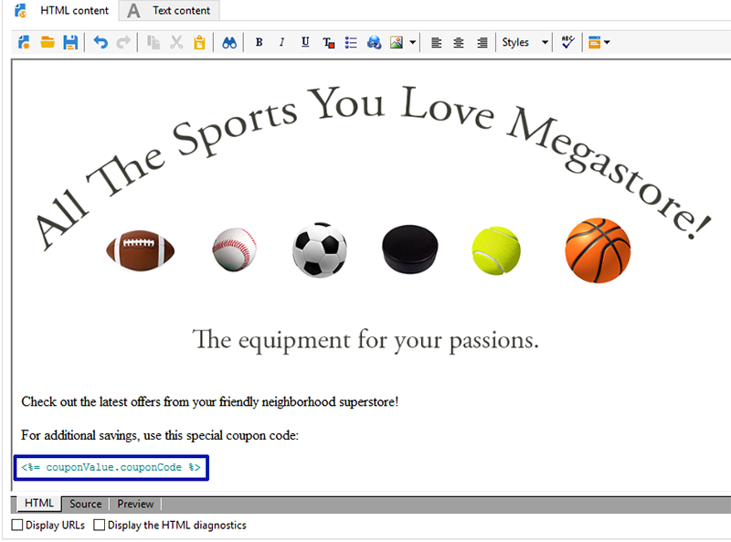

1. Führen Sie einen Test durch, um den von Ihnen dem Gutschein zugewiesenen Namen zu überprüfen. Klicken Sie dazu auf der Registerkarte **[!UICONTROL Vorschau]** auf **[!UICONTROL Personalisierung testen]**. Wählen Sie eine Empfängerin bzw. einen Empfänger für den Test aus.

   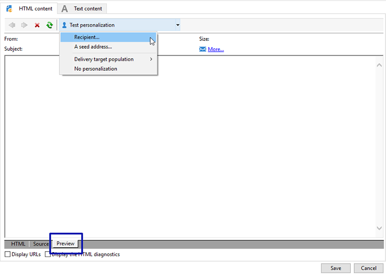

   Nach dem Test sollte auf dem Gutschein der zugewiesene Name anstatt des Codes angezeigt werden.

   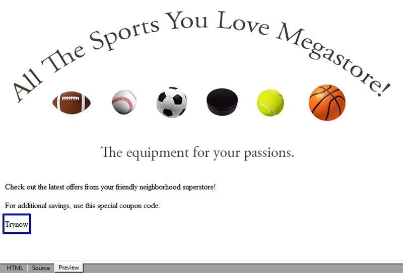

1. Klicken Sie in der Symbolleiste links oben auf **[!UICONTROL Senden]** und wählen Sie aus, wie Sie die Nachricht senden möchten.

   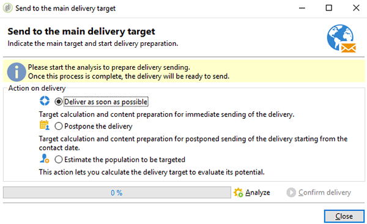

1. Klicken Sie auf **[!UICONTROL Analysieren]**. Wenn im Analyseprotokoll bestätigt wird, dass für alle Empfänger genügend Gutscheine vorhanden sind, versenden Sie die Nachrichten durch die Auswahl von **[!UICONTROL Absendung bestätigen]**.

   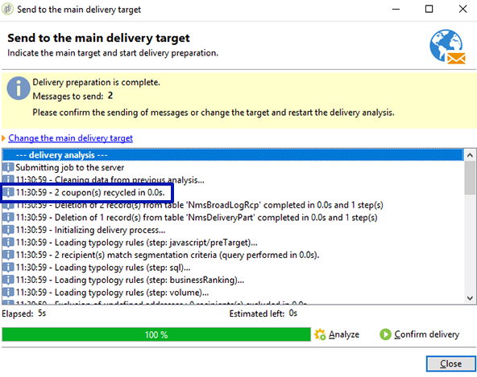

>[!NOTE]
>
>Eine Anleitung zur Vorgehensweise, wenn nicht genügend Coupons für einen Versand vorhanden sind, finden Sie unter [Verwalten bei unzureichender Anzahl von Gutscheinen](#managing-insufficient-coupons).

So prüfen Sie, ob der Versand erfolgreich war:

1. Gehen Sie zu **[!UICONTROL Explorer > Ressourcen > Kampagnenverwaltung > Coupons]**.
1. Wählen Sie den Tab **[!UICONTROL Sendungen]**.

   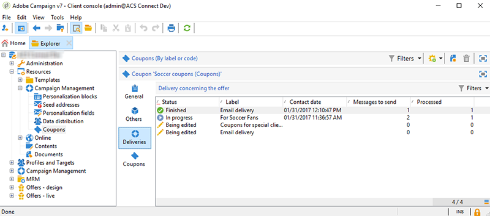

   Eine erfolgreiche Sendung ist im Status als **[!UICONTROL Abgeschlossen]** gekennzeichnet.

>[!NOTE]
>
>Standardmäßig verwendet das Modul zur Couponverwaltung eine **nms:recipient**-Tabelle. [Weitere Informationen](../dev/datamodel.md#ootb-profiles).
>
>[Auf dieser Seite](../dev/custom-recipient.md) erfahren Sie, wie Sie eine benutzerdefinierte Empfängertabelle verwenden.

## Verwalten bei unzureichender Anzahl von Gutscheinen {#managing-insufficient-coupons}

Die Versandanalyse wird angehalten, wenn weniger Coupons als Nachrichten vorhanden sind. In diesem Fall können Sie weitere Coupons importieren oder die Anzahl der Nachrichten einschränken. Folgen Sie den unten stehenden Anweisungen, wenn Sie die Anzahl der Nachrichten begrenzen möchten.

1. Gehen Sie zum E-Mail-Versand-Fenster.
1. Wählen Sie **[!UICONTROL An]**.
1. Gehen Sie unter **[!UICONTROL Auswahl der Zielgruppe]** zum Tab **[!UICONTROL Ausschlüsse]**.

   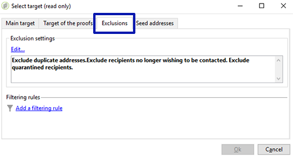

1. Wählen Sie im Bereich für die Einstellungen der Ausschlüsse **[!UICONTROL Bearbeiten]** aus.
1. Geben Sie die Anzahl der Nachrichten ein, die Sie senden möchten **[!UICONTROL Begrenzung des Versands auf … Nachrichten]** und klicken Sie auf **[!UICONTROL OK]**. Sie können den Versand durchführen.

   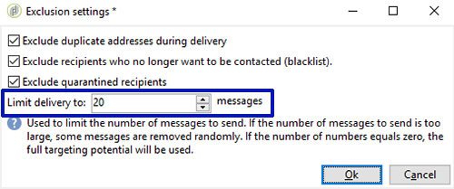

>[!NOTE]
>
>Bei der Verwaltung einer begrenzten Anzahl von Gutscheinen ermöglicht ein Versand-Workflow die Aufteilung des Versands anhand Ihrer Kriterien. Dies ist eine gute Option, wenn Sie Coupons an eine ausgewählte Population senden möchten, ohne die Zielgruppe einzuschränken.
