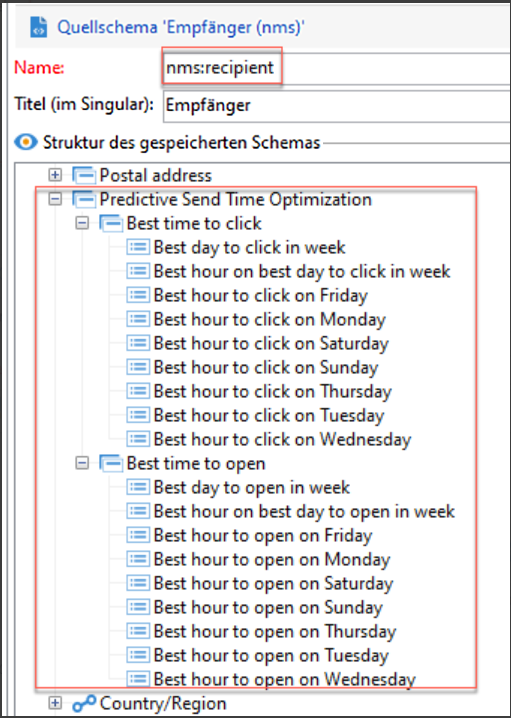

# Sendezeitoptimierung und prädiktive Interaktionsbewertung{#optimize-message-delivery}

Mit der auf KI und maschinellem Lernen basierenden Sendezeitoptimierung und der prädiktiven Interaktionsbewertung von Adobe Campaign können Öffnungsraten, optimale Sendezeiten und wahrscheinliche Abwanderung auf der Grundlage historischer Interaktionsmetriken analysiert und vorhergesagt werden.

Adobe Campaign bietet zwei neue Modelle für maschinelles Lernen: [Prädiktive Sendezeitoptimierung](#predictive-send) und [Prädiktive Interaktionsbewertung](#predictive-scoring). Bei diesen beiden Modellen handelt es sich um Modelle für maschinelles Lernen, die speziell für die Erstellung und Bereitstellung besserer Customer Journeys entwickelt wurden.

>[!CAUTION]
>
>Diese Funktionen sind nicht im Produkt vorkonfiguriert. Sie sind nur für Kundinnen und Kunden von Adobe Campaign Managed Cloud Services verfügbar, die Adobe Campaign Classic v7 oder Adobe Campaign v8 verwenden.
>
>Die Implementierung erfordert die Einbindung von Adobe Consulting. Weitere Informationen erhalten Sie vom Adobe-Support.

## Prädiktive Sendezeitoptimierung{#predictive-send}

Die prädiktive Sendezeitoptimierung prognostiziert für jedes Empfängerprofil den besten Sendezeitpunkt für E-Mail-Öffnungen oder -Klicks und für Push-Nachrichten-Öffnungen. Für jedes Empfängerprofil kann anhand von Werten festgestellt werden, was die beste Sendezeit für jeden Wochentag ist und welcher Wochentag beim Senden die besten Ergebnisse liefert.

Innerhalb des prädiktiven Sendezeit-Optimierungsmodells gibt es zwei Untermodelle:

* Die prädiktive Sendezeit für Öffnungen ist die beste Zeit, zu der eine Kommunikation an den Kunden gesendet werden muss, um Öffnungen zu maximieren.

* Die prädiktive Sendezeit für Klicks ist die beste Zeit, zu der eine Kommunikation an den Kunden gesendet werden muss, um Klicks zu maximieren.

**Modelleingabe**: Versandlogs, Trackinglogs und Profilattribute (keine personenbezogenen Daten)

**Modellausgabe**: Bester Zeitpunkt für den Versand einer Nachricht (für Öffnungen und Klicks)

Ausgabedetails:

* Berechnen Sie die beste Tageszeit für den Versand einer E-Mail an den sieben Wochentagen in Intervallen von einer Stunde (z. B.: 9:00 Uhr, 10:00 Uhr, 11:00 Uhr).
* Das Modell zeigt den besten Tag der Woche und die beste Stunde an diesem Tag an.
* Jede optimale Zeit wird zweimal berechnet: einmal zur Maximierung der Öffnungsrate und einmal zur Maximierung der Klickrate.
* Es werden 16 Felder angegeben (14 für die Wochentage und 2 für die ganze Woche):
   * beste Zeit, um eine E-Mail zu senden, um Klicks für Montag zu optimieren – Werte zwischen 0 und 23
   * beste Zeit, um eine E-Mail zu senden, um Öffnungen für Montag zu optimieren – Werte zwischen 0 und 23
   * ...
   * beste Zeit, um eine E-Mail zu senden, um Klicks für Sonntag zu optimieren – Werte zwischen 0 und 23
   * beste Zeit, um eine E-Mail zu senden, um Öffnungen für Sonntag zu optimieren – Werte zwischen 0 und 23
   * ...
   * bester Tag, um eine E-Mail zu senden, um die Öffnungen für die ganze Woche zu optimieren – Montag bis Sonntag
   * beste Zeit, um eine E-Mail zu senden, um Öffnungen für die ganze Woche zu optimieren – Werte zwischen 0 und 23

Die prädiktive Sendezeitoptimierung wird auf Profilebene gespeichert:

>[!NOTE]
>
>Das Modell benötigt mindestens einen Monat lang Daten, um signifikante Ergebnisse zu erzielen. Diese prädiktiven Funktionen sind nur für E-Mail- und Push-Kanäle verfügbar.

## Bewertung prädiktiver Interaktionen {#predictive-scoring}

Die Bewertung prädiktiver Interaktionen sagt die Wahrscheinlichkeit voraus, mit der Empfangende mit einer Nachricht interagieren, sowie die Wahrscheinlichkeit, mit der sie sich innerhalb der nächsten sieben Tage nach dem nächsten E-Mail-Versand abmelden. Die Wahrscheinlichkeiten werden je nach vorhergesagter Interaktion mit Ihrem Inhalt in verschiedene Kategorien eingeteilt: hoch, mittel oder niedrig. Diese Modelle liefern auch den prozentualen Rang des Abmelderisikos für die Kundinnen und Kunden, um zu verdeutlichen, wo der Rang einer/eines bestimmten Kundin/Kunden im Vergleich zu anderen liegt.

Mit der prädiktiven Interaktionsbewertung können Sie Folgendes:

* **Eine Audience auswählen**: Mithilfe der Abfrageaktivität können Sie die Audience auswählen, an die eine bestimmte Nachricht gesendet werden soll.
* **Eine Audience ausschließen**: Mithilfe der Abfrageaktivität können Sie die Audience entfernen, die sich abmelden möchte.
* **Personalisieren**: Personalisieren Sie die Nachricht basierend auf dem Grad der Interaktion (stark interaktive Benutzer erhalten eine andere Nachricht als nicht interaktive).

Dieses Modell verwendet mehrere Bewertungen, um Folgendes anzugeben:

* **Interaktionsbewertung für Öffnungen/Interaktionsbewertung für Klicks**: Dieser Wert entspricht der Wahrscheinlichkeit, mit der sich ein Abonnent mit einer bestimmte Nachricht beschäftigt (Öffnung oder Klick). Die Werte liegen zwischen 0,0 und 1,0.
* **Abmeldewahrscheinlichkeit**: Dieser Wert entspricht der Wahrscheinlichkeit, dass der Empfänger sich von einem E-Mail-Kanal abmeldet, nachdem er eine E-Mail geöffnet hat. Die Werte liegen zwischen 0,0 und 1,0.
* **Bindungsgrad**: Dieser Wert unterteilt Benutzer in drei Stufen: niedrig, mittel und hoch. Dabei bedeutet &quot;hoch&quot;, dass sie höchstwahrscheinlich bei der Marke bleiben, und &quot;niedrig&quot;, dass sie sich wahrscheinlich abmelden.
* **Perzentilrang der Bindung**: Rang des Profils in Bezug auf die Abmeldewahrscheinlichkeit. Die Werte liegen zwischen 0,0 und 1,0. Wenn der Perzentilrang der Bindung beispielsweise 0,953 beträgt, bleibt dieser Empfänger mit größerer Wahrscheinlichkeit bei der Marke und hat eine geringere Wahrscheinlichkeit, sich abzumelden, als 95,3 % aller Empfänger.

>[!NOTE]
>
>Diese prädiktiven Funktionen gelten nur für den E-Mail-Versand.
>
>Das Modell benötigt mindestens einen Monat an Daten, um signifikante Ergebnisse zu erzielen.

**Modelleingabe**: Versandlogs, Trackinglogs und spezifische Profilattribute

**Modellausgabe**: Ein Profilattribut, das die Bewertung und Kategorie des Profils beschreibt.
